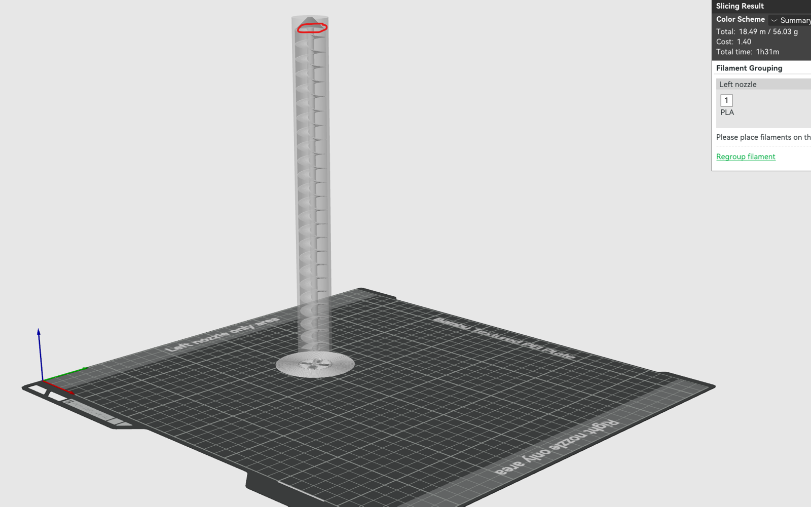
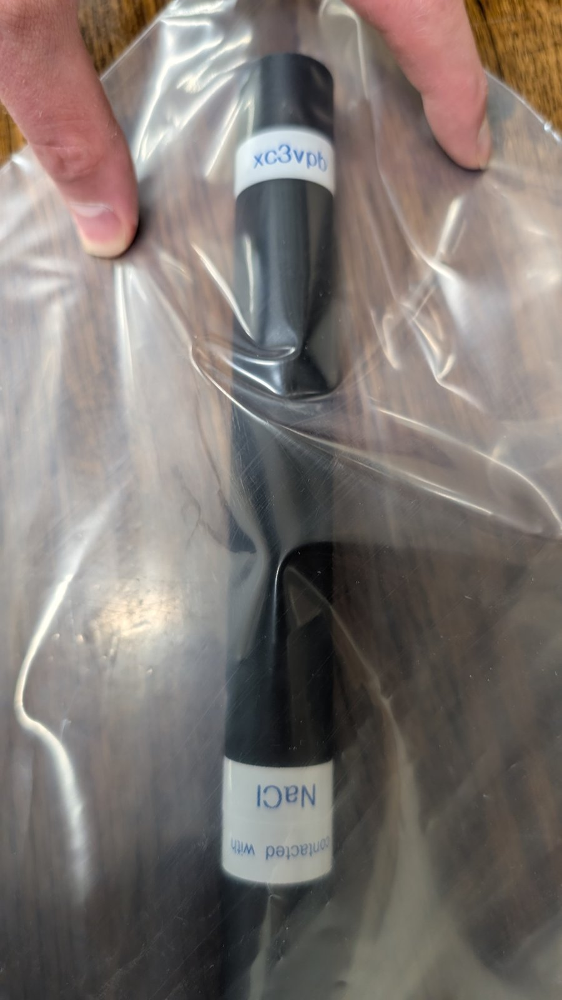
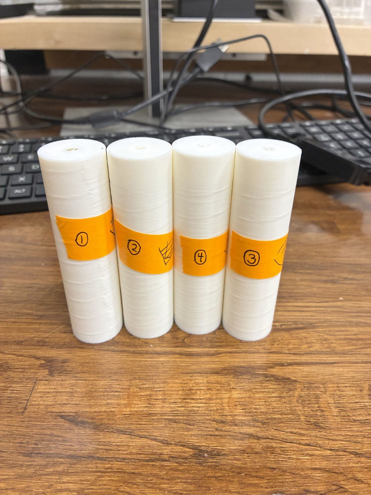

# Record of Designs

A single, chronological, scroll-through record of **every design** created in this
repository — and **every iteration** of each design — in the order each one was
made. This is a deliberate, repetitive log: a design that was revised five times
appears five times, each version placed at the moment it was created (by commit
date), not grouped with its siblings. The intent is a fast visual timeline of how
the powder-doser evolved from a hand-sketched scoop to a motorized, hinged
multi-part assembly.

Built in response to issue [#73](https://github.com/vertical-cloud-lab/powder-doser/issues/73).

<!-- FRONTMATTER:START -->
<!-- Machine-readable summary; regenerated by tools/design_log/build_design_log.py -->
```yaml
title: "Record of Designs"
kind: design-log
entries: 97
date_span: [2026-04-23, 2026-05-28]
iteration_chains: 11
subsystems:
  - name: "Scoop / excavator"
    entries: 13
  - name: "Sieve-cup alternatives (A–H)"
    entries: 11
  - name: "Auger"
    entries: 21
  - name: "Auger bracket"
    entries: 8
  - name: "Sealing cap"
    entries: 6
  - name: "Tap collar"
    entries: 4
  - name: "Doser module"
    entries: 7
  - name: "Mounting plate & hinge"
    entries: 21
  - name: "Electronics & PCB"
    entries: 6
```
<!-- FRONTMATTER:END -->

## How to read this log

- Entries are ordered **oldest → newest**. Each entry is one design or one
  iteration of a design. Jump straight to a subsystem or a specific iteration with
  the [Index by subsystem](#index-by-subsystem) below.
- **Trigger** names the issue, comment, or review that prompted that version, and
  who raised it.
- **Design** is a 1–2 sentence summary of the design and what changed.
- **Rationale** states *why* — the constraint, goal, or decision behind the change
  (the "because…"). Every entry carries one so the log records intent, not just
  geometry.
- **Outcome** (where known) records what happened when a design was built or
  reviewed, tagged ✅ pass / ⚠️ partial / ❌ fail, and — for an iteration that was
  abandoned or replaced — *why* the branch was a dead-end and what superseded it.
- Each entry shows one or more **render views** (iso / front / top / side /
  cross-section / assembly / exploded) to communicate the geometry. Where a design
  also has an **animated GIF** (a rotating spin or an actuation loop), that GIF is
  shown too. A few entries reference diagrams or sketches where those best capture
  the design at that moment.
- Where a design was physically printed and bench-tested, the entry also embeds the
  **printed-part photos** and links the **test videos** from the corresponding
  GitHub issue or pull-request comment.
- Every image and animation here is an **artifact that was actually generated** —
  a render, GIF, or photo committed to a branch or attached to a comment. Nothing
  was re-rendered ad-hoc for this log.
- Images are pinned to the exact commit they were generated at, so each thumbnail
  shows that *specific* iteration — even when a later version reused the same
  filename. Many designs live on still-open pull-request branches; the pinned
  commit SHAs keep these visuals stable. Printed-part **photos** attached to issue/PR
  comments are archived in-repo under [`docs/assets/`](docs/assets) so they survive
  even if the original attachment is removed; bench-test **videos** remain linked to
  their YouTube sources.
- The summary block above and the subsystem index below are **regenerated** from the
  entries by [`tools/design_log/build_design_log.py`](tools/design_log/build_design_log.py);
  edit the entries, then re-run it (`--check` verifies they are in sync).

<!-- INDEX:START -->
## Index by subsystem

Designs are logged chronologically below, but iterations of one object are scattered across that timeline. This index regroups them. Within a multi-version **iteration chain** each version is superseded by the next (`v1 → v2 → …`); follow a link to jump to that exact iteration.

| Subsystem | Entries | Iteration chains (oldest → newest) |
| --- | --: | --- |
| Scoop / excavator | 13 | [Original powder-excavator scoop concept](#e001)<br>[Powder excavator concept diagram](#e002)<br>[Powder excavator corrected subpanels](#e003)<br>[Ferris-wheel trough pivot](#e004)<br>[Longitudinal-pivot sideways-tilt trough](#e005)<br>[Pin-defined-path actuation variant](#e006)<br>[Mechanism-panel alignment refinement](#e007)<br>[Bimodal compliant trough mechanism](#e008)<br>[3D-printable bimodal trough prototype](#e009)<br>[Continuous chamfered rim lip](#e010)<br>**Parametric CAD excavator assembly:** [v1](#e011) → [v2](#e013)<br>[Bimodal flexure curve fix](#e012) |
| Sieve-cup alternatives (A–H) | 11 | [Preliminary sieve-cup concepts A/G](#e014)<br>[Alternative A tap-sieve cup](#e020)<br>[Alternative B Pez-style chamber strip](#e021)<br>[Alternative C capillary wiper](#e022)<br>[Alternative D brush-comb pickup](#e023)<br>[Alternative E shaker dispenser](#e024)<br>[Alternative F passive auger](#e025)<br>[Alternative G ERM-augmented sieve](#e026)<br>[Alternative H solenoid-tapped sieve](#e027)<br>[A–H annotated explainer panels](#e028)<br>[CadQuery-grounded A–H spatial scenes](#e034) |
| Auger | 21 | [Monolithic Archimedes auger preview](#e015)<br>[Print-ready monolithic auger](#e016)<br>[Auger internal-helix x-ray views](#e017)<br>[Two-part fixed-shaft/rotating-housing auger](#e018)<br>[Short workshop-test auger](#e019)<br>[Large integrated H2D auger](#e032)<br>[Through-cut loading slots](#e033)<br>[Central-supported helix](#e044)<br>[Hollow-core auger](#e045)<br>**Geared Archimedes auger assembly:** [v1](#e053) → [v2](#e055)<br>[Geared Archimedes auger full-length](#e056)<br>[Geared Archimedes auger short alternate](#e057)<br>[Large top opening with pour lip](#e061)<br>[Tapered-shaft auger exit](#e087)<br>[Continuous funnel helix auger](#e089)<br>[Phase-matched funnel helix auger](#e090)<br>[Nozzle test auger type 1](#e094)<br>[Nozzle test auger type 2](#e095)<br>[Nozzle test auger type 3](#e096)<br>[Nozzle test auger type 4](#e097) |
| Auger bracket | 8 | **Auger bracket:** [v1](#e049) → [v2](#e050) → [v3](#e051) → [v4](#e052) → [v5](#e058)<br>**Parametric auger clamp bracket:** [v1](#e062) → [v2](#e064)<br>[CADsmith-style auger bracket](#e063) |
| Sealing cap | 6 | **Bayonet plug sealing cap:** [v1](#e036) → [v2](#e046)<br>**Spring hatch sealing cap:** [v1](#e037) → [v2](#e047)<br>**Twist shutter sealing cap:** [v1](#e038) → [v2](#e048) |
| Tap collar | 4 | **Tap collar assembly:** [v1](#e059) → [v2](#e069) → [v3](#e070) → [v4](#e073) |
| Doser module | 7 | [Inward collection cup architecture](#e031)<br>**Single-channel powder-doser module:** [v1](#e035) → [v2](#e039) → [v2.0b](#e040) → [v3-r1](#e041) → [v3-r2](#e042) → [v4](#e043) |
| Mounting plate & hinge | 21 | [Hinged mounting plate + baseplate assembly](#e060)<br>**Mounting plate + hinged baseplate:** [v1](#e065) → [v2](#e067) → [v3](#e074) → [v4](#e076) → [v5](#e078) → [v6](#e081) → [v7](#e083)<br>[Mounting-plate/baseplate assembly](#e066)<br>[Real-geometry mounting assembly](#e068)<br>[Offset-hinge mounting plate](#e072)<br>[Drawing-aligned mounting assembly](#e075)<br>[Face-mounted motor and side-hinge assembly](#e077)<br>[Centered-auger hinge assembly](#e079)<br>[CADsmith mounting/base plates](#e080)<br>[Lifted-bracket sandwich-hinge assembly](#e082)<br>[Baseplate contact cleanup](#e084)<br>[Servo-driven hinge gear assembly](#e085)<br>[Involute servo-hinge gearing](#e086)<br>[Corrected MG996R hole-pattern mount](#e088)<br>[Raised-spline rescaled servo gearing](#e091) |
| Electronics & PCB | 6 | **Actuator electronics schematic:** [v1](#e029) → [v2](#e030)<br>[Satellite rev-a PCB](#e054)<br>[Single-Pico-W test-module schematic](#e071)<br>[Pico-W schematic alignment and shunt regulator](#e092)<br>[DRV8825 carrier schematic](#e093) |

<!-- INDEX:END -->

---

<!-- ENTRY date=2026-04-23T20:27:45Z pr=0 -->
<a id="e001"></a>
### 2026-04-23 — Original powder-excavator scoop concept · Issue #1 / #3
**Trigger:** @sgbaird opened issue #1 with a hand sketch proposing a purely mechanical mini-excavator: a deep ladle/scoop on a gantry that is pushed against a wall to tip and drop powder; @devoranajjar's issue #3 then worked through its technical viability.
**Design:** The founding concept was a 3D-printed semicircular scoop (mm–cm scale) mounted on a Genmitsu 3018-PROVer V2 gantry, with side pins catching a ledge to pivot and dump powder into a vial, paired with closed-loop gravimetric dosing, PTFE coating, and an ERM vibration motor to fight micron-powder adhesion.


---

<!-- ENTRY date=2026-04-23T20:37:37Z pr=2 -->
<a id="e002"></a>
### 2026-04-23 — Powder excavator concept diagram v1 · PR #2
**Trigger:** @sgbaird opened issue #1 with a hand sketch and asked for a pure mechanical gantry-actuated scoop that could drop powder when pushed against a wall.
**Design:** The first cleaned visual translated the hand sketch into a mechanical trough/scoop concept with a fixed ledge interaction. It captured the initial idea before reviewer feedback clarified the pin, arms, lip, and powder-handling constraints.

 

---

<!-- ENTRY date=2026-04-23T22:01:11Z pr=2 -->
<a id="e003"></a>
### 2026-04-23 — Powder excavator corrected subpanels v2 · PR #2
**Trigger:** @sgbaird's review said the pin was missing, the shaft needed two arms, the lip/sawtooth ledge was unclear, and the arm should stay vertical while the trough rotated.
**Design:** The design was redrawn as individual subpanels with an explicit pivot pin, two vertical arms, and a wall-mounted ledge/lip actuation story. The update also reframed the concept for cohesive micron-scale powders and 3D-printable parts.

 

---

<!-- ENTRY date=2026-04-23T22:21:43Z pr=2 -->
<a id="e004"></a>
### 2026-04-23 — Ferris-wheel trough pivot v3 · PR #2
**Trigger:** @sgbaird clarified that the arms were on the wrong edges and the bucket should pivot like a ferris-wheel gondola, with arms secured to the flat sides.
**Design:** The geometry was rebuilt so arms straddle the long side walls and a transverse pin runs through side bosses. This replaced the earlier edge-mounted interpretation with a clearer end-over-end trough rotation.

  

---

<!-- ENTRY date=2026-04-23T23:20:02Z pr=2 -->
<a id="e005"></a>
### 2026-04-23 — Longitudinal-pivot sideways-tilt trough v4 · PR #2
**Trigger:** @sgbaird noted the isometric arms were inconsistent and suggested scoop-and-drag filling plus a possible bimodal/closed scoop behavior.
**Design:** The mechanism changed to a longitudinal pivot held at the short end caps, a sideways-tilting dump, and a J-curve plunge/drag with strike-off. The change tried to improve filling and dose repeatability without adding a bucket actuator.

 

---

<!-- ENTRY date=2026-04-23T23:44:50Z pr=2 -->
<a id="e006"></a>
### 2026-04-23 — Pin-defined-path actuation variant v5 · PR #2
**Trigger:** @sgbaird asked for open CAD-esque feedback mechanisms and repeated Edison-analysis iterations under the no-second-axis gantry constraint.
**Design:** A pin-in-slot panel was added as an alternate way to make the gantry path define the trough rotation. It made the kinematic constraint more explicit than the free ledge/cam sketches.

 

---

<!-- ENTRY date=2026-04-24T01:08:08Z pr=2 -->
<a id="e007"></a>
### 2026-04-24 — Mechanism-panel alignment refinement v6 · PR #2
**Trigger:** @sgbaird said the mechanism GIF and panels were weird, not lined up, and had confusing connection points and scale/aspect.
**Design:** The visual panels were iterated through multiple cycles to show pin stubs, cam contact, an end-view pin marker, ghost arm, and a better-scaled pin-slot panel. This was primarily a clarity iteration to make the same mechanism legible.

  


---

<!-- ENTRY date=2026-04-24T01:11:03Z pr=5 -->
<a id="e008"></a>
### 2026-04-24 — Bimodal compliant trough mechanism v1 · PR #5
**Trigger:** @sgbaird opened issue #4 asking to revisit the bimodal compliant mechanism as a secondary idea and install tools to test bimodal compliance.
**Design:** The first visualized compliant trough used flexural snap-through between scoop and hold/dump states, paired with an energy/bistability checker. It explored a passive way to get two stable powder-handling poses.

 


---

<!-- ENTRY date=2026-04-24T01:21:19Z pr=5 -->
<a id="e009"></a>
### 2026-04-24 — 3D-printable bimodal trough prototype v2 · PR #5
**Trigger:** @sgbaird asked for help getting the design 3D printed for prototyping and testing.
**Design:** The mechanism was turned into a printable OpenSCAD prototype with a rendered iso view, STL, and print guide. The flexure arch and pre-compression were encoded geometrically so the part could be printed and bench-tested.

 

---

<!-- ENTRY date=2026-04-24T01:32:13Z pr=2 -->
<a id="e010"></a>
### 2026-04-24 — Continuous chamfered rim lip v7 · PR #2
**Trigger:** The earlier lip/spout interaction remained a point of confusion in @sgbaird's review, especially around how the ledge/cam contacted the trough.
**Design:** The trough rim changed to a continuous chamfered lip on both long sides instead of a spout-like feature. This simplified the contact geometry for strike-off/cam interaction and reduced special-case powder-catching features.

 

---

<!-- ENTRY date=2026-04-24T01:52:25Z pr=2 -->
<a id="e011"></a>
### 2026-04-24 — Parametric CAD excavator assembly v1 · PR #2
**Trigger:** @sgbaird asked to incorporate open CAD/generative-design feedback mechanisms that could be installed and run, rather than only static sketches.
**Design:** The concept became a CadQuery-derived assembly with trough, arms, pin, cam ramp, strike-off bar, and slot board render views. This moved the design history from drawings into a parametric CAD/DFM pipeline.

  


---

<!-- ENTRY date=2026-04-24T04:23:07Z pr=5 -->
<a id="e012"></a>
### 2026-04-24 — Bimodal flexure curve fix v3 · PR #5
**Trigger:** The follow-up render/recompile cycle exposed a CAD issue where the apex carrier appeared to float rather than connect cleanly to the flexure.
**Design:** The flexure curve was corrected so the apex carrier was physically connected in the rendered trough. The iteration tightened the printed geometry before final deterministic re-renders and Edison design review packaging.

 
 

---

<!-- ENTRY date=2026-04-24T05:17:10Z pr=2 -->
<a id="e013"></a>
### 2026-04-24 — Parametric CAD excavator assembly v2 · PR #2
**Trigger:** Copilot review and Edison v3 feedback flagged mismatches in modeled statics, slot/cam documentation, and the cam-ramp-rise geometry.
**Design:** The CAD assembly and part renders were regenerated after geometry/documentation corrections, especially around the cam ramp and pivot/statics assumptions. This is the final PR #2 CAD-state visual after review-driven tuning.

  


---

<!-- ENTRY date=2026-04-24T07:16:46Z pr=13 -->
<a id="e014"></a>
### 2026-04-24 — Preliminary sieve-cup concepts A/G · PR #13
**Trigger:** @sgbaird-alt asked for preliminary designs for the top recommended alternatives after Edison promoted ERM-assisted sieving over tap-only sieving.
**Design:** The first alternative CAD covered a passive gantry-tapped sieve cup, an ERM-augmented sieve cup, and a tap anvil. It followed the PR #2/#5 procedure with OpenSCAD, STL, iso renders, and a one-day workshop build focus.

  
  

---

<!-- ENTRY date=2026-04-24T19:08:11Z pr=16 -->
<a id="e015"></a>
### 2026-04-24 — Monolithic Archimedes auger preview v1 · PR #16
**Trigger:** @sgbaird noted from issue #1 that the team was moving toward a vertical Archimedes screw with sieve/tapping/vibration options, and PR #16 opened with the initial auger CAD.
**Design:** The first visual preview showed a one-piece rotating helical dispenser with top spindle mount and bottom exit. It established the vertical screw-feed architecture before printability checks.


---

<!-- ENTRY date=2026-04-24T19:57:07Z pr=16 -->
<a id="e016"></a>
### 2026-04-24 — Print-ready monolithic auger v2 · PR #16
**Trigger:** @sgbaird asked to make the auger ready for 3D printing, convert to STL, run checks, and fix floating-part errors.
**Design:** The auger was made manifold and printable, with coincident/unsupported internal helix surfaces corrected and Ultimaker-oriented print-prep added. Iso and cutaway renders exposed the tube, internal helix, funnel, and M3 boss.

 

---

<!-- ENTRY date=2026-04-24T20:57:21Z pr=16 -->
<a id="e017"></a>
### 2026-04-24 — Auger internal-helix x-ray views v2.1 · PR #16
**Trigger:** @sgbaird clarified that he could not see the STL/STEP content in the slicer views, meaning the internal helix needed proof visuals.
**Design:** X-ray and layer cross-section views were added to demonstrate that the apparently plain cylinder contained the helix, funnel, loading slots, and exit path. This was a visual/debug iteration rather than a major geometry change.

 

---

<!-- ENTRY date=2026-04-24T23:15:23Z pr=16 -->
<a id="e018"></a>
### 2026-04-24 — Two-part fixed-shaft/rotating-housing auger v3 · PR #16
**Trigger:** @sgbaird said the real auger design should be two parts, with a fixed shaft and an outer tube rotating around it.
**Design:** The auger was refactored into a stationary inner shaft carrying the helix and a rotating outer housing. This changed the mechanism from a monolithic rotor to a more conventional screw-in-tube architecture.

 

---

<!-- ENTRY date=2026-04-24T23:20:56Z pr=16 -->
<a id="e019"></a>
### 2026-04-24 — Short workshop-test auger v3.1 · PR #16
**Trigger:** @sgbaird asked for the two-part auger to be made very short so it could print quickly before the workshop ended.
**Design:** The same fixed-shaft/rotating-housing architecture was compressed from 100 mm to 30 mm height. It preserved the fits and helix geometry while reducing print time for fast bench testing.

 

---

<!-- ENTRY date=2026-04-24T23:29:41Z pr=13 -->
<a id="e020"></a>
### 2026-04-24 — Alternative A tap-sieve cup · PR #13
**Trigger:** @sgbaird asked to use learnings from PRs #16, #7, #5, and #2 to refine each proposed alternative individually with slices, cross sections, and rotating visuals.
**Design:** Alternative A became a tap-driven sieve cup with dedicated OpenSCAD/STL, iso render, and cutaway. It keeps actuation gantry-mechanical by striking an anvil to meter powder through sieve holes.

 


---

<!-- ENTRY date=2026-04-24T23:29:41Z pr=13 -->
<a id="e021"></a>
### 2026-04-24 — Alternative B Pez-style chamber strip · PR #13
**Trigger:** @sgbaird asked to refine each alternative individually and catch print/slicing issues before workshop testing.
**Design:** Alternative B modeled a Pez-like indexed strip of small powder chambers. The design explores discrete volumetric doses by translating chambers past a loading/dispense location.

 


---

<!-- ENTRY date=2026-04-24T23:29:41Z pr=13 -->
<a id="e022"></a>
### 2026-04-24 — Alternative C capillary wiper · PR #13
**Trigger:** @sgbaird asked to treat all A–H alternatives separately and use cutaways to make the mechanisms understandable.
**Design:** Alternative C modeled a capillary pickup/wiper concept that loads powder by contact and meters it by wiping excess. The cutaway exposes the pickup channel and wiper path.

 


---

<!-- ENTRY date=2026-04-24T23:29:41Z pr=13 -->
<a id="e023"></a>
### 2026-04-24 — Alternative D brush-comb pickup · PR #13
**Trigger:** @sgbaird asked for individual design refinement and cross sections for each brainstormed alternative.
**Design:** Alternative D became a brush/comb pickup that carries powder mechanically and releases it by combing or scraping. The design tests whether bristles/teeth can manage cohesive powders without a full auger.

 


---

<!-- ENTRY date=2026-04-24T23:29:41Z pr=13 -->
<a id="e024"></a>
### 2026-04-24 — Alternative E shaker dispenser · PR #13
**Trigger:** @sgbaird asked for each alternative to be refined with visualizations and slicing so the concepts could be compared.
**Design:** Alternative E modeled a salt-shaker-like oscillating dispenser. It uses holes and vibration/gantry agitation to meter powder, trading dose precision for simplicity.

 


---

<!-- ENTRY date=2026-04-24T23:29:41Z pr=13 -->
<a id="e025"></a>
### 2026-04-24 — Alternative F passive auger · PR #13
**Trigger:** @sgbaird explicitly pointed to PR #16 learnings while asking that each alternative be refined individually.
**Design:** Alternative F captured a passive auger-style dispenser in the A–H comparison set. It borrowed the screw-feed direction from the vertical auger work while keeping the alternative compact for side-by-side evaluation.

 


---

<!-- ENTRY date=2026-04-24T23:29:41Z pr=13 -->
<a id="e026"></a>
### 2026-04-24 — Alternative G ERM-augmented sieve · PR #13
**Trigger:** Edison feedback, summarized by @copilot, ranked ERM-augmented sieving above passive tapping because continuous bounded vibration better matches published vibratory-sieve/chute regimes.
**Design:** Alternative G added an ERM vibration path to the sieve-cup concept. The geometry provides motor/battery accommodation while preserving sieve metering as the powder-release primitive.

 


---

<!-- ENTRY date=2026-04-24T23:29:41Z pr=13 -->
<a id="e027"></a>
### 2026-04-24 — Alternative H solenoid-tapped sieve · PR #13
**Trigger:** Issue #12 allowed electronics if useful but warned that added motors/electronics increased one-day workshop risk.
**Design:** Alternative H modeled a solenoid-tapped sieve as the higher-actuation-risk member of the set. It separates the tapping actuator idea from the passive and ERM sieve options for comparison.

 


---

<!-- ENTRY date=2026-04-25T02:16:27Z pr=13 -->
<a id="e028"></a>
### 2026-04-25 — A–H annotated explainer panels v2 · PR #13
**Trigger:** @sgbaird said he was not sure what was going on in any of the alternative designs.
**Design:** Each A–H concept received an annotated panel with title, iso, cutaway, numbered parts, and a three-step operating cycle. This did not mainly change geometry; it was a visual iteration to make function and part roles understandable.

  


---

<!-- ENTRY date=2026-05-07T21:22:32Z pr=25 -->
<a id="e029"></a>
### 2026-05-07 — Actuator electronics schematic v1 · PR #25
**Trigger:** swcharles opened Issue #24 asking for small externally integrated solenoid/vibration hardware controllable from a Pi Zero 2 W, then requested a real KiCad schematic instead of unclear block/ASCII diagrams.
**Design:** Replaced the informal diagram with a KiCad 7 actuator schematic tying the Pi/bonnet to DRV2605L vibration, DRV8871 solenoid, and stepper-driver blocks, with placeholder symbols and explicitly listed connection assumptions.


---

<!-- ENTRY date=2026-05-08T20:47:28Z pr=25 -->
<a id="e030"></a>
### 2026-05-08 — Actuator electronics schematic v2 · PR #25
**Trigger:** williamulbz reviewed the KiCad PNG and said net labels overlapped pin labels/routes and related components should be closer together.
**Design:** Re-rendered the schematic with short wire stubs pulling every global net label off the symbol bodies, preserving the functional grouping while making the actuator nets readable.


---

<!-- ENTRY date=2026-05-12T03:50:45Z pr=31 -->
<a id="e031"></a>
### 2026-05-12 — Inward collection cup architecture v1 · PR #31
**Trigger:** sgbaird asked for a visualization of the inward-pointing single collection point idea, preferably CAD with realistic dimensions and labels.
**Design:** Added a parametric CadQuery visualization of 12 Ø30 mm tubes on a 150 mm pitch circle tilted 30° inward toward an Ø80 mm collection cup/load-cell area, plus a 2D top/side sketch to test whether the shared-cup concept was physically plausible.

  

---

<!-- ENTRY date=2026-05-12T04:29:49Z pr=16 -->
<a id="e032"></a>
### 2026-05-12 — Large integrated H2D auger v4 · PR #16
**Trigger:** @sgbaird and @sgbaird-yolo reported that the integrated auger had worked surprisingly well with xanthan gum, leaned away from hoppers due to bridging/ratholing, and asked to assume an H2D printer.
**Design:** The design reverted to a monolithic integrated auger/tube and scaled up to 250 × 25 mm for larger capacity. It intentionally avoided a hopper and left de-bridging to planned solenoid/vibration additions.

 

---

<!-- ENTRY date=2026-05-12T04:54:41Z pr=16 -->
<a id="e033"></a>
### 2026-05-12 — Through-cut loading slots v4.1 · PR #16
**Trigger:** @sgbaird-yolo said he could not see openings to the outside for loading powder into the tube.
**Design:** The top-cap slot cuts were fixed so the four loading slots actually broke through the outside surface. A top-down view was added to verify that powder could enter from the top/drive end.

 

---

<!-- ENTRY date=2026-05-12T06:03:30Z pr=13 -->
<a id="e034"></a>
### 2026-05-12 — CadQuery-grounded A–H spatial scenes v3 · PR #13
**Trigger:** @sgbaird-yolo said the spatial inconsistencies still were not addressed and suggested using something more physical, such as CAD software.
**Design:** A CadQuery-grounded scene/animator was added so the A–H mechanisms shared physical anchors and clearer load/dispense positions. The visuals move beyond schematic panels toward spatially consistent CAD-based operation frames.

  


---

<!-- ENTRY date=2026-05-12T16:38:00Z pr=35 -->
<a id="e035"></a>
### 2026-05-12 — Single-channel powder-doser module v1 · PR #35
**Trigger:** swcharles opened Issue #34 directing Copilot to move forward with Idea B: a repeatable single-channel doser module with integrated motor, vibrator, tapper, angle control, printable files, and images.
**Design:** Created the first CadQuery module package with a printed frame, auger/tube envelope, actuator placeholders, STEP/STL exports, and orthographic renders as an archetype for scaling to many powders.

 

---

<!-- ENTRY date=2026-05-12T17:04:05Z pr=37 -->
<a id="e036"></a>
### 2026-05-12 — Bayonet plug sealing cap v1 · PR #37
**Trigger:** swcharles opened Issue #36 asking for several cap/sealer concepts compatible with auger channels so stored/swapped channels would not spill or cross-contaminate.
**Design:** Added a bayonet plug concept: a receiver on the channel end and a twist-lock plug intended to mechanically seal the bore for storage while remaining printable as separate plug/receiver pieces.

 

---

<!-- ENTRY date=2026-05-12T17:04:05Z pr=37 -->
<a id="e037"></a>
### 2026-05-12 — Spring hatch sealing cap v1 · PR #37
**Trigger:** swcharles's Issue #36 suggested hatch/linkage-style sealers as one possible way to keep channel powder contained during storage and transfer.
**Design:** Added a spring-hatch concept with a cap base and flap geometry, exploring a normally closed mechanical hatch that could be opened by the downstream dispensing mechanism.

 

---

<!-- ENTRY date=2026-05-12T17:04:05Z pr=37 -->
<a id="e038"></a>
### 2026-05-12 — Twist shutter sealing cap v1 · PR #37
**Trigger:** swcharles's Issue #36 explicitly listed a twist-like shutter among acceptable cap/sealer mechanisms to brainstorm visually and in CAD.
**Design:** Added a two-disc twist-shutter proof of concept where overlapping sector openings rotate between blocked and aligned states to seal or open the channel outlet.

 

---

<!-- ENTRY date=2026-05-12T19:14:23Z pr=35 -->
<a id="e039"></a>
### 2026-05-12 — Single-channel powder-doser module v2 · PR #35
**Trigger:** williamulbz reviewed v1 and said the motor blocked powder entry, the plate-and-post frame was unintuitive for 3D printing, cartridges were needed, and powder flow should be visualized.
**Design:** Reworked the module around a printed spine, bearing collar, side-mounted belt drive, removable cartridge hopper, and adjustable cradle, eliminating the top/bottom plate frame and adding a powder-flow render.

 

---

<!-- ENTRY date=2026-05-12T20:58:19Z pr=35 -->
<a id="e040"></a>
### 2026-05-12 — Single-channel powder-doser module v2.0b · PR #35
**Trigger:** swcharles's v2 review said the powder-flow diagram needed a continuous arrow/nodes and requested angle visualizations; the thread also raised cartridge-throat bridging and one-powder-per-auger contamination concerns.
**Design:** Iterated the design visuals by adding a node-based continuous powder-flow diagram with scale, a tilt-sweep render over a cup, and notes that future swappable designs must swap rotor plus cartridge rather than hopper alone.

 

---

<!-- ENTRY date=2026-05-12T22:03:38Z pr=35 -->
<a id="e041"></a>
### 2026-05-12 — Single-channel powder-doser module v3-r1 · PR #35
**Trigger:** sgbaird instructed Copilot to do a comprehensive redesign using Edison Scientific VLM-Judge rounds after swcharles identified mechanically nonsensical parts, obstructions, uncoupled components, and printability concerns.
**Design:** Rewrote the CAD to address swcharles and Edison round-1 findings, including floating cartridge placement, solenoid plunger orientation, cradle/base relationships, exploded-looking brackets, and ERM placement in the flow path.

 

---

<!-- ENTRY date=2026-05-12T22:12:08Z pr=35 -->
<a id="e042"></a>
### 2026-05-12 — Single-channel powder-doser module v3-r2 · PR #35
**Trigger:** Edison round 2 caught new geometry bugs introduced by the v3-r1 edits, including cheek-axis placement, bracket/rotor interference, belt-plane height, stale sketch dimensions, and pivot-height clearance.
**Design:** Folded in the second judge pass by moving the cheek workplane/offset logic, trimming the motor bracket away from the rotor, raising the belt plane, synchronizing the sketch, and raising the pivot to avoid cradle-base interference at high tilt.

 

---

<!-- ENTRY date=2026-05-13T15:32:46Z pr=35 -->
<a id="e043"></a>
### 2026-05-13 — Single-channel powder-doser module v4 · PR #35
**Trigger:** swcharles's next review ordered a v4 with full-assembly STL, lower pivot near the mouth, a true single-body bracket, labels, larger belt interface, and A&D scale/cup context.
**Design:** Lowered the tilt pivot from high on the spine to near the outlet, added a continuous bracket gusset, enlarged the rotor pulley/belt, added scale and cup context, exported full assembly STLs, and added a labeled component diagram.

  

---

<!-- ENTRY date=2026-05-13T22:14:50Z pr=16 -->
<a id="e044"></a>
### 2026-05-13 — Central-supported helix v4.2 · PR #16
**Trigger:** @sgbaird-yolo reported that the print failed: the outer tube was fine but the inner screw became strings, matching the slicer's floating-cantilever warning.
**Design:** A central support shaft was added under the helix so the inner fin edge had material to land on during printing. This fixed the unsupported internal screw print failure, but introduced concern about powder trapping.

 

---

<!-- ENTRY date=2026-05-13T22:23:01Z pr=16 -->
<a id="e045"></a>
### 2026-05-13 — Hollow-core auger v5 · PR #16
**Trigger:** @sgbaird-yolo said to leave the inner core out, enlarge the empty core space to reduce cantilevering, and avoid powder getting trapped.
**Design:** The inner core/central shaft was removed and the funnel was lengthened to improve self-supporting geometry. This kept the integrated auger but restored a hollow core better suited for powder flow and cleanup.

 

---

<!-- ENTRY date=2026-05-14T15:28:17Z pr=37 -->
<a id="e046"></a>
### 2026-05-14 — Bayonet plug sealing cap v2 · PR #37
**Trigger:** swcharles reviewed the v1 bayonet and said the idea was good but the housing holes were blocked/not large enough, asking for assembly views and interference checks.
**Design:** Revised the bayonet geometry with widened J-slots, corrected ear/slot clearances, a locked/inserted assembly model, an interference check, and an exploded render showing how the plug engages the receiver.

 

---

<!-- ENTRY date=2026-05-14T15:28:17Z pr=37 -->
<a id="e047"></a>
### 2026-05-14 — Spring hatch sealing cap v2 · PR #37
**Trigger:** swcharles reviewed the spring-hatch STLs and said the design did not make sense visually, asking how the pieces fit together and requesting assembly/process diagrams.
**Design:** Converted the hatch into a unified PETG flexure print with base, flap, cam tab, and living-hinge webs as one body, while adding reference/exploded visuals to explain the flap-window-hinge relationship.

 

---

<!-- ENTRY date=2026-05-14T15:28:17Z pr=37 -->
<a id="e048"></a>
### 2026-05-14 — Twist shutter sealing cap v2 · PR #37
**Trigger:** swcharles reviewed the twist shutter and asked what held the common-axis plates together, suggesting a screw or another retention mechanism so the plates would not fall apart.
**Design:** Added an M3 pan-head screw, clearance bore, top counterbore, captive M3 nut pocket, and exploded assembly render so the two shutter discs have a defined pivot/retainer and visible assembly order.

 

---

<!-- ENTRY date=2026-05-14T19:55:10Z pr=47 -->
<a id="e049"></a>
### 2026-05-14 — Auger bracket v1 · PR #47
**Trigger:** swcharles opened issue #46 asking Copilot to model a shaft-collar-like auger bracket from the sketch, with free-spinning tolerance, mounting holes, a screw clamp, rounded collar/plate transition, ready-to-print STL, and an explanatory diagram.
**Design:** Created the first parametric split shaft-collar auger bracket with a rectangular mounting plate, top tightening ears, collar/plate fillets, STL/STEP output, and assembly/renders. The initial bore was sized from an assumed small auger OD pending a real auger reference.

 

---

<!-- ENTRY date=2026-05-14T20:12:48Z pr=47 -->
<a id="e050"></a>
### 2026-05-14 — Auger bracket v2 · PR #47
**Trigger:** williamulbz reviewed the assembly render and said the shaft-holding portion looked good, but the upper tightening-screw portion was not securely connected to the collar body and could fail.
**Design:** Integrated the clamp ears into the collar by sinking them into the collar wall, adding a fillet at the tab/collar joint, and thinning the top feature. This made the tightening-screw tabs grow continuously out of the collar instead of sitting on top of it.

 

---

<!-- ENTRY date=2026-05-14T20:22:31Z pr=47 -->
<a id="e051"></a>
### 2026-05-14 — Auger bracket v3 · PR #47
**Trigger:** swcharles reviewed v2 and clarified that the screw hole should remain centered between the part top and the collar-circle top, while the tabs should be thinner along the screw axis so the tightening screw passes through less material.
**Design:** Slimmed the clamp ears along the screw axis and raised the tab height so the M3 hole stayed centered with wall above and below. The change shortened the screw path while preserving a usable centered clamp hole.

 

---

<!-- ENTRY date=2026-05-14T21:03:47Z pr=47 -->
<a id="e052"></a>
### 2026-05-14 — Auger bracket v4 · PR #47
**Trigger:** swcharles asked Copilot to use issue/PR #16 as the auger reference because the auger should be about 25 mm in diameter, then resize the brackets and report dimensions.
**Design:** Resized the bracket around a 25 mm auger OD with a 25.5 mm free-running bore, 33.5 mm collar OD, wider/deeper mounting plate, and longer assembly spacing for the 250 mm auger. This replaced the initial assumed small-shaft sizing with geometry tied to the printed auger design.

 

---

<!-- ENTRY date=2026-05-14T21:54:17Z pr=49 -->
<a id="e053"></a>
### 2026-05-14 — Geared Archimedes auger assembly v1 · PR #49
**Trigger:** swcharles opened issue #48 asking for a new auger based on #16 with external gear teeth about one-third toward the dispensing end, no internal auger changes, plus a matching NEMA stepper pinion and reported gear ratio.
**Design:** Created the first geared Archimedes auger and NEMA 11 pinion CAD set with gear/mesh preview renders. The design established the external toothed band and separate motor pinion, but later print/review feedback found that the auger internals had been altered and the gear/pinion layout was too small for motor clearance.

  

---

<!-- ENTRY date=2026-05-14T22:38:06Z pr=45 -->
<a id="e054"></a>
### 2026-05-14 — Satellite rev-a PCB v1 · PR #45
**Trigger:** williamulbz first asked for a topology-C PCB outline, then explicitly asked Copilot to design the PCB in KiCad as described in §3.4; swcharles forwarded the request.
**Design:** Added a KiCad 7 satellite PCB project for topology C with a 50 × 50 mm two-layer outline, M3 mounting pattern, RP2040, TMC2209 socket, DRV8871, DRV2605L, USB-C, 12 V, stepper, solenoid, ERM, servo, buttons, LED, and labeled control nets. The placement/renders were intended for review before follow-up copper routing.

 

---

<!-- ENTRY date=2026-05-15T13:54:34Z pr=49 -->
<a id="e055"></a>
### 2026-05-15 — Geared Archimedes auger assembly v2 · PR #49
**Trigger:** swcharles commented that the first print meshed well, but the Archimedes screw was gone, the solid gear blocked powder flow, and the NEMA motor could not sit behind the pinion without interfering with the auger.
**Design:** Revised the geared auger with an open bore through the gear band, a larger 48-tooth auger gear, 16-tooth pinion, 32 mm center distance, and NEMA 11 assembly preview. The change addressed powder-flow blockage and motor-clearance issues while updating the reported gear ratio.

  

---

<!-- ENTRY date=2026-05-15T16:59:31Z pr=49 -->
<a id="e056"></a>
### 2026-05-15 — Geared Archimedes auger full-length v3 · PR #49
**Trigger:** williamulbz reported from slicer inspection that the inner auger core was completely missing and instructed Copilot not to submit new files unless the internal auger was confirmed present.
**Design:** Restored the central shaft and continuous helical Archimedes fin through the geared auger, keeping the v2 gear adjustments while adding cross-section renders to verify the core. Shared geometry was moved into a common core so future full and short variants could not drift apart.

 

---

<!-- ENTRY date=2026-05-15T16:59:31Z pr=49 -->
<a id="e057"></a>
### 2026-05-15 — Geared Archimedes auger short alternate v1 · PR #49
**Trigger:** williamulbz also requested a separate shorter alternate, trimming 5–8 cm from the length between the gear and the “+” loading side while keeping the auger shape continuous.
**Design:** Added a short geared auger alternate, reducing total height from 250 mm to 180 mm by trimming the body above the gear band while preserving the gear-to-dispensing-end distance. Cross-section imagery verified that the internal helix remained continuous in the shortened part.

 

---

<!-- ENTRY date=2026-05-15T18:40:16Z pr=47 -->
<a id="e058"></a>
### 2026-05-15 — Auger bracket v5 · PR #47
**Trigger:** williamulbz noted that the larger gear in the geared auger from PR #49 required the auger to be lifted higher from the baseplate so the gear would not contact it.
**Design:** Increased the bracket plate thickness from 4 mm to 14 mm, lifting the collar and auger bore while keeping the clamp/collar geometry tied to the new height. The revised bracket gave the Ø50 mm gear radial clearance above the baseplate while preserving through mounting holes.

 

---

<!-- ENTRY date=2026-05-15T19:32:02Z pr=51 -->
<a id="e059"></a>
### 2026-05-15 — Tap collar assembly v1 · PR #51
**Trigger:** swcharles opened issue #50 asking for an independent tap collar around the auger with an integrated coin vibration motor and solenoid, plus a separate mounting plate with a hardstop so cords would not wind up.
**Design:** Created the first parametric tap-collar assembly: a split collar with clamp tabs and motor/solenoid mounting features, plus a separate bracket-like mount plate and raised hardstop. The design followed the issue sketch and reused bracket-family sizing concepts from PRs #46/#47.

  

---

<!-- ENTRY date=2026-05-15T20:22:01Z pr=59 -->
<a id="e060"></a>
### 2026-05-15 — Hinged mounting plate + baseplate assembly v1 · PR #59
**Trigger:** swcharles opened issue #58 asking for a CADsmith foundation tying together the auger, brackets, tap collar, NEMA motor, cup, and scale, with a hinge on the auger discharge axis and linear-actuator tilt from 0° to 90°.
**Design:** Created the initial hand-authored CAD package for a printable mounting plate and elevated baseplate: placeholder upstream components, hinge coaxial with powder discharge, linear-actuator placeholder, cup/scale clearance, installation diagrams, powder-flow diagram, and 0°/45°/90° tilt renders.

 

---

<!-- ENTRY date=2026-05-15T22:31:39Z pr=16 -->
<a id="e061"></a>
### 2026-05-15 — Large top opening with pour lip v6 · PR #16
**Trigger:** @sgbaird-alt asked for one larger top opening and a small cup/funnel-like interface so powder would be easier to pour in.
**Design:** The four small loading slots were replaced by a single large pie-slice opening plus a one-sided pour lip/slide. This made loading less fiddly while keeping the change small and non-invasive.

  

**Printed & bench-tested** (issue [#16](https://github.com/vertical-cloud-lab/powder-doser/issues/16), @sgbaird): the auger printed cleanly (oriented upside-down to avoid a floating internal region) and was run with NaCl. ▶ [NaCl dispensing test](https://youtu.be/5nx-SDRfRgg)

 

---

<!-- ENTRY date=2026-05-18T12:49:12Z pr=53 -->
<a id="e062"></a>
### 2026-05-18 — Parametric auger clamp bracket v1 · PR #53
**Trigger:** swcharles opened issue #52 asking for a zoo.dev-generated bracket matching the sketch: a shaft-collar-like part that fits around the #16 auger with tolerance, is polished for 3D printing, and shows the auger fitting into two brackets.
**Design:** Added an OpenSCAD split shaft-collar bracket for the 25 mm OD auger with 0.8 mm diametral clearance, 4 mm ring wall, 2 mm top slit, M3 pinch ears, a flat print-on mounting plate, and hull-style smooth ring-to-plate transitions.

 

---

<!-- ENTRY date=2026-05-18T12:51:55Z pr=55 -->
<a id="e063"></a>
### 2026-05-18 — CADsmith-style auger bracket v1 · PR #55
**Trigger:** After issue #54 requested a CADsmith bracket, swcharles commented that the agent should pull the auger from #16 and move forward, anticipating CADsmith-style models would be better than the current efforts.
**Design:** Added a parametric CadQuery split shaft-collar plus mounting-flange bracket around the PR #16 25 mm auger: 25.4 mm bore, 5 mm ring wall, 15 mm collar width, 2 mm clamp slit, M3 clamp screw, filleted flange, STEP/STL exports, and an assembly render with two brackets supporting the auger.

 

---

<!-- ENTRY date=2026-05-18T13:08:02Z pr=53 -->
<a id="e064"></a>
### 2026-05-18 — Parametric auger clamp bracket v2 · PR #53
**Trigger:** swcharles reviewed v1 and asked why a pyramidical-looking base had been added, emphasizing that the whole thing should be one piece and should stay as close as possible to the original drawing.
**Design:** Rewrote the bracket as a single 2D front-profile extrusion: ring, ears, slit, tangent flanks, and plate all share one uniform 10 mm depth, eliminating the pyramidal/frustum base while retaining the flat print face and M3 clamp/mount holes.

 

---

<!-- ENTRY date=2026-05-18T13:30:01Z pr=57 -->
<a id="e065"></a>
### 2026-05-18 — Mounting plate + hinged baseplate v1 · PR #57
**Trigger:** swcharles opened issue #56 asking for a compact printable foundation for the powder doser, with through-holes for all parts, a hinge axis through the auger dispensing point, a baseplate, linear actuator, and room underneath for a cup and scale.
**Design:** Created the first mounting-plate/baseplate assembly using placeholders for the auger, brackets, tap collar, NEMA motor, actuator, cup, and scale, plus labeled install diagrams, a powder-flow view, and 0°/45°/90° rotation about the dispensing axis.

 

---

<!-- ENTRY date=2026-05-18T13:30:01Z pr=66 -->
<a id="e066"></a>
### 2026-05-18 — Mounting-plate/baseplate assembly v1 · PR #66
**Trigger:** @swcharles opened issue #62 asking for a printable baseplate, mounting plate, hinge, assembly, and dimensioned drawing based on the powder-doser module layout.
**Design:** The first assembly placed the module on a hinged mounting plate over a baseplate, with installation, powder-flow, and 0/45/90-degree rotation visuals to establish the dispense-axis hinge concept.


---

<!-- ENTRY date=2026-05-18T14:04:18Z pr=57 -->
<a id="e067"></a>
### 2026-05-18 — Mounting plate + hinged baseplate v2 · PR #57
**Trigger:** swcharles commented that v1 was promising but used placeholders where actual #46 sub-issue parts existed, making placements such as the motor nonsensical because the motor gear must mesh with the auger gear.
**Design:** Rebuilt the assembly around real upstream geometry imported from PR #49 (geared auger, pinion, NEMA 11), PR #51 (tap collar), and PR #55 (auger bracket), changing the layout to a parallel-axis pinion/motor relationship and updating the mounting plate/baseplate views accordingly.

 

---

<!-- ENTRY date=2026-05-18T14:04:18Z pr=66 -->
<a id="e068"></a>
### 2026-05-18 — Real-geometry mounting assembly v2 · PR #66
**Trigger:** @swcharles commented on PR #57 that placeholders were insufficient and asked Copilot to import the actual CAD from #46 sub-issues so the motor, auger, brackets, and tap collar would be mounted correctly.
**Design:** The assembly was rebuilt against real upstream geometry from PRs #49, #51, and #55, replacing nonsensical placeholder placement with the NEMA 11 pinion/auger gear mesh, actual bracket holes, tap-collar mount, and clearance slot.


---

<!-- ENTRY date=2026-05-18T14:52:24Z pr=51 -->
<a id="e069"></a>
### 2026-05-18 — Tap collar assembly v2 · PR #51
**Trigger:** swcharles reviewed v1 and said the collar interfered with the mounting plate, the hardstop was too tall, the collar was too thin for the servo/solenoid holes, and the motor mounting plates were fragile.
**Design:** Reduced the hardstop to a short bump that the lower clamp tab could hit, lengthened the collar along the auger axis, and rebuilt the mounting pads as gusseted tapered wedges. The update eliminated the obvious hardstop/collar interference and put the actuator holes over solid collar material.

 

---

<!-- ENTRY date=2026-05-18T16:22:18Z pr=51 -->
<a id="e070"></a>
### 2026-05-18 — Tap collar assembly v3 · PR #51
**Trigger:** swcharles said the hardstop was much better but asked for a countersink so the hardstop top stayed flat, a collar-shaped relief in the mounting plate with bracket-like tolerance, and stronger rectangular motor/solenoid pad roots.
**Design:** Added a flat-head countersink to the hardstop screw, cut a half-cylindrical relief into the plate for free collar rotation, and replaced fragile pad geometry with reinforced rectangular slabs sunk into the collar with fillets. The change used the bracket reinforcement idea as a template.

 

---

<!-- ENTRY date=2026-05-18T17:12:47Z pr=61 -->
<a id="e071"></a>
### 2026-05-18 — Single-Pico-W test-module schematic v1 · PR #61
**Trigger:** @williamulbz opened issue #60 requesting a one-microcontroller electrical/software test module for dispensing angle, tapping, vibration, and auger rotation using parts from #25.
**Design:** The initial KiCad schematic connected a Pico-class controller to the stepper, haptic driver, solenoid driver, servo, buck regulator, and bench wiring contract for a single module.


---

<!-- ENTRY date=2026-05-18T17:39:09Z pr=63 -->
<a id="e072"></a>
### 2026-05-18 — Offset-hinge mounting plate v1 · PR #63
**Trigger:** @swcharles' issue #62 sketch asked for a baseplate/mounting plate with green-hole mounting points, a hinge at the base, 0/90-degree motion, and dimensions inferred from the real parts.
**Design:** This parametric CAD iteration produced the printable mounting plate, baseplate, hinge pin, 0/45/90-degree assembly renders, and an engineering drawing documenting the inferred hole spacing and thicknesses.


---

<!-- ENTRY date=2026-05-18T17:45:48Z pr=51 -->
<a id="e073"></a>
### 2026-05-18 — Tap collar assembly v4 · PR #51
**Trigger:** williamulbz reported that the new printed parts worked great and asked for the mounting plate to be adjusted to the same width as the tap collar along the auger axis.
**Design:** Widened the mount plate depth from 12 mm to 18 mm so it matched the tap-collar depth, then locked the dimensions together parametrically. This preserved the working design while making the plate and collar align along the auger axis.

 

---

<!-- ENTRY date=2026-05-18T21:34:33Z pr=57 -->
<a id="e074"></a>
### 2026-05-18 — Mounting plate + hinged baseplate v3 · PR #57
**Trigger:** swcharles reviewed the design against issue #62, saying it had diverged from the drawing: one side should stay clear, relative placement/order should remain, latest components should be used, the motor axis should be parallel with the plate, and the hinge/dosing axes must align.
**Design:** Realigned the design to the issue #62 drawing with components on top, an asymmetric plate with the clear side preserved, top hinge-yoke wedges, and the hinge bore placed through the auger dispensing point so the red dispense point stays fixed through the rotation diagram.

 

---

<!-- ENTRY date=2026-05-18T21:34:33Z pr=66 -->
<a id="e075"></a>
### 2026-05-18 — Drawing-aligned mounting assembly v3 · PR #66
**Trigger:** A PR #57 follow-up said the design had diverged from issue #62's drawing: one side should stay clear, components should occupy the other side, and the hinge should pass through the dispensing point.
**Design:** The layout moved all components to the top, made the plate asymmetric with a clear side, placed the hinge through the auger dispensing point, and added rotation visuals showing the dispense point fixed through tilt.


---

<!-- ENTRY date=2026-05-18T22:33:42Z pr=57 -->
<a id="e076"></a>
### 2026-05-18 — Mounting plate + hinged baseplate v4 · PR #57
**Trigger:** swcharles called v3 the best version yet, authorized a front-face NEMA motor mount, and asked for the top-view layout to keep only the intended open front gap between the hinge sets so the auger end can overhang without extra plate gaps.
**Design:** Changed to a face-mounted NEMA 11 with M3 pattern and Ø22 pilot, raised the auger on integrated bracket plinths to remove the through-plate gear slot, added an open U-notch at the front, split the hinge into two side hinges, and added full-width front ramps.

 

---

<!-- ENTRY date=2026-05-18T22:33:42Z pr=66 -->
<a id="e077"></a>
### 2026-05-18 — Face-mounted motor and side-hinge assembly v4 · PR #66
**Trigger:** A PR #57 review called it the best version yet but asked to front-face-mount the NEMA motor, remove unnecessary plate gaps, use two separate side hinges, and leave the auger discharge open.
**Design:** The NEMA 11 was face-mounted, the auger axis was raised to remove the gear-band slot, two side hinges replaced the central tang, full-width front ramps were added, and the powder drop was left in front of the baseplate.


---

<!-- ENTRY date=2026-05-18T22:53:21Z pr=57 -->
<a id="e078"></a>
### 2026-05-18 — Mounting plate + hinged baseplate v5 · PR #57
**Trigger:** swcharles reviewed v4 as the best version so far but asked for the auger and front gap to be centered, the hinges to be equal and thicker, and the bracket blocks plus bottom feature to be removed.
**Design:** Centered the auger on a symmetric plate, moved the gap to the middle, made the side hinge eyes equal and thicker, removed bracket plinths so brackets bolt directly to the plate, and removed the underside feature while retaining only the needed gear/pinion clearance.

 

---

<!-- ENTRY date=2026-05-18T22:53:21Z pr=66 -->
<a id="e079"></a>
### 2026-05-18 — Centered-auger hinge assembly v5 · PR #66
**Trigger:** A PR #57 review asked to center the auger on the plate, make the hinges equal and thicker, drop bracket plinths, and remove an underside actuator lug.
**Design:** The plate became symmetric with the auger gap centered, hinge eyes grew to equal thicker lobes, brackets returned directly to the plate top, and the underside was cleared of actuator features.


---

<!-- ENTRY date=2026-05-18T23:06:30Z pr=59 -->
<a id="e080"></a>
### 2026-05-18 — CADsmith mounting/base plates v2 · PR #59
**Trigger:** swcharles commented that an Anthropic API key should now be available and asked Copilot to try CADsmith again.
**Design:** Ran CADsmith on both printable plates; the mounting plate and baseplate each converged on iteration 0, producing CADsmith STEP files, generated CadQuery scripts, full logs, and Judge three-view renders while keeping the hand-authored multi-part assembly as the source of truth.

 

---

<!-- ENTRY date=2026-05-19T15:45:37Z pr=57 -->
<a id="e081"></a>
### 2026-05-19 — Mounting plate + hinged baseplate v6 · PR #57
**Trigger:** swcharles reviewed v5 and asked for the most updated lifted brackets from #46, the updated tap collar, no mounting-plate gap or extra bracket blocks, perfect motor-gear alignment with the auger gear, tightly packed bracket/tap-collar/gear spacing, and improved hinges.
**Design:** Swapped in lifted PR #47 brackets and refreshed PR #51 tap-collar geometry, raised the auger bore enough to eliminate the gear slot and plinths, centered the pinion on the gear band, packed the bracket/tap collar/gear with about 1 mm clearance, and revised the hinges into a three-layer sandwich spanning the ramp width.

 

---

<!-- ENTRY date=2026-05-19T15:45:37Z pr=66 -->
<a id="e082"></a>
### 2026-05-19 — Lifted-bracket sandwich-hinge assembly v6 · PR #66
**Trigger:** A PR #57 follow-up asked to use the most updated lifted brackets from #46, pack the bracket/tap-collar/gear-band stack, align the pinion, and make sandwich-style hinges.
**Design:** Updated raised brackets and tap-collar geometry aligned the bores, removed the gear-band slot, packed the front bracket/tap collar/gear band with 1 mm clearances, and converted each side hinge to a three-layer sandwich on a long M5 pin.


---

<!-- ENTRY date=2026-05-19T18:13:06Z pr=57 -->
<a id="e083"></a>
### 2026-05-19 — Mounting plate + hinged baseplate v7 · PR #57
**Trigger:** williamulbz reviewed the baseplate and said the obsolete linear-actuator stand opposite the hinges should be removed and the hinge stands must fully contact the baseplate; swcharles then asked Copilot to address that comment.
**Design:** Removed the leftover linear-actuator base clevis and its actuator annotations, then extended the hinge-stand arms back onto the baseplate top so each arm has a continuous bottom-face contact patch instead of a cantilever.

 

---

<!-- ENTRY date=2026-05-19T18:13:06Z pr=66 -->
<a id="e084"></a>
### 2026-05-19 — Baseplate contact cleanup v7 · PR #66
**Trigger:** @williamulbz reviewed PR #57 and said the old linear-actuator stand was no longer needed and the hinge stands needed full bottom-face contact with the baseplate.
**Design:** The baseplate actuator clevis was removed, and the hinge arms were extended back onto the baseplate top so each arm had a continuous contact patch rather than a cantilever.


---

<!-- ENTRY date=2026-05-19T20:45:39Z pr=66 -->
<a id="e085"></a>
### 2026-05-19 — Servo-driven hinge gear assembly v8 · PR #66
**Trigger:** @williamulbz opened issue #65 asking to add an MG996R servo on the baseplate beside the hinge, mesh it to an integral hinge gear at 2:1, and check baseplate/mounting-plate interference.
**Design:** The first servo-angle-control CAD added a gear band on the mounting-plate hinge, a servo pinion, and a baseplate servo support so the hinge could be driven mechanically instead of by a linear actuator.


---

<!-- ENTRY date=2026-05-19T23:45:06Z pr=66 -->
<a id="e086"></a>
### 2026-05-19 — Involute servo-hinge gearing v9 · PR #66
**Trigger:** @williamulbz reviewed PR #66 and asked for normal gear teeth like #49, rounded/sloped hinge-stand backs to avoid 45-degree interference, and a mount connection strong enough to support servo loads.
**Design:** The hinge gear and servo pinion were rebuilt with involute teeth, the hinge-arm backs were sloped for sweep clearance, and the servo wall received a baseplate porch plus gusset so it was no longer floating off the edge.


---

<!-- ENTRY date=2026-05-20T16:24:10Z pr=68 -->
<a id="e087"></a>
### 2026-05-20 — Tapered-shaft auger exit v1 · PR #68
**Trigger:** @williamulbz opened issue #67 because the geared auger's funnel cone intercepted the central shaft and closed the Archimedes-screw path to the exit hole.
**Design:** The funnel-region shaft was tapered from Ø8 mm down to Ø1 mm at the exit, opening an annular powder path around the shaft while leaving the outer tube, gear band, top cap, and main fin geometry unchanged.


---

<!-- ENTRY date=2026-05-20T16:59:44Z pr=66 -->
<a id="e088"></a>
### 2026-05-20 — Corrected MG996R hole-pattern mount v10 · PR #66
**Trigger:** @williamulbz said the design had no interference in CAD but the servo mounting holes and head hole were wrong after a more precise MG996R dimension diagram was found.
**Design:** The servo body, flange, Ø5 mounting-hole pattern, and output collar clearance were updated to match the diagram while keeping the 40T/20T 2:1 gear pair meshed at the same center distance.


---

<!-- ENTRY date=2026-05-20T17:10:40Z pr=68 -->
<a id="e089"></a>
### 2026-05-20 — Continuous funnel helix auger v2 · PR #68
**Trigger:** A PR #68 follow-up said this version was printable but asked to keep the previous tapering-screw idea by continuing the screw through the funnel area.
**Design:** The helical fin was extended continuously down through the conical funnel annulus to the exit hole, preserving the tapered shaft and annular exit gap while giving powder a flight surface through the funnel.


---

<!-- ENTRY date=2026-05-20T17:21:54Z pr=68 -->
<a id="e090"></a>
### 2026-05-20 — Phase-matched funnel helix auger v3 · PR #68
**Trigger:** A PR #68 review praised the exit and screw but noted a mismatch between the funnel helix and the upper screw, asking that the two be matched up.
**Design:** The upper and funnel fin phases were corrected at the seam by fixing the twist-hand mismatch, and a top-down funnel cross-section render was added to show the smooth continuous spiral around the tapered post.


---

<!-- ENTRY date=2026-05-20T17:33:05Z pr=66 -->
<a id="e091"></a>
### 2026-05-20 — Raised-spline rescaled servo gearing v11 · PR #66
**Trigger:** @williamulbz compared the CAD to the current baseplate and said the servo head center was 7.5 mm from the face but should be 10 mm, requiring the side holes and gears to move too.
**Design:** The servo spline axis and side holes were raised to 10 mm above the baseplate top, then the 40T/20T gear module was back-solved to keep a 2:1 mesh at the new center distance without reintroducing interference.


**Hardware test** (issue [#65](https://github.com/vertical-cloud-lab/powder-doser/issues/65), @swcharles): the MG996R servo drove the printed mounting-plate hinge through its angle change on the baseplate. ▶ [Servo angle-change video](https://youtu.be/ASQb1NmKOFs)

---

<!-- ENTRY date=2026-05-26T18:01:52Z pr=61 -->
<a id="e092"></a>
### 2026-05-26 — Pico-W schematic alignment and shunt regulator v2 · PR #61
**Trigger:** @williamulbz reviewed PR #61 asking for slow servo angle moves, Pico W consistency, readable net/pin alignment, and an explanation or placement for the shunt regulator from #25.
**Design:** The schematic and wiring docs were revised around a Pico W, global-label stubs were realigned to component pin rows, a Pololu shunt regulator was added across +12V/GND near the DRV8825, and firmware angle moves became smooth ramps.


---

<!-- ENTRY date=2026-05-27T17:41:24Z pr=61 -->
<a id="e093"></a>
### 2026-05-27 — DRV8825 carrier schematic v3 · PR #61
**Trigger:** @williamulbz reviewed the schematic and noted the real DRV8825 carrier has 8 pins per side with no VDD pin, and asked why the Tic T500 from #25 was absent.
**Design:** The DRV8825 symbol and nets were rebuilt as the real 2×8 Pololu #2133 carrier, the spurious VDD connection was removed, and the docs explained that the Pico W already supplies USB-serial control and STEP/DIR generation so the Tic T500 is redundant for this bench rig.


**Bench tests** (issue [#60](https://github.com/vertical-cloud-lab/powder-doser/issues/60), @williamulbz): the assembled single-Pico-W module drove each actuator following the firmware/wiring docs from PR #61. ▶ [Haptic motor](https://youtu.be/hIK3kkgJRD4) · ▶ [Servo control](https://youtu.be/NQX6OudTasM) · ▶ [Solenoid control](https://youtu.be/HvvvGUM0XXY)

---

<!-- ENTRY date=2026-05-28T17:21:17Z pr=49 -->
<a id="e094"></a>
### 2026-05-28 — Nozzle test auger type 1 v1 · PR #49
**Trigger:** williamulbz asked for short 3–4 inch, gearless test designs for each of the four nozzle designs in swcharles’s issue #48 comment, preserving the same inlets/outlets and at least three full Archimedes-screw rotations.
**Design:** Added the type 1 test piece with direct screw cutoff into a large open funnel leading to the nozzle exit. It kept the production inlet/outlet geometry, omitted the external gear, and used a 90 mm body for bench testing.


**Printed & NaCl-tested** (issue [#48](https://github.com/vertical-cloud-lab/powder-doser/issues/48), @williamulbz / @swcharles): all four gearless nozzle augers were printed and dispensed table salt; type 1 worked well but dispensed large volumes and risked over-running when fully vertical. ▶ [Whole process](https://www.youtube.com/watch?v=rPkqHXSsHqU&t=20s) · ▶ [Auger 1](https://www.youtube.com/watch?v=eSp2F_uMj6o)



---

<!-- ENTRY date=2026-05-28T17:21:17Z pr=49 -->
<a id="e095"></a>
### 2026-05-28 — Nozzle test auger type 2 v1 · PR #49
**Trigger:** williamulbz asked for short 3–4 inch, gearless test designs for each of the four nozzle designs in swcharles’s issue #48 comment, preserving the same inlets/outlets and at least three full Archimedes-screw rotations.
**Design:** Added the type 2 test piece, continuing the screw to just before the exit with a straight center shaft and small funnel. The short test body was meant to isolate this small-gap outlet behavior without the integrated gear.


**NaCl test** (issue [#48](https://github.com/vertical-cloud-lab/powder-doser/issues/48), @swcharles): type 2 did not work for salt — the small pre-nozzle gap let it rattle like a maraca with the crystals stuck at the end; smaller powders might still pass. ▶ [Auger 2](https://www.youtube.com/watch?v=T0gh_4o2ak8)

---

<!-- ENTRY date=2026-05-28T17:21:17Z pr=49 -->
<a id="e096"></a>
### 2026-05-28 — Nozzle test auger type 3 v1 · PR #49
**Trigger:** williamulbz asked for short 3–4 inch, gearless test designs for each of the four nozzle designs in swcharles’s issue #48 comment, preserving the same inlets/outlets and at least three full Archimedes-screw rotations.
**Design:** Added the type 3 test piece with the screw directly cut off above a tapered shaft tip that shrinks toward a near-point. The design enabled testing whether the tapered tip controlled outflow without continuing the helix to the outlet.


**NaCl test** (issue [#48](https://github.com/vertical-cloud-lab/powder-doser/issues/48), @swcharles): type 3 worked well, though crystals might jam in the small gap when fully vertical. ▶ [Auger 3](https://www.youtube.com/watch?v=lMtbQKnj60g)

---

<!-- ENTRY date=2026-05-28T17:21:17Z pr=49 -->
<a id="e097"></a>
### 2026-05-28 — Nozzle test auger type 4 v1 · PR #49
**Trigger:** williamulbz asked for short 3–4 inch, gearless test designs for each of the four nozzle designs in swcharles’s issue #48 comment, preserving the same inlets/outlets and at least three full Archimedes-screw rotations.
**Design:** Added the type 4 test piece combining the type 2 and type 3 ideas: the screw continues as the center shaft tapers down. This variant was created to test the combined metering effect in a short, gearless, printable sample.


**NaCl test** (issue [#48](https://github.com/vertical-cloud-lab/powder-doser/issues/48), @swcharles): type 4 was the standout — it metered well in every orientation, even pushing uphill past horizontal, and started/stopped readily in small, consistent amounts. ▶ [Auger 4](https://www.youtube.com/watch?v=lWmswxWfWuA)
