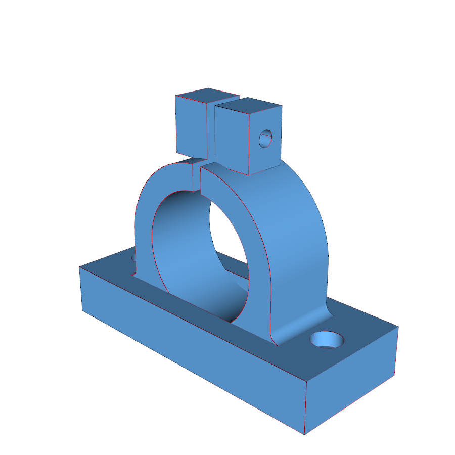
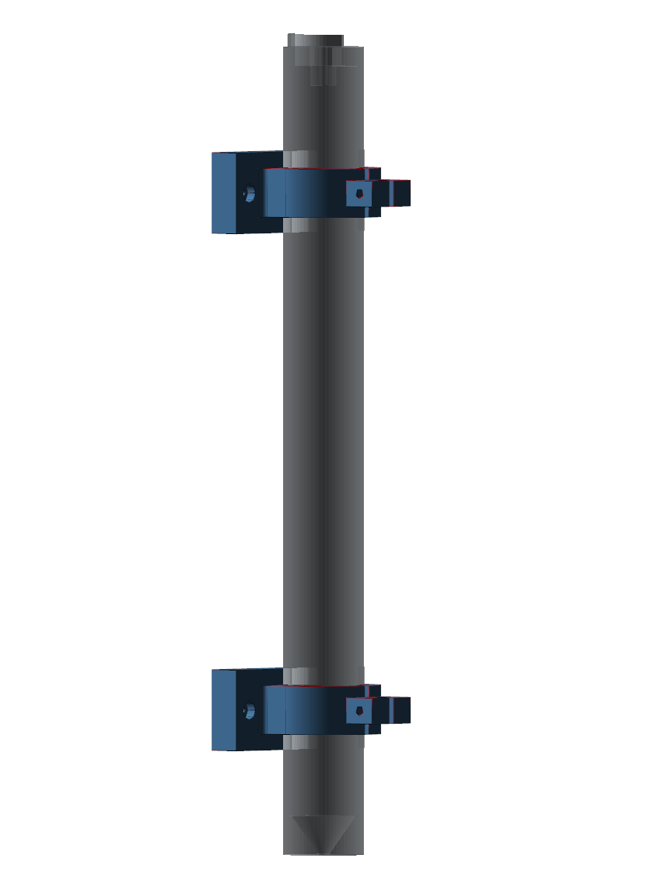

# Auger Bracket

Split shaft-collar + mounting-flange bracket for the Archimedes auger
from PR #16 (`cad/auger/archimedes-auger.scad`, `outer_diameter = 25 mm`,
`total_height = 250 mm`).

Two of these brackets support the auger near its ends, leaving the
centre span clear for the planned solenoid (#25) and coin-vibration
motor (#31).





## Design intent

Per the hand sketch in the source issue:

| feature | dimension | note |
| --- | --- | --- |
| bore Ø | 25.4 mm | auger OD 25 mm + 0.4 mm dia. slip-fit |
| ring wall (radial) | 5 mm | thick enough for the clamp to bear on |
| ring axial width | 15 mm | bearing surface along the auger |
| clamp slit | 2 mm | "2mm" callout in the sketch — top-down through both ears + ring wall to the bore |
| ears (each) | 8 × 8 × 10 mm | M3 clamp screw across both ears |
| M3 clamp screw | Ø 3.2 mm clearance | tighten to pinch the ring closed on the auger |
| flange | 60 × 25 × 10 mm | "10 mm" callout |
| flange ↔ pillar fillet | R 2 mm | "smooth transition" callout |
| mounting holes | 2 × M3 (Ø 3.2 mm) | Ø 6 × 3 mm counterbore for M3 cap screws |

The flange-bottom face is the build-plate face ("Print on this face"
callout) — printed flange-down with no supports needed (all overhangs
are inside the ring and are self-supporting at ≤ 45° because the bore
arch never exceeds the printable horizontal-bridge length on a 0.4 mm
nozzle).

## Files

| file | purpose |
| --- | --- |
| `auger-bracket.py` | parametric CadQuery model — single source of truth |
| `auger-bracket.step` | exported STEP (regenerated by the script) |
| `auger-bracket.stl` | exported STL (3D-print-ready) |
| `render_views.py` | iso / front / side / top PNGs into `views/` |
| `render_assembly.py` | diagram of two brackets gripping the auger |
| `views/iso.png`, `front.png`, `side.png`, `top.png`, `assembly.png` | renders |

## Reproducing the files

```sh
pip install cadquery                                 # cadquery==2.7.0 + cadquery-ocp + vtk
python3 cad/auger-bracket/auger-bracket.py           # → auger-bracket.{step,stl}
xvfb-run -a python3 cad/auger-bracket/render_views.py     # → views/{iso,front,side,top}.png
xvfb-run -a python3 cad/auger-bracket/render_assembly.py  # → views/assembly.png
```

The assembly renderer looks for the PR #16 auger STL at
`cad/auger/archimedes-auger.stl` (once PR #16 merges) or at
`/tmp/auger-ref/archimedes-auger.stl` (handy for off-branch use); pass
`--auger-stl <path>` to override.  If no STL is found it draws a plain
Ø25 × 250 mm cylinder as a stand-in so the script never fails.

## Why CadQuery and not CADsmith

The original ask was to generate this part with
[CADsmith](https://github.com/vertical-cloud-lab/CADSmith).  CADsmith is
a CadQuery-based multi-agent pipeline that requires an
`ANTHROPIC_API_KEY`, which is **not** provisioned in the Copilot
Coding Agent sandbox (only `ZOO_API_TOKEN` and `EDISON_API_KEY` are).
Rather than block the PR, the part was authored by hand in the same
CadQuery shape CADsmith's Coder agent would emit, so the file can be
fed back through CADsmith for validation/refinement once the key is
available.

## Print recipe

* PLA or PETG, 0.4 mm nozzle, 0.2 mm layers
* 4 perimeters, 30 % gyroid infill, no supports
* Orient with the flange face on the build plate (this is the default
  orientation of the STL)
* M3 × 25 mm cap screw + nut for the clamp; 2 × M3 × 12 mm cap screws
  for mounting

After printing, slip the bracket over the auger, snug the clamp screw
just enough to keep the auger from sliding axially under its own
weight, then back off ¼ turn so the auger can still rotate freely.
