# Assembly: chain-carousel test rig

Twelve steps in build order, then the test set-up. In each render the parts from earlier steps are pale, and the step's new parts are in colour, lifted along the way they go in. The table under each render is the BoM lines that step uses ([BOM.md](BOM.md) item numbers). The same order is the Onshape assembly's tree (`01 Frame` ... `12 Electronics board`).

Tools: chain breaker (BOM item 3), metric hex keys, 8 mm and 1/2 in wrenches, drill + countersink, 3-1/8 in hole saw, jigsaw, soldering iron, heat-set insert tip, feeler gauges.

## Step 1. Frame: long rails, cross members, corner brackets

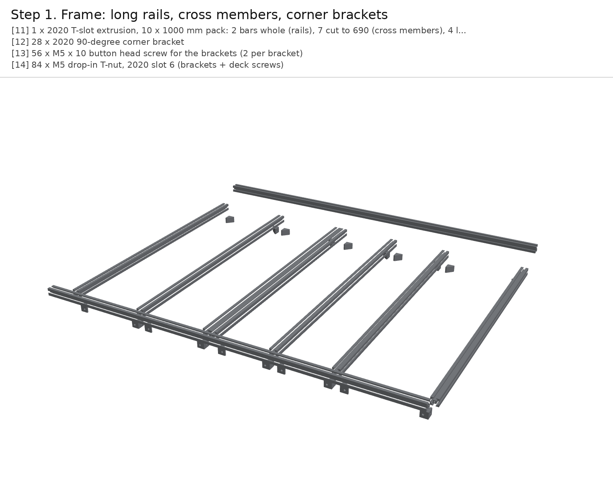

| # | Qty | Part |
|---|---|---|
| 11 | 1 | 2020 T-slot extrusion, 10 x 1000 mm pack: 2 bars whole (rails), 7 cut to 690 (cross members), 4 legs of 230 from the offcuts |
| 12 | 28 | 2020 90-degree corner bracket |
| 13 | 56 | M5 x 10 button head screw for the brackets (2 per bracket) |
| 14 | 84 | M5 drop-in T-nut, 2020 slot 6 (brackets + deck screws) |

The frame uses one VEVOR 10-pack of 1000 mm 2020 bars: 2 whole bars are the long rails, 7 are cut
to 690 mm for the cross members, and 4 legs of 230 mm come from the offcuts. Lay the rails parallel,
710 mm apart centre to centre. Put the cross members between them at 10, 236.6, 396.6, 560, 580, 780
and 990 mm from the **drive end** of the rails:

- the pair at 236.6 and 396.6 box in the motor plate;
- the touching pair at 560 and 580 carry the seam between the two deck sheets, one sheet edge each.

Join each cross member to both rails with a corner bracket in each inside corner. The end members
only get brackets on their inner side. Use M5 x 10 button heads into drop-in T-nuts, snug. Square the
frame by its diagonals (equal within 1 mm), then tighten.

## Step 2. Legs and leveling feet

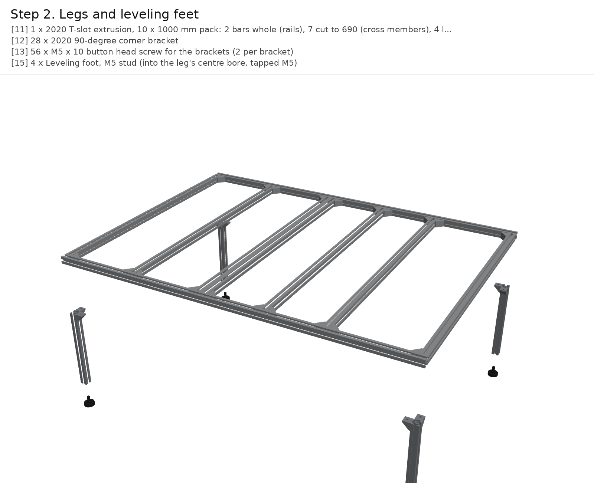

| # | Qty | Part |
|---|---|---|
| 11 | 1 | 2020 T-slot extrusion, 10 x 1000 mm pack: 2 bars whole (rails), 7 cut to 690 (cross members), 4 legs of 230 from the offcuts |
| 12 | 28 | 2020 90-degree corner bracket |
| 13 | 56 | M5 x 10 button head screw for the brackets (2 per bracket) |
| 15 | 4 | Leveling foot, M5 stud (into the leg's centre bore, tapped M5) |

Hang a 230 mm leg under each rail end with two corner brackets: one to the rail's underside, one to
the end cross member's underside. Tap each leg's 4.2 mm centre bore M5 at the bottom and screw in
an M5 leveling foot. Level the frame on the bench.

## Step 3. NEMA 34 on its motor plate

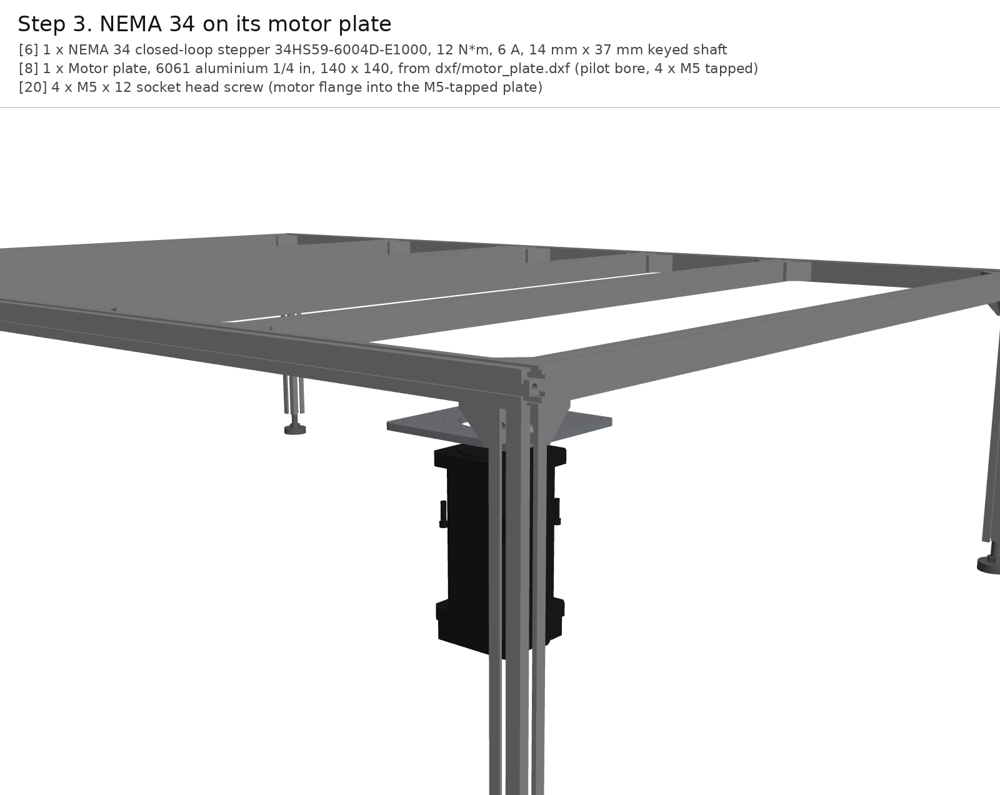

| # | Qty | Part |
|---|---|---|
| 6 | 1 | NEMA 34 closed-loop stepper 34HS59-6004D-E1000, 12 N*m, 6 A, 14 mm x 37 mm keyed shaft |
| 8 | 1 | Motor plate, 6061 aluminium 1/4 in, 140 x 140, from dxf/motor_plate.dxf (pilot bore, 4 x M5 tapped) |
| 20 | 4 | M5 x 12 socket head screw (motor flange into the M5-tapped plate) |

Make the motor plate from [`dxf/motor_plate.dxf`](dxf/motor_plate.dxf): 1/4 in 6061, 140 x 140 mm, a 73.5 mm
pilot bore (hole saw or the shop's lathe), 4 x M5 tapped holes on the 69.6 mm square, and 4 x 5.5 mm corner
holes for the screws that hang it from the deck. Bolt the NEMA 34 up against the plate's underside: shaft
up, pilot in the bore, 4 x M5 x 12 through the motor flange into the tapped holes. The screws must not
stand proud of the plate's top face. The 34HS59 is 169 mm long and weighs about 6 kg; it hangs 190 mm
below the deck.

## Step 4. Deck onto the frame; motor plate up into the deck

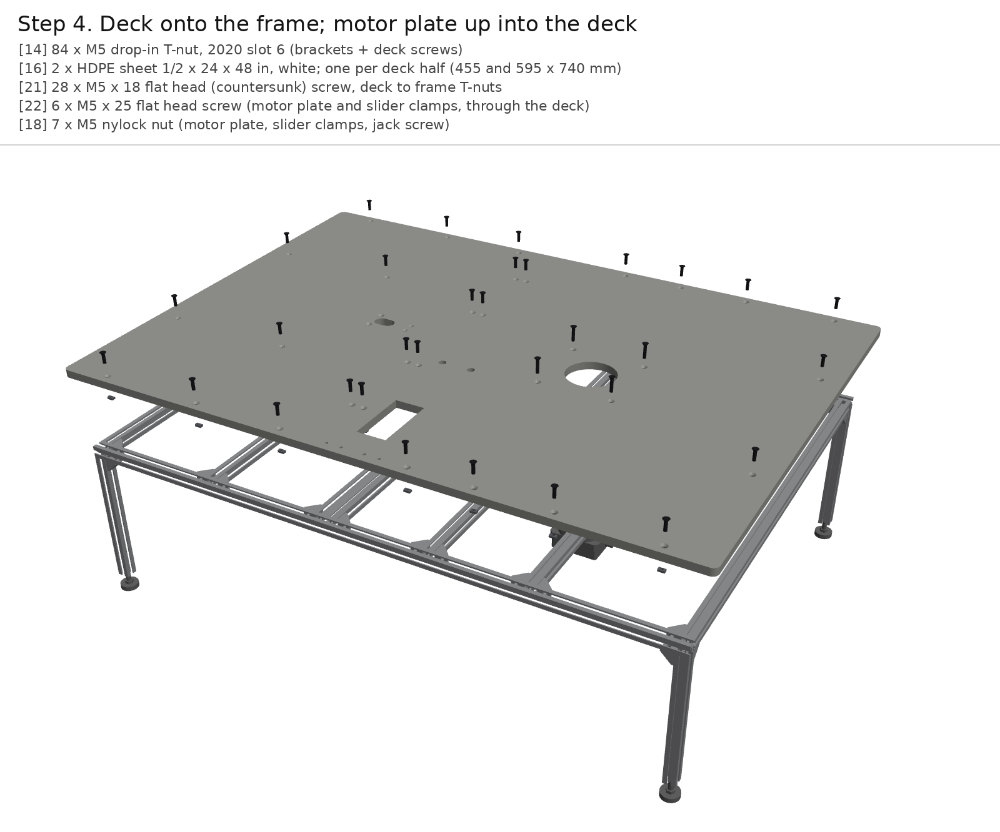

| # | Qty | Part |
|---|---|---|
| 14 | 84 | M5 drop-in T-nut, 2020 slot 6 (brackets + deck screws) |
| 16 | 2 | HDPE sheet 1/2 x 24 x 48 in, white; one per deck half (455 and 595 x 740 mm) |
| 21 | 28 | M5 x 18 flat head (countersunk) screw, deck to frame T-nuts |
| 22 | 6 | M5 x 25 flat head screw (motor plate and slider clamps, through the deck) |
| 18 | 7 | M5 nylock nut (motor plate, slider clamps, jack screw) |

The deck is two 1/2 in HDPE sheets, both cut from 24 x 48 in stock to a 740 mm width: the idler half
is 455 mm long, the drive half 595 mm. They butt together over the touching pair of cross members at
560/580 mm from the drive end, and each sheet screws into its own member. Print
[`dxf/deck_left.dxf`](dxf/deck_left.dxf) and [`dxf/deck_right.dxf`](dxf/deck_right.dxf) at 1:1, tape them on and mark out.
Cut the 80 mm drive hole (3-1/8 in hole saw), the idler slot (22 x 34 mm), the station window
and the two 11.8 mm sensor holes. Drill and **countersink every screw hole so the heads sit 0.3 mm
below the surface**, because the carriage skids slide over them. Lay both halves on the frame and screw
them down with M5 x 18 flat heads into drop-in T-nuts in the rails and cross members. Then lift the
motor plate into its box under the drive hole and fix it with 4 x M5 x 25 flat heads from the top,
with nylock nuts underneath.

## Step 5. Idler: slider, stud, spacer, idler sprocket, tensioner

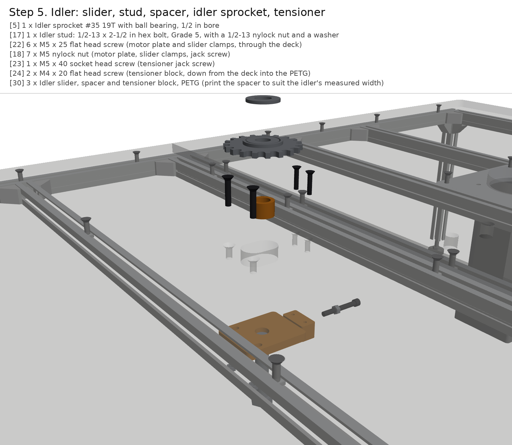

| # | Qty | Part |
|---|---|---|
| 5 | 1 | Idler sprocket #35 19T with ball bearing, 1/2 in bore |
| 17 | 1 | Idler stud: 1/2-13 x 2-1/2 in hex bolt, Grade 5, with a 1/2-13 nylock nut and a washer |
| 22 | 6 | M5 x 25 flat head screw (motor plate and slider clamps, through the deck) |
| 18 | 7 | M5 nylock nut (motor plate, slider clamps, jack screw) |
| 23 | 1 | M5 x 40 socket head screw (tensioner jack screw) |
| 24 | 2 | M4 x 20 flat head screw (tensioner block, down from the deck into the PETG) |
| 30 | 3 | Idler slider, spacer and tensioner block, PETG (print the spacer to suit the idler's measured width) |

Measure the idler sprocket's width through its bearing, W. Print the spacer with height
12.7 + 5.4 - W/2 mm, which puts the tooth ring at the chain's centre plane, 5.4 mm
above the deck. The model uses W = 9.65 mm, the 35BB19H figure.

1. From below: put the printed slider under the idler slot with the 1/2-13 bolt up through it and
   the slot. Clamp it with the two M5 x 25 flat heads through the deck, finger-tight for now.
2. From above: the spacer, the idler sprocket, a washer and the nylock nut. Make it snug: the bearing
   turns, not the bolt.
3. Screw the tensioner block to the deck's underside with two M4 x 20 flat heads from the top, and
   trap an M5 nut in it.
4. Thread the M5 x 40 jack screw through the block until it touches the slider's face. The slider
   has 12 mm of travel.

## Step 6. Drive sprocket on the motor shaft

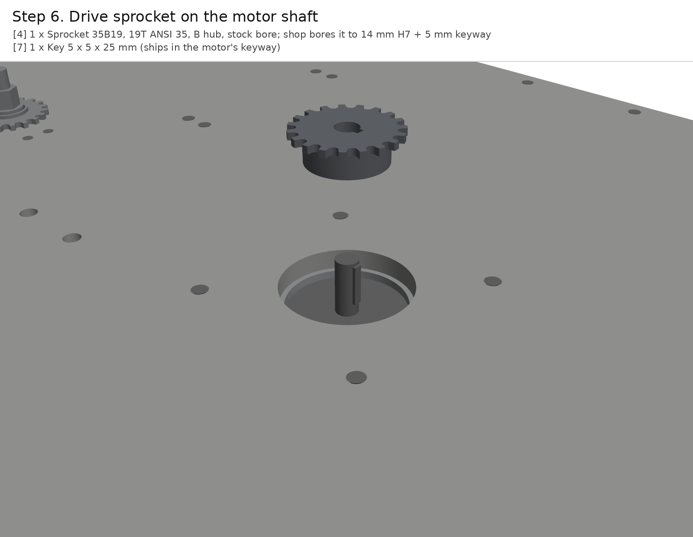

| # | Qty | Part |
|---|---|---|
| 4 | 1 | Sprocket 35B19, 19T ANSI 35, B hub, stock bore; shop bores it to 14 mm H7 + 5 mm keyway |
| 7 | 1 | Key 5 x 5 x 25 mm (ships in the motor's keyway) |

Have the 35B19 bored to 14 mm H7 with a 5 mm keyway (BYU machine shop). Check that the key is in
the motor shaft, then slide the sprocket on **hub down**, into the deck hole. Set the tooth ring's
mid-plane 5.4 mm above the deck: rest a 3.3 mm shim under the tooth ring, tighten both set
screws (one over the key), and remove the shim. The 37 mm shaft stands about 10 mm above the sprocket.

## Step 7. Hall sensors (index, home) into the deck

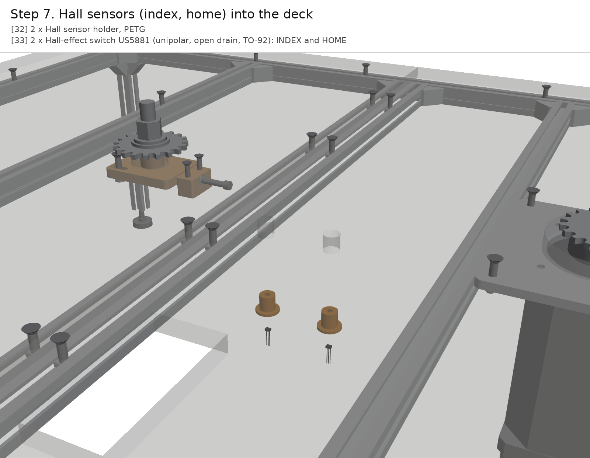

| # | Qty | Part |
|---|---|---|
| 32 | 2 | Hall sensor holder, PETG |
| 33 | 2 | Hall-effect switch US5881 (unipolar, open drain, TO-92): INDEX and HOME |

Solder 30 cm leads to the two US5881 sensors. Push each into its printed holder, face up, and press the
holders into the sensor holes from below so the sensor face sits 0.8 mm under the deck surface.
The one on the drive side (+X in the carriage frame) is INDEX; the other is HOME. Both run on 5 V,
and their open-drain outputs get 10k pull-ups to 3.3 V.

## Step 8. Chain: 12 A-1 attachment links every 8 pitches, close the loop, tension

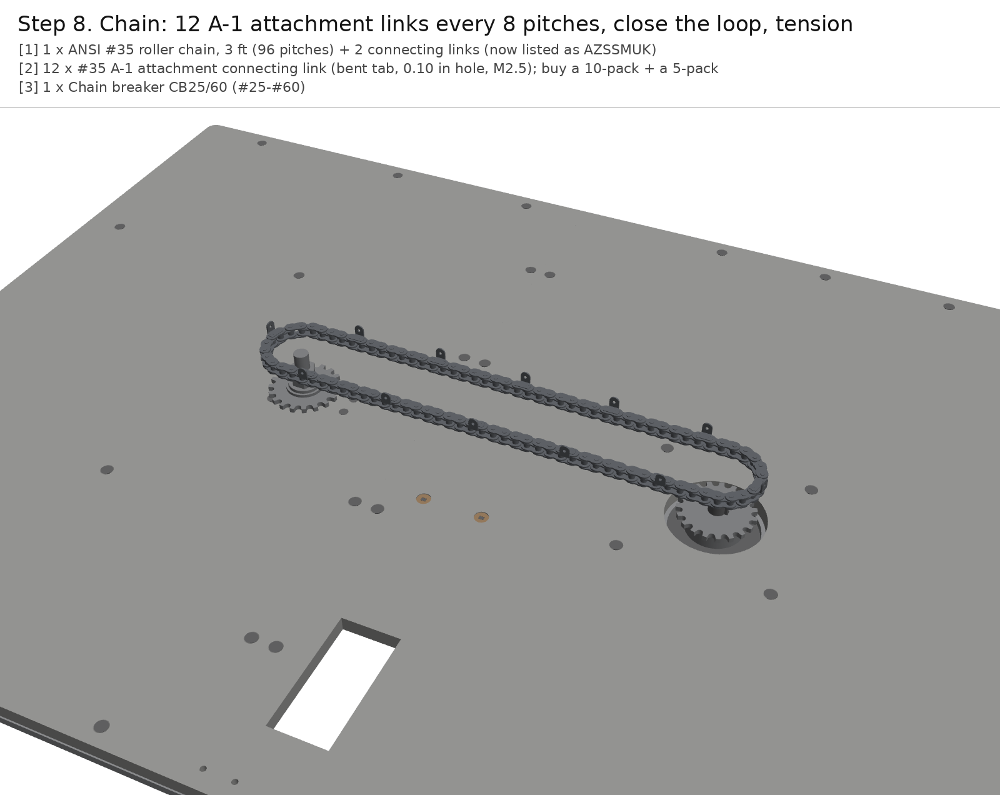

| # | Qty | Part |
|---|---|---|
| 1 | 1 | ANSI #35 roller chain, 3 ft (96 pitches) + 2 connecting links (now listed as AZSSMUK) |
| 2 | 12 | #35 A-1 attachment connecting link (bent tab, 0.10 in hole, M2.5); buy a 10-pack + a 5-pack |
| 3 | 1 | Chain breaker CB25/60 (#25-#60) |

**First measure the chain** (see the BoM note): about 4.78 mm between the inner plates and a 5.08 mm
bushing means ANSI 35, which is what the sprockets are. Lay it round both sprockets to check the
length: 96 pitches, both spans tight with the idler slid fully in.

With the chain breaker, take out **11 riveted outer links, one every 8 pitches**. Fit an A-1
attachment connecting link in each gap, **tab up and on the outside of the loop**, then close the
loop with the 12th A-1 link. Each spring clip's closed end points the way the chain travels
(counter-clockwise seen from above).

Back the jack screw out until the mid-span deflection is 3-4 mm under a 5 N side push (TEST-PLAN
T1), then tighten the slider clamps.

## Step 9. Carriages: inserts and magnets, then bolt each to its A-1 tab

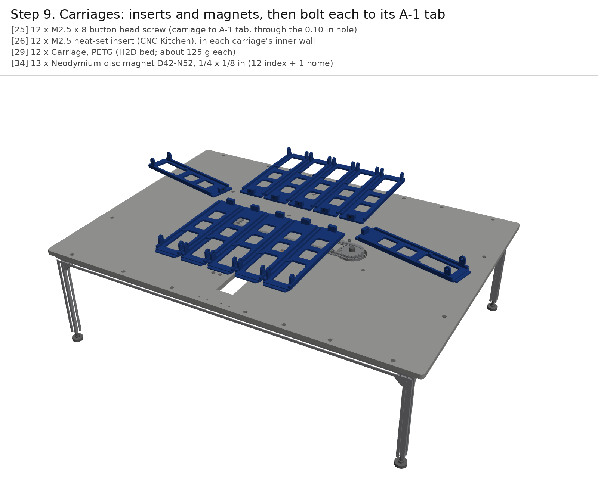

| # | Qty | Part |
|---|---|---|
| 25 | 12 | M2.5 x 8 button head screw (carriage to A-1 tab, through the 0.10 in hole) |
| 26 | 12 | M2.5 heat-set insert (CNC Kitchen), in each carriage's inner wall |
| 29 | 12 | Carriage, PETG (H2D bed; about 125 g each) |
| 34 | 13 | Neodymium disc magnet D42-N52, 1/4 x 1/8 in (12 index + 1 home) |

Print 12 carriages in PETG on the H2D: skids down, 0.2 mm layers, 4 walls, 30% gyroid, about 125 g
each. Then, on each one:

1. Melt an M2.5 heat-set insert into the inner wall.
2. Glue a 1/4 x 1/8 in magnet, **south pole down**, into the +X pocket under the inner skid (INDEX).
3. On carriage 1 only, glue a second magnet into the -X pocket (HOME).
4. Write the carriage number on a rib.

Stand each carriage on the deck against its A-1 tab and screw it on from the chain side with an
M2.5 x 8 button head through the tab's 0.10 in hole. Carriage 1 goes on the A-1 link that sits over
the sensors when the chain is at home.

## Step 10. Station hold-down blocks

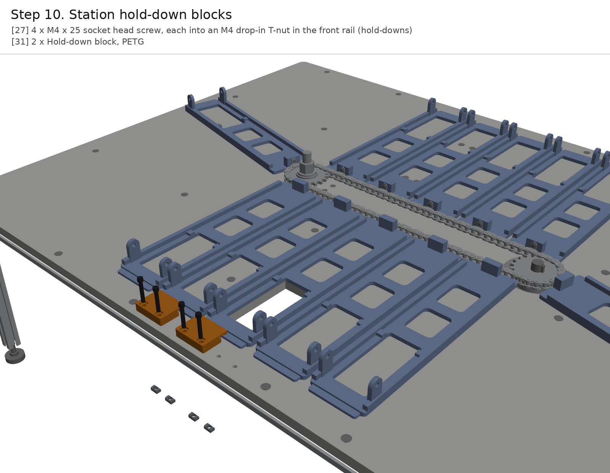

| # | Qty | Part |
|---|---|---|
| 27 | 4 | M4 x 25 socket head screw, each into an M4 drop-in T-nut in the front rail (hold-downs) |
| 31 | 2 | Hold-down block, PETG |

Bolt the two hold-down blocks to the front rail at the station: M4 x 25 screws into M4 drop-in T-nuts in
the rail's top slot, through the deck. Slide carriage 1 under them by hand. With a feeler gauge, set
each lip 0.5 mm above the tongue before tightening. Then index every carriage in and check its tongue
slides under the lips without catching.

## Step 11. Module 1: Sam's mounting plate, auger and cap on carriage 1

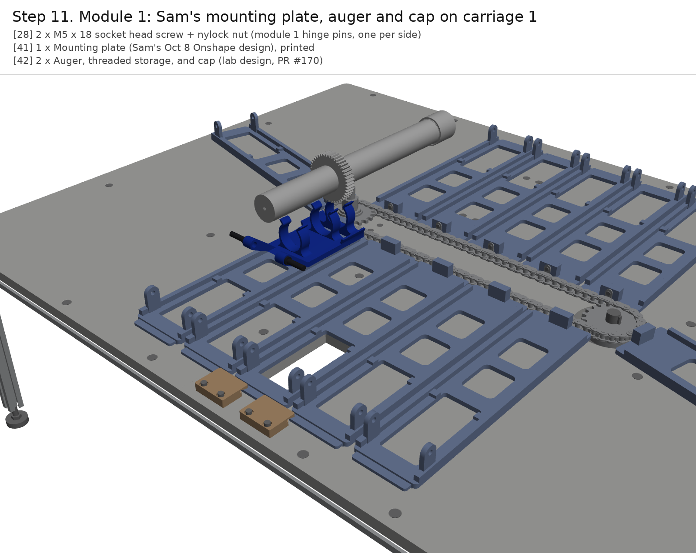

| # | Qty | Part |
|---|---|---|
| 28 | 2 | M5 x 18 socket head screw + nylock nut (module 1 hinge pins, one per side) |
| 41 | 1 | Mounting plate (Sam's Oct 8 Onshape design), printed |
| 42 | 2 | Auger, threaded storage, and cap (lab design, PR #170) |

Module 1 is the hardware the lab already has: Sam's Oct 8 mounting plate holding the lab auger
(threaded storage + cap). The 44T gear sits in the 10.1 mm gap between his second and third clamp
rings, with the outlet end at the hinge.

Put the plate between carriage 1's lugs, hinge end outward. Pin each side with an M5 x 18 socket
head through the lug into the plate's knuckle, with a nylock nut. A single through-pin would cross
the auger's outlet end. Leave the nuts snug but free, so the plate drops onto its rest posts under
its own weight. The hinge axis is 276 mm out from the chain line and 28 mm above the
deck. The gear hangs in the carriage window, and the cap end stops 20 mm short of the chain.

## Step 12. Electronics board: supply, driver, Pi, interface board, e-stop

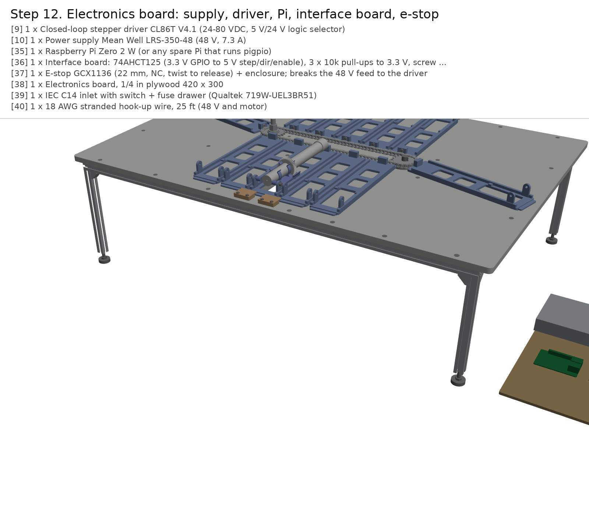

| # | Qty | Part |
|---|---|---|
| 9 | 1 | Closed-loop stepper driver CL86T V4.1 (24-80 VDC, 5 V/24 V logic selector) |
| 10 | 1 | Power supply Mean Well LRS-350-48 (48 V, 7.3 A) |
| 35 | 1 | Raspberry Pi Zero 2 W (or any spare Pi that runs pigpio) |
| 36 | 1 | Interface board: 74AHCT125 (3.3 V GPIO to 5 V step/dir/enable), 3 x 10k pull-ups to 3.3 V, screw terminals, perfboard |
| 37 | 1 | E-stop GCX1136 (22 mm, NC, twist to release) + enclosure; breaks the 48 V feed to the driver |
| 38 | 1 | Electronics board, 1/4 in plywood 420 x 300 |
| 39 | 1 | IEC C14 inlet with switch + fuse drawer (Qualtek 719W-UEL3BR51) |
| 40 | 1 | 18 AWG stranded hook-up wire, 25 ft (48 V and motor) |

The electronics board sits on the bench beside the drive end. Wire it like this:

| From | To |
|---|---|
| Mains (IEC inlet, fuse, switch) | LRS-350-48 AC input |
| LRS-350-48 +V | E-stop (NC) -> 10 A fuse -> CL86T +VDC |
| LRS-350-48 -V | CL86T GND |
| NEMA 34 A+/A-/B+/B- | CL86T A+/A-/B+/B- |
| NEMA 34 encoder (EA+/EA-/EB+/EB-/VCC/GND) | CL86T encoder port |
| Pi GPIO 17 / 27 / 22 | 74AHCT125 inputs 1A / 2A / 3A (VCC 5 V, OE tied low) |
| 74AHCT125 outputs 1Y / 2Y / 3Y | CL86T PUL+ / DIR+ / ENA+ (logic selector at 5 V) |
| CL86T PUL- / DIR- / ENA- | Pi GND |
| Pi 3.3 V via 10k | GPIO 23 (INDEX), GPIO 24 (HOME), GPIO 25 (CL86T ALM+; ALM- to GND) |
| Pi 5 V, GND | Both US5881 VCC, GND; outputs to GPIO 23 / 24 |

The 74AHCT125 is there because a 3.3 V GPIO pin only just reaches the CL86T's 7 mA input minimum. A
ULN2803 sinking the minus terminals drops about 1 V, which would put it at the same limit.

Set the CL86T DIP switches to 4000 pulses/rev and the motor current to 6.0 A. Run `sudo pigpiod`, then
`python3 test/chain_rig.py --sim lap` to check the software and `python3 test/chain_rig.py home` to
check the hardware.

## Step 13. Test set-up (not in the CAD)

| # | Qty | Part |
|---|---|---|
| 43 | 1 | Digital indicator 0-1 in / 0.01 mm with arm and magnetic base (lift, sag, index tests) |
| 44 | 1 | Digital hanging scale 50 kg (drag and push-up force; a 50 N push-pull gauge is better if the lab has one) |
| 45 | 1 | ADXL343 accelerometer breakout (transit vibration) |
| 46 | 11 | Dummy module mass: 250 g bag of table salt per carriage |

Put a 250 g dummy (a salt bag taped to the plate) on carriages 2-12, mount the dial indicator on its magnetic base on a steel plate on the deck at the station, and stick the ADXL345 to module 1's mounting plate near the outlet. Then run [TEST-PLAN.md](TEST-PLAN.md) T0-T7.
