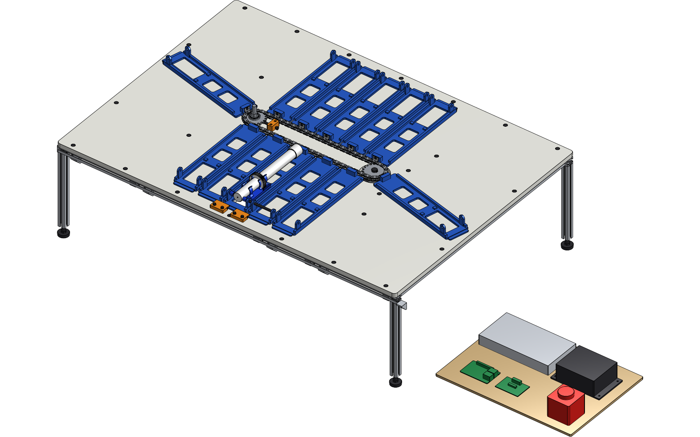
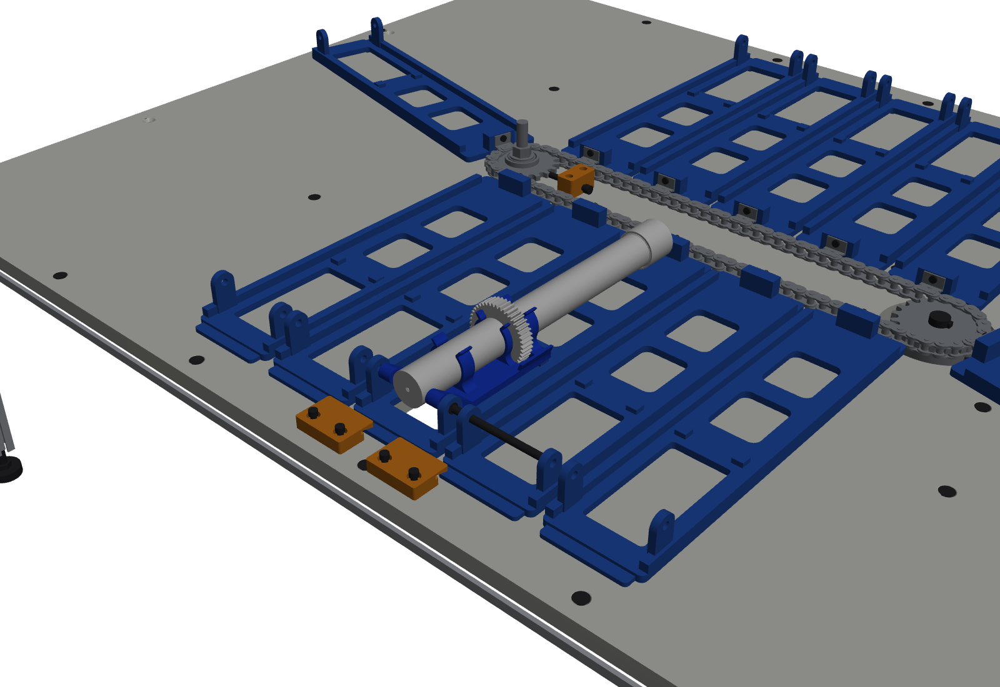
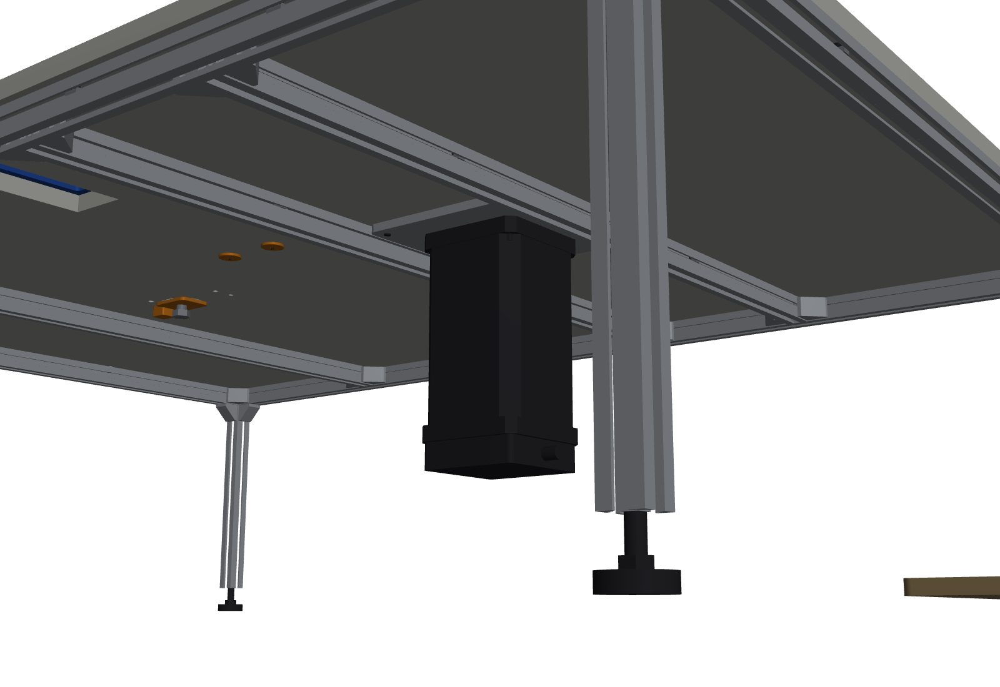
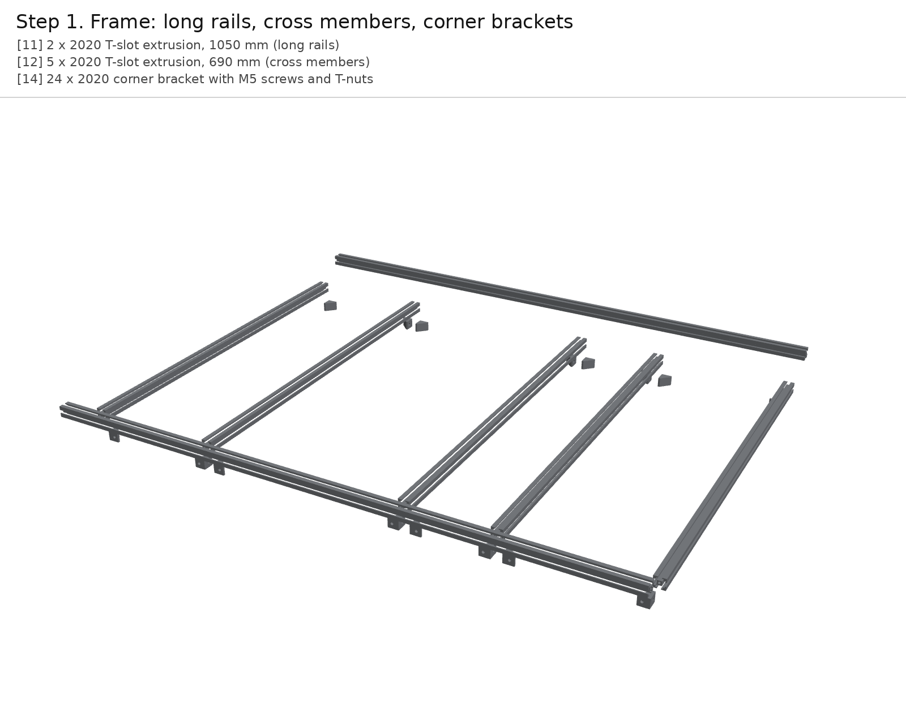

# Multi-doser chain carousel: test rig v0 (#128)

A bench rig for the one question the multi-doser can't skip: **does a horizontal #35 roller-chain loop carry and index the passive carriages from the [Aug 18 pitch](https://github.com/vertical-cloud-lab/powder-doser/issues/128) reliably?** It uses the chain already on the ME order (Aobbmok #35, 96 links), the NEMA 34 UofU bought, and Sam's Oct 8 mounting plate as module 1. Everything else is a real, orderable part ([BOM.md](BOM.md)) or printed ([`stl/`](stl)).

**Onshape (public, owned by Vertical Cloud Lab), built through the REST API:**
[Multi-doser chain carousel - test rig](ONSHAPE_URL). The assembly tree is the build sequence (`01 Frame` … `12 Electronics board`), and all unique parts are in one Part Studio. See [Onshape](#onshape) below.



| Station (module 1 on carriage 1, hold-downs, hall sensors under the deck) | Drive end from below (NEMA 34 on its plate) |
|---|---|
|  |  |

## The design in numbers

| | Value | Why |
|---|---|---|
| Chain | ANSI #35, 96 pitches, 9.525 mm pitch, lying flat (pins vertical) | The box on the ME order. Flat, so carriages stay upright all the way round |
| Sprockets | 2 x 19T ANSI 35: drive 35B19 bored 14 mm on the motor shaft, idler with a ball bearing | 19T is the smallest count with under 1.5% chordal speed ripple |
| Centre distance | **366.71 mm = 38.5 pitches** | For two equal 19T sprockets this closes 96 links exactly: two 38-link spans plus 10 links on each sprocket ([`layout.chain_pins`](layout.py)) |
| Modules | **12, every 8 pitches (76.2 mm)** | 96 / 8. One module is 8/19 of a sprocket turn |
| Attachment | 12 x #35 **A-1 attachment connecting links**, tab up and outward; carriage bolts on with one M3 | Steel stays in the tension path; the PETG carriage only hangs off the tab (July 31 advice) |
| Carriage | PETG, 70 x 290 mm, 4 skids on the deck, 125 g | Rides on the deck, not on the chain, so the chain only pulls |
| Deck | 1/2 in HDPE, 1050 x 740 mm, on a 2020 frame with legs | Low-friction wear surface under the whole sweep, round the ends too |
| Drive | NEMA 34 34HS59-6004D-E1000 + CL86T, 36 V | Needs about 0.23 N·m against 12 N·m available. The 4000-count encoder catches missed steps |
| Station | Deck window under carriage 1, two hold-down blocks over the carriage tongue, 2 hall switches | Reacts the station's upward push locally (Aug 18 pitch, [12:41]–[13:23]) instead of through the chain |

### The auger sets the rig's size

The lab auger is **250 mm** long. Sam's Oct 8 mounting plate holds it with the **outlet at the hinge**, and the tube runs about 150 mm past the plate's free end. With the outlet pointing outward over the balance, that free end points back at the chain. The hinge therefore has to sit **270 mm** from the chain for the cap end to clear the chain and the A-1 tabs. On the wraps each carriage sweeps a 330 mm radius, so the deck is 1050 x 740 mm for 12 modules. Two other options don't work:

- **Pointing the augers inward** puts 12 cap ends into the 58 mm-wide middle of the loop.
- **Laying them along the chain** needs 26 pitches per module, which leaves 3 modules on this chain.

A **150 mm auger** would bring the hinge in to about 170 mm and the deck down to about 850 x 540 mm. That is worth deciding before the carriage is printed 12 times. `HINGE_Y` in [`params.py`](params.py) is the one number to change; the cut-outs, sensors and hold-downs follow it.

### Correction to the July 31 sprocket note

The July 31 pricing comment said to buy "ANSI #35 sprockets, not 06C". **ISO 06C is ANSI 35**: 9.525 mm pitch, 5.08 mm bushing, 4.78 mm between the inner plates. The one to avoid is **06B** (British standard). It has the same pitch, but a 6.35 mm roller and 5.72 mm between the inner plates, and its roughly 5.3 mm teeth bind in a #35 chain's 4.78 mm gap. Many metric-bore listings are 06B, so check the tooth width (#35: 0.168 in / 4.27 mm) before buying.

## How it goes together

[**ASSEMBLY.md**](ASSEMBLY.md) has 12 steps, each with a render and the BoM lines it uses.



## Testing the chain

[**TEST-PLAN.md**](TEST-PLAN.md) covers T0 fit, T1 tension, T2 drag, **T3 index repeatability**, T4 station push-up, T5 transit vibration and powder loss, T6 endurance and T7 wraps on video. [`test/chain_rig.py`](test/chain_rig.py) runs them from a Pi (pigpio step/dir into the CL86T, hall-sensor homing, CSV log, `--sim` for a dry run).

## Onshape

[`onshape/onshape_build.py`](onshape/onshape_build.py) creates the document in the Vertical Cloud Lab company and makes it public. It uploads [`step/chain_carousel_rig.step`](step/chain_carousel_rig.step) once as a composite import (`flattenAssemblies=false`), saves Onshape's own shaded views to [`renders/onshape/`](renders/onshape) and marks a version. The STEP shares part definitions between instances: the 84 plain chain links are two parts, and 269 instances come from 43 parts. So the import is one upload plus a poll. Every call is logged in [`onshape/api_calls.jsonl`](onshape/api_calls.jsonl), and the ids are in [`onshape/onshape_document.json`](onshape/onshape_document.json).

| Purpose | Calls |
|---|---|
| Read Sam's two documents and export his Oct 8 Part Studio to STEP (read-only) | 10 |
| Company id, new document | 2 |
| Upload + translation poll + element list | 3 |
| Shaded views (iso, front-iso, top) | 3 |
| Version | 1 |

That is under 1% of the company's 2,500 calls a year. **Git stays the source of truth**: change `params.py`, run `build.py`, re-import. If someone edits the design in Onshape, bring the change back as a reviewed STEP export.

## Files

| File | What |
|---|---|
| [`params.py`](params.py) | Every dimension, with its source |
| [`parts.py`](parts.py) | CadQuery models: chain links (inner, outer, A-1), 19T sprockets with real tooth gaps, NEMA 34, 2020 profile, printed parts, fasteners, electronics envelopes |
| [`layout.py`](layout.py) | Exact chain solution, carriage frames, deck openings, placements and assembly steps |
| [`build.py`](build.py) | STEP assembly + per-part STEP, print STLs, DXF cutting templates (deck, motor plate), `placements.json` |
| [`render.py`](render.py) | Hero views, one image per step, GIF (VTK, `xvfb-run`) |
| [`bom.py`](bom.py) | The BoM table; quantities counted from the CAD; writes [BOM.md](BOM.md) and [bom.csv](bom.csv) |
| [`reference/`](reference) | Sam's Oct 8 Part Studio (exported from his Onshape doc) and the lab auger + cap (PR #170) |
| [`onshape/`](onshape) | API client with a call budget and ledger, build script, document ids |
| [`test/chain_rig.py`](test/chain_rig.py) | Pi driver and logger for the tests |

```bash
pip install cadquery vtk pillow requests
python build.py && python bom.py && xvfb-run -a python render.py
cd onshape && python onshape_build.py create        # needs ONSHAPE_ACCESS_KEY / ONSHAPE_SECRET_KEY
```

## Not done yet

- **No station in the CAD.** Sam's electronics carriage is in `reference/` but not placed; this rig only provides the window, hold-downs and sensors it will need. The linear actuator and couplings come next.
- **No mates in Onshape.** The import places every instance; it adds no revolute mates for the sprockets and no hinge mate for module 1. Onshape has no chain mate, so animating the loop would mean driving instance transforms from `layout.py`.
- **Not built or run.** Every number in TEST-PLAN.md is a prediction until T0–T7 are done.
