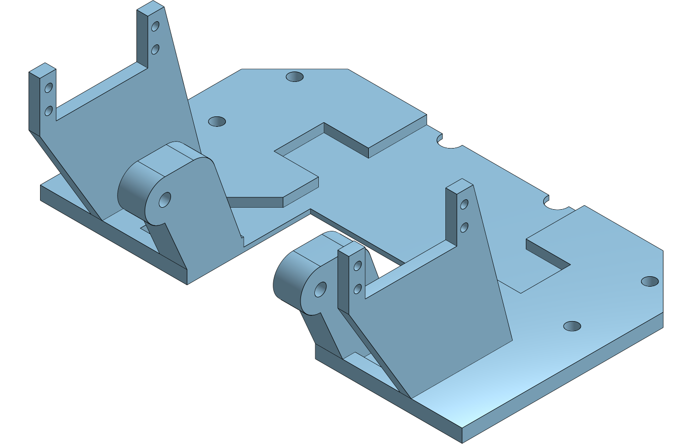
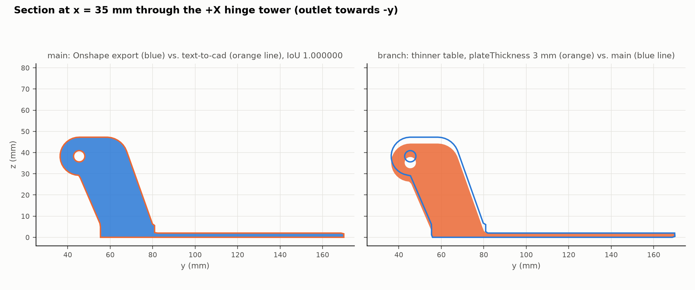
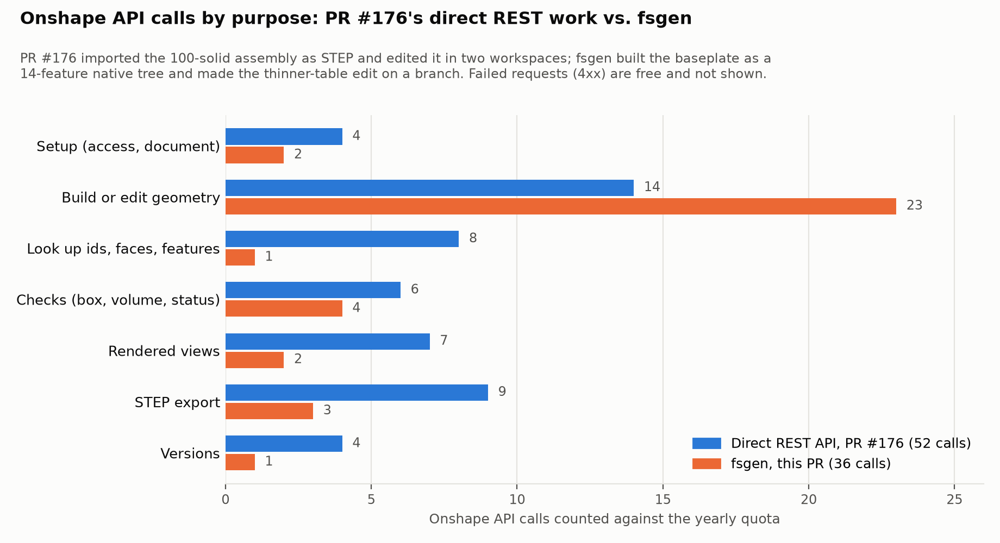

# fsgen on the servos-above baseplate (issue #171)

[fsgen](https://github.com/Lucasfrit/onshape-fsgen) (commit 95135c0, suggested in
[#171](https://github.com/vertical-cloud-lab/powder-doser/issues/171#issuecomment-6055694044))
turns a Part Studio script into a native Onshape feature tree. It builds and checks the script
locally first, then pushes it feature by feature, so design iterations cost no API calls. This
folder repeats the job PR #176 did through the REST API directly: the servos-above baseplate
in Onshape, plus the "thinner table" edit. It then compares the API calls.

**Repeated with fsgen 0.2.0 in [`v0.2.0/`](v0.2.0/README.md).** The mirror now builds on the
first push, and in Onshape the cradles follow `#plateThickness` and `#hingeDrop`. The towers still
don't: their sketch is over-constrained and loses its dimensions. The same steps took 35 calls
(36 here).

**Onshape document (public, owned by Vertical Cloud Lab):**
[Powder doser baseplate, servos above - fsgen native tree (#171)](https://cad.onshape.com/documents/81c1f65bc8ecb1a4935de521/w/559770a1e881cadedeacf3ad/e/3c350455e7fb77d514c18760).
Onshape asks you to sign in to view it, even though it is public.

| Where | What |
|---|---|
| [**main** workspace](https://cad.onshape.com/documents/81c1f65bc8ecb1a4935de521/w/559770a1e881cadedeacf3ad/e/3c350455e7fb77d514c18760) | The final design: text-to-cad's lowered baseplate (`#hingeDrop` = 5 mm, `#plateThickness` = 6 mm) |
| [version "text-to-cad design (fsgen)"](https://cad.onshape.com/documents/81c1f65bc8ecb1a4935de521/v/d4e555669819f61892e0be1c/e/3c350455e7fb77d514c18760) | The same state, frozen |
| [branch "thinner table (plateThickness 3 mm)"](https://cad.onshape.com/documents/81c1f65bc8ecb1a4935de521/w/0f6f0dd6752fa8be4671adc3/e/3c350455e7fb77d514c18760) | PR #176's main-workspace edit, made with fsgen: the table is 3 mm thinner and everything on it sits 3 mm lower |

The document also has an empty "Part Studio 1" tab. Onshape creates it with every new
document, and deleting it would have cost 2 more calls.

| Onshape's render of the main workspace | Section through the +X tower |
|---|---|
|  |  |

## The part

[`parts/baseplate_servos_above.fs`](parts/baseplate_servos_above.fs) is the spec of
`cad/text-to-cad/src/parts/baseplate.py`, `make_baseplate("above")` (PR #176), written as an
fsgen script. It has 7 variables in a Variable Studio and 14 features:

| # | Feature | Type | Driven by |
|---|---|---|---|
| 1 | Plate sketch | Sketch: outline, 4 screw holes | `#screwHoleDiameter` |
| 2 | Plate | Extrude | `#plateThickness` |
| 3 | Relief floor plane | Plane, offset from Top | `#reliefSkin` |
| 4–5 | Relief sketch, Relief | Sketch, Extrude (remove, through all) | |
| 6–7 | Slot and notch sketch, Cup slot and head notches | Sketch (rectangle + 2 circles), Extrude (remove) | `#slotWidth` |
| 8–10 | Tower plane, Tower sketch, Hinge tower | Plane at x = 28.9, Sketch (lines, 2 arcs, hinge hole), Extrude (add) | `#hingeHoleDiameter` (see below for `#plateThickness`, `#hingeDrop`) |
| 11–13 | Cradle plane, Cradle sketch, Servo cradle | Plane at x = 67.1, Sketch (U outline, 4 ear holes), Extrude (add) | `#cradleHoleDiameter` |
| 14 | Mirror tower and cradle | Mirror (feature pattern, "Reapply features") | |

Checks ([`compare_step.py`](compare_step.py), [`results/`](results)):

| | Volume (mm³) | IoU vs. text-to-cad's `baseplate_servos_above.step` |
|---|---|---|
| fsgen's local build (0 calls) | 137,661.008 | **1.000000** |
| Onshape's volume check after the push | 137,661.008 | |
| STEP exported back from Onshape | 137,661.008 | **1.000000** |
| Branch "thinner table": local build / Onshape's volume check | 103,908.7 / 103,908.655 | (top at z = 72.66 instead of 75.66) |

## API calls

The company plan (EDU Educator) allows 2,500 calls a year for the whole company. fsgen logs
every call to `.fsgen_api_ledger.jsonl` (the branch has its own, in
[`branch_thinner_table/`](branch_thinner_table)). [`api_calls.py`](api_calls.py) sorts both
ledgers and PR #176's log ([`results/pr176_api_calls.jsonl`](results/pr176_api_calls.jsonl)) by
purpose. Onshape doesn't count failed requests (4xx).



| Step | Calls | What |
|---|---|---|
| New public document | 2 | company id, document (fsgen would have made a private one, 4 calls) |
| First push | 19 | new Part Studio 1, Variable Studio 3, features 14, plus 1 to diagnose the mirror, which failed in Onshape |
| Fix the mirror | 2 | that one feature updated in place, volume check |
| Renders, STEP export, version | 6 | 2 shaded views; translation, 1 poll, download; version |
| Feature tree for this README | 1 | `GET features` ([`results/onshape_features.json`](results/onshape_features.json)) |
| Thinner table on a branch | 6 | branch 1; Variable Studio 1, the two profile sketches 2, status check 1, volume check 1 |
| **Total** | **36** | 1.4 % of the year's 2,500 |

The same edits, step by step:

| | Direct REST API (PR #176) | fsgen |
|---|---|---|
| Get the baseplate into Onshape | 9 (access check 2, STEP import 7). A solid with no history | 23 (document 2, push 19, fix 2). A 14-feature native tree |
| Find the faces and ids to edit | 4 (`bodydetails`, `featurespecs` twice, a box) | 0: the tree is the script |
| Thinner table, plus a check | 3 features + 8 to verify (box, mass, 2 views, STEP export, version) | 5 including a volume check, plus 1 for the branch |
| Hinge 5 mm lower, plus checks | 30 logged, 28 counted: branch, Feature Studio and v1 7; v2 6; verifying v1 and v2 17 (v1 failed the tilt sweep) | Already in the tree as `#hingeDrop`. fsgen estimates 5 calls to change it, like the thinner table |
| Design iterations | Each costs calls (v1 → v2 cost 14) | About a dozen local builds and checks, 0 calls |

Other edits, as fsgen estimates them offline (`fsgen studio check`, 0 calls): a variable that
drives a dimensioned circle (`#screwHoleDiameter`) costs 3 calls, and a literal changed in a
sketch (the notch diameter) costs 3. The paste route, one custom feature with a parameter
dialog ([`out/paste/baseplate_servos_above.fs`](out/paste/baseplate_servos_above.fs)), costs 0.
Its local volume matches the native build, but pasting needs the Onshape UI, so it wasn't tried
in Onshape.

**Where the savings come from:** checks and lookups. A 1-call volume check against the local
build replaces STEP export round trips (34 calls → 11 for lookups, checks, views, exports and
versions). Edits re-send only the features that changed. **Where fsgen costs more:** building
the tree costs about one call per feature (19), while a STEP import is 2 (upload, poll). For
geometry that only needs to be viewed, importing is cheaper.

The scopes differ. PR #176 imported the whole 100-solid assembly and moved the other 99
solids with one Transform. fsgen only makes parts; it doesn't import or assemble.

## What to know before using it

* **The local build doesn't catch everything.** The mirror built locally, but Onshape rejected
  it (`PATTERN_SWITCH_TO_PER_INSTANCE`, faulty parameter `fullFeaturePattern`). fsgen stopped
  there and diagnosed it in 1 call. The fix (`"fullFeaturePattern" : true`) re-sent that one
  feature.
* **Only rectangles and circles get dimensions.** fsgen dimensions rectangles (width, height,
  corner) and circles (diameter, centre), and positions only on the Top, Front and Right planes.
  Polylines and arcs get coincident and horizontal/vertical constraints only. In Onshape (see
  [`results/onshape_features.json`](results/onshape_features.json)), `#slotWidth`,
  `#reliefSkin`, `#plateThickness` (the plate's depth) and the three hole diameters follow the
  Variable Studio. `#hingeDrop` drives nothing in Onshape, and the towers and cradles wouldn't
  follow `#plateThickness`. fsgen applies those two by recomputing the two profile sketches and
  re-sending them (which is why the thinner-table edit cost 5 calls, not 3). **Change
  `#plateThickness` or `#hingeDrop` in the `.fs` and push again; changing them in Onshape's
  Variable Studio would leave the towers floating above a thinner plate.** The document's
  description says the same.
* **Documents are private by default.** fsgen creates its own private "fsgen-workspace"
  document. [`onshape_doc.py`](onshape_doc.py) creates a public, company-owned document instead
  and points fsgen at it through `.fsgen_workspace.json`. It also makes the versions, branches,
  renders and the STEP export, all through fsgen's client, so every call is in the same ledger.
* **The paste route and `fsgen generate` weren't used here.** The script was written as
  `/make-part` in [AGENTS.md](https://github.com/Lucasfrit/onshape-fsgen/blob/main/AGENTS.md)
  describes, with Claude Code as the designer.

## Reproduce

```bash
git clone https://github.com/Lucasfrit/onshape-fsgen && cd onshape-fsgen && git checkout 95135c0
python3.12 -m venv .venv && .venv/bin/pip install -e .
cd <this folder>
fsgen studio build parts/baseplate_servos_above.fs                     # local: STEP, STL, preview, 0 calls
python compare_step.py out/baseplate_servos_above/baseplate_servos_above.step <text-to-cad STEP>
fsgen studio check parts/baseplate_servos_above.fs --name "Baseplate (servos above)" --metrics   # estimate, 0 calls
# with ONSHAPE_ACCESS_KEY / ONSHAPE_SECRET_KEY set (these cost calls):
python onshape_doc.py create
fsgen studio push parts/baseplate_servos_above.fs --name "Baseplate (servos above)" --metrics --budget 25
python onshape_doc.py views; python onshape_doc.py export; python onshape_doc.py version "name" "description"
python onshape_doc.py branch "thinner table (plateThickness 3 mm)" branch_thinner_table
cd branch_thinner_table && fsgen studio push baseplate_thinner_table.fs --name "Baseplate (servos above)" --metrics
```

The reference STEP is `cad/text-to-cad/STEP/parts/baseplate_servos_above.step` on the PR #176
branch (`claude/issue-172-20261003-2216`).

## Files

| File | What |
|---|---|
| `parts/baseplate_servos_above.fs` | The fsgen script (the source of truth for the Onshape tree) |
| `out/baseplate_servos_above/` | fsgen's local build: STEP, STL, 4-view preview |
| `out/paste/baseplate_servos_above.fs` | The same part as one custom feature, to paste into a Feature Studio (0 calls) |
| `branch_thinner_table/` | The thinner-table script, its local build, fsgen state and ledger for the branch |
| `onshape_doc.py` | Public company document, versions, branches, renders, STEP export, feature tree |
| `onshape_document.json` | Document, workspace, element, feature, version and branch ids |
| `.fsgen_native.json`, `.fsgen_workspace.json` | fsgen's state: a later push from this folder updates the same Part Studio |
| `.fsgen_api_ledger.jsonl` | Every call fsgen's client made for the main workspace |
| `compare_step.py`, `section_figure.py`, `api_calls.py` | IoU checks, the section figure, the call tally and chart (0 calls) |
| `results/` | Comparisons, Onshape's STEP export, feature tree, push logs, PR #176's call log |
| `renders/` | Onshape's shaded views, the section, the API-call chart |
