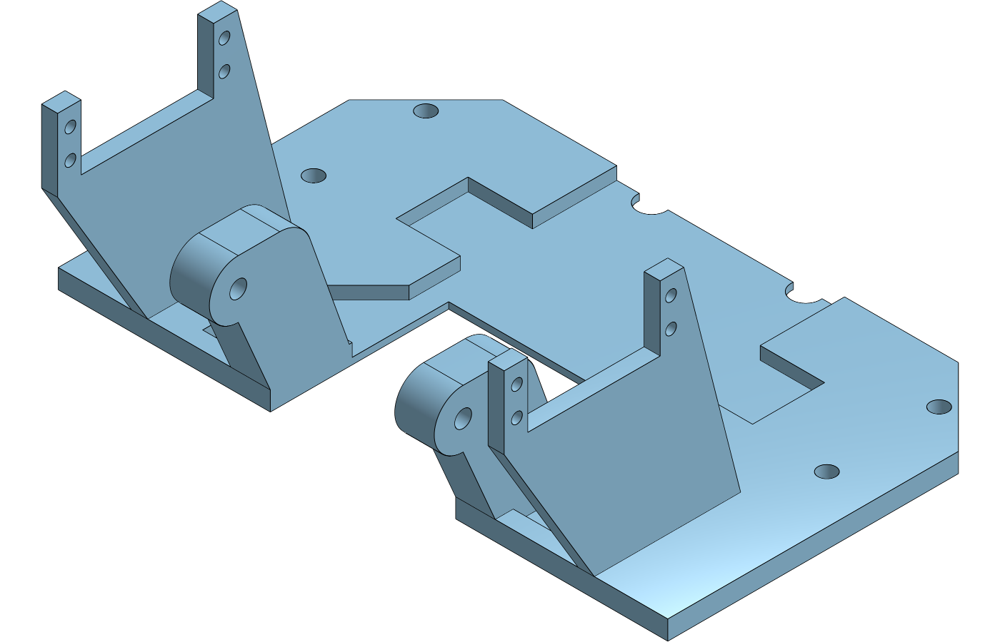
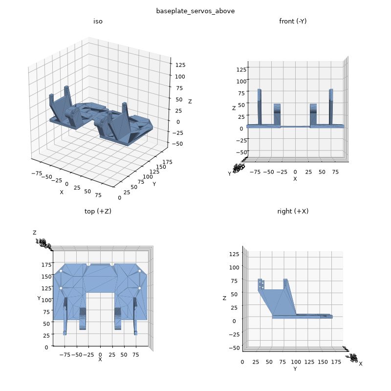
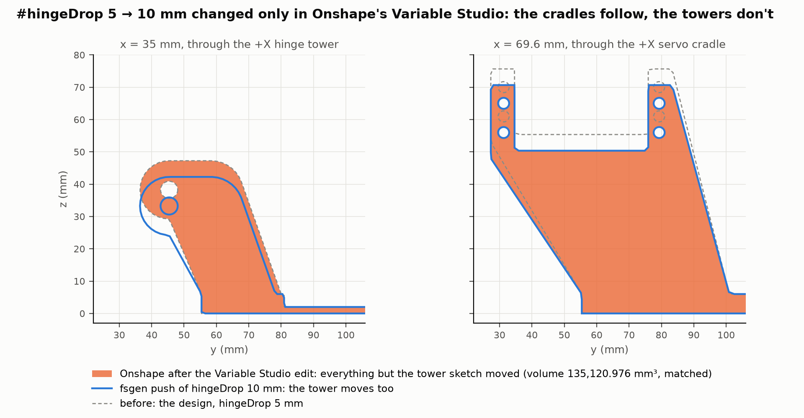
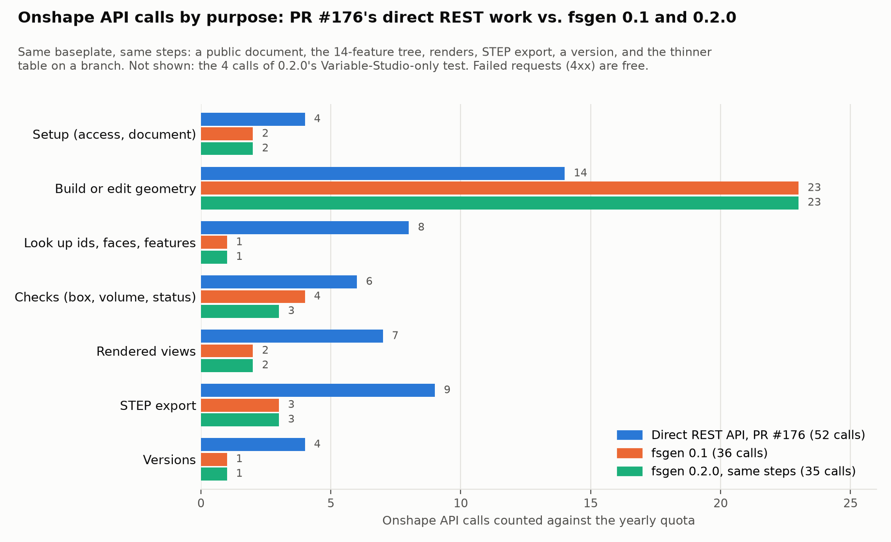

# fsgen 0.2.0 on the servos-above baseplate (issue #171)

This repeats the [fsgen 0.1 study](../README.md) (commit 95135c0) with
[fsgen 0.2.0](https://github.com/Lucasfrit/onshape-fsgen/tree/v0.2.0) (commit eabcc02). Its
changelog lists three changes that matter for this part:

1. Variables drive every line, polyline and arc point.
2. Feature patterns use "Reapply features" by default.
3. `--document` pushes into an existing document.

It uses the same script (without the `fullFeaturePattern` fix that 0.1 needed), the same steps
and a new public document. It adds one test the 0.1 study couldn't run: change a variable only
in Onshape's Variable Studio and see whether the tree follows.

**Onshape document (public, owned by Vertical Cloud Lab):**
[Powder doser baseplate, servos above - fsgen 0.2.0 native tree (#171)](https://cad.onshape.com/documents/57bb938243b883c7bdad1045/w/363b7f98896e7b44dab64f48/e/90ab6355538f5d532922ca60).
Onshape asks you to sign in to view it, even though it is public.

| Where | What |
|---|---|
| [**main** workspace](https://cad.onshape.com/documents/57bb938243b883c7bdad1045/w/363b7f98896e7b44dab64f48/e/90ab6355538f5d532922ca60) | text-to-cad's lowered baseplate (`#plateThickness` 6 mm, `#hingeDrop` 5 mm) as a 14-feature tree |
| [version "text-to-cad design (fsgen 0.2.0)"](https://cad.onshape.com/documents/57bb938243b883c7bdad1045/v/494b3ee81838f562a542094a/e/90ab6355538f5d532922ca60) | The same state, frozen |
| [branch "thinner table (plateThickness 3 mm)"](https://cad.onshape.com/documents/57bb938243b883c7bdad1045/w/ad5c3faacfea2bbf8b231a69/e/90ab6355538f5d532922ca60) | PR #176's main-workspace edit, pushed with fsgen |
| [branch "hinge 5 mm lower, Variable Studio only (hingeDrop 10 mm)"](https://cad.onshape.com/documents/57bb938243b883c7bdad1045/w/86882f77405eeea74b4ff776/e/90ab6355538f5d532922ca60) | Only `#hingeDrop` changed in the Variable Studio, as in the Onshape UI; no fsgen push |

| Onshape's render of the main workspace | fsgen's local preview (0 calls) |
|---|---|
|  |  |

## Results in short

* **The mirror built on the first push.** The script is the 0.1 one without
  `"fullFeaturePattern" : true`; 0.2.0 sends it by default. In 0.1 the same script failed in
  Onshape (`PATTERN_SWITCH_TO_PER_INSTANCE`) and cost 2 calls to fix.
* **The cradles now follow `#plateThickness` and `#hingeDrop` in Onshape. The towers don't.**
  The tower sketch's knuckle arc is concentric with the hinge hole. fsgen makes the two centres
  coincident and also dimensions both ends of the arc, so the arc is over-constrained. Onshape
  flags the sketch (`WARNING`), and fsgen re-sends it with no dimensions at all (1 extra call per
  push). This also drops the `#hingeHoleDiameter` dimension that 0.1 kept. The
  Variable-Studio-only test below confirms it: Onshape's volume equals the model where everything
  but the tower sketch moved.
* **Onshape's volumes are 0.032 mm³ below the local build** (0.1 matched exactly). fsgen writes
  the new dimension expressions with 6 significant digits, so the relief's `105.2426` becomes
  `105.243`. Local builds with that one rounding match all three of Onshape's volume checks to
  0.001 mm³ ([`results/volume_checks.json`](results/volume_checks.json)). The STEP exported from
  Onshape still has IoU 1.000000 vs. text-to-cad at 6 decimals.
* **API calls: 35 for the same steps (0.1: 36; PR #176's direct REST work: 52 counted),** plus
  4 for the Variable-Studio-only test, 39 in total. 0.2.0 saved the mirror fix (2 calls), but the
  tower sketch's fallback cost 1 extra call on the first push and 1 on the thinner-table edit.
  The cradle sketch is no longer re-sent for that edit, which saved 1.

## Checks

[`../compare_step.py`](../compare_step.py), [`volume_checks.py`](volume_checks.py), [`results/`](results):

| | Volume (mm³) | IoU vs. text-to-cad's `baseplate_servos_above.step` |
|---|---|---|
| fsgen 0.2.0's local build (0 calls) | 137,661.008 | **1.000000** (the STL is byte-identical to 0.1's) |
| Onshape's volume check after the push | 137,660.976 | |
| STEP exported back from Onshape | 137,660.976 | **1.000000** (2 × 10⁻⁵ % less volume) |
| Branch "thinner table": local build / Onshape | 103,908.655 / 103,908.647 | |
| Branch "Variable Studio only": Onshape | 135,120.976 | |

With the one rounding applied to the local builds (`105.2426` → `105.243`), every Onshape number
above matches its local build to 0.001 mm³.

## The Variable-Studio-only test

The 0.1 README warned: "Change `#plateThickness` or `#hingeDrop` in the `.fs` and push again;
changing them in Onshape's Variable Studio would leave the towers floating." 0.2.0 dimensions
line, polyline and arc points with the script's expressions, so this test checks whether that
warning still applies. On a branch, only `#hingeDrop` was changed, 5 → 10 mm, with one call to
the Variable Studio (`onshape_doc.py setvars`). That is what an edit in the Onshape UI does.
Onshape's volume was then read back (1 call):

| Candidate (local builds, with the rounding) | Volume (mm³) |
|---|---|
| Everything follows `#hingeDrop`: what `fsgen studio push` builds | 131,589.017 |
| Everything but the tower sketch follows | 135,120.976 |
| **Onshape after the Variable Studio edit** | **135,120.976** |



So the cradles' polyline and ear holes now follow the variables in Onshape. The towers stay where
they were pushed, 5 mm too high for the servos. In Onshape (see
[`results/onshape_features.json`](results/onshape_features.json)), these follow the Variable
Studio: `#screwHoleDiameter`, `#slotWidth`, `#reliefSkin`, `#cradleHoleDiameter`,
`#plateThickness` (the plate and the cradles) and `#hingeDrop` (the cradles). The tower sketch
follows nothing, not even `#hingeHoleDiameter`. **For this part, still change `#plateThickness`,
`#hingeDrop` or `#hingeHoleDiameter` in the `.fs` and push.**

| Sketch | fsgen 0.1 in Onshape | fsgen 0.2.0 in Onshape |
|---|---|---|
| Plate sketch | 12 dimensions (`#screwHoleDiameter`) | 24 dimensions (`#screwHoleDiameter`) |
| Relief sketch | 0 dimensions | 40 dimensions (numbers only) |
| Slot and notch sketch | 10 dimensions (`#slotWidth`) | 10 dimensions (`#slotWidth`) |
| Tower sketch | 1 dimension (`#hingeHoleDiameter`) | **0 dimensions**: the fallback after `WARNING` |
| Cradle sketch | 4 dimensions (`#cradleHoleDiameter`) | 30 dimensions (`#cradleHoleDiameter`, `#plateThickness`, `#hingeDrop`) |

## API calls

fsgen logs every call to [`.fsgen_api_ledger.jsonl`](.fsgen_api_ledger.jsonl). With
`--document`, one ledger covers the main workspace and both branches.
[`api_calls.py`](api_calls.py) sorts it by purpose, with the same rules as
[`../api_calls.py`](../api_calls.py).



| Step | fsgen 0.1 | fsgen 0.2.0 | What changed |
|---|---|---|---|
| New public document | 2 | 2 | |
| First push | 19 | 20 | Part Studio 1, Variable Studio 3, features 14, then the tower sketch re-sent without dimensions 1, volume check 1. 0.1: 1 to diagnose the failed mirror instead of the re-send |
| Fix the mirror | 2 | 0 | "Reapply features" is now the default |
| Renders, STEP export, version | 6 | 6 | |
| Feature tree | 1 | 1 | |
| Thinner table on a branch | 6 | 6 | Branch 1, Variable Studio 1, status check 1, volume check 1, and the re-sent sketches: 0.1 sent the tower and cradle sketches (2); 0.2.0 sent the tower sketch twice (with dimensions, then without) |
| **Same steps** | **36** | **35** | PR #176's direct REST work: 52 counted (54 logged) |
| Variable-Studio-only test | | 4 | Branch 1, Variable Studio 1, volume check 1, render 1 |
| **This session** | | **39** | 1.6 % of the company's 2,500 a year |

fsgen's estimates before each push (0 calls) don't include the fallback re-send. They said 19 for
the first push (20 used) and 4 for the thinner table (5 used). Offline estimates for other single
edits (`fsgen studio check`):

| Edit | fsgen 0.1 | fsgen 0.2.0 |
|---|---|---|
| `#plateThickness` 6 → 3 mm (thinner table) | 5 | 4 (5 with the fallback) |
| `#hingeDrop` 5 → 10 mm | 5 | 4 (5 with the fallback) |
| `#screwHoleDiameter` 5.5 → 6 mm | 3 | 3 |
| Notch radius 4.5 → 5 mm (a literal in a sketch) | 3 | 3 |
| `#slotWidth`, `#cradleHoleDiameter` | | 3 each |

Only the tower sketch is re-sent for the thinner table now. Its two 3-point arcs aren't counted
as driven by dimensions, so their numbers still count as a change. If the arcs counted as
driven and the tower sketch kept its dimensions, the thinner table would cost 3 calls.

## For the fsgen author

Things this part ran into, with what would reproduce them:

1. **An arc concentric with a circle is over-constrained.** Here that is the knuckle round
   around the hinge hole. In [`baseplate_servos_above.fs`](baseplate_servos_above.fs), the
   "Tower sketch" has the arc `knuckle` and the circle `hingeHole`, which share a centre. fsgen
   adds `COINCIDENT knuckle.center hingeHole.center`, positions `hingeHole.center`, and positions
   both arc ends. Onshape gives `WARNING`, and the fallback then drops every dimension in the
   sketch, including the circle's diameter that 0.1 kept. Two possible fixes: leave out one of
   the redundant constraints, or fall back by dropping only the constraints of the offending
   entity.
2. **Dimension expressions are rounded to 6 significant digits.** Examples: `105.2426 mm`
   becomes `105.243 mm`, `67.756415` becomes `67.7564`, `39.588069` becomes `39.5881`, and
   `#hingeDrop * 0.3539851` becomes `#hingeDrop * 0.353985`. So Onshape's volume check no longer
   matches the local build exactly (0.032 mm³ here). Writing the literals at full precision would
   keep the 1-call volume check exact.
3. **Branches and `--document`.** 0.2.0 saves its state under `"<name>@<workspace id>"`. After
   branching in Onshape, `--document <branch URL>` doesn't find the branched Part Studio, even
   though a branch keeps its element and feature ids. It would make a second Part Studio in the
   branch and build all 14 features again (about 20 calls instead of 5). `onshape_doc.py branch`
   avoids this by copying the state entry to the branch's key.
4. **Estimates leave out the fallback re-send**, which happens on every push that sends the
   tower sketch (estimate 4, actual 5).

## Reproduce

```bash
git clone https://github.com/Lucasfrit/onshape-fsgen && cd onshape-fsgen && git checkout eabcc02   # v0.2.0
python3.12 -m venv .venv && .venv/bin/pip install -e . pytest && .venv/bin/python -m pytest -q   # 104 passed
cd <this folder>
fsgen studio build baseplate_servos_above.fs --name "Baseplate (servos above)"     # local: STEP, STL, preview, 0 calls
python ../compare_step.py out/baseplate_servos_above/baseplate_servos_above.step <text-to-cad STEP>
# with ONSHAPE_ACCESS_KEY / ONSHAPE_SECRET_KEY set (these cost calls):
python onshape_doc.py create                                                        # prints the document URL
fsgen studio push baseplate_servos_above.fs --name "Baseplate (servos above)" --document <URL> --metrics --budget 25
python onshape_doc.py tree; python onshape_doc.py views; python onshape_doc.py export
python onshape_doc.py version "text-to-cad design (fsgen 0.2.0)" "description"
python onshape_doc.py branch "thinner table (plateThickness 3 mm)"
fsgen studio push baseplate_thinner_table.fs --name "Baseplate (servos above)" --document <branch URL> --metrics
python onshape_doc.py branch "hinge 5 mm lower, Variable Studio only (hingeDrop 10 mm)"
python onshape_doc.py setvars hingeDrop=10 --ws "hinge 5 mm lower, Variable Studio only (hingeDrop 10 mm)"
python onshape_doc.py mass --ws "hinge 5 mm lower, Variable Studio only (hingeDrop 10 mm)"
python volume_checks.py; python api_calls.py                                        # 0 calls
```

The reference STEP is `cad/text-to-cad/STEP/parts/baseplate_servos_above.step` on the PR #176
branch (`claude/issue-172-20261003-2216`, 61717c7).

## Files

| File | What |
|---|---|
| `baseplate_servos_above.fs` | The fsgen script: the 0.1 script without the `fullFeaturePattern` fix |
| `baseplate_thinner_table.fs` | The same with `#plateThickness` 3 mm, pushed to the branch |
| `out/` | fsgen's local builds: STEP, STL, 4-view preview |
| `onshape_doc.py` | Public company document, versions, branches (with fsgen state), renders, STEP export, feature tree, Variable Studio edits, volume and status checks |
| `onshape_document.json` | Document, workspace, element, feature, version and branch ids |
| `.fsgen_native.json` | fsgen's state for main and both branches; a later push with `--document` updates the same Part Studio |
| `.fsgen_api_ledger.jsonl` | Every call, for main and both branches |
| `volume_checks.py`, `variable_studio_test/` | Onshape's volumes vs. local builds; the two candidates for the Variable-Studio-only test |
| `api_calls.py` | The call tally and chart (PR #176, fsgen 0.1, fsgen 0.2.0) |
| `results/` | Push logs, comparisons, Onshape's STEP export and feature tree, call tally |
| `renders/` | Onshape's shaded views, the sections, the API-call chart |
