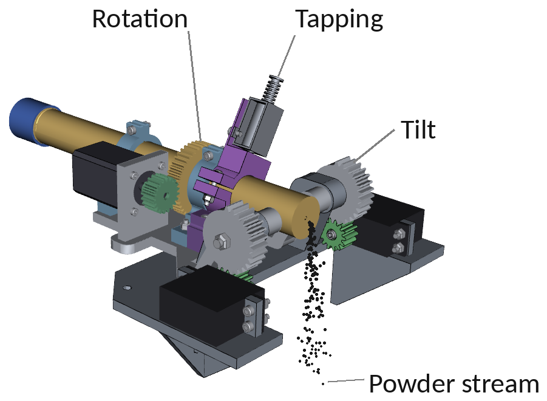
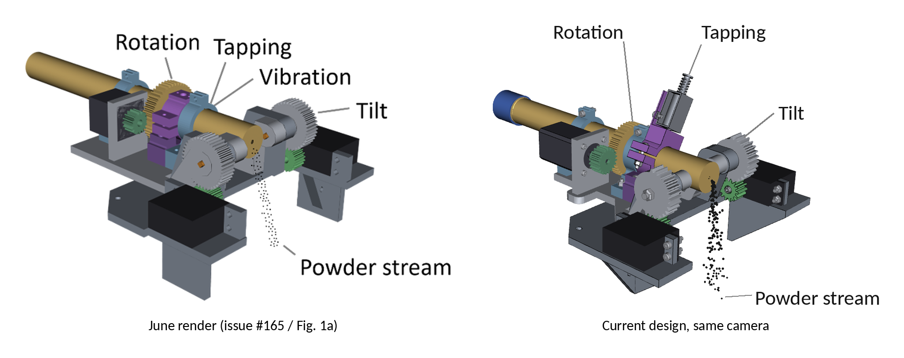
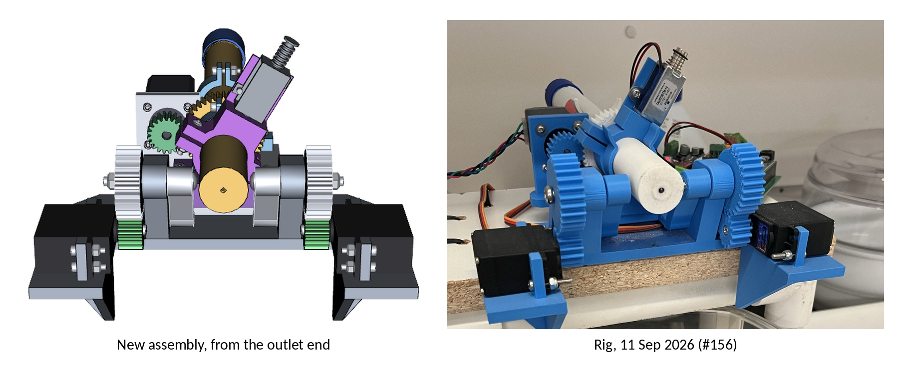
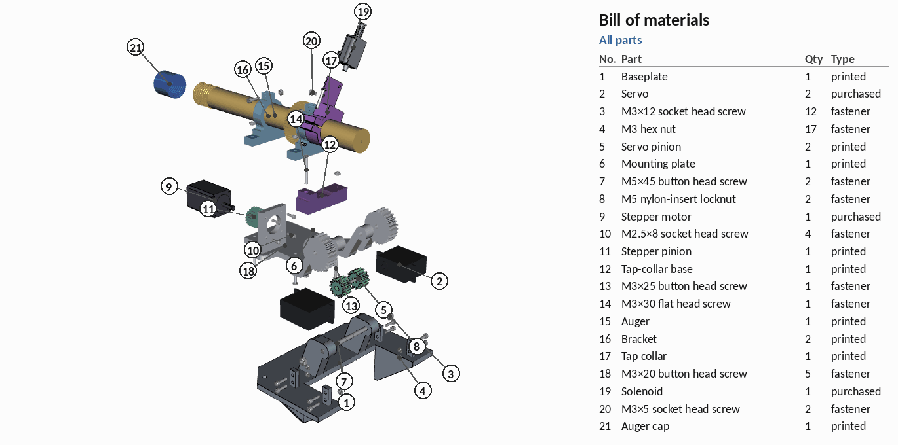
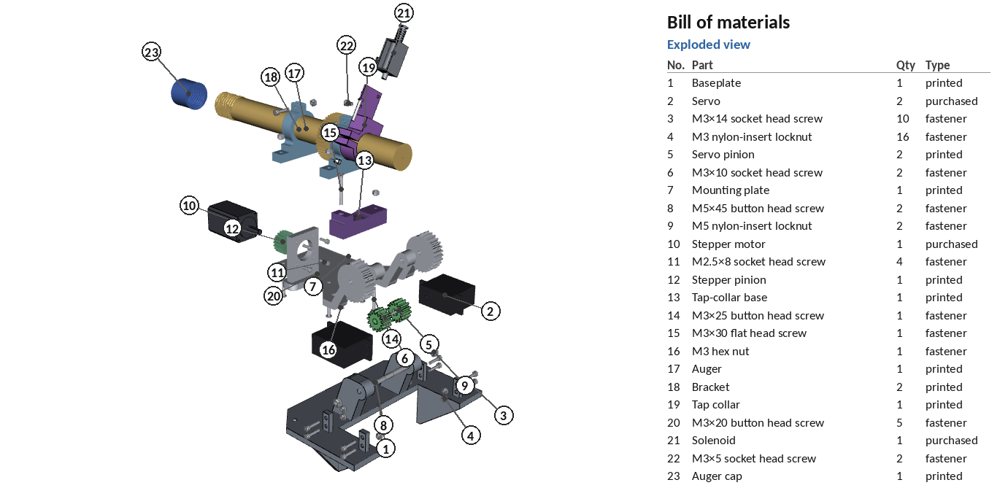
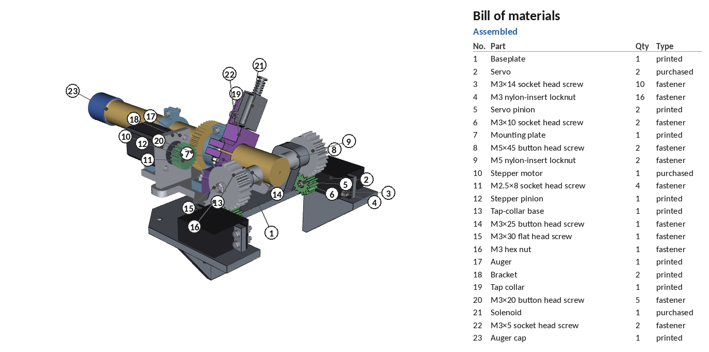
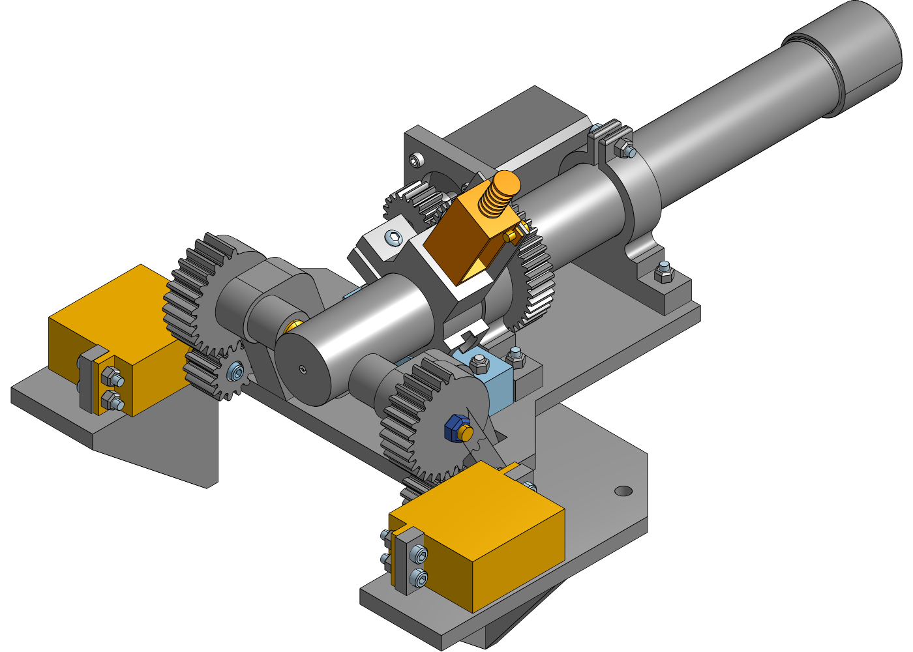
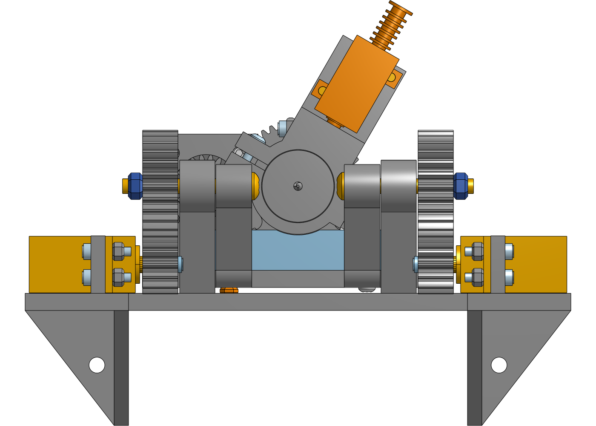

# Full assembly, current design

Every part of the current doser module in one assembly: the eight lab
Fusion 360 designs, the AI tap-collar base the rig still uses, simplified
models of the stepper, servos and solenoid, and all 46 screws and nuts.
It is the source of manuscript Fig. 1a (PR #97 uses
`renders/assembly_iso_az090_hires_annotated_white.png` as is), the bill of
materials and the assembly animation, and it matches the
[Onshape assembly](#onshape-assembly-all-current-files).



The camera is the one the June render from
[#165](https://github.com/vertical-cloud-lab/powder-doser/issues/165) used,
so the two line up:

| June render vs. current design (same camera) |
|---|
|  |

| New assembly from the outlet end vs. the rig on 11 Sep 2026 ([#156](https://github.com/vertical-cloud-lab/powder-doser/issues/156)) |
|---|
|  |

## Assembly animation and bill of materials

**[BOM.md](BOM.md)** lists all 23 line items in build order: 11 printed
parts, 4 purchased parts and 46 fasteners of 11 kinds, each with its
McMaster-Carr part number. The same data is in [`assembly/bom.csv`](assembly/bom.csv). The
item numbers match the balloons below and the 13 steps in the GIF.



| Exploded, every item numbered | Assembled, every item numbered |
|---|---|
|  |  |

Each part moves in along its own insertion direction. A part rides on the
part it attaches to (its "parent") until its own step, so the exploded view
is every offset up the chain added together. The auger, both brackets and
the tap collar go in as one unit: the brackets and collar slide onto the
tube from its ends, and the 44T gear between the brackets stops them going
on any other way. Electronics, wiring and the balance aren't in the CAD;
they're in the SI bill of materials (PR #97).

## What is in the assembly

| Part | Qty | Source |
|---|---:|---|
| Baseplate (servo posts, hinge towers) | 1 | Fusion 360, lab account ([share](https://a360.co/4AOA7sI)) |
| Mounting plate (knuckles, both 28T tilt gears, stepper plate) | 1 | Fusion 360 ([share](https://a360.co/4xXUj8L)) |
| Auger (44T module-1 gear on the tube, flight on the outlet end) | 1 | Fusion 360 ([share](https://a360.co/4y1oz2H)) |
| Auger cap (screw-on) | 1 | Fusion 360 ([share](https://a360.co/4w9kRE5)) |
| Auger bracket (split clamp) | 2 | Fusion 360 ([share](https://a360.co/46XtYN1)) |
| Tap collar | 1 | Fusion 360 ([share](https://a360.co/4AIIgyz)) |
| Stepper pinion, 20T | 1 | Fusion 360 ([share](https://a360.co/4yqSHFz)) |
| Servo pinion, 14T | 2 | Fusion 360 ([share](https://a360.co/4dcGSdF)) |
| Tap-collar base (hard stop) | 1 | AI-modelled, `mount_plate.step` from PR #51; the only AI part left on the rig |
| NEMA 11 stepper (11HS18-0674S), MG996R servo (x2), Adafruit 412 solenoid | 4 | simplified from datasheets by `onshape/purchased_parts.py` |
| Screws and nuts | 46 | McMaster-Carr, see [Fasteners](#fasteners) |

The STEP files are in `components/fusion-step/` (exported from the share
links by `onshape/fetch_fusion_shares.py`), `components/ai-step/` and
`components/purchased/`. `components/fusion/*.stl` are the STLs from the
[#117 zip](https://github.com/vertical-cloud-lab/powder-doser/issues/117#issuecomment-5004533979),
which PR #97's auger-section script reads.

The "Vibration" label from the June figure is gone, because there is no
working vibration motor on the rig (`python3 annotate.py --vibration` puts
it back). The colours are the June palette rather than the rig's blue and
white, so the figure keeps its colour code: gold auger, purple tapping,
grey tilt.

## Fasteners

[`hardware.py`](hardware.py) places every screw and nut, reading each joint
off the hole geometry in the STEP files. Each length is the shortest
standard one that passes the grip plus a full nut. All of them are 18-8
stainless. The M3 nuts are nylon-insert locknuts, because the team
replaced every nut on the rig with a locknut
([#132](https://github.com/vertical-cloud-lab/powder-doser/issues/132#issuecomment-5181688024)).

| McMaster-Carr | Part | Qty | Where |
|---|---|---:|---|
| [92095A223](https://www.mcmaster.com/92095A223/) | M5 x 45 button head screw | 2 | hinge, from inside each knuckle |
| [93625A200](https://www.mcmaster.com/93625A200/) | M5 nylon-insert locknut | 2 | hinge, outside each 28T gear |
| [91292A027](https://www.mcmaster.com/91292A027/) | M3 x 14 socket head screw | 10 | servos to posts (8), bracket clamps (2) |
| [93625A100](https://www.mcmaster.com/93625A100/) | M3 nylon-insert locknut | 16 | servos (8), brackets (6), tap-collar base (1), collar clamp (1) |
| [91828A211](https://www.mcmaster.com/91828A211/) | M3 hex nut | 1 | under the plate's floor, where a locknut doesn't fit |
| [91292A113](https://www.mcmaster.com/91292A113/) | M3 x 10 socket head screw | 2 | servo pinions, into the servo shaft |
| [92095A185](https://www.mcmaster.com/92095A185/) | M3 x 20 button head screw | 5 | brackets to plate (4), tap-collar clamp (1) |
| [92095A186](https://www.mcmaster.com/92095A186/) | M3 x 25 button head screw | 1 | tap-collar base, plain hole |
| [92125A140](https://www.mcmaster.com/92125A140/) | M3 x 30 flat head screw | 1 | tap-collar base, countersunk hole |
| [91292A110](https://www.mcmaster.com/91292A110/) | M3 x 5 socket head screw | 2 | solenoid to the collar's plate |
| [91292A012](https://www.mcmaster.com/91292A012/) | M2.5 x 8 socket head screw | 4 | stepper to its plate (vendor drawing: 4-M2.5, 4 mm deep min.) |

How the joints were read:
- **Hinge.** The holes are Ø5.3 in the towers and Ø5.7 in the knuckles and
  gears, so the plate turns on an M5 shank. The auger tube passes 3.6 mm
  inside the knuckles, which leaves no room for a nut there. So the screw
  goes in from the inside with a 2.75 mm button head (0.85 mm clear of the
  tube at every tilt), and the locknut sits outside the gear.
- **Under the mounting plate.** At tilt 0 the plate's floor is 2 mm above
  the baseplate, so only a button head (1.65 mm) fits underneath. The
  bracket screws and the base's plain-hole screw go in from below, with
  the nut on top.
- **Tap-collar clamp.** The nut only clears the base's hard-stop bump with
  the collar rolled away from the stepper. That roll is also how the collar
  sits on the rig, so the assembly uses it (30°, 3° short of the bump).
- **Servos.** The nut sits on the flange, 3.7 mm from the case wall. An M3
  nut fits there; an M4 nut does not, which is why the Ø4.0 post holes get
  M3.

An interference check of every fastener against every part (OCC boolean
intersections) leaves only expected contacts. The servo-pinion and solenoid
screws run into the shaft and the solenoid ears they thread into. The
countersunk tap-base screw and its nut meet the baseplate at tilt 0, as
described under *Check on the rig* below.

**The McMaster CAD files could not be downloaded.** The rig's Pi tunnel and
the lab login both worked, but mcmaster.com restricted the BYU VCL account
right after login ("Access has been restricted ... your use exceeds typical
patterns"). A logged-out session was not restricted. I stopped after two
logins so the account wouldn't get locked. Every part number was checked
against public listings that quote McMaster's own description. Most were
checked against two or more:
[Clearpath's McMaster fastener tables](https://docs.clearpathrobotics.com/docs_robots/common/parts/fasteners/screw_socket_head/),
reli-tool cross-references and published BOMs. Until the STEP files are in
hand, `hardware.py` draws each fastener from its ISO dimensions. Drop
McMaster's STEP files into `components/mcmaster/<part number>.step` and
every script uses them instead: `hardware.py` re-orients each file from its
geometry.

**What the rig has instead.** Photos of the rig (11 Sep, 4 Aug, #72, #156)
and the issue threads show different hardware in several places. The BOM
above is a consistent set for the CAD, not an inventory of the rig.
- The rig's hardware is mostly zinc-plated Phillips pan heads. The stepper
  is the exception: it uses button-head socket screws with washers.
- **Hinge:** a pan head sits outside the gear, with no nut, and the screws
  were backing out
  ([#116](https://github.com/vertical-cloud-lab/powder-doser/issues/116#issuecomment-5259483789)).
  A nut can't go inside the knuckle (3.6 mm to the tube), hence the CAD's
  flipped screw with the locknut outside.
- **Brackets and tap-collar base:** the pan heads are on top, with the nuts
  under the plate. Those nuts sit in the 2 mm gap above the baseplate, so
  the plate can't quite reach 0° there. The CAD screws from below instead.
- **Servos:** the screws are longer, with domed nuts, and only the lower
  hole of each visible post is used.
- **Solenoid:** nuts were reported coming off it
  ([#117](https://github.com/vertical-cloud-lab/powder-doser/issues/117#issuecomment-5097409563)),
  so its ears may be clearance holes rather than the tapped holes assumed
  here. If so, use M3 x 8 with a locknut on the outside of the collar's
  plate.
- **Bench mount:** the baseplate legs hang over the edge of a board that is
  zip-tied to a PVC stand. The four Ø5.5 corner holes and two leg holes
  are unused, so they aren't in the BOM.

**Check on the rig:**
- The base's countersunk hole takes a flat head from above, so its nut
  ends up under the plate's floor. There the nut and the screw tip stand
  0.4 mm and 1.0 mm proud of the 2 mm gap at tilt 0. Either the rig parks
  a fraction of a degree up, or that screw is shorter and threads into the
  plastic.
- The servo-pinion screw is assumed to be M3 into the MG996R output shaft.
  At x 10 it engages 2.4 mm of thread; x 12 could bottom out in the spline.
- The stepper pinion has a D-bore and no set-screw hole, so there is no set
  screw.

## Onshape assembly (all current files)

**[Powder doser - full assembly (current design)](https://cad.onshape.com/documents/ae9f107d3972fc9d390e541f/w/b4151a24f733d0ffc48da6d2/e/dfbe0ae499cd860a85aa8da6)**,
owned by the Vertical Cloud Lab Onshape company. One document holds a Part
Studio per file and the *Powder doser assembly* tab.

| Onshape, isometric | Onshape, from the outlet end |
|---|---|
|  |  |

| Part | Source |
|---|---|
| Baseplate, mounting plate (with both 28T tilt gears), auger bracket (x2), tap collar, auger, auger cap, stepper pinion (20T), servo pinion (14T, x2) | lab Fusion 360 account, share links in [PR #170](https://github.com/vertical-cloud-lab/powder-doser/pull/170), exported to STEP in `components/fusion-step/` |
| Tap-collar base (hard-stop plate) | AI version still in use: `mount_plate.step` from PR #51 (`cad/mounting-plate-assembly/imported-parts/tap-collar/` @ `eaf528a`), in `components/ai-step/` |
| NEMA 11 11HS18-0674S, MG996R (x2), Adafruit 412 solenoid | simplified models from the datasheet dimensions, `onshape/purchased_parts.py` -> `components/purchased/` |
| 46 screws and nuts, 11 kinds | `hardware.py`, one Part Studio per kind named with its McMaster number, from `components/hardware/*.step` (each in its seat frame) |

The assembly has 61 placements: the 15 parts of `layout.py` and the 46
fasteners of `hardware.py`. That makes 65 instances, because the mounting
plate's STEP has five bodies.

The Fusion links were exported through the share page's own Download API,
with `onshape/fetch_fusion_shares.py` run on the rig's Raspberry Pi. The
links must keep *Allow download* switched on for this to work.
`components/fusion-step/shares_stp.json` records the Fusion version of
each export.

### How the parts are placed

Every part keeps the frame its STEP was exported in.
[`onshape/layout.py`](onshape/layout.py) maps each one into the baseplate's
frame (Z up, hinge along X, outlet towards -Y, stepper on -X). The numbers
come from the STEP geometry, not from eyeballing:

- Mounting plate: its knuckles sit 0.3 mm inside the baseplate towers and
  its 28T gears 0.6 mm outside them. The floor has M3 rows 48 mm apart
  across the tube. The brackets and the tap-collar base stand on the rows at
  124 / 58.3 mm (brackets) and 42.3 mm (base) behind the hinge. Their bores
  are 29.25 mm up, so the auger axis is level with the hinge.
- Stepper: the NEMA 11 pilot hole is 32 mm from the auger axis, which is
  (20 + 44) / 2 at module 1. The motor sits behind its plate and the 20T
  pinion is in front of it, as on the 11 Sep photo. The pinion's hub sits
  0.5 mm off the plate, and the auger's 44T gear is centred on the pinion
  teeth, which puts the outlet 11.6 mm in front of the hinge axis. The
  pinion is phased by half a tooth (no tooth overlap).
- Servos: the baseplate posts' holes form a 48.04 x 9.04 mm MG996R pattern.
  The spline sits straight under the hinge, 27.26 mm = 1.298 x (28 + 14) / 2
  away, so the 14T pinions mesh the 28T gears. The flange is on the posts'
  inner faces.
- Tap collar: on the auger over its base. The solenoid plate faces the
  cap, so the solenoid hangs over the collar's Ø6.9 plunger hole. The
  collar rides loose on the turning tube, with its clamp ears against the
  base's hard-stop bump. It is rolled 30° towards +X (away from the
  stepper), 3° short of touching the bump (`COLLAR_ROLL_DEG`). That is the
  pose in the 11 Sep photo (about 40° by eye), and the only one in which
  the clamp nut clears the bump.

`python3 layout.py` writes `placements.json` and runs a pairwise
interference check. The only overlaps left are expected ones: the cap
thread on the auger thread (the two threads are modelled overlapping),
1.1 mm³ at the NEMA pilot, and 0.35 mm per side where the 40.7 mm MG996R
case meets the posts. The posts are 40.0 mm apart, so either the real case
is a bit shorter at that height or it is a press fit.

The parts are placed with absolute transforms, not mates, at tilt 0. In
Onshape, *Fix* the baseplate and add a revolute mate on the hinge if you
want to drive the tilt.

### Re-running

```bash
pip install cadquery requests numpy
cd cad/full-assembly/onshape
python3 purchased_parts.py      # NEMA 11 / MG996R / Adafruit 412 models
python3 layout.py               # placements.json + interference check
python3 onshape_build.py        # fastener STEPs + sync the Onshape document (needs ONSHAPE_ACCESS_KEY/SECRET_KEY)
```

`onshape_build.py` is idempotent against `onshape_document.json`. It
re-imports a STEP only if its contents changed. It resets the transforms
of the instances it created to `layout.py` and leaves hand-added instances
alone. The API key has no delete scope, so a superseded Part Studio is
renamed "(superseded, safe to delete)" instead of being removed. These
tabs can be deleted by hand: every tab whose name ends in "(superseded,
safe to delete)" (the fastener tabs from earlier uploads and the old Adafruit
412), *Baseplate (stray upload, ...)*, and the empty *Part Studio 1*.

## Running it

```bash
pip install cadquery vtk trimesh pillow
sudo apt install fonts-crosextra-carlito   # label font (Calibri metrics)
cd cad/full-assembly
xvfb-run -a python3 build.py --hires   # renders + assembly exports (about 20 s)
python3 annotate.py                    # annotated render (+ _white copy)
python3 annotate.py --src assembly_iso_az090_hires.png --out assembly_iso_az090_hires_annotated.png
python3 compare.py                     # the two comparison panels
xvfb-run -a python3 assembly_bom.py    # BOM.md, bom.csv, GIF, balloon views (about 1 min)
```

`build.py` renders the parts from `onshape/layout.py` and `hardware.py`.
These are the same transforms the Onshape document is built from. The
camera is the June az = 90° view, pinned after its `ResetCamera()`. Until
`e1b3293` the render used the June stand-ins, and with every part set back
to its June version it reproduced the June image exactly. The annotated
PNGs keep the transparent background the June figure had; the `_white`
copies are for viewing on GitHub and for the manuscript.

| Output | What it is |
|---|---|
| `renders/assembly_iso_az090.png` | the reference view, tilt 0 |
| `renders/assembly_iso_az090_annotated.png` | labelled, transparent background (901×660) |
| `renders/assembly_iso_az090_hires_annotated_white.png` | labelled, print resolution (3603×2643), **PR #97 Fig. 1a** |
| `renders/pr97_fig1_preview.png` | PR #97's Fig. 1 built by its own `make_figures.py` (@ `43f8ac8`) with this panel (a); a preview only, PR #97 itself is unchanged |
| `renders/assembly_iso_az090_tilt22p5.png`, `_tilt45.png` | same direction at 22.5° and 45° tube tilt |
| `renders/assembly_front_from_outlet.png` | view from the outlet end, to compare with photos |
| `renders/assembly_steps.gif` | 13-step assembly animation with the BOM, ending in a 0–45° tilt |
| `renders/assembly_exploded_bom.png`, `assembly_bom_callouts.png` | every BOM item ballooned, exploded and assembled |
| `BOM.md`, `assembly/bom.csv` | bill of materials, build order |
| `assembly/full_assembly.glb` / `.stl` | the whole assembly in the June frame (mm), per-part colours in the GLB |
| `assembly/parts_manifest.json` | source of every part, and the McMaster number of every fastener |
| `components/fusion-step/*.step` | the eight lab Fusion 360 designs, exported 1 Oct 2026 |
| `renders/onshape_assembly_{iso,front,top,right}.png` | shaded views of the Onshape assembly, rendered by Onshape |
