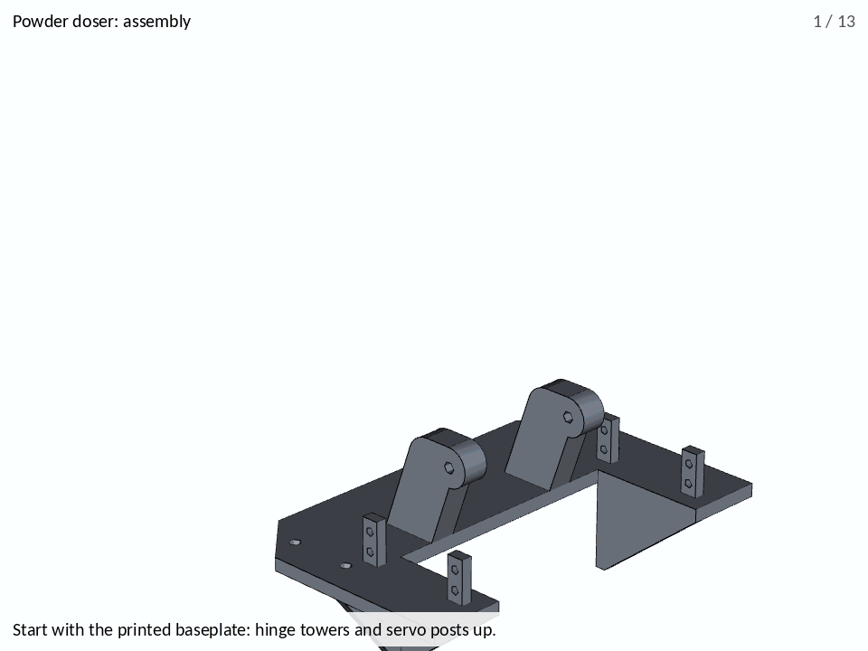
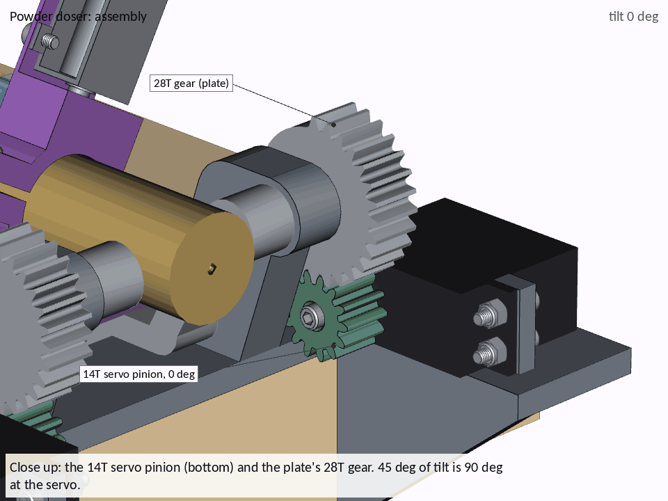
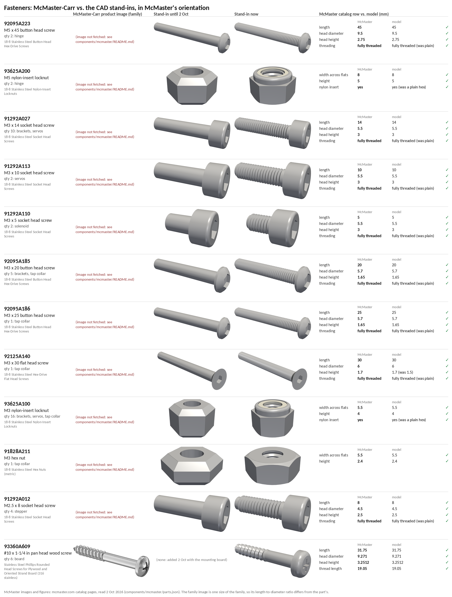

# Full assembly, current design

Every part of the current doser module in one assembly: the eight lab
Fusion 360 designs, the AI tap-collar base the rig still uses, simplified
models of the stepper, servos and solenoid, all 52 screws and nuts, and the
board it is screwed down to.
It is the source of manuscript Fig. 1a (PR #97 uses
`renders/assembly_iso_az090_hires_annotated_white.png` as is), the bill of
materials and the assembly animation, and it matches the
[Onshape assembly](#onshape-assembly-all-current-files).


The camera is the one the June render from
[#165](https://github.com/vertical-cloud-lab/powder-doser/issues/165) used,
so the two line up:

| June render vs. current design (same camera) |
|---|
|  |

| New assembly from the outlet end vs. the rig on 11 Sep 2026 ([#156](https://github.com/vertical-cloud-lab/powder-doser/issues/156)) |
|---|
|  |

## Assembly animation and bill of materials

**[BOM.md](BOM.md)** lists all 25 line items in build order: the board
the doser is screwed to, 11 printed parts, 4 purchased parts and 52
fasteners of 12 kinds, each with its McMaster-Carr part number. The same
data is in [`assembly/bom.csv`](assembly/bom.csv). The item numbers match
the balloons below and the 19 steps in the GIF.


The same 19 steps as an instruction-style walkthrough
([`animate.py`](animate.py)), in the format of the OT-2 lid-camera mount's
GIF (byu-vcl PR #234). It has one large view and a plain-language caption
for every step, with close-ups of the small fasteners and 2–3 s holds. It
ends with the doser working (below).



### The doser working

[`renders/doser_motion.gif`](renders/doser_motion.gif) is the end of the
walkthrough on its own: three close-ups, each moving the parts the way the
drive train moves them ([`onshape/layout.py`](onshape/layout.py) has the
ratios).



- **Tilt.** Each servo turns a 14T pinion, which drives one of the
  mounting plate's 28T gears. The pinion turns twice as far as the plate,
  the other way: 45° of tilt is 90° at the servo. (Until 2 Oct the pinions
  stayed put while the plate turned, so in the tilted views the 28T teeth
  went through them, by up to 80 mm³. The interference check now finds
  only tooth contact, at most 0.02 mm³, from 0 to 45°.)
- **Rotation.** The stepper's 20T pinion drives the 44T gear on the auger
  tube, so the motor turns 2.2 times per turn of the auger. The cap turns
  with the tube. The brackets and the tap collar stay put, because the
  tube turns inside them. Pinion and gear stay in mesh with no overlap at
  any angle.
- **Tapping.** The solenoid's plunger drops 7.6 mm through the collar's
  Ø6.9 hole and hits the tube, squashing the return spring, then the spring
  pulls it back. That 7.6 mm is the gap in the model between the plunger's
  end (at rest) and the tube. The solenoid is one solid in the STEP file;
  for the animation, `purchased_parts.adafruit412_pieces()` splits it into
  the frame, the plunger and the spring.

The close-ups turn the gears by a third of a tooth per frame or less, so
the teeth don't appear to run backwards.

| Exploded, every item numbered | Assembled, every item numbered |
|---|---|
|  |  |

Each part moves in along its own insertion direction. A part rides on the
part it attaches to (its "parent") until its own step, so the exploded view
is every offset up the chain added together. Electronics, wiring and the
balance aren't in the CAD; they're in the SI bill of materials (PR #97).

**The auger unit (steps 11–15).** The auger, both brackets and the tap
collar go on as one unit, put together off the plate. The 44T gear sits
between the brackets and is wider than their bores, so each part has to
slide onto the tube from one end. The sizes are from the STEP files: the
tube is Ø25.0 from the outlet to the gear and from the gear to the cap
thread, the bracket and collar bores are Ø25.5, and the cap thread is
Ø26.0.

11. The auger is held over the plate, outlet end forward.
12. One bracket slides on from the outlet end, split clamp on top, and
    stops 2.4 mm short of the gear.
13. The tap collar follows it from the outlet end, solenoid plate first,
    and stops 1.5 mm from the bracket. Its clamp ears are on the stepper's
    side.
14. The other bracket slides on from the cap end, over the cap thread, and
    ends up 41 mm behind the gear. The thread is 0.5 mm wider than the
    bore, so the split clamp has to be eased open with its screw out.
15. The unit is lowered onto the plate. The brackets land on their M3 hole
    rows, the collar on its base, and the gear meshes with the stepper
    pinion.

Lowered straight down, the gear's teeth would cut through the pinion's
over the last 10 mm, by up to 40 mm³ (OCC booleans). The old one-piece drop
did this too. So the auger turns as it comes down, the way a gear rolls
down a rack: −h/22 rad over the last 12 mm, while the pinion stays put.
That leaves no overlap at any height checked, from 0.3 to 11.5 mm
(`assembly_bom.auger_roll`).

## What is in the assembly

| Part | Qty | Source |
|---|---:|---|
| Baseplate (servo posts, hinge towers) | 1 | Fusion 360, lab account ([share](https://a360.co/4AOA7sI)) |
| Mounting plate (knuckles, both 28T tilt gears, stepper plate) | 1 | Fusion 360 ([share](https://a360.co/4xXUj8L)) |
| Auger (44T module-1 gear on the tube, flight on the outlet end) | 1 | Fusion 360 ([share](https://a360.co/4y1oz2H)) |
| Auger cap (screw-on) | 1 | Fusion 360 ([share](https://a360.co/4w9kRE5)) |
| Auger bracket (split clamp) | 2 | Fusion 360 ([share](https://a360.co/46XtYN1)) |
| Tap collar | 1 | Fusion 360 ([share](https://a360.co/4AIIgyz)) |
| Stepper pinion, 20T | 1 | Fusion 360 ([share](https://a360.co/4yqSHFz)) |
| Servo pinion, 14T | 2 | Fusion 360 ([share](https://a360.co/4dcGSdF)) |
| Tap-collar base (hard stop) | 1 | AI-modelled, `mount_plate.step` from PR #51; the only AI part left on the rig |
| NEMA 11 stepper (11HS18-0674S), MG996R servo (x2), Adafruit 412 solenoid | 4 | simplified from datasheets by `onshape/purchased_parts.py` |
| Screws and nuts | 52 | McMaster-Carr, see [Fasteners](#fasteners) |
| Mounting board, 38 mm (1.5 in) thick | 1 | any flat board or bench top (yours); drawn 250 x 220 mm by `onshape/purchased_parts.py` |

**The board underneath.** The baseplate is drawn to be screwed down to a
flat board. Its rear 60 mm (y = 55.4 to 115 mm) sits flat on top. Two legs
hang over the board's front edge, with their back faces against it. The
legs are 40 mm deep, and each has a Ø5.5 hole 19 mm (¾ in) down: halfway
down a 1.5 in board. Four more Ø5.5 holes sit in the plate's rear corners.
None of these were used until 2 Oct. The board in the CAD is 1.5 in thick,
so that both sets of holes work. It sits under the doser in the BOM,
the GIFs and Onshape, but not in Fig. 1a or the GLB/STL, which show the
doser alone. The outlet hangs 21.6 mm in front of the board's edge, so the
board needs to stand above the balance, as the rig's board does on its
PVC stand.

The STEP files are in `components/fusion-step/` (exported from the share
links by `onshape/fetch_fusion_shares.py`), `components/ai-step/` and
`components/purchased/`. `components/fusion/*.stl` are the STLs from the
[#117 zip](https://github.com/vertical-cloud-lab/powder-doser/issues/117#issuecomment-5004533979),
which PR #97's auger-section script reads.

The "Vibration" label from the June figure is gone, because there is no
working vibration motor on the rig (`python3 annotate.py --vibration` puts
it back). The colours are the June palette rather than the rig's blue and
white, so the figure keeps its colour code: gold auger, purple tapping,
grey tilt.

## Fasteners

[`hardware.py`](hardware.py) places every screw and nut, reading each joint
off the hole geometry in the STEP files. Each length is the shortest
standard one that passes the grip plus a full nut. All of them are 18-8
stainless, except the wood screws: McMaster's only stainless pan head
Phillips wood screws are 316. The M3 nuts are nylon-insert locknuts, because the team
replaced every nut on the rig with a locknut
([#132](https://github.com/vertical-cloud-lab/powder-doser/issues/132#issuecomment-5181688024)).

| McMaster-Carr | Part | Qty | Where |
|---|---|---:|---|
| [92095A223](https://www.mcmaster.com/92095A223/) | M5 x 45 button head screw | 2 | hinge, from inside each knuckle |
| [93625A200](https://www.mcmaster.com/93625A200/) | M5 nylon-insert locknut | 2 | hinge, outside each 28T gear |
| [91292A027](https://www.mcmaster.com/91292A027/) | M3 x 14 socket head screw | 10 | servos to posts (8), bracket clamps (2) |
| [93625A100](https://www.mcmaster.com/93625A100/) | M3 nylon-insert locknut | 16 | servos (8), brackets (6), tap-collar base (1), collar clamp (1) |
| [91828A211](https://www.mcmaster.com/91828A211/) | M3 hex nut | 1 | under the plate's floor, where a locknut doesn't fit |
| [91292A113](https://www.mcmaster.com/91292A113/) | M3 x 10 socket head screw | 2 | servo pinions, into the servo shaft |
| [92095A185](https://www.mcmaster.com/92095A185/) | M3 x 20 button head screw | 5 | brackets to plate (4), tap-collar clamp (1) |
| [92095A186](https://www.mcmaster.com/92095A186/) | M3 x 25 button head screw | 1 | tap-collar base, plain hole |
| [92125A140](https://www.mcmaster.com/92125A140/) | M3 x 30 flat head screw | 1 | tap-collar base, countersunk hole |
| [91292A110](https://www.mcmaster.com/91292A110/) | M3 x 5 socket head screw | 2 | solenoid to the collar's plate |
| [91292A012](https://www.mcmaster.com/91292A012/) | M2.5 x 8 socket head screw | 4 | stepper to its plate (vendor drawing: 4-M2.5, 4 mm deep min.) |
| [93360A609](https://www.mcmaster.com/93360A609/) | #10 x 1-1/4 in pan head Phillips wood screw, 316 stainless | 6 | baseplate to the board: 4 down through the corner holes, 2 through the legs into the front edge |

How the joints were read:
- **Board.** The six Ø5.5 holes take #10 wood screws. That's the biggest
  common wood screw that passes Ø5.5 (Ø4.8 mm thread). At 1-1/4 in, the
  four corner screws go 25.75 mm into the board, through the 6 mm plate,
  and the two leg screws 26.75 mm into its front edge, through the 5 mm
  legs. McMaster lists a 3/32 in pilot drill. The pan heads (Ø9.27) clear
  the legs' gussets by 1.4 mm and the servo cases by 4.9 mm.
- **Hinge.** The holes are Ø5.3 in the towers and Ø5.7 in the knuckles and
  gears, so the plate turns on an M5 shank. The auger tube passes 3.6 mm
  inside the knuckles, which leaves no room for a nut there. So the screw
  goes in from the inside with a 2.75 mm button head (0.85 mm clear of the
  tube at every tilt), and the locknut sits outside the gear.
- **Under the mounting plate.** At tilt 0 the plate's floor is 2 mm above
  the baseplate, so only a button head (1.65 mm) fits underneath. The
  bracket screws and the base's plain-hole screw go in from below, with
  the nut on top.
- **Tap-collar clamp.** The nut only clears the base's hard-stop bump with
  the collar rolled away from the stepper. That roll is also how the collar
  sits on the rig, so the assembly uses it (30°, 3° short of the bump).
- **Servos.** The nut sits on the flange, 3.7 mm from the case wall. An M3
  nut fits there; an M4 nut does not, which is why the Ø4.0 post holes get
  M3.

An interference check of every fastener against every part (OCC boolean
intersections) leaves only expected contacts. The servo-pinion and solenoid
screws run into the shaft and the solenoid ears they thread into. The
countersunk tap-base screw and its nut meet the baseplate at tilt 0, as
described under *Check on the rig* below.

**Checked against McMaster's own catalog (2 Oct).** McMaster's product
pages now answer a logged-out browser with "Log in to view Product
Detail", so the STEP files still can't be downloaded. The lab account was
also restricted after a login that day ("Access has been restricted ...
your use exceeds typical patterns"), and nobody has logged in since. The
catalog pages are still open, though.
[`mcmaster_fetch.py`](mcmaster_fetch.py) reads them through the rig's Pi
(SOCKS tunnel, throttled, no login). Every one of the 12 part numbers is
in McMaster's table, with the thread, length and head size (width and
height for the nuts) listed above:
[`components/mcmaster/catalog_rows.json`](components/mcmaster/catalog_rows.json)
has the raw rows and [`parts.json`](components/mcmaster/parts.json) the
parsed figures.

[`fastener_check.py`](fastener_check.py) renders each stand-in in
McMaster's "front orientation", beside McMaster's picture of the family
and its catalog row. In that orientation a screw has its head on the right
and its tip rising to the left; a nut is seen from about 30° above, with a
flat towards you.



The comparison changed four things in `hardware.py`. Every other dimension
already matched.
- The M3 x 30 flat head's head is 1.7 mm high, as McMaster lists it, not
  1.5.
- Every screw is fully threaded on McMaster, so the stand-ins now have
  cosmetic threads (revolved rings at the coarse pitch). The nuts have
  internal ones.
- The nuts' corners are turned off at 30°, as on McMaster's DIN 934 nuts.
  Before, every edge was chamfered.
- Both nylon-insert locknuts now have their crown and nylon ring.

The GLB/STL exports keep plain fastener bodies with the same envelopes.
The threads only matter in renders, and they would quadruple the files.

McMaster's STEP files and images aren't committed: they come with no
licence to redistribute them, and this repo is public (see
[`components/mcmaster/README.md`](components/mcmaster/README.md)).
`python3 mcmaster_fetch.py --images` fetches the five images the check
uses. If McMaster's STEP files are downloaded by hand, drop them into
`components/mcmaster/<part number>.step` and every script uses them instead;
`hardware.py` re-orients each file from its geometry.

**What the rig has instead.** Photos of the rig (11 Sep, 4 Aug, #72, #156)
and the issue threads show different hardware in several places. The BOM
above is a consistent set for the CAD, not an inventory of the rig.
- The rig's hardware is mostly zinc-plated Phillips pan heads. The stepper
  is the exception: it uses button-head socket screws with washers.
- **Hinge:** a pan head sits outside the gear, with no nut, and the screws
  were backing out
  ([#116](https://github.com/vertical-cloud-lab/powder-doser/issues/116#issuecomment-5259483789)).
  A nut can't go inside the knuckle (3.6 mm to the tube), hence the CAD's
  flipped screw with the locknut outside.
- **Brackets and tap-collar base:** the pan heads are on top, with the nuts
  under the plate. Those nuts sit in the 2 mm gap above the baseplate, so
  the plate can't quite reach 0° there. The CAD screws from below instead.
- **Servos:** the screws are longer, with domed nuts, and only the lower
  hole of each visible post is used.
- **Solenoid:** nuts were reported coming off it
  ([#117](https://github.com/vertical-cloud-lab/powder-doser/issues/117#issuecomment-5097409563)),
  so its ears may be clearance holes rather than the tapped holes assumed
  here. If so, use M3 x 8 with a locknut on the outside of the collar's
  plate.
- **Bench mount:** the baseplate legs hang over the edge of a board that is
  zip-tied to a PVC stand. That board is thinner than the 1.5 in the legs
  are made for (the legs reach below it), and the four corner holes and two
  leg holes are unused. The CAD uses all six, with the board at 1.5 in.

**Check on the rig:**
- The base's countersunk hole takes a flat head from above, so its nut
  ends up under the plate's floor. There the nut and the screw tip stand
  0.4 mm and 1.0 mm proud of the 2 mm gap at tilt 0. Either the rig parks
  a fraction of a degree up, or that screw is shorter and threads into the
  plastic.
- The servo-pinion screw is assumed to be M3 into the MG996R output shaft.
  At x 10 it engages 2.4 mm of thread; x 12 could bottom out in the spline.
- The stepper pinion has a D-bore and no set-screw hole, so there is no set
  screw.

## Onshape assembly (all current files)

**[Powder doser - full assembly (current design)](https://cad.onshape.com/documents/ae9f107d3972fc9d390e541f/w/b4151a24f733d0ffc48da6d2/e/dfbe0ae499cd860a85aa8da6)**,
owned by the Vertical Cloud Lab Onshape company. One document holds a Part
Studio per file and the *Powder doser assembly* tab.

| Onshape, isometric | Onshape, from the outlet end |
|---|---|
|  |  |

| Part | Source |
|---|---|
| Baseplate, mounting plate (with both 28T tilt gears), auger bracket (x2), tap collar, auger, auger cap, stepper pinion (20T), servo pinion (14T, x2) | lab Fusion 360 account, share links in [PR #170](https://github.com/vertical-cloud-lab/powder-doser/pull/170), exported to STEP in `components/fusion-step/` |
| Tap-collar base (hard-stop plate) | AI version still in use: `mount_plate.step` from PR #51 (`cad/mounting-plate-assembly/imported-parts/tap-collar/` @ `eaf528a`), in `components/ai-step/` |
| NEMA 11 11HS18-0674S, MG996R (x2), Adafruit 412 solenoid | simplified models from the datasheet dimensions, `onshape/purchased_parts.py` -> `components/purchased/` |
| 52 screws and nuts, 12 kinds | `hardware.py`, one Part Studio per kind named with its McMaster number, from `components/hardware/*.step` (each in its seat frame) |
| Mounting board (any flat board, 1.5 in thick) | `onshape/purchased_parts.py` -> `components/mount/mounting-board.step` |

The assembly has 68 placements: the 15 parts of `layout.py`, the
mounting board, and the 52 fasteners of `hardware.py`. That makes 72
instances, because the mounting plate's STEP has five bodies.

The Fusion links were exported through the share page's own Download API,
with `onshape/fetch_fusion_shares.py` run on the rig's Raspberry Pi. The
links must keep *Allow download* switched on for this to work.
`components/fusion-step/shares_stp.json` records the Fusion version of
each export.

### How the parts are placed

Every part keeps the frame its STEP was exported in.
[`onshape/layout.py`](onshape/layout.py) maps each one into the baseplate's
frame (Z up, hinge along X, outlet towards -Y, stepper on -X). The numbers
come from the STEP geometry, not from eyeballing:

- Mounting plate: its knuckles sit 0.3 mm inside the baseplate towers and
  its 28T gears 0.6 mm outside them. The floor has M3 rows 48 mm apart
  across the tube. The brackets and the tap-collar base stand on the rows at
  124 / 58.3 mm (brackets) and 42.3 mm (base) behind the hinge. Their bores
  are 29.25 mm up, so the auger axis is level with the hinge.
- Stepper: the NEMA 11 pilot hole is 32 mm from the auger axis, which is
  (20 + 44) / 2 at module 1. The motor sits behind its plate and the 20T
  pinion is in front of it, as on the 11 Sep photo. The pinion's hub sits
  0.5 mm off the plate, and the auger's 44T gear is centred on the pinion
  teeth, which puts the outlet 11.6 mm in front of the hinge axis. The
  pinion is phased by half a tooth (no tooth overlap).
- Servos: the baseplate posts' holes form a 48.04 x 9.04 mm MG996R pattern.
  The spline sits straight under the hinge, 27.26 mm = 1.298 x (28 + 14) / 2
  away, so the 14T pinions mesh the 28T gears. The flange is on the posts'
  inner faces.
- Gears: `placements(tilt, auger_deg=...)` turns each 14T servo pinion
  by −2 × the tilt (it meshes a 28T gear on the plate), and the 20T stepper
  pinion by −44/20 × the auger's angle. Both trains were checked with OCC
  booleans at 0–45° of tilt and 0–90° of auger rotation: the teeth touch
  (at most 0.02 mm³ of overlap) but never cut into each other.
- Mounting board: `mount_placements()`. Its top is on the baseplate's
  underside (z = 0) and its front edge on the legs' back faces
  (y = 55.4). It isn't in `placements()`, so Fig. 1a and the GLB/STL show
  the doser alone.
- Tap collar: on the auger over its base. The solenoid plate faces the
  cap, so the solenoid hangs over the collar's Ø6.9 plunger hole. The
  collar rides loose on the turning tube, with its clamp ears against the
  base's hard-stop bump. It is rolled 30° towards +X (away from the
  stepper), 3° short of touching the bump (`COLLAR_ROLL_DEG`). That is the
  pose in the 11 Sep photo (about 40° by eye), and the only one in which
  the clamp nut clears the bump.

`python3 layout.py` writes `placements.json` and runs a pairwise
interference check. The only overlaps left are expected ones: the cap
thread on the auger thread (the two threads are modelled overlapping),
1.1 mm³ at the NEMA pilot, and 0.35 mm per side where the 40.7 mm MG996R
case meets the posts. The posts are 40.0 mm apart, so either the real case
is a bit shorter at that height or it is a press fit.

The parts are placed with absolute transforms, not mates, at tilt 0. In
Onshape, *Fix* the baseplate and add a revolute mate on the hinge if you
want to drive the tilt.

### Re-running

```bash
pip install cadquery requests numpy
cd cad/full-assembly/onshape
python3 purchased_parts.py      # NEMA 11 / MG996R / Adafruit 412 models, mounting board
python3 layout.py               # placements.json + interference check
python3 onshape_build.py        # fastener STEPs + sync the Onshape document (needs ONSHAPE_ACCESS_KEY/SECRET_KEY)
```

`onshape_build.py` is idempotent against `onshape_document.json`. It
only touches a STEP if its contents changed, and then it updates the Part
Studio in place: it uploads the new file over the blob that the studio's
*Import* feature reads, and points the feature at the new version. Part
ids, tabs and assembly instances stay the same (since 2 Oct; this is how
the eleven fastener studios got their threads). It resets the transforms
of the instances it created to `layout.py` and leaves hand-added
instances alone. If an in-place update fails, it falls back to a fresh
Part Studio and renames the old one "(superseded, safe to delete)",
because the API key has no delete scope. These tabs, left from earlier
uploads, can be deleted by hand: the 14 whose names end in "(superseded,
safe to delete)", *Baseplate (stray upload, ...)*, and the empty *Part
Studio 1*.

## Running it

```bash
pip install cadquery vtk trimesh pillow
sudo apt install fonts-crosextra-carlito   # label font (Calibri metrics)
cd cad/full-assembly
xvfb-run -a python3 build.py --hires   # renders + assembly exports (about 20 s)
python3 annotate.py                    # annotated render (+ _white copy)
python3 annotate.py --src assembly_iso_az090_hires.png --out assembly_iso_az090_hires_annotated.png
python3 compare.py                     # the two comparison panels
xvfb-run -a python3 assembly_bom.py    # BOM.md, bom.csv, GIF, balloon views (about 1 min)
xvfb-run -a python3 animate.py         # walkthrough + motion GIFs (about 2 min; gifsicle -O3 if installed)
xvfb-run -a python3 fastener_check.py  # fasteners vs. McMaster (images: mcmaster_fetch.py --images)
```

`build.py` renders the parts from `onshape/layout.py` and `hardware.py`.
These are the same transforms the Onshape document is built from. The
camera is the June az = 90° view, pinned after its `ResetCamera()`. Until
`e1b3293` the render used the June stand-ins, and with every part set back
to its June version it reproduced the June image exactly. The annotated
PNGs keep the transparent background the June figure had; the `_white`
copies are for viewing on GitHub and for the manuscript.

| Output | What it is |
|---|---|
| `renders/assembly_iso_az090.png` | the reference view, tilt 0 |
| `renders/assembly_iso_az090_annotated.png` | labelled, transparent background (901×660) |
| `renders/assembly_iso_az090_hires_annotated_white.png` | labelled, print resolution (3603×2643), **PR #97 Fig. 1a** |
| `renders/pr97_fig1_preview.png` | PR #97's Fig. 1 built by its own `make_figures.py` (@ `43f8ac8`) with this panel (a); a preview only, PR #97 itself is unchanged |
| `renders/assembly_iso_az090_tilt22p5.png`, `_tilt45.png` | same direction at 22.5° and 45° tube tilt |
| `renders/assembly_front_from_outlet.png` | view from the outlet end, to compare with photos |
| `renders/assembly_steps.gif` | 19-step assembly animation with the BOM, ending in a 0–45° tilt |
| `renders/assembly_walkthrough.gif` | the same 19 steps in the style of the OT-2 lid-mount GIF (byu-vcl PR #234): one view, a caption per step, close-ups of the fasteners, then the doser working: the 0–45° tilt, and close-ups of the tilt gears, the stepper drive and the solenoid tap (`animate.py`) |
| `renders/doser_motion.gif` | the close-ups of the doser working, on their own |
| `renders/fastener_check.png` | every fastener stand-in in McMaster's orientation, next to McMaster's picture and catalog row (`fastener_check.py`) |
| `renders/assembly_exploded_bom.png`, `assembly_bom_callouts.png` | every BOM item ballooned, exploded and assembled |
| `BOM.md`, `assembly/bom.csv` | bill of materials, build order |
| `assembly/full_assembly.glb` / `.stl` | the whole assembly in the June frame (mm), per-part colours in the GLB; fasteners without their cosmetic threads |
| `assembly/parts_manifest.json` | source of every part, and the McMaster number of every fastener |
| `components/fusion-step/*.step` | the eight lab Fusion 360 designs, exported 1 Oct 2026 |
| `renders/onshape_assembly_{iso,front,top,right}.png` | shaded views of the Onshape assembly, rendered by Onshape |
