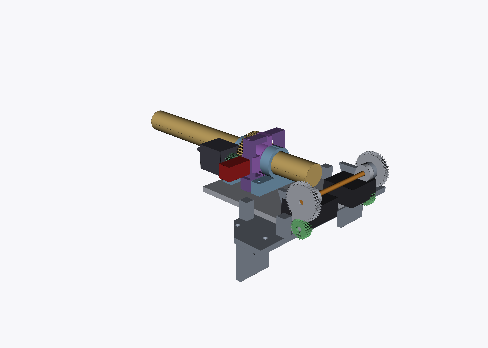

# Powder Doser — parametric CAD assembly

A self-contained, parametric [CadQuery](https://cadquery.readthedocs.io/)
package that builds the complete **Powder Doser** (a vertically-orientable,
auger-fed powder dispenser) from the text-only engineering-spec prompt in
[issue #111](https://github.com/vertical-cloud-lab/powder-doser/issues/111).

It emits a STEP + STL + PNG for every 3D-printed part, a tilt-0 assembly, and a
§6 interference / clearance report that gates the build.



High-resolution (5600 × 4000) iso view with per-part colours — auger gold,
brackets light-blue, tap collar/mount purple, stepper pinion green, servo
pinions bright-green, motor/servo dark, hinge pins orange — mirroring the
colour scheme and az = 90° iso perspective of
[`cad/mounting-plate-assembly`](../mounting-plate-assembly)'s
`assembly_iso_az090_hires.png`.

## Layout

| File | Purpose |
|------|---------|
| [`params.py`](params.py) | single source of truth for every dimension (§1–§7) |
| [`helpers.py`](helpers.py) | reusable geometry: involute spur gears + rings, helical auger screw, printable threads |
| [`build.py`](build.py) | every part builder, the tilt-0 assembly, `interference_report()`, and the exporters |
| [`SPEC.md`](SPEC.md) | the engineering specification this package implements |
| `exports/` | generated STL + PNG (committed); STEP is reproducible, see `.gitignore` |

## Parts produced

`auger-storage-full` (250), `auger-storage-180`, `auger-storage-short` (90,
bench test), `auger-threaded` (sealable variant), `thread-cap`,
`stepper-pinion` (16T), `servo-pinion` (20T), `auger-bracket`, `tap-collar`,
`tap-collar-mount`, `mounting-plate`, `baseplate`, plus the full
`powder-doser-assembly`.

## Build

Requires Python 3.10+ and CadQuery (`pip install cadquery`). PNG previews are
rendered headlessly with VTK; under a server without a display run the build
through a virtual framebuffer:

```bash
cd cad/powder-doser-assembly
pip install cadquery            # pulls in cadquery-ocp + vtk
xvfb-run -a python3 build.py    # STEP + STL + PNG + the §6 report
```

(omit `xvfb-run` on a workstation with a display). `build.py` finishes by
printing the interference / clearance report; it only reports **All checks
passed** when every §6 rule holds:

```
[PASS] auger bore open through gear band
[PASS] pinion/auger-band mesh (no jam)
[PASS] NEMA 11 body clears auger OD
[PASS] tap collar running fit on auger
[PASS] solenoid plunger interference (intended)
[PASS] auger brackets running fit
[PASS] tilt clearance @ 0 / 45 / 90 deg
```

To run just the checks (no export):

```python
import build
for name, ok, detail in build.interference_report():
    print("PASS" if ok else "FAIL", name, "-", detail)
```

## Design notes

* Coordinate frame: `+Y` along the auger (dispense tip at `+Y`), `+Z` up,
  mounting-plate top at `Z = 0`, auger bore axis at `X = 0, Z = 29.25`.
* The auger drive band is modelled as an **annular** 48T gear so the Ø21 powder
  bore stays fully open through the teeth.
* The hinge is a three-layer sandwich per side (inner plate lobe | baseplate
  arm | outer plate lobe carrying the 40T gear) with 0.4 gaps, so the table
  tilts 0→90° without ever touching the fixed baseplate.
* The tap solenoid is placed with a **deliberate 3 mm interference** into the
  auger OD — that is the hammer-tap that breaks powder bridges (§6 rule 5).
