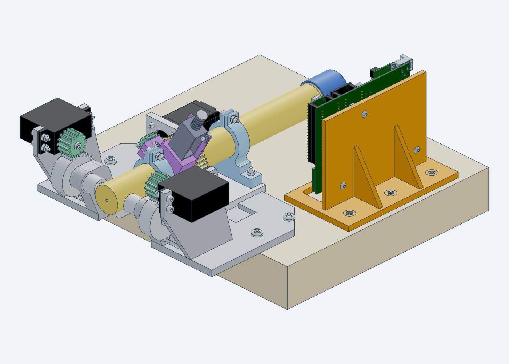
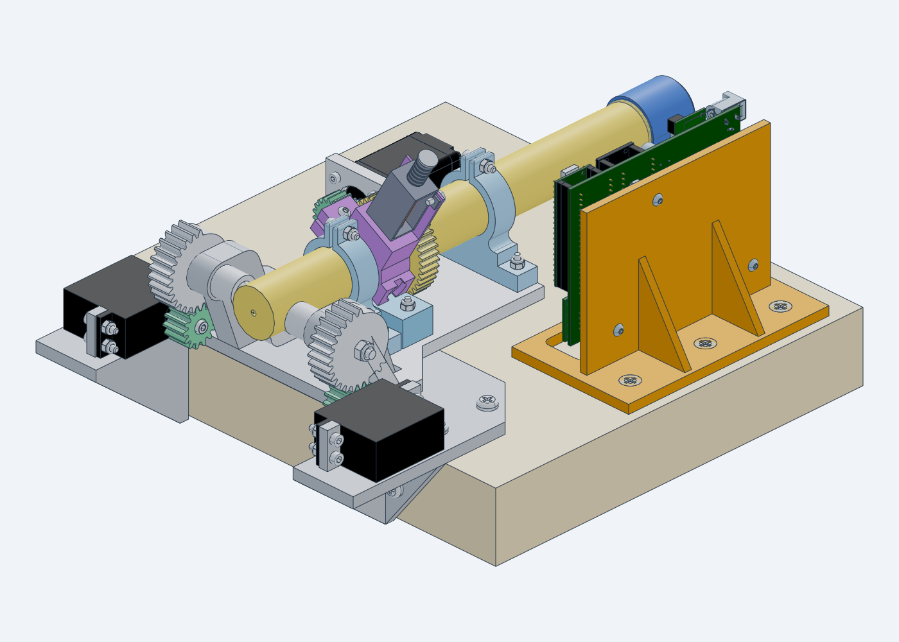
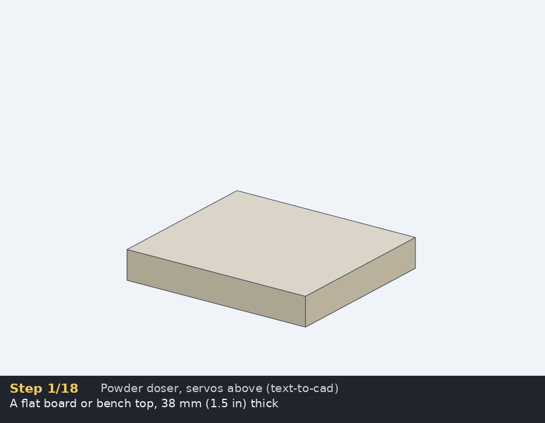
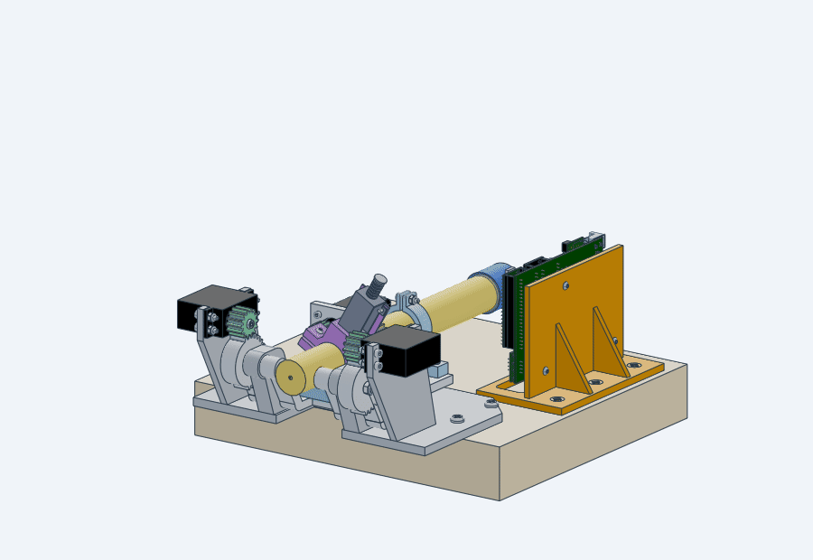
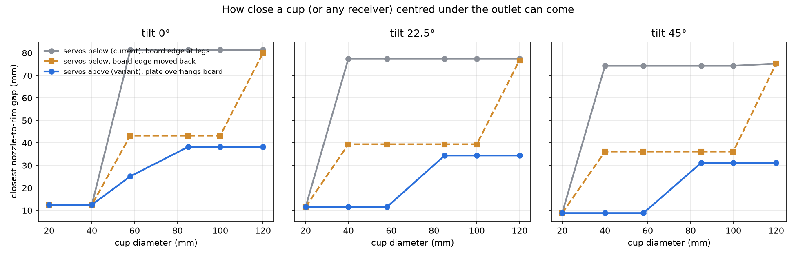
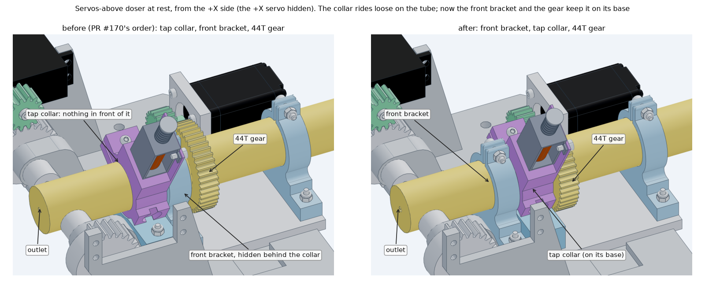
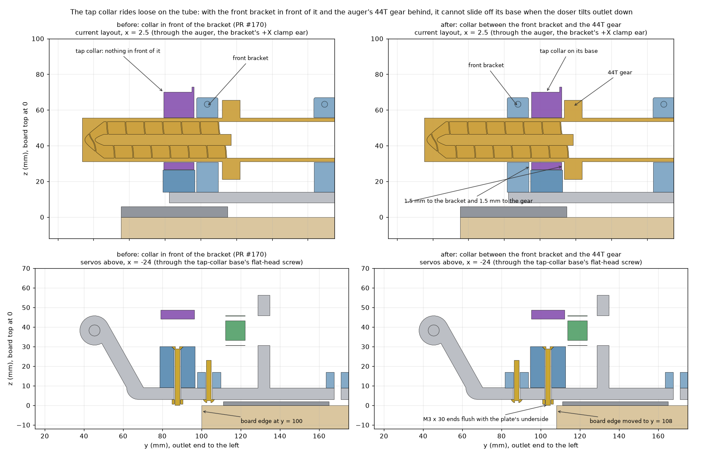
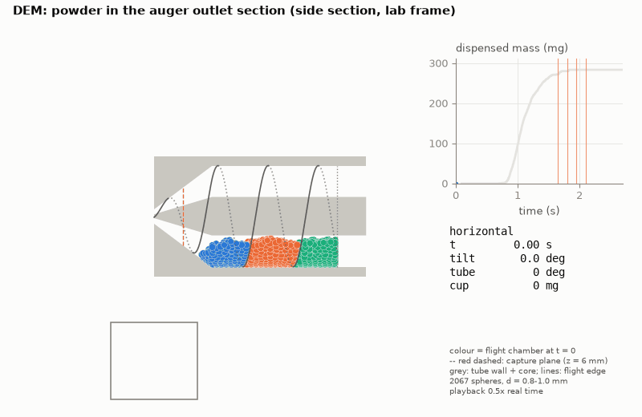
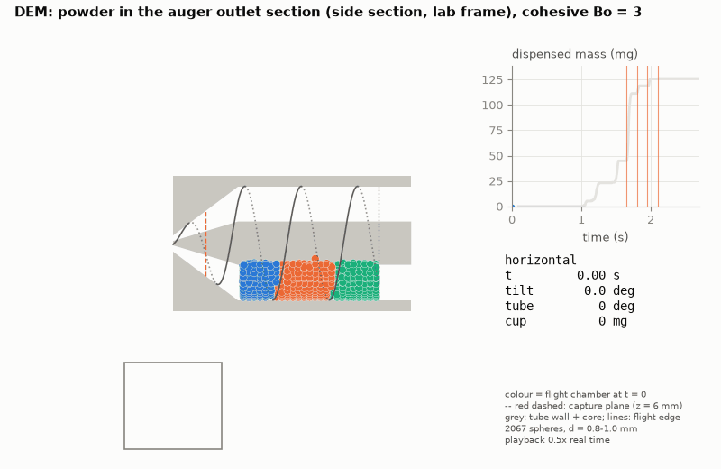

# Powder doser in text-to-cad (issue #172)

The lab's current powder doser (PR #170's full assembly, from the Fusion 360
files in #115/#97), rebuilt as code with
[text-to-cad](https://github.com/earthtojake/text-to-cad): every printed part
is a build123d model, the purchased parts are vendor or parametric models,
every screw and nut is a step.parts model, and the POWDER_DOSER_V2 PCB is
built from its Gerbers. The assemblies carry kinematics (tilt geared to both
servo pinions, auger geared to the stepper, solenoid plunger) and animation
clips. A second layout puts the **servos above the hinge**, so nothing hangs
below or in front of the nozzle, and sits **5 mm lower** on a baseplate
relieved under the mounting plate. Both layouts are checked for interference,
nozzle-to-cup clearance and printability, and a DEM model simulates the
powder (tilt, rotation, tapping). Along the auger, from the outlet back:
the front bracket, the tap collar on its base, the 44T gear, the stepper
and the rear bracket ([the collar's order](#tap-collar-between-the-front-bracket-and-the-gear)).

Toolchain: `cadgen[snapshot]==0.7.10` (text-to-cad's runtime) and
build123d 0.11.1 on Python 3.12, with the text-to-cad `cad`, `step-parts` and
`dfam-check` skills.

| Servos above (new) | Current (servos below) |
|---|---|
|  |  |

| Assembly, step by step (servos above) | Tilt, turn, tap |
|---|---|
|  |  |

## Layout

| Path | What |
|---|---|
| `src/parts/` | Printed parts: baseplate (+ servos-above variant), mounting plate (+ variant), auger, auger cap, bracket, tap collar, tap-collar base, servo and stepper pinions |
| `src/purchased/` | MG996R servo, NEMA 11 (vendor STEP 11HS18-0674S), Adafruit 412 solenoid |
| `src/electronics/` | POWDER_DOSER_V2 PCB from the Gerbers, its modules, and the printed holder ([README](src/electronics/README.md)) |
| `src/lib/` | `frames.py` (world frame and every placement, ported from PR #170), `hardware_placements.py` + `fasteners.py` (step.parts screws and nuts in PR #170's seat frames), `doser.py` (the assembly tree, kinematics and animation clips), `assembly_steps.py` (build order and captions), `electronics_place.py` |
| `src/assembly_current.py`, `src/assembly_servos_above.py` | The two full assemblies → `STEP/`, `GLB/` |
| `scripts/render_clips.py` | Renders the clips with text-to-cad's own `cadgen step snapshot --animation … --video` and captions the assembly GIF |
| `scripts/render_stills.py` | The iso renders and the before/after close-up of the tap collar (`cadgen step snapshot`) |
| `scripts/as_built.py`, `reference/as-built/` | The real doser on the livestream next to this CAD: what has changed since Oct 2 and where its design files are ([README](reference/as-built/README.md)) |
| `checks/` | Fidelity, interference, plate clearance of the lowered doser, electronics clearance, cap thread, nozzle-to-cup clearance, printability, PCB checks; results in `checks/results/` |
| `sim/` | DEM powder model of the auger ([README](sim/README.md)); figures in `renders/sim/` |
| `docs/onshape.md` | How this could work with Onshape and its REST API |

## Build

```bash
pip install "cadgen[snapshot]==0.7.10" rtree networkx lxml
python3 -m playwright install --with-deps chromium      # snapshots
sudo apt-get install -y ffmpeg                           # GIF/MP4 clips
cd cad/text-to-cad
export PYTHONPATH=src:src/parts:src/purchased:src/electronics
python3 src/assembly_servos_above.py                     # about 7 min on a 4-core runner
python3 src/assembly_current.py
python3 scripts/render_clips.py --variant above --clips motion assembly --fps 6
python3 scripts/render_stills.py iso collar
python3 checks/fetch_reference.py                        # PR #170's files, for the checks
(cd checks && PYTHONPATH=../src:. python3 interference.py --fasteners)
```

On a GitHub-hosted runner, keep an eye on memory. Each cadgen daemon worker
holds 0.5–2 GB, and fine STL exports of the helical auger spike well above
that. Two earlier CI sessions on this issue lost their runner ("The runner
has received a shutdown signal") while running jobs like these. Install
`earlyoom`, which kills the offending Python process instead of the runner,
and set `CADGEN_JOBS=2` to cap the daemon's parallelism.

## Fidelity of the recreation

`checks/fidelity.py` scores each recreated part against the file it
duplicates, in the same frame with no registration
(`checks/results/fidelity/`):

| Part | IoU | Volume error | Max surface deviation |
|---|---|---|---|
| Baseplate | 0.9996 | 0.00 % | 0.005 mm |
| Mounting plate | 0.9997 | 0.01 % | 0.012 mm |
| Bracket | 0.9996 | 0.00 % | 0.001 mm |
| Tap collar | 0.9995 | 0.00 % | 0.002 mm |
| Tap-collar base | 0.9997 | 0.00 % | < 0.001 mm |
| Servo pinion (14T) | 0.9996 | 0.05 % | 0.010 mm |
| Stepper pinion (20T) | 0.9996 | 0.04 % | 0.016 mm |
| Auger cap | (boolean failed on the threads) | 0.19 % | 0.011 mm |
| Auger | (not run: too heavy for the runner) | 0.013 %, identical bounding box | – |
| MG996R / Adafruit 412 | 0.9998 / 0.9991 | 0.00 % | – |
| NEMA 11 | 0.955 against PR #170's stand-in | 0.34 % | the recreation uses the real vendor STEP (28.2 mm square, rounded corners) |

Fasteners: 13 step.parts models against PR #170's stand-ins. Twelve score
IoU 0.83–0.999; the M5 × 45 hinge screw's boolean returned 0 (its volume is
14 % under: it is step.parts' M5 × 50 cut to 45). The step.parts `_simple`
screws draw the thread at the minor diameter, which accounts for most of the
difference.

## Servos above: what changes and what it buys

* **Baseplate** (`baseplate_servos_above.py`): the front arms, legs and
  servo posts go. The servos sit in open-top cradles on the hinge towers, and
  a slot between the towers clears the tap-collar hardware. The plate
  overhangs the board's front edge by 52.6 mm, and it prints flat with
  0.6 % of its surface needing support (the current baseplate needs 6.9 %).
* **Mounting plate** (`mounting_plate_servos_above.py`): the two 28T gears
  are turned 180° about the hinge, so the 14T pinions mesh them from above.
* **Build order** (`src/lib/assembly_steps.py`, the GIF above): the plate goes
  onto the towers first, then the servos drop in from above (their splines
  pass 8 mm over the gear tips), and then the pinions slide on from inside.
* **5 mm lower** (`lib.frames.DROP`, `baseplate.py`): see below.

### 5 mm lower

Shortening the towers alone gains nothing. At rest, the mounting plate's
floor sits **2.0 mm** above the baseplate, and the four M3 button heads
under it (the bracket screws) only **0.35 mm** above. Tilting lifts them,
so the rest position sets the height. What is "underneath the auger towards
the back" is that floor, 108 mm wide at the front and 68 mm at the rear.
It reaches from the towers to 5 mm past the plate's back edge.

So the plate is relieved under the floor instead of being thinned all
over:

* `frames.DROP["above"] = 5`: every part and screw above the plate moves
  down 5 mm. The hinge is now 38.25 mm above the board top (it was 43.25),
  and the towers and servo cradles are 5 mm shorter.
* **Relief:** a pocket under the floor's footprint (plus 1.5 mm, and 3 mm on
  the walls the floor swings towards), down to a **2 mm skin**. The floor
  clears the skin by 1 mm. The plate stays 6 mm under the towers, the
  cradles and the board screws.
* The slot widens from 54 to 57.8 mm, to the towers' inner faces, because
  the knuckle tongues now dip below the plate top beside the towers. It
  runs on to y = 111, past the tap-collar base's screw head, nut and
  screw end. The rear bracket's heads get Ø9 notches.
* **What limits it:** those button heads now hang **1.35 mm above the
  board**. Going lower means countersinking them into the mounting plate's
  floor (about 1.5 mm more), raising that floor (new brackets, tap-collar
  base and stepper plate), or recessing the board.
* The M3 × 30 flat head through the tap-collar base's tower now ends flush
  with the plate's underside, at y = 102–105 in the slot. The board's edge
  is at y = 108, so the screw end hangs in front of the board. Keep the
  edge behind y = 106. (An M3 × 25 would not reach its nut: tower and floor are
  27 mm.)
* **Swing:** as the doser tilts, the floor moves back up to 2.7 mm before
  it clears the plate top at about 4.5°. The first relief had only 1.5 mm
  on its chamfers and hit the plate at 4°. The standard 0/15/30/45° sweep
  would have missed that.
  [`checks/plate_clearance.py`](checks/plate_clearance.py) sweeps 0–10° in
  0.5° steps, then on to 45°. Nothing touches. (With PR #170's order the
  tap-collar base rested on the towers' backs at 0°, 0.135 mm³.)
* **Cost:** the plate drops from 190 to 138 cm³ and still prints flat
  (0.6 % support). Between each tower and its cradle, the fork arm over
  the board edge is now the 2 mm skin. The towers' feet, the cradles' rails
  and the front strip stay 6 mm thick. Print one and check it for flex
  before relying on it.
* **Versus a uniformly thinner table:** taking t mm off the whole table
  lowers everything by t with nothing else changed. The clearances above
  move down with the table. A 3 mm table (the Onshape session's
  `#table_trim`, [`onshape/`](onshape/README.md)) gives 3 mm. A 2 mm table
  would give 4 mm, with the whole 44.6 mm overhang only 2 mm thick.

How close a cup can come to the outlet. A cup of diameter D, centred under
the outlet, is raised until its rim touches something
(`checks/nozzle_clearance.py`, gap in mm, limiting part in brackets):

| Layout, tilt | Ø20 | Ø40 | Ø58 | Ø85 | Ø120 |
|---|---|---|---|---|---|
| Current, 0° | 12.5 (auger) | 12.5 (auger) | 81.3 (board) | 81.3 (board) | 81.3 (board) |
| Current, 45° | 8.8 (auger) | 74.3 (board) | 74.3 (board) | 74.3 (board) | 75.3 (baseplate) |
| Current, board moved back, 45° | 8.8 (auger) | 36.2 (baseplate) | 36.2 (baseplate) | 36.2 (baseplate) | 75.3 (baseplate) |
| Servos above, 0° | 12.5 (auger) | 12.5 (auger) | 25.2 (mounting plate) | 38.3 (baseplate) | 38.3 (baseplate) |
| Servos above, 22.5° | 11.6 (auger) | 11.6 (auger) | 11.6 (auger) | 34.4 (baseplate) | 34.4 (baseplate) |
| **Servos above, 45°** | **8.8 (auger)** | **8.8 (auger)** | **8.8 (auger)** | 31.2 (baseplate) | 31.2 (baseplate) |

8.8 mm is the floor here: it is the auger tube's own end face
(12.5 mm × cos 45°). At 45° with the servos above, cups up to 58 mm across
reach it. The servos-above rows are for the doser 5 mm lower. That brings
the outlet 5 mm closer to the baseplate, so wider cups stop about 5 mm
sooner (they were 43.2, 38.8 and 35.0 mm at 0, 22.5 and 45°). With the
current layout at 45°, any cup 40 mm or wider stops 74 mm below the outlet,
because the board and the baseplate's front arms are in the way.

These are for the auger where it now sits, 1.6 mm further back than PR
#170 had it ([below](#tap-collar-between-the-front-bracket-and-the-gear)).
The outlet is 1.6 mm closer to the hinge, so wider cups get 0.6–1.1 mm
more at 22.5° and 45°, and Ø58 cups 2.9 mm more at 0° with the servos
above. In the current layout a Ø40 cup at 22.5° now overlaps the board's
edge by 0.8 mm and stops at 77.5 mm (it reached 11.6 mm before). That cup
is marginal either way: tilted, the auger slides forward until its gear
meets the tap-collar base, 1 mm ahead of where it is drawn.



## Interference

Full write-up: [`checks/results/interference.md`](checks/results/interference.md).
In short:

* **Fixed:** the auger cap's thread was half a turn out of phase with the
  auger's as placed (546 mm³). `CAP_TURN_DEG = 180` seats it
  ([`checks/cap_thread.py`](checks/cap_thread.py)).
* **Fixed:** the front bracket and the tap collar were the wrong way round,
  as in PR #170's layout ([below](#tap-collar-between-the-front-bracket-and-the-gear)).
  The sweep was re-run after the swap: the only part pair that changed is
  the stepper pinion's D-bore on the motor shaft (0.64 → 0.79 mm³; the
  pinion now sits 1.6 mm further onto the shaft).
* **Fixed:** the first electronics pose put the PCB holder on the auger's
  centre line behind the doser, where the tube and the mounting plate cut
  through it. The holder now stands beside the doser on the +X side, turned
  90° with its components facing the doser
  ([`checks/electronics_clearance.py`](checks/electronics_clearance.py)).
* **Inherited from the lab's files (current layout only):** the
  baseplate's servo posts overlap each MG996R by 69 mm³, and at rest the
  M3 screw and nut under the tap-collar base hit the baseplate (4.7 and
  7.3 mm³). The servos-above baseplate has neither.
* **Vendor-model artefacts:** the NEMA 11 STEP's rigid lead stubs pierce the
  mounting plate and rear bracket. The real leads leave towards the plate, so
  route them away from it.
* Nothing else collides at 0, 15, 30 or 45° in either layout.
* **Servos above, 5 mm lower:** everything but the baseplate moved down
  together, so only pairs with the baseplate or the board changed.
  [`checks/plate_clearance.py`](checks/plate_clearance.py) sweeps those in
  0.5° steps ([results](checks/results/plate_clearance.json)).

## Tap collar between the front bracket and the gear

PR #170's layout, and this recreation until `f489826`, put the tap collar
and its base on the floor's front M3 row and the front bracket behind them,
next to the 44T gear. The collar rides loose on the turning tube. The base's
hard-stop tower keeps it from turning, but nothing kept it from sliding
along the tube, so as the doser tilts outlet down it would slide forward off
its base. On the lab's doser the order is the other way round (Sam Charles,
and the 11 Sep rig photo and June render in PR #170): front bracket, then
the collar on its base, then the gear.

* **Rows:** the mounting plate is unchanged. The front bracket stands on
  the front row (x = −42.33 in the plate's frame, world y = 87.7), and the
  tap-collar base on the middle row (−58.33, y = 103.7). The collar sits
  on its base, 1.5 mm behind the bracket and 1.5 mm in front of the gear,
  so it can move 3 mm in all.
* **Gear and pinion 1.6 mm back:** the base is 18 mm long. On the middle
  row its back end would run 0.6 mm into the 44T gear's face (the base's
  block is inside the gear's tip circle) and into the stepper pinion's
  face (its tower is inside the pinion's). So the pinion and the gear
  (still centred on the pinion's teeth) stand 1 mm behind the base:
  `frames.GEAR_TAP_BASE_GAP`. The pinion's Ø9 hub reaches 1.1 mm into the
  stepper plate's Ø22 pilot hole (the motor's pilot fills only its back
  2 mm), and the shaft engages 15.1 mm of the pinion's 16.1 mm. The outlet
  moves back with the auger and is now 10.0 mm in front of the hinge.
* **Thrust:** nothing else holds the auger along its axis, so when the
  doser tilts outlet down it slides forward until the gear's face meets
  the tap-collar base's back end (the base is 0.5 mm longer than the
  collar at each end). The gear then turns against the base. Check on the
  doser which of the two it runs against; a thin PTFE or nylon washer
  between them would take the wear.
* **Servos above:** the base's M3 × 30 flat head ends flush with the
  plate's underside. On the front row that was in the slot in front of
  the board. On the middle row it would rest on the board (0.00 mm), so
  the board's edge moves from y = 100 to 108 and the front board screws
  from y = 115 to 120. The plate now overhangs the board by 52.6 mm.
* **No 0° stop:** the tap-collar base used to rest on the hinge towers'
  backs at 0° (0.135 mm³). On the middle row it clears them by 6.3 mm and
  the front bracket clears them by 2.6 mm, so the servos hold the rest
  pose. In the current layout the base's M3 screw and nut still reach the
  baseplate (4.7 and 7.3 mm³, as before), now at y = 103.7.
* **Build order:** the 20T pinion goes on before the tap-collar base,
  whose tower is now inside its tip circle 1 mm in front of it. Then the
  tap collar and the front bracket slide onto the tube from the outlet end,
  in that order.





Not redone: the Onshape document ([`onshape/`](onshape/README.md)) still
has the old order and the board screws at y = 115.

## Printability

`checks/printability.py` (text-to-cad's `dfam-check` approach: wall
thickness, overhang/support area, best orientation) on the STLs:
[`checks/results/printability.md`](checks/results/printability.md).
The baseplates, bracket, tap-collar base and PCB holder are clean watertight
single bodies with minimum walls of 1.7–4 mm. The servos-above baseplate's
thinnest section is now its 2 mm skin under the mounting plate. The tool's
1.5 mm reading is a ray grazing a board-screw hole in the 6 mm plate. The tap collar's thinnest wall
is 0.74 mm. The auger's helical flight is 0.5 mm thick by design, which is
about one extrusion line on a 0.4 mm nozzle. The auger, auger cap and both
mounting plates export non-watertight or multi-body STLs (the helical sweeps,
and the gears as separate bodies), so their mesh wall minimums (0.002–0.14 mm)
are artefacts. A slicer repairs these meshes, but they should be unioned or
exported finer before anyone relies on their numbers.

## Powder simulation (DEM)

[`sim/`](sim/README.md) is a soft-sphere DEM of the auger's outlet section,
written for this issue in numba. The rotating tube, helical flight, core and
funnel are analytic signed-distance fields. Contacts are linear
spring–dashpot with Coulomb friction (μ = 0.6 particle–particle, 0.35
particle–PLA) and elastic–plastic rolling resistance (μ_r = 0.8). Those
values were calibrated so that a lifted-cylinder heap stands at **32.6°**
(the first, constant-torque rolling model only reached 20.6°). Tilt enters
as the gravity direction, rotation through the moving walls, and a solenoid
tap as a 4 ms, about 38 g acceleration pulse of the tube.

| Non-cohesive: tilt 35° → 1 rev → 4 taps → back | Cohesive (Bo = 3), same sequence |
|---|---|
|  |  |

* **Dose per revolution:** 1st rev 98 / 238 / 279 mg at 0 / 22.5 / 45°,
  about 285 mg once running at 22.5–45°. That is about 320 mm³ of bulk
  powder per turn; multiply by your powder's bulk density. The dose arrives
  as one pulse per revolution. A horizontal auger delivers about 35 % less.
* **Leakage:** none. With the tube stopped at 45°, the flight pockets hold
  the powder, and taps alone release nothing.
* **Taps:** with free-flowing powder they only clean out the funnel (11, 5,
  1, 0 mg). With cohesive powder, one revolution released just 45 mg
  because powder bridged in the funnel, and then **the first tap released
  67 mg**, more than the whole revolution. So in this model, tapping is what
  makes a cohesive powder dispense.
* **Caveats:** coarse-grained 0.8–1.0 mm spheres (2067 of them), soft
  contacts, and an assumed 41 % flight fill. Powder counts as dispensed at a
  capture plane where the gap is still about 4 diameters, because the real
  1.1 mm outlet annulus would jam spheres this size. Cohesion is an assumed
  Bond number, not a measured one, and each case was run once. Compare the
  trends and the bulk volume per revolution, not absolute milligrams.

## Onshape

[`onshape/`](onshape/README.md) makes the lowering in Onshape through the
REST API, in one company-owned document. A branch reproduces this
README's 5 mm lowering with a FeatureScript feature, and its baseplate
matched `baseplate_servos_above.step` at IoU 1.0000 (as of `ab2e27b`,
before the collar swap moved the front board screws from y = 115 to 120). The main workspace
has the simpler alternative, a 3 mm thinner table driven by one variable.
Together they took 54 API calls.

[`docs/onshape.md`](docs/onshape.md) covers the options. The most valuable
next step is pushing this project's kinematics sidecar into the existing
Onshape assembly as real mates and gear relations (the live document has
none). The return path, Onshape version → STEP → these checks in CI, comes
second.

## The real doser (livestream)

Since 2 Oct the real doser has stood on a new stand over the balance: a black
open-front baseplate, a perforated post behind it and perforated legs at the
sides. Its design file is a lab Onshape document, not this repo.
[`reference/as-built/`](reference/as-built/README.md) compares the
livestream with this CAD part by part, and lists the design files that aren't
in the repo: the stand, the white C-clip rear bracket, the PCB housing, the
centering device (#177), the filling stand and the small augers.
