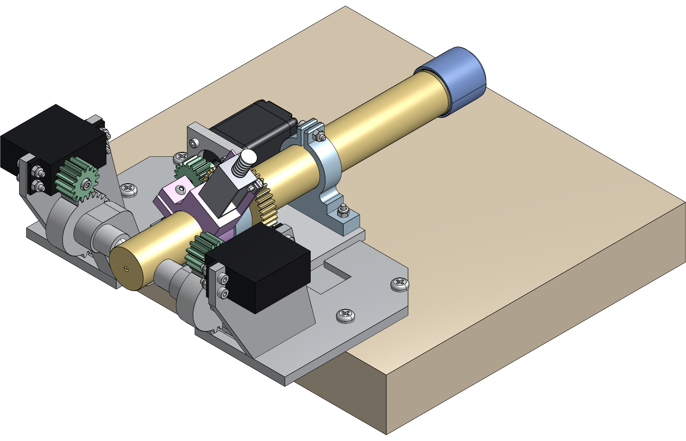
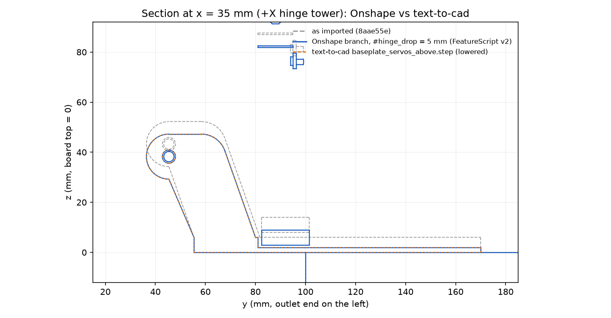

# Lowering the servos-above doser, done in Onshape through the REST API

The request was to lower the whole servos-above system by removing
material
([comment](https://github.com/vertical-cloud-lab/powder-doser/pull/176#issuecomment-6002726948)).
The text-to-cad session made that edit in the build123d sources. This
folder makes the same edits in Onshape, using only the REST API, and
checks Onshape's results against the text-to-cad geometry.

Document (private, owned by the Vertical Cloud Lab company):
[Powder doser - servos above, thinner table (text-to-cad, #172)](https://cad.onshape.com/documents/28d9eba0d7a4cbd3170c820e/w/aa1104360ebacf99765acf35).
Both edits start from the version "text-to-cad import" (the assembly at
8aae55e, before any edit):

| Workspace | Edit | In Onshape | Result |
|---|---|---|---|
| **main** | **Thinner table**: the 6 mm table becomes 3 mm, so everything on it sits 3 mm lower. This was my reading of the request before the text-to-cad session chose its approach. | 3 standard features driven by `#table_trim` | Baseplate IoU 1.0000 against the expected solid; the other 99 solids moved by exactly −3 mm |
| **branch** "hinge 5 mm lower (text-to-cad approach)" | **The text-to-cad lowering**: towers and cradles 5 mm shorter, tilting system and servos 5 mm lower, the table relieved under the mounting plate | Variable + Transform + one custom FeatureScript feature ([`featurescript/lower_hinge.fs`](featurescript/lower_hinge.fs)) | Baseplate IoU **1.0000** against text-to-cad's `baseplate_servos_above.step`; all 100 solids match the text-to-cad assembly; tilt sweep clean |

| Branch (text-to-cad lowering), in Onshape | Section through the +X tower: Onshape (blue) on top of text-to-cad (orange) |
|---|---|
|  |  |

## Common to both: the import

`doser_step.py` writes `STEP/assembly_servos_above.step`, as of 8aae55e,
without the electronics: 10 MB, 100 solids, names and colours kept. The
PCB holder and its 300 components stand beside the doser on the board, and
neither edit moves them. `lower_table.py import` creates the document and
imports that STEP **flattened**, so every solid sits in place in one Part
Studio. One Transform feature can then move any set of solids, and a
variable can drive it.

## Main workspace: the thinner table (`lower_table.py`)

| # | Feature | Type | What it does |
|---|---|---|---|
| 1 | `table_trim` | Variable (length) | `#table_trim = 3 mm` |
| 2 | Thin the table | Move face, OFFSET, opposite direction | The baseplate's underside moves up by `#table_trim`, so the table is 3 mm thick |
| 3 | Lower the doser | Transform, translate (0, 0, −`#table_trim`) | The 99 solids other than the board, baseplate included, move down. The underside is back on the board, and everything on the table is 3 mm lower |

The parameter ids came from the Part Studio's feature specs
([`results/featurespecs.json`](results/featurespecs.json)). The face came
from `bodydetails`: it is the plane face of the body `baseplate` whose box
is flat at z = 0. The API reports that face's plane normal as +Z, so the
script finds it by its box, not its normal.

To change the amount, run `python3 onshape/lower_table.py set --trim 2.5`
(one call), or edit the variable in Onshape.

Checks:

* **In Onshape:** the baseplate's box is z 0 → 77.66 mm (it was 80.66), and
  the model's top went from 107.90 to 104.90 mm. Its volume went from
  175,485 to 119,401 mm³, which is the 18,695 mm² underside × 3 mm.
* **On the STEP exported back** (`compare_onshape.py`,
  [`results/compare_trim3.json`](results/compare_trim3.json)):
  * The baseplate matches the expected solid (the original with its bottom
    3 mm cut off, moved down 3 mm) at IoU 1.0000.
  * 98 solids moved by (0, 0, −3.000 mm), and the board didn't move.
    Boxes match within 0.18 mm (the auger's helical flight) and volumes
    within 0.06 % (the auger cap's thread).
  * For the threaded parts, OCC's integration of the B-spline faces
    Onshape writes back is off by up to 8 %, so their volumes are compared
    on fine meshes.
* **The trade-off:** the gap between the mounting plate and the table
  (2 mm) doesn't change, because both move together. The table itself is
  half as thick.

## Branch: the text-to-cad lowering (`lower_hinge.py`)

The text-to-cad session found that shortening the towers alone gains
nothing. At rest, the mounting plate's floor is 2.0 mm above the table and
the bracket screws' button heads are 0.35 mm above it. So it lowered the
hinge by 5 mm and relieved the table under the floor
([its README section](../README.md)). The branch reproduces that design:

| # | Feature | What it does |
|---|---|---|
| 1 | `hinge_drop` (Variable) | 5 mm |
| 2 | Lower the tilting system (Transform) | Moves everything but the board, the baseplate and the four #10 screws down by `#hinge_drop` |
| 3 | Lower hinge, relieve table (custom, **v1, suppressed**) | My first, independent attempt: split the baseplate at z = 20, move the tops down and merge; pocket the table under the mounting plate's outline + 1 mm; Ø7 holes under the four bracket heads |
| 4 | Lower hinge (text-to-cad) (custom, **v2**) | `featurescript/lower_hinge.fs`: cuts the old towers and cradles off at the table top and rebuilds them `drop` lower from `baseplate.py`'s profiles, then cuts the same slot (to the towers, on to y = 111), relief (2 mm skin; 1.5 mm margin plus 1.5 mm where the floor swings back) and Ø9 notches |

Both FeatureScript versions compiled with no errors on their first upload,
and both features regenerated on the first try.

Checks (`compare_hinge.py`, `compare_assembly.py`, `results/`):

| | v1 (my own pocket) | v2 (text-to-cad design) |
|---|---|---|
| Baseplate vs. text-to-cad's `baseplate_servos_above.step` | IoU 0.935 | **IoU 1.0000**, the same volume to 1e-9 |
| All 100 solids vs. text-to-cad's lowered `assembly_servos_above.step` | – | Within 0.18 mm (boxes) and 0.06 % (volumes) |
| Tilt sweep against the baseplate (0–5° in 0.5° steps, 15, 30, 45°) | **Hits up to 4.5°**: the tap-collar base against the towers' lower part, which v1 left where it was (12 mm³ at rest); its nut against the slot's edge; and the mounting plate against the pocket's walls as it swings back (up to 7 mm³ at 3°) | Clean, apart from a 0.13 mm³ sliver between the tap-collar base and the towers' back faces at rest, which the design already had before the lowering |

v1 had two mistakes:

* Its towers kept their lower part, so the lowered tap-collar base ran into
  their back faces.
* Its pocket was sized from the rest pose only. For the first 4.5° of tilt,
  the floor and the screw heads move back (+y) while still below the table
  top. That is why the text-to-cad design adds its swing allowance and runs
  the slot on to y = 111.

## API calls

The company's plan is EDU Educator, which allows 2,500 API calls a year
for the whole company. `onshape_client.py` counts and logs every request
([`api_calls.jsonl`](api_calls.jsonl)), and each step has a hard budget.
Failed requests don't count against the quota.

| Step | Requests | What |
|---|---|---|
| access check | 2 | `sessioninfo`, `companies` |
| `lower_table.py import` | 7 | company, new document, upload + translate (1 poll), version, a shaded view, bounding box |
| `inspect` | 3 | `bodydetails` (12 MB for 100 bodies), `featurespecs` (twice: the first filter used the wrong key) |
| `edit` | 3 | one POST per feature |
| baseplate box | 1 | |
| `verify` | 8 | bounding box, mass properties, 2 shaded views, STEP export (translation, 1 poll, download), version |
| `lower_hinge.py branch` | 7 | branch from a version, Feature Studio, its contents, element microversion, 3 features |
| `verify` (v1, v2) | 17 | 8 each, plus 1 failed: the split had given the baseplate a new part id |
| `v2` | 6 | contents, microversion, a failed suppress, then the feature list and the suppress, the v2 feature |
| **Total** | **54** | 52 counted, about 2 % of the year's quota |

## Onshape vs. text-to-cad for these edits

* **What Onshape did well:**
  * Both edits are a few features driven by one variable each, so anyone
    can change the amount in Onshape without code.
  * Branches and versions keep the two edits, and the before state, side
    by side in one document.
  * FeatureScript turned out to be a good bridge. `lower_hinge.fs` is
    plain text in git, mirrors `baseplate.py` almost line for line, and
    gave the same solid (IoU 1.0000). It compiled and regenerated on the
    first upload.
  * Shaded views and STEP export came back from the same API.
* **What it couldn't do here:**
  * The import has no history. Editing a part means either direct edits
    on faces found through `bodydetails` (fine for the flat underside), or
    cutting the old geometry away and rebuilding it in FeatureScript.
  * The flattened import has no assembly and no mates, so lowering is a
    Transform.
  * None of the checks that mattered has a REST endpoint: the tilt sweep
    (which caught v1), clearances, printability and the DEM. They ran
    locally on the exported STEP.
  * Every call is metered.
* **What text-to-cad does instead:** the change is a parameter in
  `baseplate.py` and `frames.py`. Every downstream output (STEP, STL, GLB,
  kinematics, clips, checks) is rebuilt from it, it runs free in CI, and
  the diff is reviewable.

The two agree exactly, so either can be the one people edit. Per
`docs/onshape.md`, the sources in git remain the reference.

## Files

| File | What |
|---|---|
| `onshape_client.py` | REST client: API-key basic auth, a call budget, and a log of every call |
| `doser_step.py` | The STEP for Onshape: the servos-above assembly at 8aae55e, without the electronics |
| `lower_table.py` | Main workspace: `import`, `inspect`, `edit`, `set`, `verify` |
| `lower_hinge.py` | Branch: `fs` (writes v1), `branch`, `v2`, `verify --tag` |
| `featurescript/lower_hinge.fs`, `lower_hinge_v1.fs` | The custom features (v2: text-to-cad's design; v1: first attempt) |
| `compare_onshape.py`, `compare_hinge.py`, `compare_assembly.py` | Local checks of the exported Part Studios: expected geometry, the text-to-cad baseplate and assembly, the tilt sweep |
| `onshape_document.json` | Document, workspace, element, feature, version and body ids, plus calls per step |
| `results/` | Onshape's boxes and mass properties, comparisons, feature specs and FeatureScript notices |
