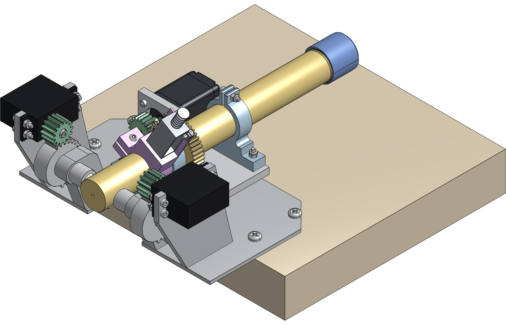
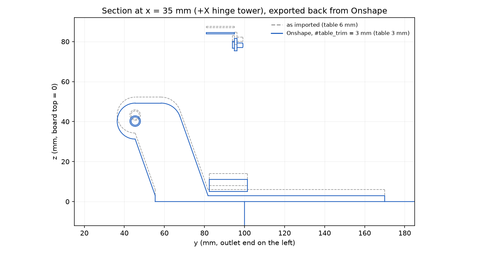
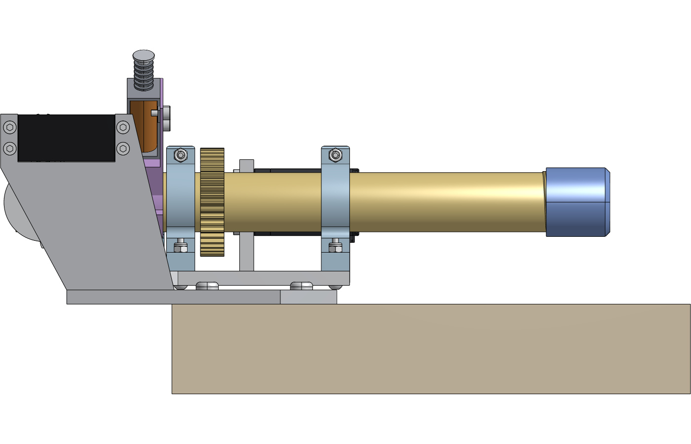
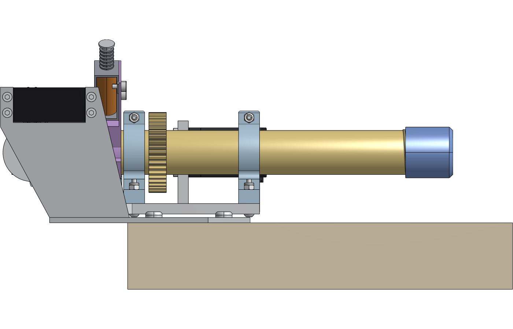

# The thinner table, made in Onshape through the REST API

The servos-above doser stands on the baseplate's 6 mm table. Making the
table thinner lowers the towers, the tilting system and the servos by the
same amount, while the board stays put
([request](https://github.com/vertical-cloud-lab/powder-doser/pull/176#issuecomment-6002726948)).
The text-to-cad session makes that edit in the build123d sources. This
folder makes the same edit in Onshape, only through the REST API, and then
checks Onshape's result against the geometry the edit should produce.

Document (private, owned by the Vertical Cloud Lab company):
[Powder doser - servos above, thinner table (text-to-cad, #172)](https://cad.onshape.com/documents/28d9eba0d7a4cbd3170c820e/w/aa1104360ebacf99765acf35).
It has two versions: "text-to-cad import" (before the edit) and
"table 6 -> 3 mm" (after).

| Onshape, after the edit | Section through the +X hinge tower, exported back from Onshape |
|---|---|
|  |  |

## How the edit is made

`doser_step.py` writes `STEP/assembly_servos_above.step` without the
electronics: 10 MB, 100 solids, names and colours kept. The PCB holder and
its 300 components stand beside the doser on the board, so the edit
doesn't move them. `lower_table.py import` creates the document and
imports that STEP **flattened**, so every solid sits in place in one Part
Studio. After the Import feature, the edit is three native features, all
driven by one variable:

| # | Feature | Type | What it does |
|---|---|---|---|
| 1 | `table_trim` | Variable (length) | `#table_trim = 3 mm` |
| 2 | Thin the table | Move face, OFFSET, opposite direction | The baseplate's underside moves up by `#table_trim`, so the table is 3 mm thick |
| 3 | Lower the doser | Transform, translate (0, 0, −`#table_trim`) | The 99 solids other than the board, baseplate included, move down by `#table_trim`. The underside is back on the board, and everything on the table is 3 mm lower |

All three regenerated without errors on the first try. The parameter ids
came from the Part Studio's feature specs
([`results/featurespecs.json`](results/featurespecs.json)), not from
guesses. The face to move came from `bodydetails`: it is the plane face of
the body named `baseplate` whose box is flat at z = 0. The API reports that
face's plane normal as +Z, so the script finds it by its box, not its
normal.

To change the amount, run `python3 onshape/lower_table.py set --trim 2.5`
(one call), or edit the variable in Onshape. The model regenerates, and
everything follows.

## Checks

From Onshape itself (`results/`):

* The baseplate's box is z 0 → 77.66 mm (it was 80.66). The model's top
  went from 107.90 to 104.90 mm, and the board's underside stays at
  z −38.10.
* The baseplate's volume went from 175,485 to 119,401 mm³. The difference
  is the 18,695 mm² underside × 3 mm.

The edited Part Studio, exported back as STEP and checked locally against
the STEP that went in (`compare_onshape.py`,
[`results/compare_trim3.json`](results/compare_trim3.json)):

* **Baseplate:** IoU 1.0000 against the expected solid (the original with
  its bottom 3 mm cut off, moved down 3 mm), with the same volume to
  1e-9 mm³ and the same box.
* **The other 99 solids:** 98 moved by (0, 0, −3.000 mm) and the board
  didn't move. Bounding boxes match within 0.18 mm (the worst is the
  auger's helical flight) and volumes within 0.06 % (the auger cap's
  thread). For the threaded parts, OCC's integration of the B-spline faces
  Onshape writes back is off by up to 8 %, so their volumes are compared
  on fine meshes.
* The section through the +X tower (above) shows the hinge axis moving
  from z 43.25 to 40.25 mm. The mounting plate's lowest point stays 2 mm
  above the table (z 8 over 6 before, 5 over 3 after), because both moved
  by the same amount.

| Onshape "right" view, before | after |
|---|---|
|  |  |

Onshape fits each view to the model, so the 3 mm change is easier to see
in the section than in these two views.

## API calls

The company's plan is EDU Educator, which allows 2,500 API calls a year
for the whole company. `onshape_client.py` counts and logs every request
([`api_calls.jsonl`](api_calls.jsonl)), and each step has a hard budget.

| Step | Calls | What |
|---|---|---|
| access check | 2 | `sessioninfo`, `companies` |
| `import` | 7 | company, new document, upload + translate (1 poll), version, a shaded view, bounding box |
| `inspect` | 3 | `bodydetails` (12 MB for 100 bodies), `featurespecs` (twice: the first filter used the wrong key) |
| `edit` | 3 | one POST per feature |
| baseplate box | 1 | |
| `verify` | 8 | bounding box, mass properties, 2 shaded views, STEP export (translation, 1 poll, download), version |
| **Total** | **24** | about 1 % of the year's quota |

## Onshape vs. text-to-cad for this edit

* **What Onshape did well:** the edit is three features driven by one
  variable. Anyone can open the document, drag the value and watch the
  doser move, with no code. Regeneration is instant, versions record
  before and after, and the shaded views and STEP export came back from
  the same API.
* **What it couldn't do here:**
  * The import has no history. The baseplate arrives as a plain solid, so
    the edit is a direct edit (Move face) on a face id read from
    `bodydetails`. That is robust for a flat underside, but a change to the
    tower profile would mean rebuilding the part as native sketches and
    features (`docs/onshape.md`, option C).
  * The flattened import has no assembly and no kinematics, so the
    lowering is a Transform. A composite import would give an assembly, but
    it would carry no mates, so each instance would have to be moved by
    hand (one `occurrencetransforms` call).
  * The checks (interference sweep, nozzle-to-cup clearance, printability,
    the DEM) have no REST endpoint. They still run locally on an exported
    STEP, as here.
  * Every call is metered.
* **What text-to-cad does instead:** the same change is a parameter in
  `baseplate.py` and `frames.py`. Every downstream output (STEP, STL, GLB,
  kinematics, clips, checks) is rebuilt from it, it runs free in CI, and
  the diff is reviewable. The cost is that someone has to edit code.

The two agree. The Onshape result is the original geometry with exactly
the intended change, so either side can be the one people edit. Per
`docs/onshape.md`, the sources in git remain the reference.

## Files

| File | What |
|---|---|
| `onshape_client.py` | REST client: API-key basic auth, a call budget, and a log of every call |
| `doser_step.py` | The STEP for Onshape: the servos-above assembly without the electronics |
| `lower_table.py` | `import`, `inspect`, `edit`, `set`, `verify` |
| `compare_onshape.py` | Local check of the exported Part Studio against the expected geometry; draws the section |
| `onshape_document.json` | Document, element, feature, version and body ids, plus calls per step |
| `results/` | Onshape's boxes and mass properties, the comparison, the feature specs used |
