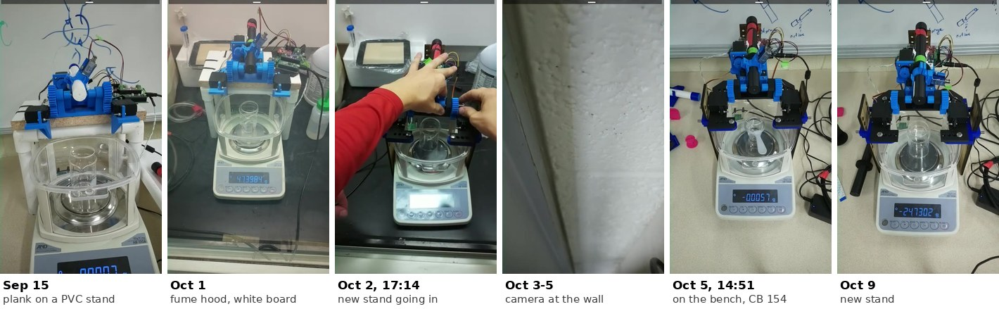
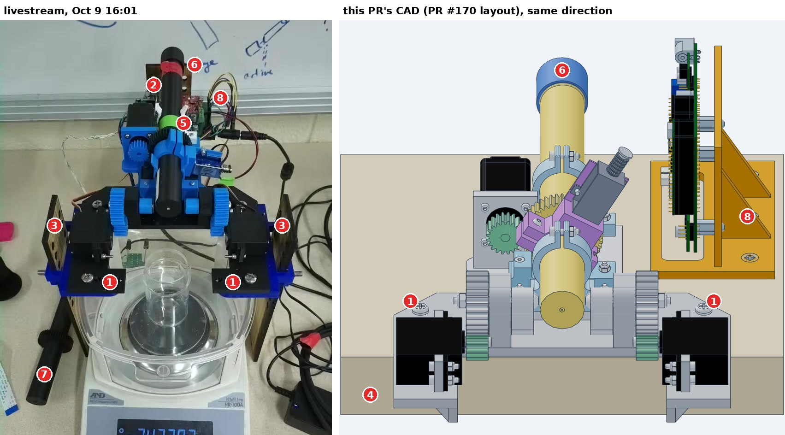
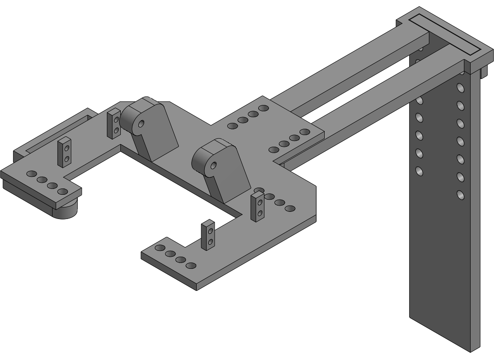
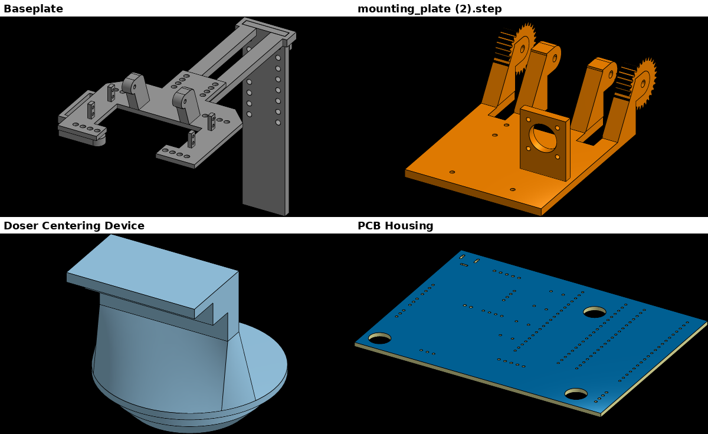

# The real doser vs. this CAD (as of 2026-10-09)

Asked on PR #176 (2026-10-10): the doser on the livestream has changed from
what this CAD shows. Where are those changes in the repo, and which aren't
there?

**Short answer.** This CAD is PR #170's assembly: the lab's Fusion 360 files
as of Oct 1, plus this PR's fix to the collar order. That is the doser as it
stood until Oct 2. At about 17:10 MDT on Oct 2 the doser was refitted onto a
new stand that straddles the balance. The stand's only design file is a lab
Onshape document, "Baseplate" (William Mulberry, Sep 29 to Oct 1). It isn't in
the repo on any branch, and no issue or PR mentions it. A few older changes
aren't in the repo either: the rear bracket, the PCB housing, the centering
device, the filling stand, and the small augers.

*16:00 MDT unless noted. On Oct 2 the doser came off at 16:51 and was being
fitted to the new stand at 17:14, in a fume hood. From Oct 3 until
14:46 on Oct 5 the camera faced the wall. The doser was back in CB 154 by
14:51 on Oct 5
([#144](https://github.com/vertical-cloud-lab/powder-doser/issues/144#issuecomment-6002953410)).*

## What differs, numbered

| # | On the rig (Oct 9) | In this CAD | Design file |
|---|---|---|---|
| 1 | **Black U-shaped baseplate**, open at the front. It has the same hinge lugs and four servo posts, but longer front arms with rows of holes, no front legs, and two rails running back. | The lab's Fusion baseplate (v2): front legs, screwed to a board | Onshape ["Baseplate"](https://cad.onshape.com/documents/5fc80753dffbfac5a3c30e5c), Part Studio "Baseplate parts", part `Body1`. **Not in the repo.** |
| 2 | **Perforated post behind the doser**, on the rails, with two columns of holes | none | Same document: the post (250 mm tall in the model) |
| 3 | **Brown perforated legs on each side of the balance.** Blue blocks with cross pins carry the front arms. | none | Probably `side_Bracket` in the same document. The model has only the rear post, so the side legs may be copies of it. Not confirmed. |
| 4 | **No board.** The stand stands on the bench, over the balance and its draft shield. | A 38 mm (1.5 in) board, PR #170's stand-in for "any flat board or bench top". From Aug 4 the rig actually stood on particleboard on a PVC stand ([#113](https://github.com/vertical-cloud-lab/powder-doser/issues/113#issuecomment-5184973628)). | none |
| 5 | **Green ring** on the auger behind the 44T gear, and the **white open C-clip rear bracket** just behind it (in use since at least Aug 4) | Nothing behind the gear; both brackets are the split clamp | C-clip: no file found, only the recreation video linked in PR #97's `paper/OPEN-DECISIONS.md` ([video](https://youtu.be/8fVVT5tipzY)). Green ring: no file or mention found. |
| 6 | **Augers printed black** (from about Oct 1), with a tape label near the cap | Fusion "Auger Threaded Storage" v1 and "Cap Threaded" v2 | Unconfirmed whether the black augers are the same design |
| 7 | Spare black auger with its gear, on the bench | none | none |
| 8 | **Electronics behind the doser**, next to the post | POWDER_DOSER_V2 (Gerbers on `main`) on an AI-made holder (`pcb_mount`) | Onshape ["PCB Housing"](https://cad.onshape.com/documents/dbe25c92dd19b12edac1581f) ("Housing top", "Housing bottom"; William, Aug 21 to Sep 10). Not in the repo. Unconfirmed whether it's fitted. |

The doser itself matches the CAD. That covers the tilt gears, servo posts,
stepper and pinion, and the order from the outlet back: front bracket, then
tap collar with the solenoid, then the 44T gear. That order is the one this PR
fixed on Oct 6 (f489826); PR #170's `cad/full-assembly` still has the old one.

*Onshape's shaded view of "Baseplate parts". The rows of holes on the front
arms and the rear post's two columns of holes match the black arms and
perforated post on the stream.*

## Other design files that aren't in the repo

| What | Where | Notes |
|---|---|---|
| Centering device ([#177](https://github.com/vertical-cloud-lab/powder-doser/issues/177)) | Onshape ["Doser Centering Device"](https://cad.onshape.com/documents/3cfb5a3df7e248205be3a795), versions 1 and 2 | v2 was being printed on Oct 9 and puts the tip 5 mm further over the lid opening. Not seen on the stream; probably a setup jig. |
| Auger filling stand | Fusion [a360.co/4yqMPfp](https://a360.co/4yqMPfp) (v3) | Posted on PR #170 on Oct 1, never downloaded |
| 3.32 mL and 9.18 mL augers | Fusion [a360.co/4hxzCu5](https://a360.co/4hxzCu5) (v2), [a360.co/47qXATc](https://a360.co/47qXATc) (v5); STLs in [#117](https://github.com/vertical-cloud-lab/powder-doser/issues/117#issuecomment-5097409563)'s `smaller.augers.zip` | Same |
| Wide-outlet auger | A screenshot on [PR #68](https://github.com/vertical-cloud-lab/powder-doser/pull/68#issuecomment-5590617887) (Sep 8) | No file found |
| Multi-doser ([#128](https://github.com/vertical-cloud-lab/powder-doser/issues/128)) | Onshape "Multi-Doser" (Oct 8), "Frame Carriage", "Electronics Carriage", "Auger Carriage", "Multi-Doser Carriage Assembly" | Not the bench doser |
| This PR, imported | Onshape "assembly_current.step", "assembly_servos_above.step", "mounting_plate_servos_above.step" (Ethan Webster, Oct 9) | Copies of this PR's outputs |

The eight Fusion share links that PR #170 exported haven't changed since then.
Each is still at the version it exported: baseplate v2, brackets v1, mounting
plate v2, servo pinion v1, stepper pinion v1, tap collar v1, auger v1, cap v2.

## How this was gathered

- **Livestream.** YouTube `@byu-vcl-hardware-streams`, "powder doser stream
  picam-d1pr" (8 h broadcasts). A 16:00 frame for each day from Sep 14 to
  Oct 9 found the dates, and the frames above come from
  [`scripts/as_built.py`](../../scripts/as_built.py) `frames`. The script
  fetches one 6 s fragment per moment (about 0.3 MB). YouTube refuses the CI
  runner's IP, so the requests went through the rig's Pi, capped at
  300 kB/s. The broadcast IDs and offsets are in `FRAMES`.
- **Repo.** Listed the CAD files (STEP, STL, 3MF, F3D, SCAD, FS and similar)
  that every branch adds relative to `main`. Nothing is there for the stand,
  the new baseplate, the C-clip, the housing or the centering device.
- **Issues and PRs.** Comments and photos since June.
- **Onshape.** Read-only calls through
  [`onshape_client.py`](../../onshape/onshape_client.py), logged in
  [`api_calls.jsonl`](../../onshape/api_calls.jsonl) as run
  `pr176-livestream-question`:
  - a document search;
  - the company's document list (2 pages);
  - 6 thumbnails;
  - the "Baseplate" document's elements and parts;
  - one shaded view.

  That makes 14 counted calls. A further 400 response isn't counted.
  `as_built.py onshape` repeats the thumbnails and the shaded view in 5 calls.

  **The issue/PR sweep agent made its own Onshape requests, without the
  client and without logging them.** It reconstructed them afterwards from
  its transcript, and they are back-filled in `api_calls.jsonl` as run
  `pr176-issue-sweep-agent`, with estimated times.
  - It made 414 to 446 requests, all read-only GETs. The range is there
    because 32 later list pages may not have been sent.
  - 311 of them returned 400: list requests with page sizes of 50 or 100,
    where Onshape's maximum is 20.
  - The other 103 to 135 succeeded. They covered:
    - the documents above, their parts, bounding boxes and shaded views;
    - document listings;
    - two unrelated documents, "parts2duplicate" and "Pi_can_mount".
  - If only successful requests count, this run used 117 to 149 calls in
    all, about 5 to 6 % of the company's 2,500 a year.
- **Fusion.** The share pages' metadata (version numbers) for all 11 links,
  with no downloads.

## Open questions for the team

1. Is "Baseplate" the version that's printed? The stream shows legs left,
   right and behind, but the model has one post. What are the brown legs?
2. Is the green ring a thrust collar, keeping the auger from sliding back?
   Nothing in the CAD holds it along its axis.
3. Is the PCB housing fitted, and which board is on the rig?
4. Are the black augers the Fusion "Auger Threaded Storage" design?
