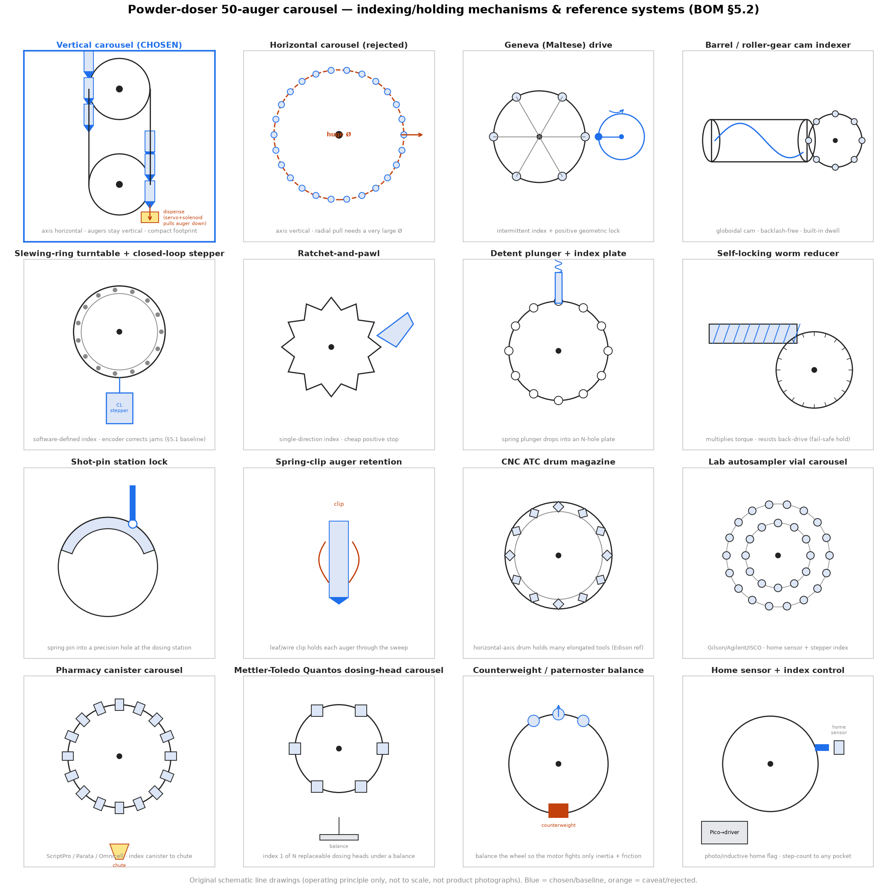

# Carousel mechanisms & reference systems — visual panel

A single labelled panel illustrating the indexing/holding mechanisms and the
commercial / open-source / academic reference systems surveyed in
[`BILL-OF-MATERIALS.md` §5.2](../../BILL-OF-MATERIALS.md#52-carousel-mechanism--prior-art-buymodify-options--recommendations)
and in the [build parts list](../carousel-build-parts-list.md). Requested on
PR #114 (comment 4801899448, @sgbaird) to "get a better sense of what you're
referring to."



> The tiles are **original schematic line drawings of the operating principle**
> (generated by [`make_panel.py`](./make_panel.py)), **not product
> photographs** — so they can be committed without copyright concerns and stay
> link-stable. They are not to scale. Blue = chosen / baseline; orange =
> caveat / rejected. For the actual commercial products, search the named
> vendors (Mettler-Toledo Quantos, ScriptPro, Gilson, Weiss, Kardex, …).

## Tile guide

**Orientation (per comment 4801844718 — the magazine is *vertical*):**

| Tile | What it shows |
|---|---|
| **Vertical carousel (CHOSEN)** | Rotation axis **horizontal**, augers stay **vertical** the whole sweep; a paternoster chain loop keeps the footprint small. The servo + solenoid pulls the indexed auger straight down into the dispense station. This is the intended architecture. |
| **Horizontal carousel (rejected)** | Rotation axis **vertical** (lazy-Susan turntable). Pulling an auger *radially* in/out of the dispense position with the servo + solenoid forces a very large wheel diameter for 50 augers — why this orientation is not used. |

**Ways to *index* and *hold* the wheel:**

| Tile | Principle |
|---|---|
| **Geneva (Maltese) drive** | Continuous motor → fixed intermittent index with a positive geometric lock between stations (held even unpowered). |
| **Barrel / roller-gear cam indexer** | Globoidal cam gives backlash-free index + built-in dwell/lock (Weiss / CAMCO-Destaco / Sankyo). |
| **Slewing-ring turntable + closed-loop stepper** | §5.1 baseline: software-defined pocket spacing; the encoder corrects a jam/overload. |
| **Ratchet-and-pawl** | Single-direction index into a cheap positive stop. |
| **Detent plunger + index plate** | Spring plunger drops into an N-hole plate for a positive station lock. |
| **Self-locking worm reducer** | Multiplies torque and resists back-drive — a fail-safe hold on power loss. |
| **Shot-pin station lock** | Spring-loaded pin into a precision hole *at the dosing station only* (Edison recommendation). |
| **Spring-clip auger retention** | Leaf/wire clip holds each auger seated through the vertical sweep. |
| **Counterweight / paternoster balance** | Balance the wheel so the motor fights only inertia + friction, not a standing gravity moment. |
| **Home sensor + index control** | Photo/inductive home flag + step-counting (Pico → driver) to reach any pocket. |

**Reference systems to buy / modify / draw inspiration from:**

| Tile | Example products |
|---|---|
| **CNC ATC drum magazine** | Horizontal-axis drum holding many elongated tools — the Edison review's analogous architecture. |
| **Lab autosampler vial carousel** | Gilson / Agilent / Thermo / Teledyne ISCO — rotary vial trays with home sensor + stepper index. |
| **Pharmacy canister carousel** | ScriptPro / Parata / Omnicell — index a canister to a dispense chute (mechanically the same problem). |
| **Mettler-Toledo Quantos dosing-head carousel** | Index 1 of N replaceable dosing heads under a balance — the closest commercial analog. |

## Regenerate

```bash
cd carousel/mechanism-panel
python3 make_panel.py   # writes carousel-mechanism-panel.png (+ .svg)
```

Requires `matplotlib` and `numpy`.
