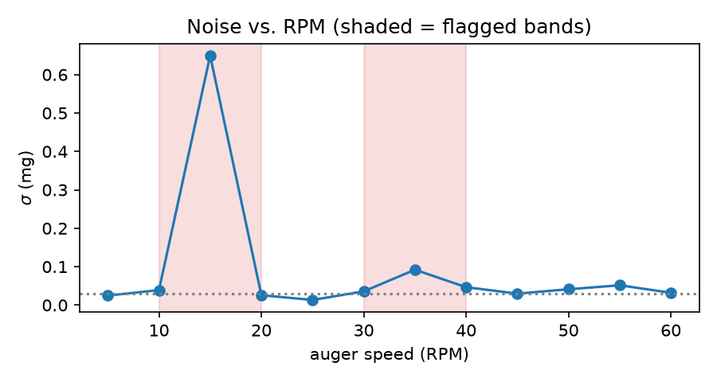
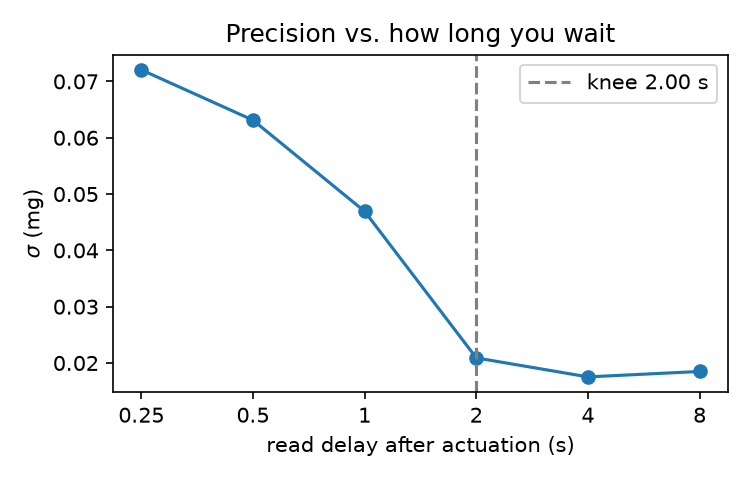

# Blank-auger vibration characterization

Run book for the experiment in
[issue #139](https://github.com/vertical-cloud-lab/powder-doser/issues/139):
dispense with an **empty auger** and measure what the balance reports.

The empty auger is the only configuration on this rig with a **known
ground truth**. Every dispense with real powder confounds "how much
powder moved" with "how much the balance lied". With nothing in the
auger the true Δm is exactly 0 mg, so anything the balance reports is
pure artefact and is directly attributable to the actuation parameters.
That makes it the cleanest available measurement of the noise floor —
and the noise floor is what sets

1. the smallest dose you can honestly claim (LOD ≈ 3σ₀, LOQ ≈ 10σ₀),
2. the tolerance band a closed-loop controller can chase, and
3. how long you must wait per reading — i.e. throughput.

It also has to be **retaken per environment**. A glovebox is not a
bench. `selfcheck` turns that from tribal knowledge into a gate.

## What it measures

| Quantity | From | Why it matters |
|---|---|---|
| **Bias** (median apparent Δm) | value at a fixed read delay | Nonzero ⇒ *systematic* coupling, not noise. Almost always mechanical: tube touching the cup rim, a cable tugging the pan, air currents, static, the pan reseating under solenoid taps. Invisible in powder runs, where it is silently absorbed into "how much came out". |
| **Precision** (σ across replicates) | same, across replicates | σ₀ → LOD/LOQ. This is your real minimum dose. |
| **Settling** (settle time, excursion, flag latency) | the raw stream | Decides whether weigh-in-motion is viable at all, and the per-increment cost of stop-and-weigh. |
| **Persistent step** | end of the trace vs. baseline | The artefact that most convincingly imitates real mass: stable, repeatable, and fictitious. |

**Raw vs. stable** is the crux, and both are logged for every run. The
raw stream tells you the *dynamics* (is the stepper exciting the load
cell, how long does it ring); the stable flag tells you what a
controller actually sees. Two failure modes only show up when you have
both: the balance declaring "stable" at a *biased* value while vibration
is ongoing, and the balance *never* declaring stable in the glovebox,
which silently stalls the loop. The analysis recomputes stability
offline with its own criterion so it can be retuned without re-running
the rig.

## Quick start

```bash
# rehearse the whole pipeline with no hardware attached
python -m characterization.sweep --mock --design selfcheck --replicates 4 \
    --out runs/mock --environment mock
python -m characterization.analyze --runs runs/mock --no-write

# print the run plan and how long the night will take, then stop
python -m characterization.sweep --design screen --replicates 20 \
    --out runs/plan --dry-run
```

Nothing here needs numpy/pandas/scipy — the analysis is stdlib only, so
it runs on the Pi that drives the rig. `matplotlib` is optional and only
used by `--plots`; `pyserial` is only needed for real hardware.

## Before the first real run

1. **Check the balance format.** Set the balance to *continuous* output
   at its highest rate (poll-per-reading caps the sample rate at the
   round-trip latency, typically far too slow to see the ringdown), then:

   ```bash
   python -m characterization.balance --port /dev/ttyUSB0 --format mtsics --sniff
   ```

   Every line must parse and the stability flags must match the display.
   Presets: `mtsics` (Mettler-Toledo), `and` (A&D and many clones), `sbi`
   (Sartorius/Ohaus). Add yours to `FORMATS` in `balance.py` if none fit.

2. **Check the rig.** `python -m characterization.sweep --mock ...` first,
   then confirm the firmware answers `params` with a JSON line — the
   sweep reads parameters *back* from the rig rather than trusting what
   the host sent.

3. **Record the physical context** with `--tare-load-g`, `--isolation`,
   `--auger`. These end up in every row; a sweep whose mechanical setup
   isn't recorded is not reproducible.

## Running a sweep

```bash
python -m characterization.sweep \
    --rig-port /dev/ttyACM0 --balance-port /dev/ttyUSB0 \
    --balance-format mtsics \
    --design screen --replicates 20 --seed 0 \
    --environment bench --tare-load-g 0 --isolation none \
    --out runs/2026-07-31-bench
```

Three designs:

- `screen` — one-factor-at-a-time around `design.BASELINE`, across all
  four vibration sources. Start here.
- `rpm-scan` — fine 1-D RPM scan (`--rpm-lo/--rpm-hi/--rpm-step`) for
  mapping forbidden bands. Run this *after* the screen says RPM matters.
- `selfcheck` — the ~20-minute subset used by the gate.

Design choices worth knowing about, because they are what make the
numbers mean anything:

- **Do-nothing controls** of matched duration are interleaved every
  `--control-every` runs and bookend the sweep. Without them you cannot
  separate actuation artefact from ambient drift, and in a glovebox the
  ambient term may dominate. The analysis subtracts them by
  interpolating between neighbouring controls.
- **Run order is randomised and interleaved**, seeded by `--seed` and
  recorded in the manifest. Blocking by condition aliases slow drift and
  HVAC cycles onto whichever factor was swept last.
- **Screening beats full factorial.** Full factorial over six-plus
  factors spends the night on interactions you have no evidence for.
  Screen, then run `design.factorial()` over the two or three factors
  that survived.
- **~15–20 replicates per condition.** The SD of an SD is ≈ σ/√(2(n−1)),
  so n=20 pins σ to about ±16 % and n=5 only to ±35 %. Every reported σ
  carries its own `sigma_rel_se`.
- **Robust statistics throughout.** Vibration artefacts are heavy-tailed
  and one bumped bench ruins a mean; median/MAD are reported next to
  mean/SD, and disagreement between them is itself a finding.

Output:

```
runs/2026-07-31-bench/
  manifest.json      design, seed, environment, git commit, run count
  runs.csv           one tidy row per run: parameters + quick-look metrics
  traces/00042.csv   the full raw stream for that run (t, grams, stable, phase)
```

`runs.csv` is flushed after every run, so a sweep that dies at 4 a.m.
still yields everything up to 4 a.m. Traces are kept forever: the whole
point is that the analysis can be redone without touching the rig.

## Factors, and why each is there

Four **independent vibration sources**, all swept because they get used
together:

- **Stepper** — `stepper_rpm`, `stepper_microsteps`, `stepper_accel`,
  `dispense_deg`. Expect *bands* of bad RPM rather than a monotonic
  trend: step frequency is `rpm/60 × steps_per_rev`, and its harmonics
  hit structural resonances. Mapping those bands is probably the single
  most actionable output.
- **Stepper energised vs. de-energised during the read**
  (`deenergize_after`). Holding current means coil hum and heat right
  next to the load cell.
- **ERM vibration motor** (`vib_effect`, `vib_duration_s`) — continuous
  excitation, the most likely thing to defeat a stability detector.
- **Solenoid tap** (`tap_count`, `tap_on_ms`, `tap_duty`) — impulsive.
  Watch specifically for a *step change* that persists after the taps
  stop, which reads as real mass.
- **Servo hold** (`servo_hold`) — digital servos hunt around the
  setpoint, so merely *holding* an angle may inject continuous noise.
- **Settle delay** — a host-side factor, swept rather than fixed. The
  output is the delay-vs-σ curve and its knee, not a single number.

Also worth including as factors when you have the runs to spare, since
they cost nothing but bench time: doser frame decoupled from the balance
(separate stand vs. shared table), sorbothane/foam isolation, draft
shield present/absent, reduced stepper current.

### Dummy weights and non-blank controls

Sweep `--tare-load-g` across the intended range (empty cup, ~0.1 g, ~1 g,
~10 g, plus cup mass). Load-cell dynamics are **load-dependent** —
resonant frequency goes roughly as √(k/m) — so both settling time and
the stability detector's behaviour shift with accumulated mass. That
matters because a dispense *ends* at a different load than it *starts*.

Two caveats worth designing around:

- A solid slug and loose powder of the same mass damp very differently;
  powder dissipates vibrational energy internally. Repeat a few
  conditions with an inert non-target powder (sand, NaCl) as the mass in
  the cup, or the calibration will be optimistic.
- "Blank auger" is not "loaded auger": an empty auger has different
  rotational inertia and no powder load on the flight. Consider a third
  condition with a non-flowing dummy load in the tube (`--auger`).

## Analysing

```bash
python -m characterization.analyze --runs runs/2026-07-31-bench \
    --read-delay-s 2.0 --plots docs/figures/characterization \
    --out calibration/bench.json
```

Example report (from the simulator, with a resonance planted at 15 RPM):

```
environment: mock-demo
noise floor sigma0 = 0.073 mg  (LOD 0.220 mg, LOQ 0.734 mg) [control]
settle-delay knee: 2.00 s
forbidden RPM bands: 10-20 (sigma 0.650 mg), 30-40 (sigma 0.092 mg)

condition                         n    bias   sigma    step settle   flag     !
                                         mg      mg      mg      s      s
-------------------------------------------------------------------------------
control                          16  0.009  0.073  0.009  1.38  0.30  5/16
stepper_rpm=10                   10 -0.003  0.039  0.014  4.56  1.34  1/10
stepper_rpm=15                   10 -0.764  0.650 -0.063     -     - 10/10
stepper_rpm=20                   10  0.010  0.026  0.016  3.35  1.74  1/10
```

The 15 RPM row is what a resonance looks like: bias and σ up by more than
an order of magnitude, and *no run settled at all* within the recorded
window. The 30–40 band in the same run is a reminder to confirm flagged
bands with a finer scan and more replicates before forbidding them — at
n=10, σ itself is only known to about ±24 %.




## The calibration artefact

`analyze` writes `calibration/<environment>.json`: σ₀, LOD/LOQ, the
settle-delay curve and its knee, forbidden RPM bands, the stability-flag
statistics, and the full per-condition table — plus the **criterion**
(read delay, stability window and tolerance) that produced them, because
a settle time without its criterion is meaningless.
[`calibration/example-mock-demo.json`](../calibration/example-mock-demo.json)
is a complete example (from the simulator, not from hardware).

## The gate

```bash
python -m characterization.selfcheck \
    --calibration calibration/bench.json \
    --rig-port /dev/ttyACM0 --balance-port /dev/ttyUSB0 \
    --out runs/selfcheck-$(date +%F)
```

Runs the ~20-minute subset, compares against the stored calibration, and
**exits non-zero** if it does not reproduce: noise floor within 2.5×,
worst blank bias within 5σ of zero, settle knee within 3×, and the
balance flagging stable on at least 75 % of runs. Wire the exit status
into whatever starts a dispensing campaign — non-zero means *do not
dispense*, because the noise floor the controller is trusting is fiction.

Build the reference from a `--design selfcheck` run. Comparing against a
calibration built from a different mix of conditions produces failures
that are about the design rather than the room; `selfcheck` says so when
it detects the mismatch.

## Firmware prerequisite

The sweep needs parameters settable **at runtime**. The firmware
(`hardware/test-module/firmware/`) gained, for this:

- `set <name> <value>` / `get <name>` / `reset [<name>]` — validated
  runtime overrides, defined once in `params.py`.
- `params` — the full active parameter set as one JSON line. The host
  records this verbatim with every run, so "what did we actually run?"
  is never an inference.
- `e <0|1>` — explicit stepper energise/de-energise, making
  "energised during the read" a swept factor rather than an accident.
- `ok <cmd> t0=… t1=… est=…` / `err <cmd> …` acknowledgements, so an
  unattended host can block until the rig is idle instead of guessing.
- Two new firmware-owned knobs: `deenergize_after` and `move_pad_ms`
  (the pre-#139 firmware hard-coded a 2000 ms pad after every move,
  which smears settle-time measurements by up to 2 s).

`params.py` imports nothing from `machine`, so the host loads it directly
(`characterization/firmware_params.py`) and validates every level against
the table the firmware itself enforces — a bad level fails on the host in
milliseconds instead of at 3 a.m. on the rig. It is also how the host
test suite covers the firmware module.

Two things still worth knowing: `config.py`, `tic.py` and `drv2605.py`
are referenced by the firmware but not checked in, so it is not
reproducible from the repo as-is (`firmware_params.StubConfig` stands in
for `config.py` on the host); and `_wait_estimated_time` waits an
*estimated* duration rather than confirming completion, so the device's
`t0`/`t1` bound the motion window only loosely. That is why the analysis
anchors every settle measurement to the balance stream on the host clock
and not to the rig's own timing.

## Tests

```bash
python -m unittest discover characterization/tests
```

No hardware needed. The end-to-end tests run the real harness against a
simulator that plants a *known* resonance band, reseat step and drift,
and assert that the analysis recovers them — an analysis pipeline that
has never been shown to recover a planted effect is not evidence of
anything, and a blank-auger sweep whose analysis is wrong is worse than
no sweep at all.

## Layout

| Module | Role |
|---|---|
| `design.py` | factor grids, randomised interleaving, controls |
| `sweep.py` | run harness, raw + stable logging |
| `analyze.py` | robust stats, settle curve, RPM bands, calibration |
| `selfcheck.py` | environment gate |
| `balance.py` | line-format parsing, serial streaming |
| `rig.py` | host client for the firmware ack protocol |
| `mock.py` | offline simulator |
| `robust.py` | stdlib median/MAD statistics |
| `firmware_params.py` | loads the firmware parameter table on the host |
