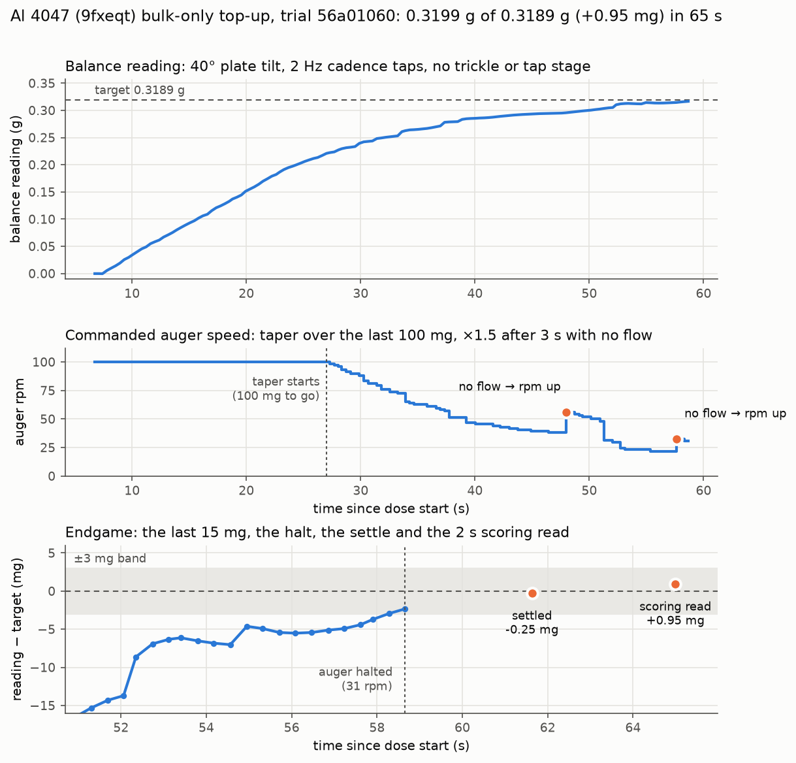

# Al 4047 (9fxeqt) production doses

## 2026-09-30: 8 g of freshly atomized Al 4047, delivered over three trials

@sgbaird requested these doses in PR #166 after loading the powder into the hopper. The
powder has occasional larger chunks, and some of them lodged inside the tube as a clog that was
left in place (operator's call). The clog lets powder feed at the 40° bulk tilt, but nothing
feeds at the 10° trickle and 15° tap tilts of the salt-optimized parameters.

| trial | target | firmware | outcome | Al 4047 into the cup |
|---|---|---|---|---|
| `3e7490c2` | 8 g, salt `bo-005` + 2 taps per tap cycle above 10 mg to go | `trickle_tap/2026-09-30` (`dca08c8`) | `no-result`: a telemetry `MemoryError` at row 257 escaped the dose 100 s into the bulk phase (fixed in `fa59ef8`). The auger stopped, but there was no `RESULT` line. | **3.4905 g** (read 3.4914–3.4922 g net of its tare, −1.3 mg baseline) |
| `de4dd913` | 4.5095 g, same parameters | `fa59ef8` | `cycle-budget` after 803 s. Bulk ran from 0 to 4.173 g in 369 s at 11–17 mg/s (40°, 100 rpm, 2 Hz taps). The 10° trickle stalled within 8 s. At 15°, 240 tap cycles plus 8 nudges added about 14 mg. The Actions run was cancelled mid-dose, but the Zero's executor finished the dose anyway. | **4.1906 g** (read 4.1911–4.1925 g net of its tare at 21:48 UTC, −0.95 mg baseline) |
| `56a01060` | 0.3189 g, **bulk-only** (see below) | `6fc5f79` (`trickle_tap/2026-09-30b`) | **`ok`: 0.31985 g (+0.95 mg) in 65 s**, one pass | **0.3199 g** |
| **total** | 8.0000 g | | | **8.0010 g** (+1.0 mg) |

Each net figure carries about ±1–2 mg. The balance crept +1.1 mg over the six reads taken 13 min
after `de4dd913`, and each dose tares again at its start.

### The bulk-only top-up (trial `56a01060`)

sgbaird asked to keep only the first phase's tilt, speed, and tapping, slowing the rpm near the
target and speeding it back up whenever flow stops. Commit `6fc5f79` adds that as `BULK_ONLY`
(`set bulk_only 1`) in `hardware/test-module/firmware/trickle_tap/`. The whole dose runs in
velocity mode at `BULK_TILT_DEG` with the bulk cadence taps, and there is no trickle or tap stage.
The three control rules:

- **Taper.** The rpm tapers linearly from `BULK_RPM` (100) to `BULK_MIN_RPM` (20) over the last
  `BULK_TAPER_START_G` (100 mg).
- **Boost.** After every `BULK_BOOST_S` (3 s) with less than 2 mg of flow, the rpm is
  multiplied by 1.5, capped at `BULK_RPM`. Flow relaxes it one step.
- **Halt.** The auger halts when the reading plus the trailing-2 s slope × τ_afterflow
  (0.8338 s) reaches the target minus half the tolerance. If the dose then settles more than
  3 mg short, another pass runs (up to 8).

What happened, from the serial log:

| t (s) | event |
|---|---|
| 6.7 | tared (baseline +0.2 mg); auger to 100 rpm at 40° with 2 Hz taps |
| 7–25 | 11.5 mg/s on average at 100 rpm (single polls 8.7–13.6 mg/s) |
| 27 | 100 mg to go: the taper starts |
| 47.6 | no flow for 3 s at 38 rpm, so the rpm goes up to 56 |
| 57.2 | no flow for 3 s at 21 rpm, so the rpm goes up to 32 |
| 58.7 | halted at 31 rpm with 2.3 mg to go (slope 1.65 mg/s) |
| 61.6 | settled at 0.31865 g (−0.25 mg; +2.1 mg afterflow) |
| 65.0 | 2 s scoring read 0.31985 g (+0.95 mg), status `ok` |

Parameters as pushed: `--params` held bulk taps 2 Hz, trim taps off, bulk tilt 40°, bulk
100 rpm, and tolerance 3 mg. The trickle and tap tilts were also set to 40°, so nothing could
have tipped the tube shallower even if `bulk_only` had failed to apply. The frozen snapshot
matched the continuation dose's, plus `bulk_only 1`, `bulk_taper_start_g 0.1`, `bulk_min_rpm 20`,
`bulk_boost_s 3`, `bulk_max_passes 8`, and `dose_timeout_s 600`.

### How it was run

`scripts/opt_dose_capture.py` ran on the Zero in `--mode production`, with campaign id
`production-al4047-9fxeqt` and powder id `al4047-9fxeqt`. It was driven over SSH from the
Actions runner, without `--takeover`: the Pico was at an idle `>>>` prompt after the firmware
upload, so the executor booted `/trickle_tap` itself. Before and after the dose:

- `trickle_controller.py` and `trickle_params.py` at `6fc5f79` were uploaded to `/trickle_tap`
  with `mpremote cp`, and the on-device sha256 was checked against the commit. No other file on
  the Pico was touched; 45 KB of flash was left free.
- After the dose, the Pico was soft-rebooted (Ctrl-D at the friendly REPL) back to its power-on
  `main.py`. It answered `s` the same way as before, with the servo at 0°.
- `~/RIG-NOTICE-20260930-al4047.txt` on the Zero records the session and says the rig is free.

### Files

- `zero/trial_<uuid>.json`: the three `opt_trials` documents (RESULT, per-phase times, stop
  events, params as executed, telemetry). The same documents are in MongoDB `opt_trials`.
- `zero/serial_<uuid>.log`: the raw serial sessions, including every `set` echo. These are
  force-added past the `*.log` ignore, as for the salt campaign.
- `zero/serial_readback_20260930.log`: the scale reads that fixed the cup load between trials.
- `zero/trials.jsonl`: the Zero's spool index, with the home-directory path scrubbed to `~`.
- `dose_trace.png`: made by `python3 data/opt/production-al4047-9fxeqt/plot_dose.py`.

`de4dd913`'s telemetry stopped at row 80 ("heap low, 1248 bytes free" on a 128 kB heap)
because `gc.mem_free()` doesn't count uncollected garbage as free. Since `6fc5f79`, the check
collects before it truncates. The serial log still has every poll of that dose.
