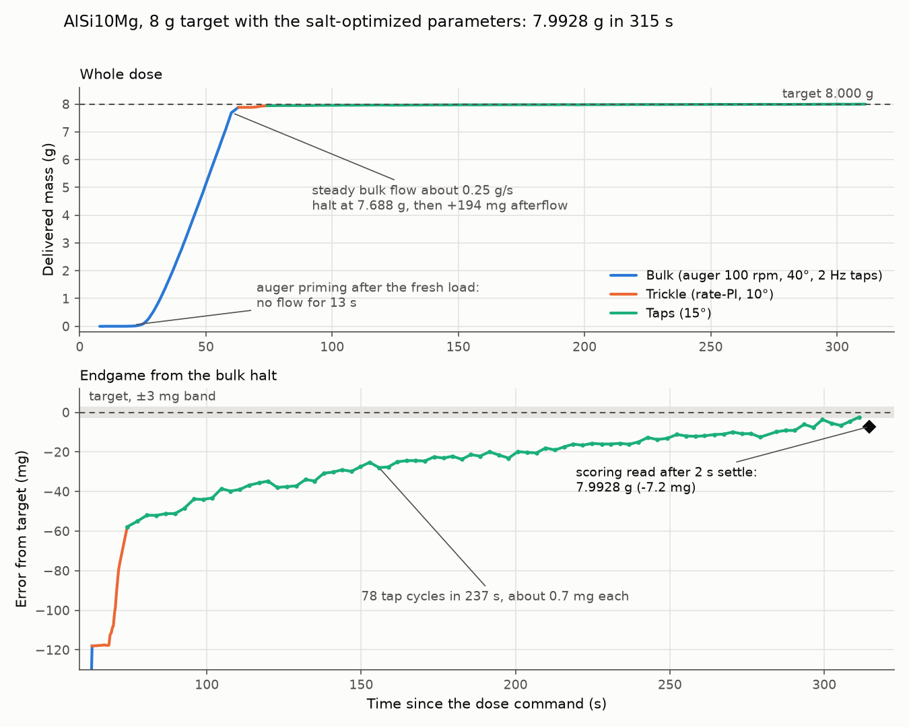

# AlSi10Mg production doses

## 2026-09-29: first AlSi10Mg dose, 8 g target (trial `64714f7c`)

@sgbaird requested this dose in PR #166 after loading AlSi10Mg into the hopper. It used the
parameters recommended by the salt campaign
[`salt-20260929T014732Z`](../salt-20260929T014732Z/report.md), point `bo-005`. Those were tuned
for salt at a 0.5 g target and haven't been validated on this powder.

| | |
|---|---|
| searched parameters | bulk taps 2 Hz, trim taps off, bulk tilt 40°, trickle tilt 10°, tap tilt 15°, bulk 100 rpm, bulk→trim threshold 0.30 g, tolerance 3 mg, τ_afterflow 0.8338 s (salt fit) |
| everything else | the salt campaign's frozen `trickle_params.py` snapshot, with `log_to_flash 0` (the Pico's flash is nearly full) |
| result | **7.9928 g** at the 2 s scoring read (−7.2 mg, −0.09 %), status `ok`, 314.5 s |
| phases | bulk 56.6 s, trickle 11.4 s, taps 237.1 s (78 cycles; 182 taps including the bulk cadence taps; 1 auger nudge) |
| bulk | no flow for the first 13 s while the freshly loaded auger primed, then a steady 0.25 g/s. Halted at 7.688 g (threshold 7.65 g), and afterflow added 194 mg, so the halt margin held. |
| tare | baseline −0.5 mg, drift −82 mg/min in the tare window. It didn't persist: five scale reads 2 min after the dose gave 7.992–7.998 g. |

The tap loop ended on an in-band reading of 7.9976 g. The scoring read 2 s later came in at 7.9928 g,
which is outside the 3 mg band. That's why the status is `ok` while `abs_error_mg` is 7.2.

### How it was run

`opt_campaign.SSHExecutor` ran `scripts/opt_dose_capture.py` on the Zero in `--mode production`,
with campaign id `production-alsi10mg` and powder id `alsi10mg`. The Pico was idle in its
power-on `main.py` (no process on the Zero held the port), so `--takeover` stopped it and booted
`/trickle_tap`. After the dose the Pico was soft-rebooted back to its power-on `main.py`.

### Files

- `zero/trial_<uuid>.json`: the full `opt_trials` document (RESULT, per-phase times,
  stop events, params as executed, 4 Hz telemetry). The same document is in MongoDB `opt_trials`.
- `zero/serial_<uuid>.log`: the raw serial session, including every `set` echo.
- `zero/trials.jsonl`: the Zero's spool index. The home-directory path is scrubbed to `~`.
- `dose_trace.png`: made by `python3 data/opt/production-alsi10mg/plot_dose.py`.
