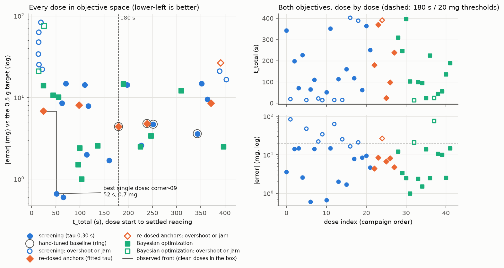

# Campaign salt-20260929T014732Z

- powder `salt`, target 0.5 g, status **finished** (deadline: 0 s left before 2026-09-29T04:05:00Z, the next dose needs about 153 s)
- 42 doses: 22 screen, 6 recenter, 14 bo
- tau_afterflow fit: 0.8338 s (linear model, 26 stop events, rates 0.0221-0.1586 g/s)
- powder in the cup at the end: 21.13 g

## Best observed dose (knee of the observed front)

`corner-09` (screen): t_total 51.8 s, |error| 0.7 mg, a single dose, not yet validated with replicates.

```json
{
 "bulk_tilt_deg": 40.0,
 "trickle_tilt_deg": 30.0,
 "tap_tilt_deg": 15.0,
 "bulk_rpm": 20.0,
 "trickle_start_remaining_g": 0.05,
 "tolerance_g": 0.003,
 "bulk_tap": "2hz",
 "trim_tap": "off"
}
```

## Model Pareto set (Ax, predicted means)

| Ax trial | t_total (s) | abs_error (mg) | taps bulk/trim, bulk tilt, trim tilt, tap tilt, RPM, threshold g, tol mg |
|---|---|---|---|
| 33 | 102.1 | 0.9 | 2hz/off, 40.0, 10.0, 15.0, 100, 0.300, 3.0 |
| 31 | 118.2 | 0.3 | 2hz/off, 40.0, 30.0, 15.0, 100, 0.300, 3.0 |
| 40 | 99.3 | 5.3 | 2hz/2hz, 40.0, 10.0, 15.0, 100, 0.300, 3.0 |
| 38 | 57.3 | 12.1 | 2hz/off, 40.0, 10.0, 15.0, 100, 0.300, 15.0 |
| 39 | 99.0 | 11.1 | off/off, 40.0, 10.0, 15.0, 20, 0.300, 15.0 |

## Screening main effects (16 corners)

8 corners sit at each level of every factor. Time is averaged over the corners that ended `ok` (an overshoot ends in seconds and would look fast); |error| is averaged over all of them.

| Factor | low / high | mean t_total of ok doses, low -> high (s) | mean abs_error, low -> high (mg) | overshoot or jam, low / high |
|---|---|---|---|---|
| Bulk taps | off / 2 Hz | 185.5 (n=6) -> 78.8 (n=3) | 13.4 -> 31.2 | 2 / 5 |
| Trim taps | off / 2 Hz | 136.9 (n=6) -> 175.9 (n=3) | 13.6 -> 31.1 | 2 / 5 |
| Bulk tilt (deg) | 15 / 40 | 184.1 (n=5) -> 107.2 (n=4) | 21.9 -> 22.8 | 3 / 4 |
| Trim tilt (deg) | 10 / 30 | 165.8 (n=5) -> 130.1 (n=4) | 25.8 -> 18.9 | 3 / 4 |
| Tap tilt (deg) | 0 / 15 | 222.6 (n=4) -> 91.8 (n=5) | 26.9 -> 17.8 | 4 / 3 |
| Bulk RPM | 20 / 100 | 120.4 (n=6) -> 208.9 (n=3) | 18.4 -> 26.3 | 2 / 5 |
| Bulk->trim threshold (g) | 0.05 / 0.3 | 129.6 (n=3) -> 160.1 (n=6) | 33.8 -> 10.8 | 5 / 2 |
| Trim tolerance band (g) | 0.003 / 0.015 | 123.7 (n=5) -> 182.6 (n=4) | 15.1 -> 29.5 | 3 / 4 |

## Every dose

| # | label | taps bulk/trim, bulk tilt, trim tilt, tap tilt, RPM, threshold g, tol mg | status | t_total (s) | error (mg) | taps |
|---|---|---|---|---|---|---|
| 0 | baseline-00 | off/off, 30.0, 15.0, 10.0, 55, 0.250, 5.0 | ok | 342.8 | -3.6 | 104 |
| 1 | corner-00 | 2hz/2hz, 40.0, 10.0, 0.0, 20, 0.050, 15.0 | overshoot | 19.3 | +83.2 | 15 |
| 2 | corner-01 | off/off, 40.0, 30.0, 0.0, 20, 0.300, 15.0 | ok | 197.6 | -14.3 | 50 |
| 3 | corner-02 | 2hz/off, 15.0, 10.0, 15.0, 20, 0.300, 15.0 | ok | 70.7 | -14.8 | 23 |
| 4 | corner-03 | off/off, 15.0, 10.0, 0.0, 20, 0.050, 3.0 | ok | 226.7 | -2.6 | 66 |
| 5 | corner-04 | 2hz/off, 15.0, 30.0, 0.0, 100, 0.050, 15.0 | overshoot | 14.7 | +47.6 | 7 |
| 6 | corner-05 | off/2hz, 40.0, 10.0, 15.0, 20, 0.300, 3.0 | ok | 65.5 | -0.6 | 26 |
| 7 | corner-06 | off/2hz, 15.0, 30.0, 15.0, 20, 0.050, 15.0 | ok | 110.2 | -14.3 | 29 |
| 8 | corner-07 | 2hz/2hz, 40.0, 30.0, 15.0, 100, 0.300, 15.0 | overshoot | 22.1 | +22.1 | 10 |
| 9 | corner-08 | off/2hz, 40.0, 30.0, 0.0, 100, 0.050, 3.0 | overshoot | 14.0 | +34.0 | 0 |
| 10 | corner-09 | 2hz/off, 40.0, 30.0, 15.0, 20, 0.050, 3.0 | ok | 51.8 | -0.7 | 25 |
| 11 | corner-10 | off/2hz, 15.0, 10.0, 0.0, 100, 0.300, 15.0 | ok | 352.0 | -14.8 | 114 |
| 12 | corner-11 | 2hz/2hz, 15.0, 10.0, 15.0, 100, 0.050, 3.0 | overshoot | 14.9 | +62.9 | 7 |
| 13 | corner-12 | 2hz/off, 40.0, 10.0, 0.0, 100, 0.300, 3.0 | ok | 113.9 | -2.0 | 31 |
| 14 | corner-13 | off/off, 40.0, 10.0, 15.0, 100, 0.050, 15.0 | overshoot | 15.3 | +25.2 | 0 |
| 15 | corner-14 | off/off, 15.0, 30.0, 15.0, 100, 0.300, 3.0 | ok | 160.7 | -1.7 | 45 |
| 16 | corner-15 | 2hz/2hz, 15.0, 30.0, 0.0, 20, 0.300, 3.0 | cycle-budget | 403.0 | -16.5 | 143 |
| 17 | center-00 | off/off, 27.5, 20.0, 7.5, 60, 0.175, 9.0 | ok | 117.6 | -7.9 | 31 |
| 18 | center-01 | off/off, 27.5, 20.0, 7.5, 60, 0.175, 9.0 | cycle-budget | 389.1 | -21.0 | 120 |
| 19 | center-02 | off/off, 27.5, 20.0, 7.5, 60, 0.175, 9.0 | ok | 62.8 | -8.5 | 13 |
| 20 | center-03 | off/off, 27.5, 20.0, 7.5, 60, 0.175, 9.0 | ok | 363.8 | -9.5 | 109 |
| 21 | baseline-01 | off/off, 30.0, 15.0, 10.0, 55, 0.250, 5.0 | ok | 251.7 | -4.7 | 73 |
| 22 | rebaseline-00 | off/off, 30.0, 15.0, 10.0, 55, 0.250, 5.0 | ok | 179.8 | -4.4 | 50 |
| 23 | recenter-00 | off/off, 27.5, 20.0, 7.5, 60, 0.175, 9.0 | ok | 370.8 | -8.5 | 113 |
| 24 | recenter-01 | off/off, 27.5, 20.0, 7.5, 60, 0.175, 9.0 | cycle-budget | 391.3 | -26.5 | 120 |
| 25 | recenter-02 | off/off, 27.5, 20.0, 7.5, 60, 0.175, 9.0 | ok | 24.0 | -6.8 | 0 |
| 26 | recenter-03 | off/off, 27.5, 20.0, 7.5, 60, 0.175, 9.0 | ok | 98.1 | -8.1 | 24 |
| 27 | rebaseline-01 | off/off, 30.0, 15.0, 10.0, 55, 0.250, 5.0 | ok | 238.6 | -4.8 | 69 |
| 28 | bo-000 | 2hz/2hz, 27.5, 22.5, 6.0, 40, 0.277, 12.5 | ok | 309.3 | -12.1 | 110 |
| 29 | bo-001 | off/off, 16.5, 13.4, 13.7, 73, 0.094, 3.5 | ok | 246.8 | -3.4 | 74 |
| 30 | bo-002 | off/off, 40.0, 30.0, 15.0, 20, 0.050, 3.0 | ok | 397.2 | -2.5 | 120 |
| 31 | bo-003 | 2hz/off, 40.0, 30.0, 15.0, 100, 0.300, 3.0 | ok | 103.5 | -1.0 | 29 |
| 32 | bo-004 | 2hz/off, 40.0, 10.0, 15.0, 100, 0.050, 3.0 | overshoot | 14.2 | +21.1 | 6 |
| 33 | bo-005 | 2hz/off, 40.0, 10.0, 15.0, 100, 0.300, 3.0 | ok | 99.7 | -2.4 | 28 |
| 34 | bo-006 | 2hz/off, 40.0, 10.0, 15.0, 20, 0.300, 3.0 | ok | 96.2 | -1.5 | 28 |
| 35 | bo-007 | 2hz/off, 40.0, 30.0, 15.0, 100, 0.300, 15.0 | ok | 24.6 | +14.0 | 4 |
| 36 | bo-008 | 2hz/off, 40.0, 30.0, 15.0, 100, 0.140, 3.0 | ok | 224.8 | -2.5 | 73 |
| 37 | bo-009 | off/2hz, 40.0, 30.0, 15.0, 100, 0.300, 15.0 | overshoot | 25.3 | +75.6 | 13 |
| 38 | bo-010 | 2hz/off, 40.0, 10.0, 15.0, 100, 0.300, 15.0 | ok | 44.1 | -10.7 | 8 |
| 39 | bo-011 | off/off, 40.0, 10.0, 15.0, 20, 0.300, 15.0 | ok | 55.6 | -10.1 | 7 |
| 40 | bo-012 | 2hz/2hz, 40.0, 10.0, 15.0, 100, 0.300, 3.0 | ok | 136.4 | -2.6 | 56 |
| 41 | bo-013 | off/off, 15.0, 10.0, 15.0, 20, 0.050, 15.0 | ok | 189.9 | -14.7 | 52 |


