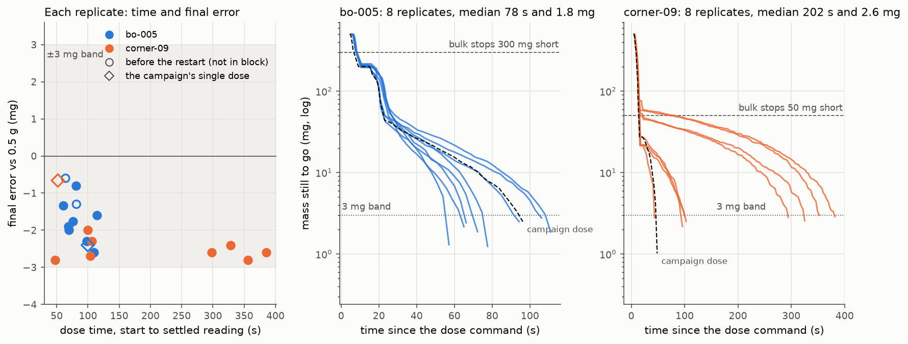

# Validation blocks, 2026-10-06: `bo-005` and `corner-09` on salt

Asked by William on PR #166 (the doser had just been refilled with salt): validate the
recommended point `bo-005` and `corner-09`, the screening corner with the smallest
bulk -> trim threshold (0.05 g), to see how the doser handles a small threshold. Run from
CI as an unattended session (Actions run 37408109875) against the rig, inside campaign
`salt-20260929T014732Z`, so every replicate ran on the campaign's fitted tau (0.8338 s).



*Left: every replicate's dose time against its final error. Middle and right: each
replicate's mass still to go (log scale) against time, from the per-poll telemetry; the
dashed black line is the campaign's single dose at the same values. Regenerate with
`python3 data/opt/salt-20260929T014732Z/plot_validation.py`.*

## Result

| point | values (taps bulk/trim, bulk / trim / tap tilt, rpm, threshold, band) | replicates | median t_total | t_total range | median abs error | errors | profile |
|---|---|---|---|---|---|---|---|
| `bo-005` | 2 Hz / off, 40 / 10 / 15 deg, 100 rpm, 0.30 g, 3 mg | 8 / 8 `ok` | 78.4 s | 60.5 - 114.4 s | 1.83 mg | -0.8 to -2.6 mg | `salt-20260929T014732Z-bo-005-20261006T034908Z` |
| `corner-09` | 2 Hz / off, 40 / 30 / 15 deg, 20 rpm, 0.05 g, 3 mg | 8 / 8 `ok` | 202.0 s | 47.1 - 385.0 s | 2.60 mg | -2.0 to -2.8 mg | `salt-20260929T014732Z-corner-09-20261006T042038Z` |

Both profiles are `validated: true` in MongoDB `dosing_profiles`: no replicate jammed,
stalled, or overshot. Nobody watched for spills (`spills_observed: false`).

**`dose.py` picks the newest validated profile, which is now `corner-09`.** To dose
`bo-005`, name it: `--profile salt-20260929T014732Z-bo-005-20261006T034908Z`.

## What the small threshold does

* **Accuracy holds.** With a 0.05 g threshold the 20 rpm bulk halts 79-98 mg short (its
  halt point is the threshold plus the 0.05 g bulk anticipation, 100 mg to go). The salt
  that falls after the halt (22-69 mg) never brought a dose closer than 21 mg to the
  target. Every replicate ended inside the 3 mg band, 2.0-2.8 mg under, with no overshoot.
* **Speed does not.** The time splits into two groups that follow the afterflow:
  * 55-69 mg fell after the halt: the taps had 22-27 mg left, and the dose took 47-106 s;
  * 22-31 mg fell: the taps had 45-59 mg left, and the dose took 298-385 s.
* **The trim stage adds almost nothing.** It starts so close to the target that it ends
  after 5.4-7.2 s, having added 0-17 mg, so the taps cover whatever the afterflow left.
* **The taps are small.** At `corner-09` each tap moved 0.37-0.85 mg (104-131 taps on the
  slow doses, about 2.7 s per tap); at `bo-005` each moved 1.6-3.6 mg (14-32 taps). Both
  tap at 15 deg. The difference is consistent with the tilt the taps follow: `corner-09`
  trims at 30 deg and drops to 15 deg for the taps, `bo-005` trims at 10 deg and rises to
  15 deg. The hand-tuned baseline (trim 15 deg, taps 10 deg) also tapped about 0.5 mg at a
  time in the campaign.
* **The campaign's 51.8 s `corner-09` dose was one of the fast cases** (58 mg of
  afterflow). Its screening dose ran on tau 0.30 s, and validation runs on the fitted
  0.8338 s; a smaller tau would let the trim stage run a little longer on the slow doses.

## Per dose

`#` is the campaign's trial index. Doses 10 and 33 are the campaign's own doses at these
values. Doses 42 and 43 ran before the restart (below): they count in no block, and they
have no telemetry rows.

| # | label | trial | t_total (s) | error (mg) | bulk / trickle / taps (s) | afterflow after the bulk halt (mg) | to go when taps start (mg) | taps | mg per tap | telemetry rows |
|---|---|---|---|---|---|---|---|---|---|---|
| 10 | corner-09 (campaign, τ 0.3 s) | `f8a14137` | 51.8 | -0.7 | 11.2 / 5.5 / 27.6 | 58 | 27 | 25 | 1.07 | 34 |
| 33 | bo-005 (campaign, τ 0.8338 s) | `d48311a0` | 99.7 | -2.4 | 5.1 / 13.9 / 73.1 | 122 | 44 | 28 | 1.49 | 55 |
| 42 | val-bo-005-00 | `f5d1e487` | 81.6 | -1.3 | 5.7 / 13.1 / 55.2 | 165 | 54 | 20 | 2.65 | 0 |
| 43 | val-bo-005-01 | `69cc8509` | 64.2 | -0.6 | 5.8 / 14.0 / 36.9 | 134 | 35 | 15 | 2.31 | 0 |
| 44 | val-bo-005-00 | `21352011` | 69.8 | -2.0 | 6.6 / 15.1 / 40.1 | 104 | 54 | 17 | 3.03 | 48 |
| 45 | val-bo-005-01 | `ca073c06` | 109.6 | -2.6 | 5.7 / 12.9 / 83.1 | 135 | 49 | 30 | 1.56 | 55 |
| 46 | val-bo-005-02 | `b329caa2` | 114.4 | -1.6 | 6.3 / 14.6 / 85.8 | 102 | 62 | 32 | 1.89 | 61 |
| 47 | val-bo-005-03 | `18637814` | 68.5 | -1.9 | 6.1 / 14.6 / 40.1 | 107 | 51 | 17 | 2.86 | 46 |
| 48 | val-bo-005-04 | `b3332ddd` | 81.0 | -0.8 | 6.2 / 14.9 / 52.0 | 108 | 54 | 21 | 2.54 | 51 |
| 49 | val-bo-005-05 | `29561c29` | 97.6 | -2.3 | 5.9 / 12.8 / 71.0 | 149 | 50 | 26 | 1.83 | 50 |
| 50 | val-bo-005-06 | `07bc9c97` | 60.5 | -1.3 | 6.1 / 15.5 / 30.8 | 117 | 52 | 14 | 3.64 | 46 |
| 51 | val-bo-005-07 | `d08e89fb` | 75.8 | -1.8 | 5.7 / 13.1 / 49.1 | 142 | 43 | 19 | 2.15 | 45 |
| 52 | val-corner-09-00 | `dcfce86a` | 297.6 | -2.6 | 11.8 / 6.0 / 272.2 | 31 | 48 | 104 | 0.44 | 114 |
| 53 | val-corner-09-01 | `337eb4ad` | 47.1 | -2.8 | 11.9 / 5.5 / 22.0 | 62 | 22 | 22 | 0.85 | 32 |
| 54 | val-corner-09-02 | `cc851451` | 99.2 | -2.0 | 12.0 / 5.4 / 73.9 | 55 | 27 | 40 | 0.63 | 49 |
| 55 | val-corner-09-03 | `367d6e3d` | 103.5 | -2.7 | 12.4 / 5.5 / 77.7 | 69 | 22 | 42 | 0.46 | 52 |
| 56 | val-corner-09-04 | `4632d220` | 106.3 | -2.3 | 12.8 / 5.5 / 79.9 | 64 | 22 | 44 | 0.44 | 54 |
| 57 | val-corner-09-05 | `65b2b6d5` | 385.0 | -2.6 | 11.4 / 7.2 / 358.7 | 22 | 59 | 131 | 0.43 | 145 |
| 58 | val-corner-09-06 | `79f3109d` | 328.5 | -2.4 | 12.6 / 5.8 / 302.2 | 26 | 45 | 115 | 0.37 | 127 |
| 59 | val-corner-09-07 | `76243c26` | 355.9 | -2.8 | 12.6 / 5.8 / 329.7 | 30 | 58 | 124 | 0.44 | 135 |

*afterflow* is the salt that fell between the bulk halt and the settled reading (the
`bulk` stop event). *To go when taps start* is the target minus the settled reading after
the trim stage. *mg per tap* divides the mass the tap stage added (to the scored reading)
by its taps.

## How it was run

* **Rig, before:** no process held the Pico's port, no cron jobs or timers touch it, and the
  Pico was in its power-on `main.py`. Every `/trickle_tap` file matched commit `6fc5f79`
  by sha256 (firmware `trickle_tap/2026-09-30b`), except the rig's own `config.py`. The
  Zero's checkout was `6fc5f79` and was not changed. A notice
  (`~/RIG-NOTICE-20261006-salt-validation.txt`) said who had the rig.
* **Commands** (from the runner, as the laptop):

  ```bash
  python -u scripts/opt_campaign.py --powder-id salt --resume salt-20260929T014732Z \
      --host <user>@<zero-hostname> --takeover --unattended --stop-at 2026-10-06T05:40:00Z \
      --log-max-rows 1200 --validate-point bo-005 --replicates 8 --operator claude-unattended
  # then the same with --validate-point corner-09
  ```
* **The restart.** The campaign's frozen snapshot carries `log_max_rows 2400` from before
  the 2026-09-30 firmware. That firmware allocates 1200 telemetry rows at boot and could
  not re-size the buffer to 2400, so doses 42 and 43 printed `no room for 2400 telemetry
  rows; logging off for this dose`. Their doses ran normally (`ok`, 81.6 s / -1.3 mg and
  64.2 s / -0.6 mg) and their raw serial logs are complete. The loop was stopped,
  `--log-max-rows 1200` added (commit `cc74831`), the Pico returned to an idle prompt with
  `mpremote exec`, and the `bo-005` block started again from replicate 0 with a freshly
  booted runner. Every block replicate has its telemetry.
* **Rig, after:** the scale read 0.4972-0.4973 g five times after the last dose (its
  scored reading was 0.4972 g). The Pico was soft-rebooted back to its power-on `main.py`
  (servo at 0 deg; `serial_readback_20261006.log`). The cup took 8.96 g of salt over these
  18 doses.

## Files

* `campaign_records.jsonl`, `campaign.json`: the 18 new dose records and both blocks
  (`profiles`); `report.md` has the *Validation blocks* table.
* `zero/trial_<uuid>.json`, `zero/serial_<uuid>.log`: each dose's trial document (RESULT,
  stop events, parameters as executed, telemetry) and raw serial session, as spooled on the
  Zero (also in MongoDB `opt_trials`). The rig's login and host name are scrubbed from paths.
* `../../profiles/salt.json`: the local cache of the last profile written (`corner-09`).
* `plot_validation.py` -> `validation_20261006.png`.
