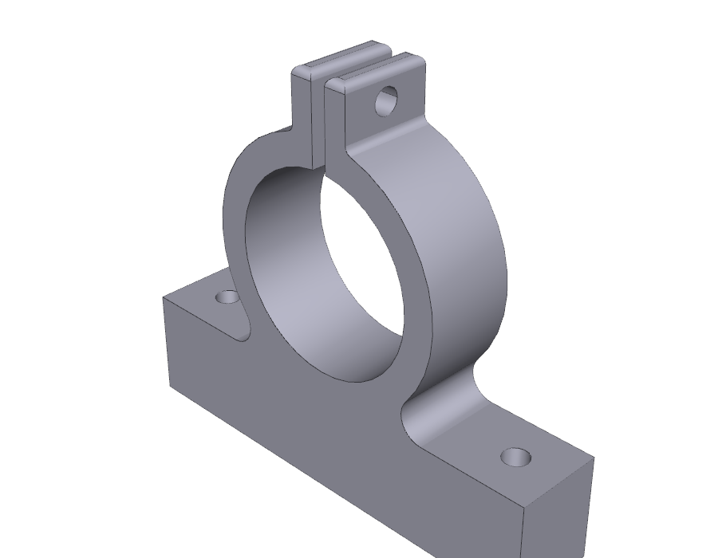
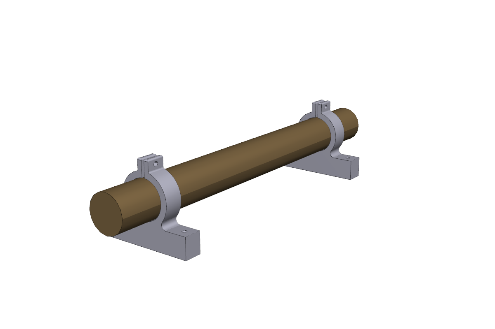

# Auger Bracket (split shaft-collar)

Parametric CAD for the auger support bracket requested in the issue
[*Part-by-part Powder Doser Approach*][issue]: a split shaft-collar style
bracket on a rectangular mounting flange that holds the powder doser's
auger so it can spin freely while still being constrained.



Two of these brackets are needed (one near each end of the auger), as
called out on the original drawing ("Brackets x2").

## How it works

```
        clamp screw (M3) tightens the two top tabs
                       │
                       ▼
                 ┌──┐ 2 mm gap ┌──┐
                 │  │◀────────▶│  │
                 │  │          │  │
              ───┴──┴──────────┴──┴───
            ╱                          ╲
           │     auger bore Ø 25.5      │  ← split collar
            ╲                          ╱      (closes on the shaft when
              ───────╲          ╱──────         the screw is tightened)
                      ╲ fillet ╱
        ───────────────╳──────╳───────────────  ← rectangular mounting plate
        │   ⊙ M3                       M3 ⊙ │      (print-on-this-face down)
        └─────────────────────────────────────┘
```

* The **bore** (Ø 25.5 mm) is sized for the 25 mm OD Archimedes auger from
  PR #16 with a 0.5 mm diametral clearance — a free-running fit that lets
  the auger spin freely while the bracket still constrains it radially.
  The clearance also accounts for the typical FDM elephant-foot squish on
  the bore wall.
* A **2 mm slot** runs from the very top of the part down through the
  collar wall and into the bore. This is what splits the upper half of
  the collar into two ears so a single M3 clamp screw passing through
  both ears can pinch them onto the shaft.
* The **collar/plate intersection is filleted** (3 mm radius on each
  side) per the "smooth transition" callout — this turns what would be a
  sharp stress-concentrating notch into a smooth tangent blend.
* The **plate** has four through-holes for M3 screws (one near each of
  the four corners) for fastening the bracket to the chassis. Print
  bed-down on the plate face so the bore is built parallel to the bed
  and needs no internal supports.



## Files

| File | What it is |
| --- | --- |
| [`cad_model.py`](cad_model.py) | Parametric CadQuery model. Run it to (re)generate the STEP and STL. |
| [`auger_bracket.step`](auger_bracket.step) | STEP export (parametric, for editing in any CAD package). |
| [`stl/auger_bracket.stl`](stl/auger_bracket.stl) | **Ready-to-print STL.** Print twice. |
| [`render_views.py`](render_views.py) | Headless VTK render of iso/front/top/side views. |
| [`render_assembly.py`](render_assembly.py) | Headless VTK render of the two-bracket + auger assembly diagram. |
| [`renders/`](renders/) | PNG renders committed for the PR/README. |

## Key parameters (mm)

All parameters live at the top of [`cad_model.py`](cad_model.py) so they
are easy to retune after the first print test.

| Parameter | Value | Notes |
| --- | --- | --- |
| `AUGER_OD` | 25.0 | Auger shaft OD — matches PR #16 (Archimedes auger, `outer_diameter = 25 mm`). |
| `BORE_CLEARANCE` | 0.5 | Diametral clearance — free-running fit on FDM. |
| `COLLAR_WALL` | 4.0 | Wall thickness around the bore (collar OD = 33.5 mm). |
| `PLATE_LENGTH × DEPTH × THICKNESS` | 60 × 12 × **14** | Plate footprint sized so the 33.5 mm collar OD fits with comfortable margin to each corner mounting hole. **Thickness = 14 mm (was 4 mm)** so the bore axis sits at Z = 29.25 mm above the bottom face — gives 4.25 mm of radial clearance between the [PR #49](https://github.com/vertical-cloud-lab/powder-doser/pull/49) geared auger's Ø50 mm gear OD and the chassis baseplate. |
| `TOP_GAP` | 2.0 | Drawing callout — clamp slot width. |
| `TOP_TAB_W × H` | 3 × 7 | Each clamp ear. Slim along the screw axis (X) so the M3 tightening screw is short and goes through less material; tall enough in Z that the centred Ø3.4 hole has ~1.8 mm of wall above and below it. |
| `TAB_COLLAR_OVERLAP` | 6.0 | How far the ears sink into the collar wall so they grow out of it continuously instead of sitting on top. |
| `CLAMP_SCREW_D` / `MOUNT_HOLE_D` | 3.4 | M3 clearance through-holes. |
| `FILLET_COLLAR_PLATE` | 3.0 | "Smooth transition" between collar and plate. |
| `FILLET_TAB_COLLAR` | 1.0 | Smooth transition between clamp ears and collar OD. |

## Print orientation

Plate face down on the bed — the face called out on the drawing as *"print
on this face"*. With this orientation the bore axis is parallel to the
bed, the clamp slot is vertical, and no support material is needed inside
the bore.

## Regenerating outputs

```sh
cd design/cad/auger-bracket
python cad_model.py                  # writes auger_bracket.step + stl/auger_bracket.stl
xvfb-run -a python render_views.py   # iso/front/top/side PNGs in renders/
xvfb-run -a python render_assembly.py  # two-bracket assembly diagram
```

The renders use VTK off-screen, which requires a display — `xvfb-run -a`
provides a virtual one in headless environments (per the convention noted
in [`cad/meta-tools/render_step.py`](../../../cad/meta-tools/render_step.py)
in earlier work, if/when that tool returns to the repo).

[issue]: https://github.com/vertical-cloud-lab/powder-doser/issues
