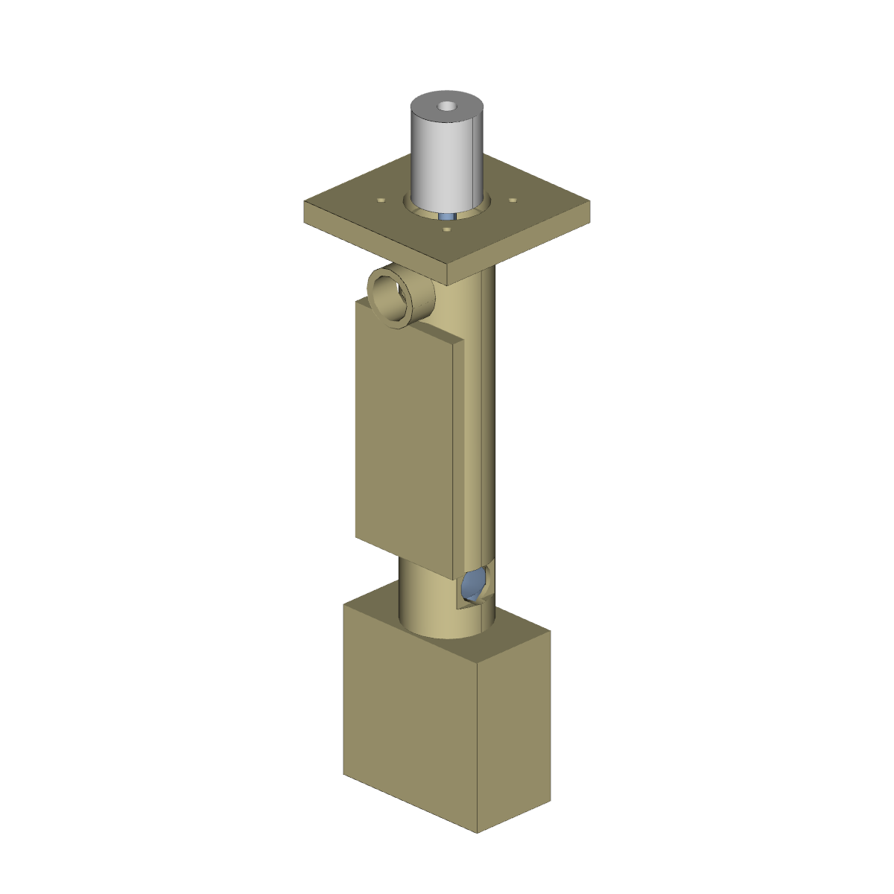
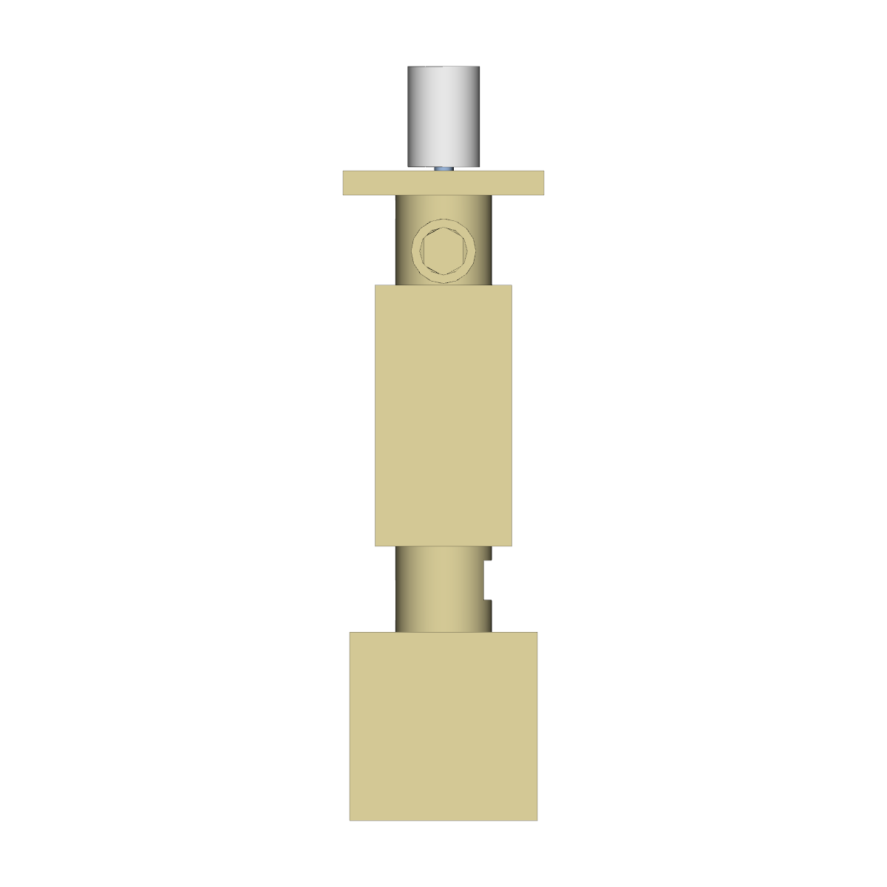
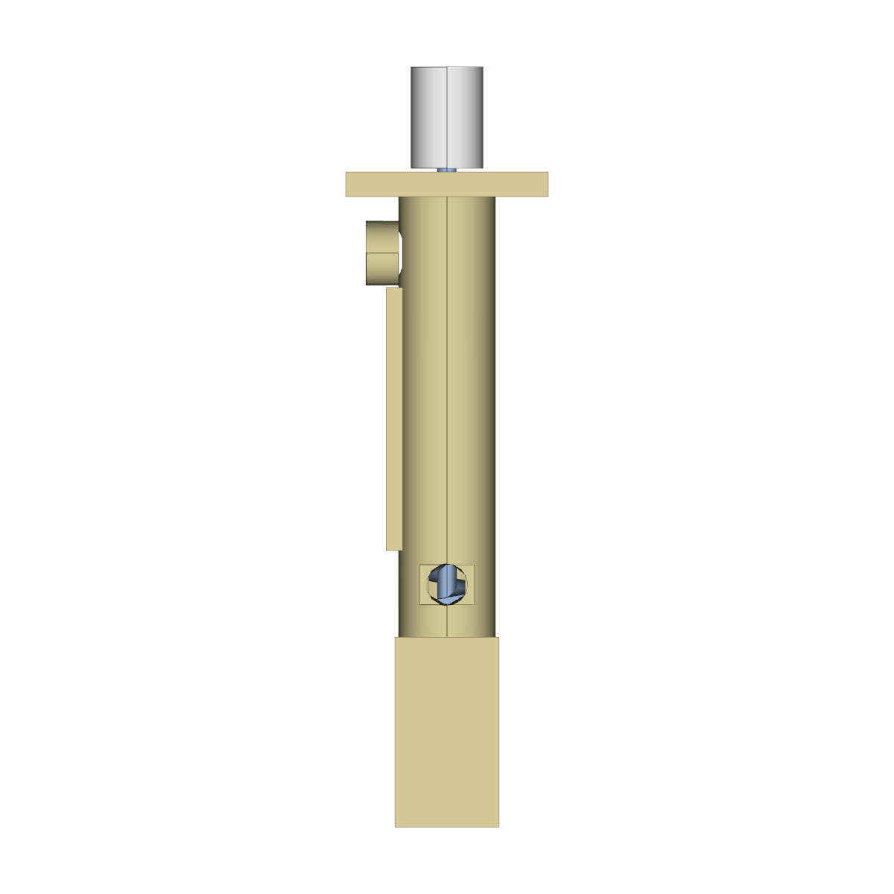
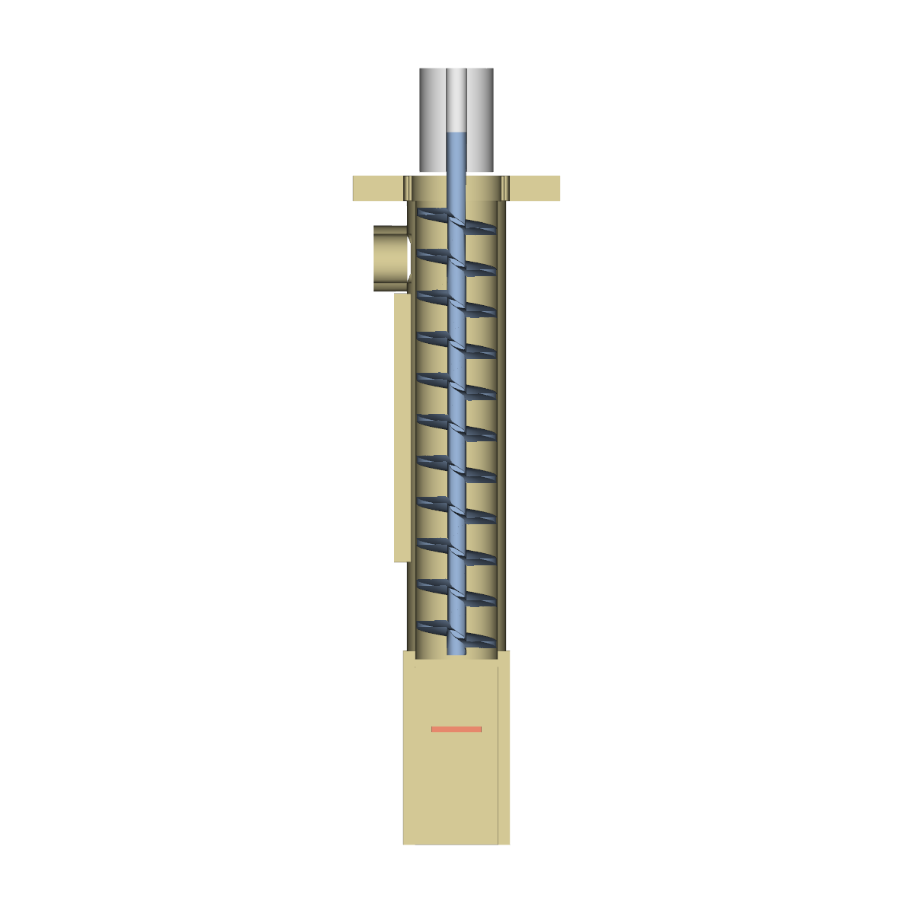

# Full powder-dosing system — direct-drive variant

Parametric CadQuery design for the full single-channel powder doser
called for in PR #5 review comment
[4463659493](https://github.com/vertical-cloud-lab/powder-doser/pull/5#issuecomment-4463659493)
(issue #16). Direct-drive stepper at the top of the auger tube, embedded
ERM disc + solenoid tap near the dispense end, a small servo-driven
deflector blade for fixed-point dispensing, and a mounting boss for the
Raspberry Pi Zero 2 W stack.

This design is deliberately built two ways for cross-checking — a
hand-authored CadQuery model **and** a Zoo (ML-ephant) text-to-CAD job
fired off with the same parameters from
[`cad/meta-tools/zoo_full_system_probe.py`](../../../cad/meta-tools/zoo_full_system_probe.py).
See "Zoo cross-check" below.

## Renders

| View | Image |
|------|-------|
| Iso  |  |
| Front |  |
| Top  |  |
| Side |  |
| **Cross-section** (clipped at +X) |  |

The cross-section is the most useful view: it shows the helical auger
flight inside the bore, the side hopper neck, the Pi mounting boss on
the back face, and the servo yoke at the bottom.

## Layout

```
                 ┌─────┐    ← ST-FC01 5×5 flexible coupler stub (envelope)
                 │     │
            ┌────┴─────┴────┐    ← top flange, 50×50×6, 4× M3 on 23 mm
            │  flange       │      pattern + 22 mm pilot for NEMA 11 boss
            └──┬─────────┬──┘
               │  ↓ shaft │
               │  ┌─────┐ │
               │  │auger│ │     ← Ø24 OD / Ø20 bore tube, ~110 mm long
               │  │     │ │       Archimedes flight, 10 mm pitch
   hopper ────►│  │     │ │
   neck Ø12    │  │     │ │
               │  │     │ │       ← Pi Zero 2 W mounting boss on -Y face
               │  │     │ │         (4× M2.5 on 58×23 grid)
               │  │     │ │
   ERM disc ──►(  │     │ )◄── solenoid tap pocket
   pocket +X   │  │     │ │      pocket -X (~9.6×19×22)
   (Ø12×4)     │  └─────┘ │
               │   exit Ø4│
               └────┬─────┘
                    │
              ┌─────┴─────┐
              │ servo yoke│        ← captures HD-1810MG-class servo
              │  ░░░░░░░  │          (40.7 × 19.7 × 42.9 mm)
              └───────────┘
                    │
                ─── deflector ───   ← 20×12×1.2 blade on the servo horn
```

## Adjustable parameters

Every value the comment asked to make adjustable is exposed as a field
on the `Params` dataclass in [`cad_model.py`](cad_model.py):

| Comment term | `Params` field | Default |
|---|---|---|
| diameter of auger tube | `tube_outside_diameter` | 24 mm |
| thickness of the auger "stairs" | `auger_flight_thickness` | 1.6 mm |
| steepness of the auger stairs (turns derived) | `auger_pitch` | 10 mm/turn |
| length of the auger tube | `tube_length` | 110 mm |
| diameter of the ERM disc | `erm_diameter` | 10 mm |
| thickness of the ERM disc | `erm_thickness` | 2.7 mm |
| stepper motor length / width / height | `stepper_length` / `stepper_width` / `stepper_height` | 28 / 28 / 45 mm (NEMA 11) |

To change any of them, edit the defaults in `Params` (or pass a custom
instance to `build()`) and re-run `python cad_model.py`.

## Vendor-part cross-reference

Dimensions for every COTS part are sourced from
`hardware/vendor-files/` on the
`copilot/identify-vibration-motor-solenoid-parts` branch (PR #25). The
table below records the exact vendor file each pocket / mount was sized
against:

| Part | Vendor file | Embed strategy |
|---|---|---|
| **NEMA 11 stepper** (StepperOnline 11HS18-0674S, 28×28×45 mm, 5 mm shaft) | [`hardware/vendor-files/stepperonline-11hs18-0674s/SPECS.md`](https://github.com/vertical-cloud-lab/powder-doser/blob/copilot/identify-vibration-motor-solenoid-parts/hardware/vendor-files/stepperonline-11hs18-0674s/SPECS.md) + `cad/11HS18-0674S.STEP` | bolt-on at the top flange (4× M2.5 on a 23 mm pattern, 22 mm pilot) — **not** embedded in the print |
| **ST-FC01 coupler** (5 mm ↔ 5 mm, Ø18 × 25 mm aluminium) | [`hardware/vendor-files/stepperonline-st-fc01-coupler/SPECS.md`](https://github.com/vertical-cloud-lab/powder-doser/blob/copilot/identify-vibration-motor-solenoid-parts/hardware/vendor-files/stepperonline-st-fc01-coupler/SPECS.md) | drawn as an Ø18 × 25 envelope above the flange so the assembly preview shows the direct drive (no gears, no belt) |
| **ERM disc** (Adafruit #1201, 10 × 2.7 mm, 3 V) | `hardware/vendor-files/README.md` (commodity, no published CAD) | **embedded — pause-and-epoxy.** Cylindrical pocket Ø10.4 × 3.1 deep on the +X face, 14 mm above the dispense exit. Wires exit through a Ø4 channel routed straight up to the flange underside. |
| **JF-0530B solenoid** (Adafruit #412, ~9.6 × 19 × 22 mm, 4.5 mm stroke) | [`hardware/vendor-files/adafruit-412-jf-0530b-solenoid/`](https://github.com/vertical-cloud-lab/powder-doser/tree/copilot/identify-vibration-motor-solenoid-parts/hardware/vendor-files/adafruit-412-jf-0530b-solenoid) (datasheets only) | **embedded — pause-and-drop.** Rectangular pocket 19.3 × 22.3 × 9.6 deep on the -X face, 14 mm above the dispense exit, oriented so the plunger taps the tube wall radially. Wires exit through a Ø4 channel routed straight up. |
| **HD-1810MG metal-gear servo** (Adafruit #1142, 40.7 × 19.7 × 42.9 mm) | [`hardware/vendor-files/adafruit-1142-metal-gear-servo/SPECS.md`](https://github.com/vertical-cloud-lab/powder-doser/blob/copilot/identify-vibration-motor-solenoid-parts/hardware/vendor-files/adafruit-1142-metal-gear-servo/SPECS.md) | yoke cradle hollowed under the dispense exit; the servo bolts in via the standard mounting flanges (no print pause needed). |
| **Raspberry Pi Zero 2 W** (65 × 30 mm, 58 × 23 mm hole grid, M2.5) | [`hardware/vendor-files/manual-downloads/RP-008358-DS-1-raspberry-pi-zero-2-w-mechanical-drawing.pdf`](https://github.com/vertical-cloud-lab/powder-doser/blob/copilot/identify-vibration-motor-solenoid-parts/hardware/vendor-files/manual-downloads/RP-008358-DS-1-raspberry-pi-zero-2-w-mechanical-drawing.pdf) | mounting boss on the -Y face, 4× M2.5 through-holes on the official 58 × 23 mm grid. Mounted via standoffs after the print finishes — **not** embedded. |
| **Perma-Proto Bonnet** (66 × 57 × 2 mm) | [`hardware/vendor-files/adafruit-2310-perma-proto-bonnet/SPECS.md`](https://github.com/vertical-cloud-lab/powder-doser/blob/copilot/identify-vibration-motor-solenoid-parts/hardware/vendor-files/adafruit-2310-perma-proto-bonnet/SPECS.md) | piggybacks on the Pi mount via the same M2.5 standoffs (Bonnet PCB outline matches the Pi's 65 × 30 footprint extended over the 2×20 header). |

## Pause-and-embed print plan

The two pockets that need the print to pause for component insertion
(the ERM and the solenoid) are both **opened on the +X / -X faces** of
the housing, perpendicular to the build direction (Z). With the part
oriented Z-up on the build plate:

1. Slice the housing STL.
2. Insert a pause command **at the Z height of the embed band** (the
   centre is `embed_band_centre_above_exit = 14 mm` above the dispense
   exit; the pause should fire after the *top* of each pocket has been
   printed so the lid layer can resume on top of the inserted part).
3. At the pause:
   * Drop the JF-0530B into the -X pocket; tack with a dab of cyano
     before resuming so it doesn't shift when the nozzle returns.
   * Epoxy the ERM disc into the +X pocket (the pocket is sized for a
     0.2 mm radial clearance).
   * Route both pairs of wires up through the corresponding Ø4 channels
     so they exit at the underside of the top flange.
4. Resume the print; the next ~20 mm of housing wall encapsulates the
   parts.

The servo yoke and Pi boss don't need a pause — both are bolted on
afterwards through their respective hole patterns.

## Files

* [`cad_model.py`](cad_model.py) — the parametric CadQuery model
  (`Params`, `make_housing`, `make_auger`, `make_coupler_stub`,
  `make_deflector`, `build`, `export`).
* [`render_views.py`](render_views.py) — VTK offscreen renderer for
  iso / front / top / side + an X-clipped cross-section.
* [`full_system.step`](full_system.step) — full-system BREP (CadQuery
  assembly).
* [`full_system.stl`](full_system.stl) — full-system mesh.
* [`stl/`](stl/) — per-part STLs ready for the slicer:
  `housing.stl`, `auger.stl`, `coupler_stub.stl`, `deflector.stl`.

## Reproducing

```bash
pip install cadquery
python design/cad/full-system-direct-drive/cad_model.py
xvfb-run -a python design/cad/full-system-direct-drive/render_views.py
```

(`xvfb-run` because VTK requires a `DISPLAY`; on a workstation with a
GPU you can drop it.)

## Zoo cross-check

In parallel with this hand-authored model, the same prompt was sent to
Zoo's ML-ephant text-to-CAD endpoint as the second half of comment
4463659493:

* probe script: [`cad/meta-tools/zoo_full_system_probe.py`](../../../cad/meta-tools/zoo_full_system_probe.py)
* job id: `38df38c1-05f1-413a-a2b7-079363d13214` (recorded in
  [`cad/meta-tools/zoo-output/full-system/job-id.txt`](../../../cad/meta-tools/zoo-output/full-system/job-id.txt))
* outputs (when the job completes): `full_system_*.step` + `full_system.kcl`
  + `full_system.job.json` under
  [`cad/meta-tools/zoo-output/full-system/`](../../../cad/meta-tools/zoo-output/full-system/)

To re-poll without re-spending credits:

```bash
python cad/meta-tools/zoo_full_system_probe.py poll
```

The single-part Zoo auger (job `87e812e2-…`) used $6.89 / 14 min on
ML-ephant for a much simpler prompt; this multi-part job is expected
to take longer and the result will be a single STEP that approximates
the housing — almost certainly with looser tolerances on the embed
pockets than the hand-authored model. Comparing the two side-by-side
is the point of the exercise (it's the same Judge-style cross-check
called out in the CADSmith reference from #29).
