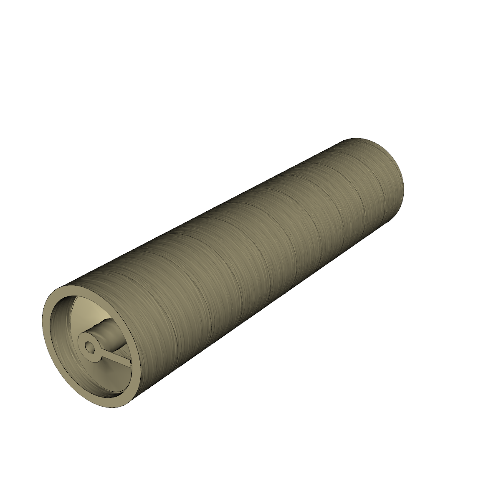
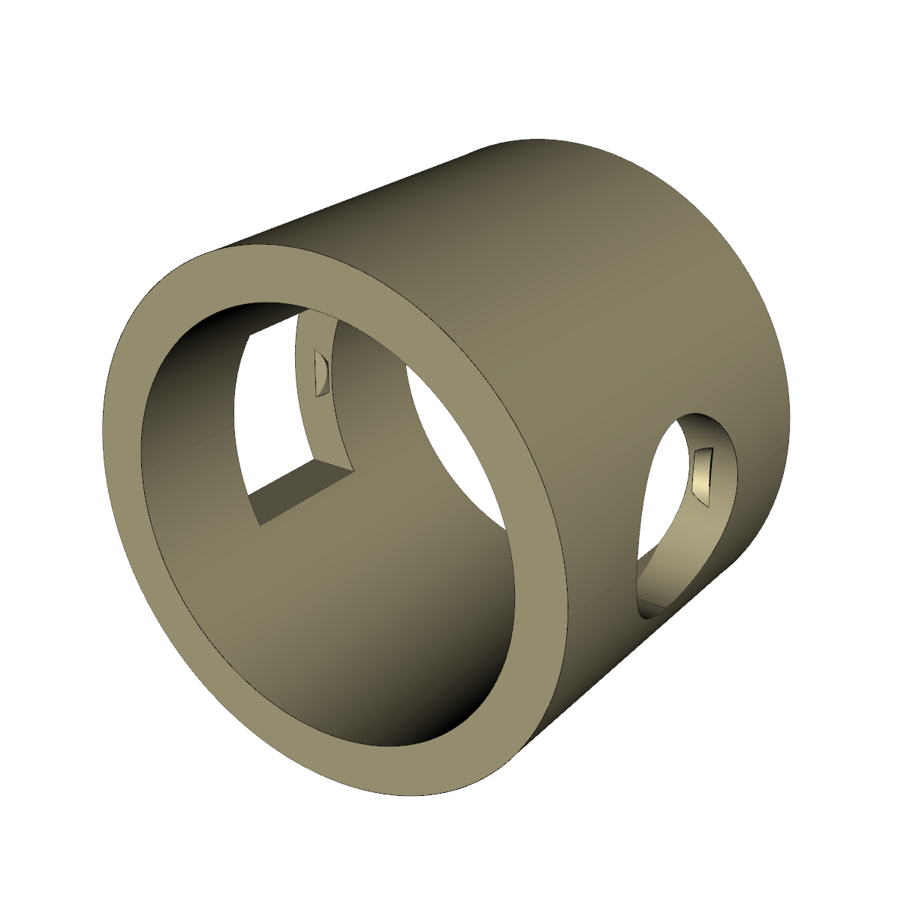
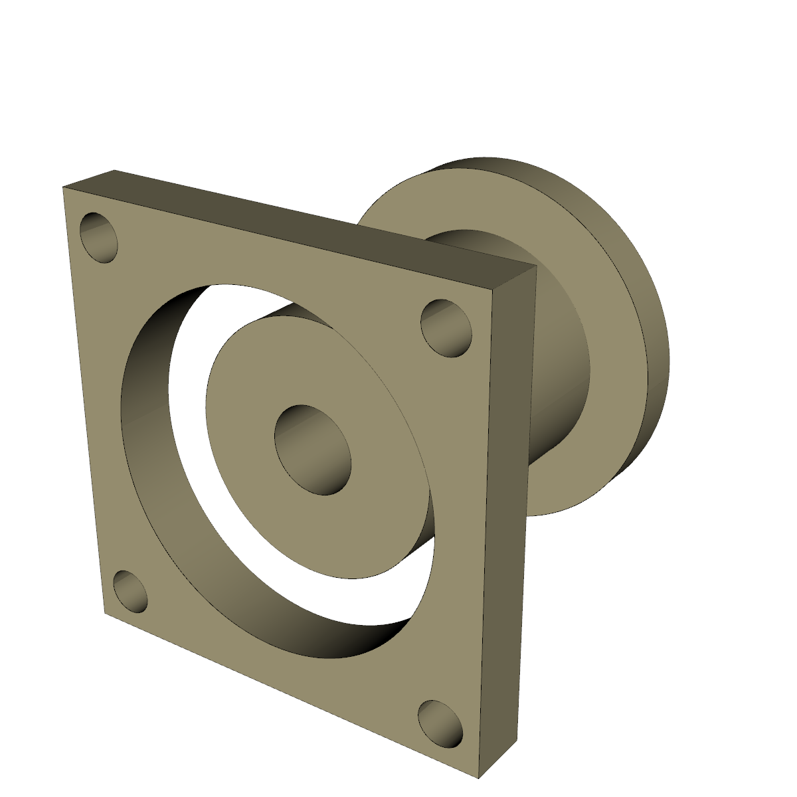
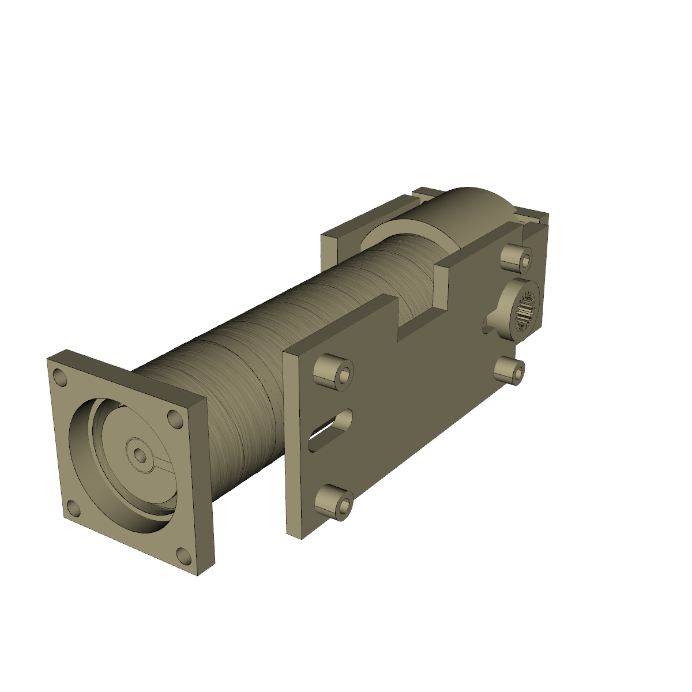

# Full-system modular CAD (multi-part Zoo workflow)

> Companion to PR #5 review comment 4464317865 — "*treating parts
> distinctly and then joining together later, running multiple queries
> and iterations, either consecutively or in small, parallel batches
> (max 5)*". The single-shot full-system probe in PR #5 commit `c48a9d0`
> exhibited two failure modes: (a) the auger had a long axial slab cut
> out of it (a "rendering cheat" so the internals were visible) and
> (b) ML-ephant added a side hopper despite the spec ("the internal
> volume of the auger itself is sufficient"). Decomposing the system
> into per-part prompts with explicit *negative* constraints ("do NOT
> cut a slab", "do NOT add a hopper") and grafting the results together
> with CadQuery defeats both failure modes.

## Layout

```
design/cad/full-system-modular/
├── ground_truth_auger.py     # Phase 0 — hand-authored canonical auger
├── ground_truth_auger.step   # 1 fused solid, 24×24×100 mm, no hopper
├── ground_truth_auger.stl
├── assemble.py               # Phase 3 — CadQuery merge of all 5 parts
├── full_system_assembly.step # composite STEP (5 components, colour-coded)
├── full_system_assembly.gltf
└── renders/
    ├── ground_truth_auger.png
    └── full_system_assembly.png
```

The Zoo per-part outputs (KCL + STEP + per-part PNGs) live under
[`cad/meta-tools/zoo-output/multi-part/`](../../../cad/meta-tools/zoo-output/multi-part/)
so the design directory stays free of vendor / generator-specific scaffolding.

## Phase 0 — ground-truth canonical auger

`ground_truth_auger.py` builds the *single* shape every Phase 1
`auger_solid` Zoo job is graded against in the Judge loop:

| field | value |
| --- | --- |
| outer tube OD | 24.0 mm |
| tube wall | 2.0 mm |
| total height | 100.0 mm |
| flight outer radius | 10.0 mm (= tube ID/2 — direct fuse to wall) |
| central shaft Ø | 6.0 mm |
| pitch | 10.0 mm/turn (10 turns over 100 mm) |
| flight thickness | 1.6 mm |
| top tap drill | M3 (Ø2.5 × 6 mm) on axis |
| bottom exit | Ø2.5 mm through-hole on axis |
| solids in result | **1** (single fused body) |
| no hopper | ✓ |
| no axial slab | ✓ |

Reproduce:

```bash
pip install cadquery
python design/cad/full-system-modular/ground_truth_auger.py
```

Two CadQuery gotchas that bit the v1 of this script and are documented
here so they don't bite future contributors (cross-references to the
[`cadquery boolean fuse`](../../../cad/meta-tools/zoo-output/) memo and
the [`cadquery helix sweep`](../../full-system-direct-drive/cad_model.py)
memo):

1. `rect().sweep(helix_path)` collapses the rectangle onto the central
   axis unless you `.center(helix_radius, 0)` first — the resulting
   "flight" otherwise has bbox `±thickness/2` instead of `±helix_radius`.
2. After fusing the helical flight into the tube, the top face is no
   longer planar (the terminal turn introduces a curved seam), so
   `body.faces(">Z").workplane()` raises `ValueError: If multiple
   objects selected, they all must be planar faces`. Cut tap-drill /
   exit holes with explicit cylinder tools instead.

## Phase 1 — five narrow per-part Zoo jobs in one batch

`cad/meta-tools/zoo_multi_part_probe.py` submits five independent
`POST /ai/text-to-cad/step` jobs, persists every job-id to
`zoo-output/multi-part/<part>/job-id.txt` *before any polling* (so a
session-restart can resume without re-spending evaluate minutes), then
polls them concurrently with a thread pool and writes KCL + job
metadata back to the same per-part directory. The five parts are tiny
prompts (≤6 sentences, all dimensions explicit, all "do NOT…"
exclusions explicit) — the full prompts live at
`zoo-output/multi-part/<part>/prompt.txt`.

| part | job id | KCL | STEP | bbox (mm) | solids | render |
| --- | --- | --- | --- | --- | --- | --- |
| `auger_solid` | `16b3ab1a-…` | 5347 chars | 1006 KB | 24 × 24 × 100 | **4** ⚠ | [PNG](../../../cad/meta-tools/zoo-output/multi-part/renders/auger_solid.png) |
| `stepper_mount_collar` | `380d1b71-…` | 6549 chars | 43 KB | 28 × 28 × 25 | **2** ⚠ | [PNG](../../../cad/meta-tools/zoo-output/multi-part/renders/stepper_mount_collar.png) |
| `embed_pocket_sleeve` | `af338f92-…` | 8402 chars | 167 KB | **54** × 30 × 24 ⚠ | 3 | [PNG](../../../cad/meta-tools/zoo-output/multi-part/renders/embed_pocket_sleeve.png) |
| `servo_yoke` | `c847e1fb-…` | 9951 chars | 241 KB | 39 × 24 × 34 | 1 ✓ | [PNG](../../../cad/meta-tools/zoo-output/multi-part/renders/servo_yoke.png) |
| `pi_mount_bracket` | `184b9296-…` | 12646 chars | 59 KB | 70 × 32 × 7 | 1 ✓ | [PNG](../../../cad/meta-tools/zoo-output/multi-part/renders/pi_mount_bracket.png) |

⚠ marks Phase-1 defects flagged for Phase 2 iteration:

* `auger_solid` returned 4 disjoint solids instead of one fused body.
* `stepper_mount_collar` returned 2 solids (plate + sleeve not fused).
* `embed_pocket_sleeve` returned a 54 mm X-extent vs the prompted 30 mm
  OD because it modelled the wire-exit channels as protruding solid
  tubes outside the sleeve instead of cutting them into the wall.

### API regression: the `outputs` blob is now null

The `POST /ai/text-to-cad/{format}` and `GET /user/text-to-cad/{id}`
endpoints used to return base64-encoded STEP/GLTF blobs in an
`outputs` field on the completed job — see
`cad/meta-tools/zoo-output/auger_mlephant.job.json` from the May 12
run. As of May 15 every completed job comes back with `outputs: null`
and only the KCL `code` populated, verified against
`get_text_to_cad_part_for_user` via both the official `kittycad` Python
lib and a raw `urllib` `GET`.

The work-around is `cad/meta-tools/kcl_to_step.py`, a tiny wrapper
around the
[`zoo` CLI](https://github.com/KittyCAD/cli/releases)'s
`kcl export --output-format=step` subcommand, which uploads the KCL
source to the Zoo design API and writes back a real BREP. All four
non-trivial Phase-1 STEP files in the table above were produced this
way (`zoo` v0.2.171). A binary release for Linux x86_64 lives at
[`KittyCAD/cli` releases](https://github.com/KittyCAD/cli/releases).

## Phase 2 — iteration on the three defective parts

`cad/meta-tools/zoo_iteration_phase2.py` sends a delta prompt to
`POST /ml/text-to-cad/iteration` for each defective part, using the
Phase-1 KCL as `original_source_code` and a whole-file source range
(1-based line/column — line 0 returns 400, see the `zoo iteration api`
repo memo). The delta prompts are intentionally surgical: "fuse plate
+ sleeve + flange via union", "replace the protruding wire tubes with
cut Ø4 mm holes", etc.

| part | iteration id | result | delta |
| --- | --- | --- | --- |
| `auger_solid` | `6ce8d143-f510-47e0-9e9a-4df404e0c56c` | completed → **1 solid, 24×24×100 mm** ✓ (down from 4 solids in Phase 1) | union the 4 disjoint solids into one watertight body |
| `stepper_mount_collar` | `4c8eb83a-f3f7-4d79-a508-3dfb5df9b5cf` | completed → still 2 solids ⚠ (iteration did not honor the fuse-via-union delta; documented limitation) | fuse plate + sleeve + flange into one solid |
| `embed_pocket_sleeve` | `db0122d6-dd33-4961-a527-3e834d785726` | completed → **1 solid, 30×30×24 mm** ✓ (down from 3 solids / 54 mm X-extent) | cut the wire-exit channels into the sleeve wall (no protrusions) |

Two of the three iterations (`auger_solid`, `embed_pocket_sleeve`) were
still `in_progress` at the previous session's handoff and were polled
to completion in a follow-up session; both resolved cleanly to single
fused solids with sensible bboxes. `stepper_mount_collar` remains a
2-solid composite — iteration runs that ask the LLM to fuse separately
extruded bodies via a closing `union` reliably produce a delta with the
right *intent* but the wrong *placement* (see the rendered PNG); the
assembly merge in Phase 3 handles this transparently since CadQuery's
`Assembly` accepts multi-body STEPs.

The iteration responses (KCL only, per the same regression — the
[`zoo iteration api`](#) memo notes the iteration endpoint never
returned a STEP blob even before the regression) land at
`zoo-output/multi-part-iter/<part>/<part>.kcl` and are converted to
STEP via the same `kcl_to_step.py` wrapper.

`servo_yoke` and `pi_mount_bracket` are not iterated — both came back
from Phase 1 with one solid and a sensible bbox.

## Phase 3 — CadQuery assembly merge

`assemble.py` loads each Zoo-returned STEP (or the ground-truth
fallback for the auger if the iteration is still pending), wraps it in
a `cq.Assembly` at an explicit `cq.Location`, and exports the
composite as a colour-coded `full_system_assembly.step` +
`full_system_assembly.gltf`. The locations follow the design intent
spelled out in the comment thread: stepper collar above the auger,
embed sleeve slipped over the auger near the dispense end, servo yoke
under the dispense exit, Pi bracket on the back face. Each part keeps
its own colour in the assembly tree so the Judge render is legible.

Composite extents: 5 components, 6 sub-solids,
40.0 mm × 32.0 mm × 108.0 mm bbox — tighter than the Phase-1 composite
(11 solids, 57.6 × 32.0 × 108.0 mm) because the Phase-2 iterations
collapsed the auger into one solid (was 4) and the embed sleeve into
one solid + 30 mm OD (was 3 solids, 54 mm OD with the protruding wire
tubes). The stepper collar still contributes 2 solids; everything
else is 1 solid each.

| view | image |
| --- | --- |
| Phase 0 ground-truth auger |  |
| Phase 2 iterated `auger_solid` (1 fused solid, 24×24×100 mm) |  |
| Phase 2 iterated `embed_pocket_sleeve` (1 solid, channels cut in) |  |
| Phase 2 iterated `stepper_mount_collar` (2 solids — fuse delta not honored) |  |
| Phase 3 composite assembly (Phase 2 parts where available) |  |

Reproduce:

```bash
# Phase 0 — ground-truth auger
python design/cad/full-system-modular/ground_truth_auger.py

# Phase 1 — submit + poll the 5 per-part Zoo jobs
python cad/meta-tools/zoo_multi_part_probe.py submit
python cad/meta-tools/zoo_multi_part_probe.py poll

# Convert returned KCL → STEP via zoo CLI
python cad/meta-tools/kcl_to_step.py

# Phase 2 — iterate the 3 defective parts
python cad/meta-tools/zoo_iteration_phase2.py submit
python cad/meta-tools/zoo_iteration_phase2.py poll
python cad/meta-tools/kcl_to_step.py auger_solid stepper_mount_collar embed_pocket_sleeve

# Phase 3 — CadQuery assembly merge
python design/cad/full-system-modular/assemble.py

# Renders (CadQuery + VTK offscreen, requires Xvfb)
xvfb-run -a python cad/meta-tools/render_step.py \
    design/cad/full-system-modular/full_system_assembly.step \
    design/cad/full-system-modular/renders/full_system_assembly.png
```
