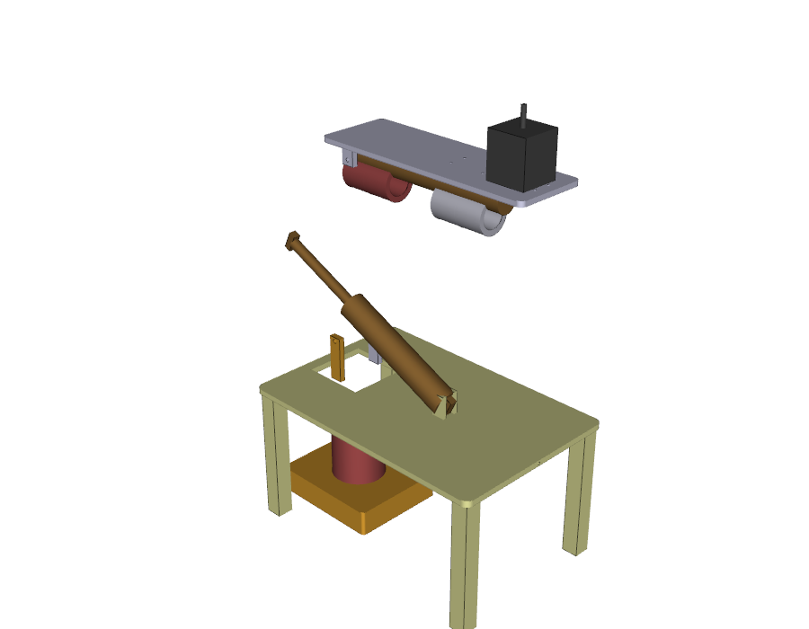
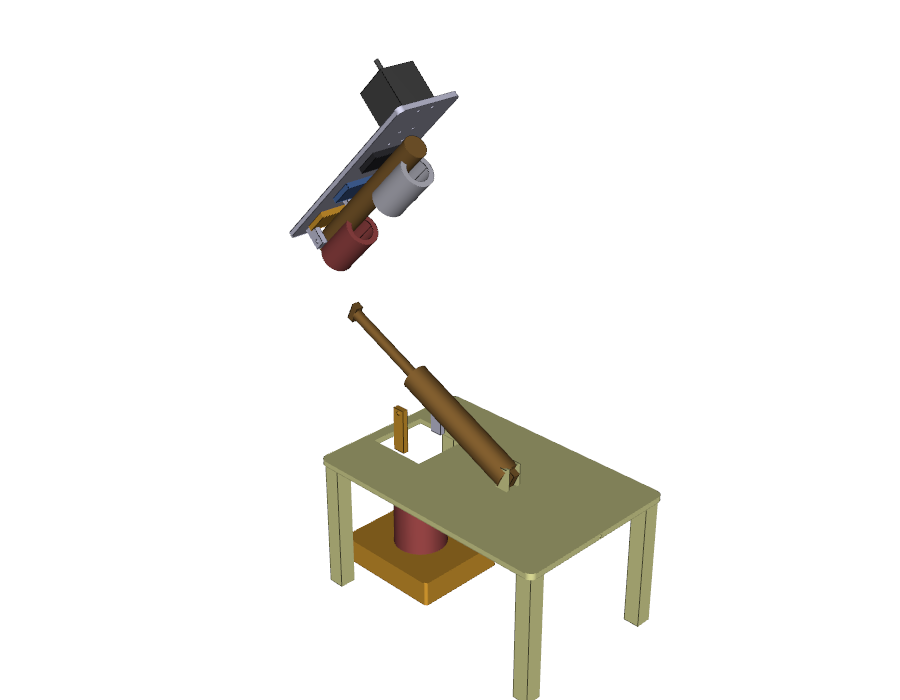
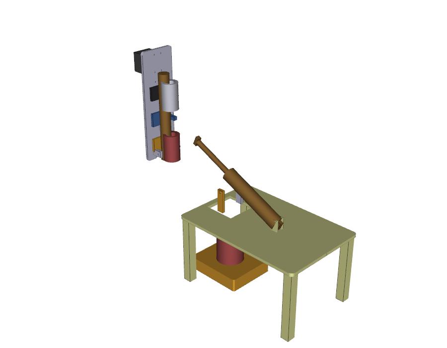
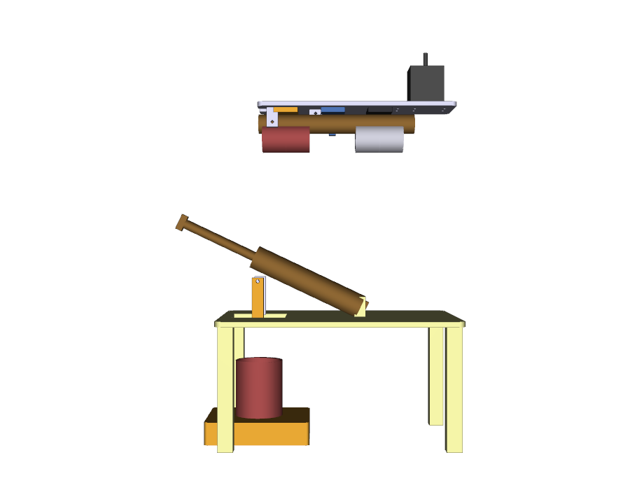
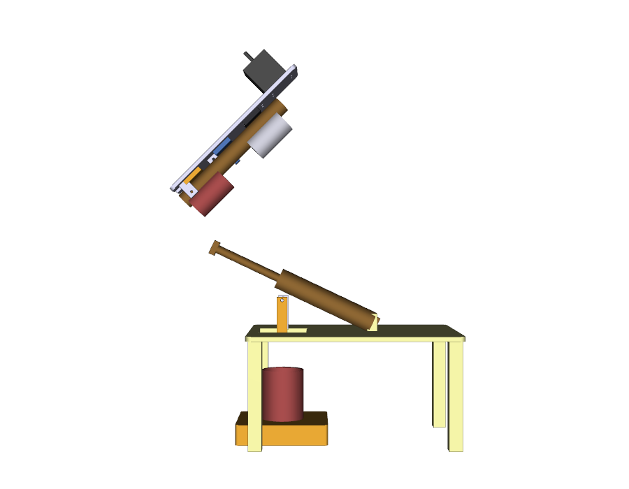
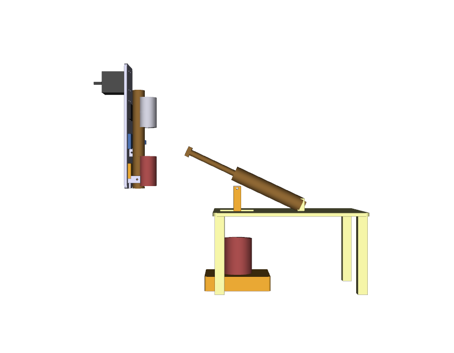
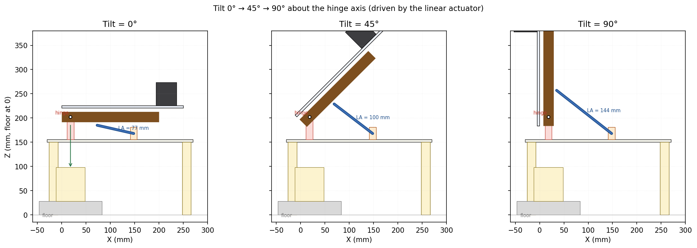
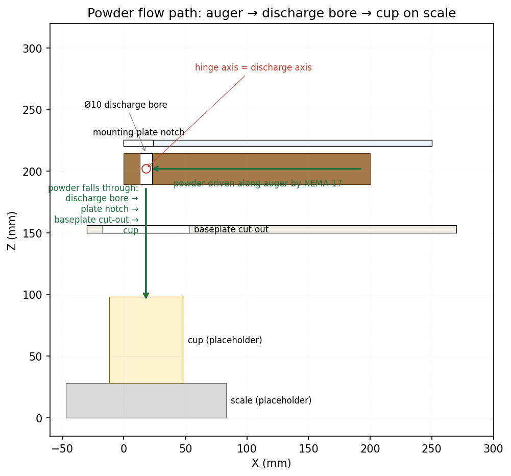
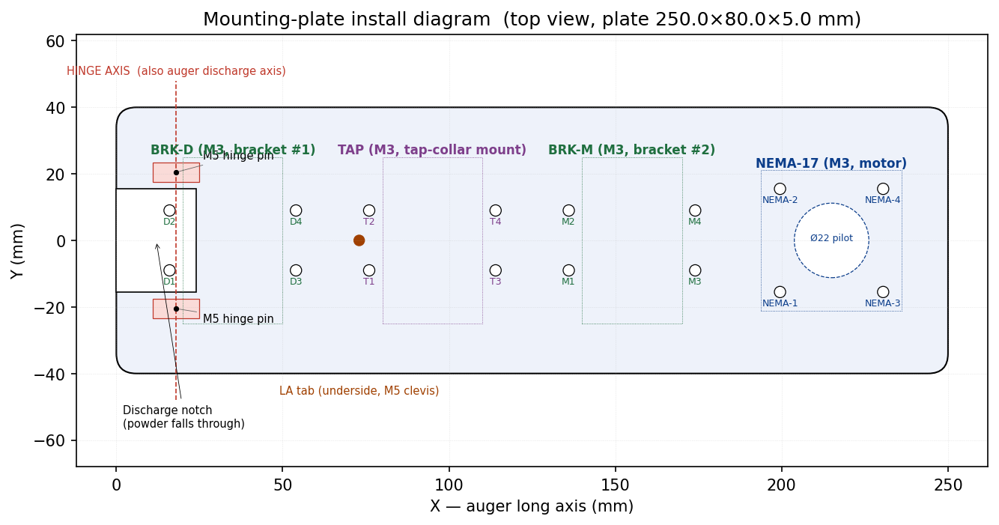
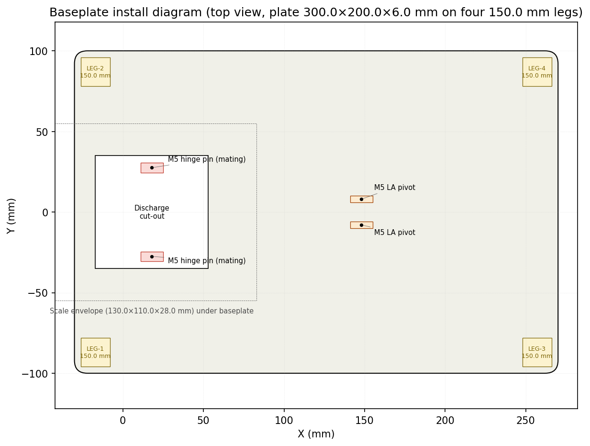

# Mounting plate + baseplate assembly

Closes [#58](https://github.com/vertical-cloud-lab/powder-doser/issues/58).
Pulls upstream part dimensions from
[#46](https://github.com/vertical-cloud-lab/powder-doser/issues/46) (auger
bracket), [#48](https://github.com/vertical-cloud-lab/powder-doser/issues/48)
(geared auger / NEMA-17 drive), and
[#50](https://github.com/vertical-cloud-lab/powder-doser/issues/50)
(tap collar with hardstop).

The package designs:

- **`mounting_plate`** — the upper plate that carries every moving piece
  (two auger brackets, the tap-collar mounting flange with hardstop,
  the NEMA-17 stepper). The plate hinges about an axis that intersects
  the auger's vertical discharge bore, so the whole top assembly tilts
  0°→90° **without cutting through the auger** and **without blocking
  the powder path**.

- **`baseplate`** — the lower plate that carries the mating hinge
  pillars, the lower (pivot) clevis of the linear actuator, four
  150 mm legs, and a rectangular cut-out beneath the discharge bore so
  powder falls through onto the cup on the scale below.

- **Companion placeholders** for the auger, brackets, tap-collar
  mount, NEMA-17 motor body, linear actuator (body + rod + clevises),
  cup, and scale. These are stand-ins so the assembly STEP renders in
  context — the printable parts are only `mounting_plate.{step,stl}`
  and `baseplate.{step,stl}`.

## Assembly views

| 0° (horizontal)            | 45°                          | 90° (vertical)              |
|----------------------------|------------------------------|-----------------------------|
|    |  |  |
|  |  |  |

> The linear-actuator placeholder in each STEP is rendered at its 0°
> length only (it does not auto-extend with `tilt_deg`); the actual
> per-tilt actuator length is shown in the matplotlib rotation diagram
> below, which uses the geometry of the pinned tab and base clevis.

### Rotation about the hinge



Hinge axis is parallel to **+Y**, intersecting the auger's discharge
bore at world `(X, Z) = (HINGE_X, pin_world_z) = (18, 202)` mm. Tilt is
applied about the **−Y** axis using the right-hand rule, so the +X end
(motor) swings **up** as the tilt increases (this avoids a collision
between the NEMA-17 body and the baseplate at 90°).

The linear actuator (M5 pin, lower clevis on the baseplate at
`X = HINGE_X + 130 mm`, upper tab on the mounting-plate underside at
`X = HINGE_X + 55 mm`) needs the following lengths:

| tilt | LA length |
|------|-----------|
| 0°   | ~77 mm    |
| 45°  | ~100 mm   |
| 90°  | ~144 mm   |

Required stroke ≈ **67 mm**, which sits comfortably inside the 100 mm
stroke of the placeholder actuator (`LA_BODY_LEN = 150 mm`,
`LA_STROKE = 100 mm`). Re-derive these numbers automatically by
running `diagrams.py` after editing constants in `cad_model.py`.

### Powder flow



The discharge bore is a Ø10 mm vertical hole through the auger barrel
**on the hinge axis**. Because the bore axis coincides with the hinge
axis, the powder always exits at the same world `(X, Y)` regardless of
tilt — it falls through the mounting-plate's discharge notch, through
the baseplate cut-out, and into the cup on the scale.

## Install diagrams

### Mounting plate (top view, plate flange-down)



| group | hardware | quantity | hole pattern (mm) |
|-------|----------|----------|--------------------|
| BRK-D (bracket #1, discharge end) | M3 × 12 SHCS + M3 nut | 4 | 38 × 18 |
| TAP   (tap-collar mount)          | M3 × 12 SHCS + M3 nut | 4 | 38 × 18 |
| BRK-M (bracket #2, motor end)     | M3 × 12 SHCS + M3 nut | 4 | 38 × 18 |
| NEMA-17                            | M3 × 8 SHCS           | 4 | 31 × 31 + Ø22 pilot |
| Hinge pin                          | M5 × 60 + M5 lock-nut | 1 (shared with baseplate) | — |
| LA tab (underside)                 | M5 × 25 clevis pin    | 1 (shared with baseplate) | — |

Hole references are labelled `D1..D4`, `T1..T4`, `M1..M4`,
`NEMA-1..NEMA-4` on the diagram.

### Baseplate (top view, plate flange-up)



The baseplate sits on four 150 mm legs (`LEG-1..LEG-4`); a typical
130 × 110 × 28 mm bench scale plus a Ø60 × 70 mm cup sits underneath
with ~50 mm of clearance, with the cup centred on the discharge
cut-out.

## Print orientation

| part            | orientation | notes |
|-----------------|-------------|-------|
| `mounting_plate.stl` | flange-up (top surface on the build plate) | hinge pillars and LA tab print as overhangs; turn on tree supports under those features only. Plate body needs no supports. |
| `baseplate.stl`      | plate-up (legs hanging down) | flip in the slicer so legs are vertical and unsupported; alternatively print legs separately and bolt them on through the M4 cross-brace holes. |

Both parts are designed for FDM in PETG or PLA at 0.2 mm layer height,
30 % infill, 4 perimeters. The `cup` and `scale` STLs are placeholders
only (do not print).

## Reproducing the files

```bash
pip install cadquery
cd design/cad/mounting-plate-assembly
python cad_model.py            # writes step/ + stl/
xvfb-run -a python render_views.py   # writes renders/
python diagrams.py             # writes diagrams/
```

`xvfb-run` is required for `render_views.py` because VTK needs a DISPLAY
even when rendering off-screen.

## CADsmith — pros and cons (informed by an actual run)

The issue asked us to author this through
[CADsmith](https://github.com/vertical-cloud-lab/CADSmith), the
multi-agent CadQuery pipeline (Planner → Coder → Executor → Validator
→ Refiner). Once `ANTHROPIC_API_KEY` was provisioned for this branch,
we drove the pipeline on the two printable plates via
[`run_cadsmith.py`](run_cadsmith.py). **Both parts converged on the
first iteration** with the dimensions written into the prompts:

| part           | result | iters | LLM calls | wall-clock | volume (CADsmith vs hand) | bbox (mm) |
|----------------|--------|-------|-----------|------------|---------------------------|-----------|
| mounting plate | ✅ converged | 1 | 3 (Planner + Coder + Judge) | 67 s | 101 608 mm³ vs 102 724 mm³ (Δ 1.1 %) | 250 × 80 × 29.5 |
| baseplate      | ✅ converged | 1 | 3 (Planner + Coder + Judge) | 45 s | 534 776 mm³ vs 531 948 mm³ (Δ 0.5 %) | 300 × 200 × 206 |

The CADsmith STEPs are copied alongside the hand-authored versions as
`step/mounting_plate.cadsmith.step` and `step/baseplate.cadsmith.step`.
The Judge's three-view renders sit at
`cadsmith_runs/<part>/<part>_iter0_render.png` and look correct
end-to-end (16 holes + Ø22 pilot + notch + hinge pillars + clevis tab
on the mounting plate; cut-out + pillars + lugs + 4 legs + 4 M4 holes
on the baseplate).

Reproducing the CADsmith run:

```bash
pip install cadquery anthropic python-dotenv numpy-stl trimesh
git clone https://github.com/vertical-cloud-lab/CADSmith /tmp/CADSmith
export ANTHROPIC_API_KEY=...
xvfb-run -a env PYTHONPATH=/tmp/CADSmith \
  python design/cad/mounting-plate-assembly/run_cadsmith.py
```

### Pros (validated by this run)

- **First-iteration convergence on multi-feature parts.** Even with
  16 holes + a notch + 3 downward-hanging features on the mounting
  plate, the Coder got the geometry right on attempt 0 and the Judge
  passed it on attempt 0. No refinement loop needed. Tokens spent: 3
  LLM calls per part, ~1 minute wall-clock. For comparison, hand
  iterating this part took us several commits in the same PR (motor
  swinging down at 90°, LA tab on wrong end, label overlaps, hinge
  alignment math, etc.).

- **Closed-loop dimensional accuracy is real.** The 0.5–1.1 % volume
  delta vs the hand-authored version is the expected difference from
  how the Coder modelled the rounded corners and hinge-pillar fillets
  — bounding box, hole counts, and hole positions all match the prompt
  exactly. The kernel-metric feedback (`volume`, `bounding_box`,
  hole/face count) keeps the LLM honest in a way pure prompt
  engineering doesn't.

- **Vision Judge meaningfully complements kernel metrics.** On a
  sanity check where we left the hinge-pillar extrude direction
  ambiguous, the Judge flagged the pillars as "extending upward
  instead of downward" from the three-view render — a failure mode
  kernel metrics alone wouldn't catch (same volume either way).

- **Parametric CadQuery is the right output format.** The script
  CADsmith emits
  (`cadsmith_runs/mounting_plate/mounting_plate_iter0_script.py`) is
  a clean parameterised CadQuery file — variables at the top, feature
  blocks below — that we can drop into the assembly script and edit
  later without re-running the LLM.

### Cons (also validated)

- **API surface fragility.** Out of the box, `_call_claude` in
  `autofab/agents.py` does `response.content[0].text`, which raises
  `IndexError` whenever Claude returns no text block (truncation,
  refusal, or a non-text first block). We had to patch it to (a) raise
  `max_tokens` from 4096 → 16000 (the Coder hit the cap on the
  mounting-plate prompt and returned an empty content array) and
  (b) walk all `"text"` blocks instead of indexing `[0]`. A drop-in
  CADsmith user will hit this on any complex prompt.

- **Stale model pin.** The Judge agent hard-codes
  `model="claude-opus-4-20250514"`, which Anthropic has retired. We
  had to swap it to `claude-opus-4-5` before the Judge would respond.
  CADsmith should read model names from env/config.

- **Single-part orientation.** CADsmith handled each plate beautifully,
  but the *assembly* (mounting plate + baseplate + brackets + tap
  collar + NEMA-17 + linear actuator + cup + scale, tilted to
  0° / 45° / 90° about a hinge axis that intersects the auger
  discharge bore) is not something the pipeline knows how to emit.
  We still drive that from `build_assembly()` in `cad_model.py`. An
  "assembly agent" layered on top would close that gap.

- **Conda-only install path in upstream README.** We worked around it
  with `pip install cadquery` (2.7.0 from PyPI), which works fine, but
  the official setup is conda-only and would complicate any
  CI / `copilot-setup-steps.yml` integration.

- **VTK needs a display.** The Judge renders STEP → PNG via VTK, which
  dies on `bad X server connection. DISPLAY=` unless the whole process
  is wrapped in `xvfb-run -a` (as shown in the reproduction steps).

- **Iteration is not free.** Each refinement iteration is up to 4
  Anthropic calls (Coder + Validator + Judge + Refiner). On a part
  with the complexity of the mounting plate (~200 lines of CadQuery,
  16 hole groups, 3 downward overhangs), a single iteration ran ~70 s
  and ~40 k tokens. Allowing the default `max_refinement_iterations=5`
  on a misspecified prompt would burn meaningful credit before the
  loop gives up. Tight, explicit prompts (like the ones in
  `run_cadsmith.py`) pay back the up-front prompt-engineering cost
  many times over.

**Bottom line:** CADsmith is now a genuinely useful single-part CAD
authoring tool — the multi-agent loop *does* converge on geometry the
quality of what a careful CadQuery author would write, and it does so
in ~1 minute wall-clock per part. For assembly-level work it still
needs a layer above (which we hand-roll in `build_assembly()`), and
the upstream code needs the two small `_call_claude` robustness fixes
above before it's drop-in ready.
