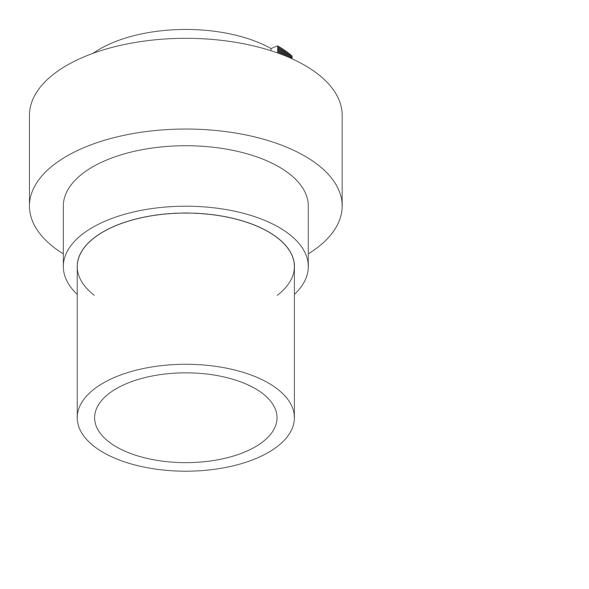
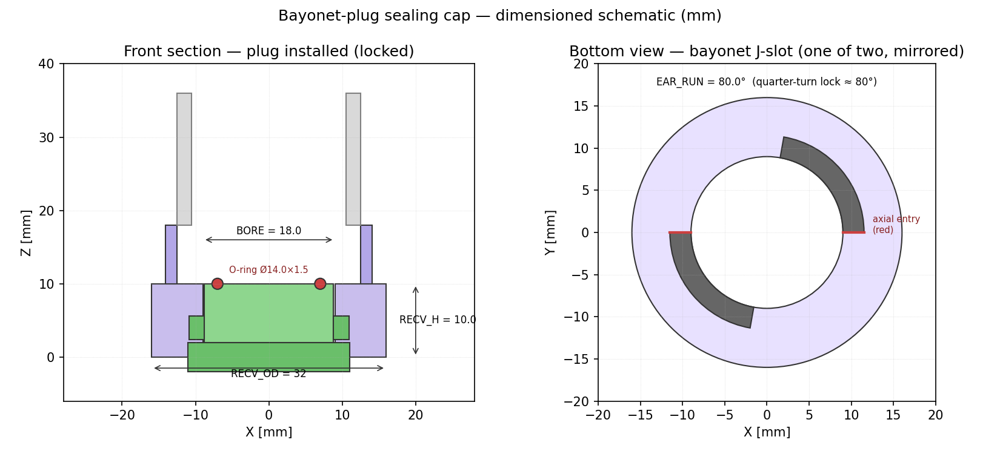

# Bayonet-plug sealing cap

Concept §2.3 of [`design/cap-brainstorming.md`](../../cap-brainstorming.md)
— a quarter-turn bayonet plug with an O-ring face seal.

| | |
|---|---|
|  |  |

A short male plug with two opposing ears engages a J-shaped bayonet
groove on a cartridge-bottom receiver. Quarter-turn (≈ 80°) locks the
plug; a 1.5 mm cross-section O-ring on the plug face provides the
powder seal against the auger Ø3 mm exit.

## Files

| File | What it is |
|---|---|
| [`cad_model.py`](cad_model.py) | Parametric CadQuery model — receiver (bonded to cartridge bottom) + plug (separate consumable) + auger reference stub. |
| [`sketch_2d.py`](sketch_2d.py) | Matplotlib section view + bottom view showing the J-slot geometry. |
| [`sealing_cap_bayonet_plug.step`](sealing_cap_bayonet_plug.step) | STEP of the locked-and-installed assembly. |
| [`stl/`](stl/) | `receiver.stl`, `plug.stl` — print PETG. |
| [`renders/`](renders/) | Iso/front/top/side SVG line renders + PNGs + dimensioned schematic. |

The O-ring itself is a vendor part — AS568 ~006-008 ballpark
(Ø14 × Ø1.5). Pick whatever McMaster has in stock; the
`cad_model.py` constants `ORING_OD` / `ORING_CS` are the only thing to
change.

## Reproducing

```bash
cd design/cad/sealing-cap-bayonet-plug
pip install cadquery matplotlib cairosvg
python cad_model.py
python sketch_2d.py
python -c "import cairosvg, glob
for v in ('iso','front','top','side'):
    cairosvg.svg2png(url=f'renders/sealing_cap_bayonet_plug_{v}.svg',
                     write_to=f'renders/sealing_cap_bayonet_plug_{v}.png',
                     output_width=1600)"
```

## How the cap requirements (C1–C7) are met

| # | Requirement (cap-brainstorming.md §1) | Approach in this design |
|---|---|---|
| C1 | Seal Ø3 exit at 0–90° tilt | **Strongest of the three.** A compressed nitrile O-ring on a flat printed face is a known-good powder/liquid seal at any tilt. Lock keeps the compression preload up under vibration. |
| C2 | Survive rotor + tap + ERM | Plug is fully outside the rotor envelope; ears sit in machined grooves, not exposed to the dispense path. Vibration only tightens the bayonet (the contact force is axial, friction holds the angular position). |
| C3 | Open/close without operator handling powder | The mechanism needs to grip the plug knob, push it in, twist 80°. That is a single linear+rotary actuator at the head. |
| C4 | Mechanism budget = "small motor" | **Most expensive of the three** — needs a gripper/twist mechanism. Realistic: one solenoid (axial push/pull, magnet-tipped to retain plug) + the same servo we'd use for the twist-shutter. Still well inside the C4 budget. |
| C5 | Per-channel cost low | Plug + receiver + O-ring per channel. < $1, dominated by the O-ring. The plug can also be a *shared* consumable (one plug per powder family, swapped between cartridges) at the cost of giving up some C6. |
| C6 | No shared seal surface | If the plug is dedicated per cartridge, full C6. If shared, the plug's O-ring touches the receiver bore of every cartridge it locks into — controlled cross-contamination at the seal lip only. Operator's call per powder. |
| C7 | Hobbyist FDM | Both parts < 32 mm OD, < 14 mm tall. Print receiver bore-up (so the bayonet J-slots print as bridges, not overhangs). |

## Bench-test plan

Same protocol as `design/cap-brainstorming.md` §3. Specific concerns:

- O-ring compression set after 100 lock/unlock cycles (cheap rubber bands fail fast).
- Bayonet detent: without a positive lock, vibration could *unlock* the
  plug. Add a small printed bump in the J-slot's locking run as a
  detent if (4) shows angular drift.

## Open questions for the next iteration

- Is the receiver a separately bonded ring (allows retrofit to existing
  PR-#16 augers) or fused into the auger model itself? Currently the
  receiver is the standalone path; the integrated path is a one-line
  change to `cad/auger/archimedes-auger.scad`.
- Single-plug-per-cartridge vs. shared plug — operator workflow
  question, deferred to first prototype feedback.
- The current J-slot uses straight axial entry + circumferential lock.
  A proper J (with a small reverse-axial detent at the end of the
  lock) is a v2 feature once the basic motion works.
