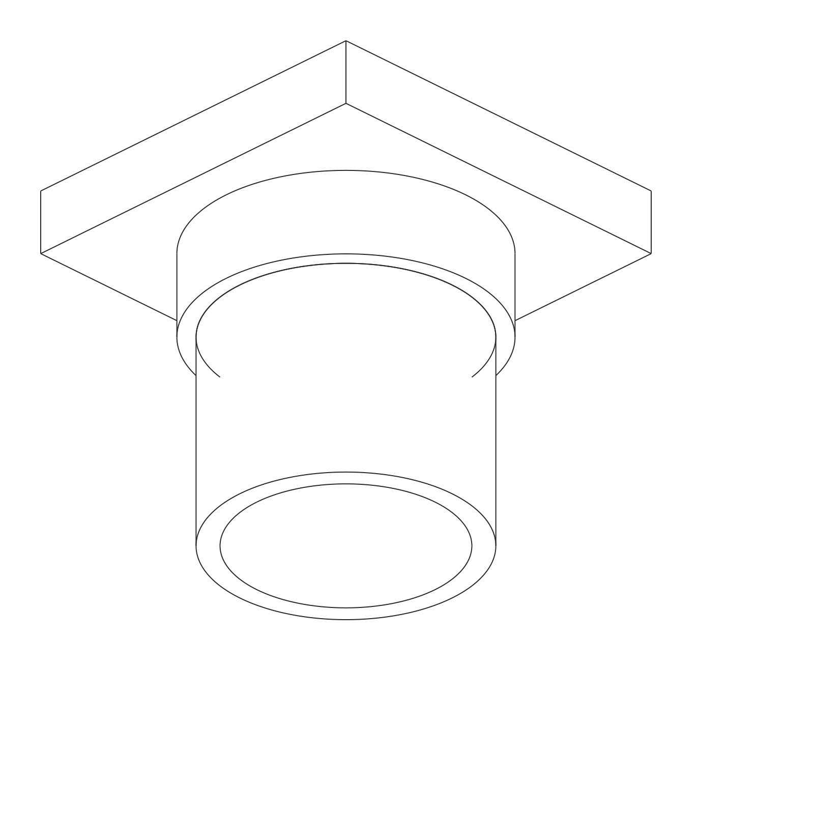
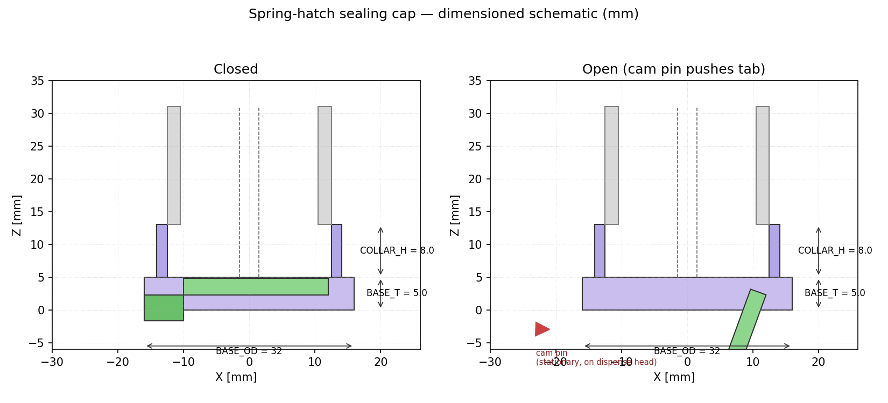

# Spring-hatch sealing cap

Concept §2.2 of [`design/cap-brainstorming.md`](../../cap-brainstorming.md)
— a printed living-hinge flap that auto-opens when the cartridge seats.

| | |
|---|---|
|  |  |

A flexure-hinged Ø22 flap covers the auger Ø3 mm exit. The flap carries
a downward-pointing cam tab on its outboard edge; when the cartridge is
seated into the dispense head a stationary cam pin pushes that tab,
swinging the flap clear. Pulling the cartridge out lets the flexure
spring it back closed.

## Files

| File | What it is |
|---|---|
| [`cad_model.py`](cad_model.py) | Parametric CadQuery model — base + flap (with integral hinge + cam tab) + auger reference stub. |
| [`sketch_2d.py`](sketch_2d.py) | Matplotlib closed-vs-open schematic with the cam-pin interaction shown. |
| [`sealing_cap_spring_hatch.step`](sealing_cap_spring_hatch.step) | STEP of the closed-configuration assembly. |
| [`stl/`](stl/) | `cap_base.stl`, `flap.stl` — print PETG for the flap (the 0.6 mm flexure needs the layer adhesion). |
| [`renders/`](renders/) | Iso/front/top/side SVG line renders + PNGs + dimensioned schematic. |

## Reproducing

```bash
cd design/cad/sealing-cap-spring-hatch
pip install cadquery matplotlib cairosvg
python cad_model.py
python sketch_2d.py
python -c "import cairosvg, glob
for v in ('iso','front','top','side'):
    cairosvg.svg2png(url=f'renders/sealing_cap_spring_hatch_{v}.svg',
                     write_to=f'renders/sealing_cap_spring_hatch_{v}.png',
                     output_width=1600)"
```

## How the cap requirements (C1–C7) are met

| # | Requirement (cap-brainstorming.md §1) | Approach in this design |
|---|---|---|
| C1 | Seal Ø3 exit at 0–90° tilt | Flap face seats against a Ø6 × 2 mm recess directly under the auger exit. The flexure pre-load holds it shut against the powder column's static head; bench test will confirm whether the pre-load is enough at 90° (full inversion). |
| C2 | Survive rotor + tap + ERM | The flap lives below the rotor, in a separate parked cavity, so the rotor never touches it. Vibration loads are transferred through the snap collar into the cap base, *not* through the hinge. |
| C3 | Open/close without operator handling powder | Fully passive — seating the cartridge opens it, removing it closes it. **No mechanism-side actuator at all.** |
| C4 | Mechanism budget = "small motor" | **Zero.** The dispense head only needs a single fixed cam pin (a printed lobe or a Ø3 pin press-fit into the head). |
| C5 | Per-channel cost low | Two printed parts + (optional) one torsion spring or rubber band if the PETG flexure relaxes over time. < $0.30. |
| C6 | No shared seal surface | Flap and base both belong to the cartridge. The cam pin on the mechanism only ever touches the *outside* of the cam tab, which is never wetted. |
| C7 | Hobbyist FDM | All parts < 32 mm OD, < 12 mm tall. Flap prints flat with the hinge oriented along the bed (layers parallel to bend axis = max fatigue life). |

## Bench-test plan

Same protocol as `design/cap-brainstorming.md` §3, plus a hinge-fatigue
sweep: 1000 cycles of cam-tab actuation on a stepper-driven jig before
the spill tests, to see if the PETG flexure relaxes enough to leak.

## Open questions for the next iteration

- Hinge thickness vs. fatigue life: 0.6 mm is a starting guess for
  PETG. If it cracks before 1000 cycles, switch to a small Ø1 mm
  music-wire torsion spring + rigid hinge knuckle.
- Cam-tab geometry: the current straight tab works for a perpendicular
  cam pin. For a single-axis insertion we may want a ramp tab (so the
  cam force naturally lifts the flap as the cartridge slides in).
- Powder dust-down: when the flap closes, dust gets shaken loose from
  the auger and lands on the seal face. A 0.3 mm radial gutter around
  the seal bore (defer to v2) would catch it.

## Why this is the most exciting of the three

It is the **only** concept that costs the mechanism *zero* extra
actuator. If it survives the cycle test, it is the obvious default for
a 30+ channel system where every per-channel cost is multiplied by 30.
