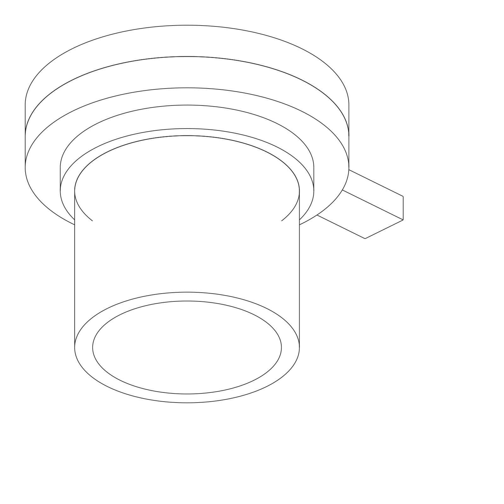
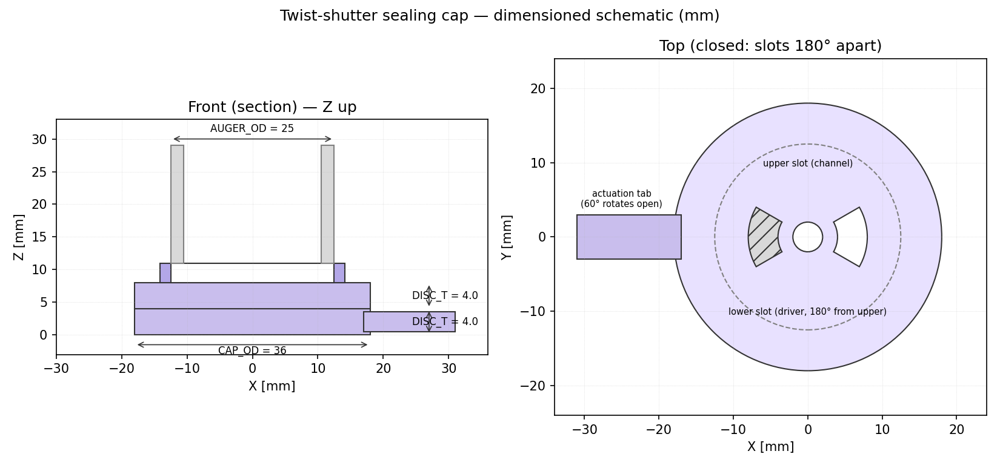

# Twist-shutter sealing cap

Concept §2.1 of [`design/cap-brainstorming.md`](../../cap-brainstorming.md)
— a two-disc shutter that seals the Ø3 mm dispense exit of a swappable
powder cartridge.

| | |
|---|---|
|  |  |

The upper disc snaps onto the bottom of the PR-#16 auger envelope
(Ø25 OD); the lower disc spins coaxially against it with a 60° throw
between *closed* (slots 180° apart) and *open* (slots aligned, Ø3 mm
dispense path clear). A radial actuation tab gives the dispense head
something to push.

## Files

| File | What it is |
|---|---|
| [`cad_model.py`](cad_model.py) | Parametric CadQuery model. Builds both discs + the auger reference stub, exports `sealing_cap_twist_shutter.step` and per-part STLs in `stl/`. |
| [`sketch_2d.py`](sketch_2d.py) | Matplotlib front-section + top schematic. Same constants as `cad_model.py`. |
| [`sealing_cap_twist_shutter.step`](sealing_cap_twist_shutter.step) | STEP of the closed-configuration assembly. |
| [`stl/`](stl/) | `channel_disc.stl`, `driver_disc.stl` — drop straight into your slicer. |
| [`renders/`](renders/) | Iso/front/top/side SVG line renders + PNGs + dimensioned schematic. |

## Reproducing

```bash
cd design/cad/sealing-cap-twist-shutter
pip install cadquery matplotlib cairosvg
python cad_model.py
python sketch_2d.py
python -c "import cairosvg, glob
for v in ('iso','front','top','side'):
    cairosvg.svg2png(url=f'renders/sealing_cap_twist_shutter_{v}.svg',
                     write_to=f'renders/sealing_cap_twist_shutter_{v}.png',
                     output_width=1600)"
```

## How the cap requirements (C1–C7) are met

| # | Requirement (cap-brainstorming.md §1) | Approach in this design |
|---|---|---|
| C1 | Seal Ø3 exit at 0–90° tilt | Slots 180° apart in closed state — exit covered by 4 mm of disc material on both sides; print with a thin nitrile gasket between the discs for the bench test, or upgrade to a press-fit O-ring on the rotating disc later. |
| C2 | Survive rotor + tap + ERM | Both discs are flat and coaxial with the rotor; no protruding feature for the spinning auger to catch on. The pivot is the same axis as the auger, so rotor side-loads do not torque the shutter. |
| C3 | Open/close without operator handling powder | Single rotational DOF — driven by the dispense head's cam tab (free if the head already has motion), or a 9 g servo (≈ $3) per channel. |
| C4 | Mechanism budget = "small motor" | A passive cam works; if not, one micro-servo. Comfortably inside the budget. |
| C5 | Per-channel cost low | Two printed discs + one M3 pivot screw. < $0.50 in PETG. |
| C6 | No shared seal surface | Both discs and the gasket belong to the cartridge; the mechanism only ever touches the *outside* of the actuation tab. |
| C7 | Hobbyist FDM | Both discs are flat, < 36 mm OD, < 4 mm thick. Flat-on-bed, no supports. |

## Bench-test plan

Same protocol as `design/cap-brainstorming.md` §3:

1. Snap onto a printed Ø25 stub of the auger envelope (the model's
   `auger_stub` is the geometry to match).
2. Load 1 g of xanthan gum (the canonical sticky-powder reference, see
   `POSE_tube_xanthan_gum.png`).
3. Closed → invert → tap 20× → measure spilled mass (target 0 g).
4. Closed → 150 Hz vibration jig 60 s → invert → measure (target < 1 mg).
5. 100 open/close cycles → repeat (1).

## Open questions for the next iteration

- Does the printed PLA-on-PLA disc-disc face leak with sub-µm fines?
  Probably yes — plan for the nitrile-gasket variant if (1) shows any
  spill.
- Pivot wear: an M3 brass through-screw + washers vs. a printed-in
  hub. Defer to first wear data.
- Indexing: a printed detent at the open and closed positions would
  let the cam-tab actuator be open-loop. Add to v2 if v1 needs it.
