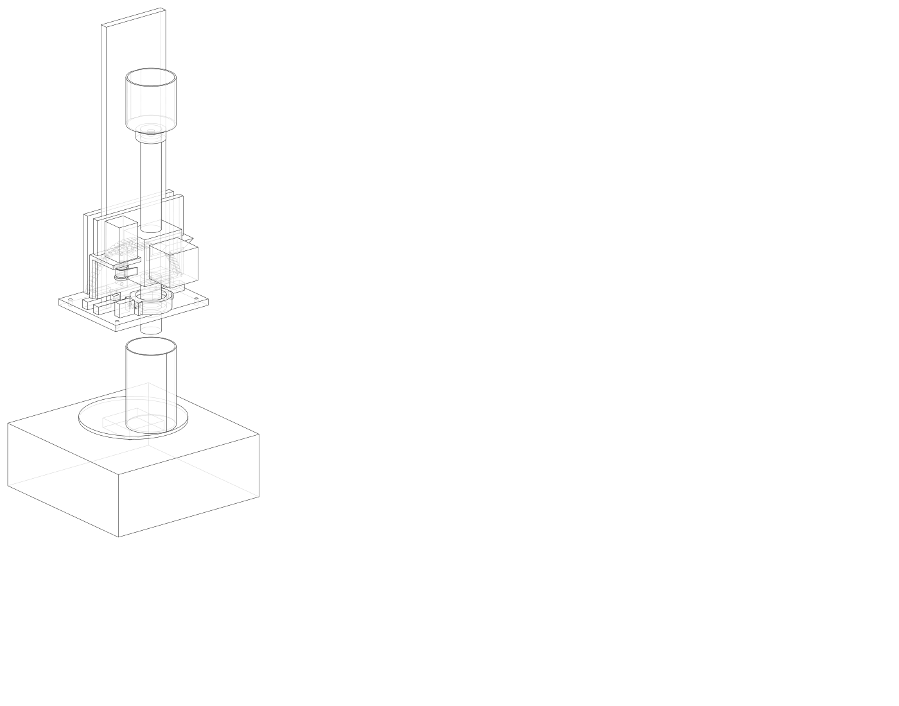
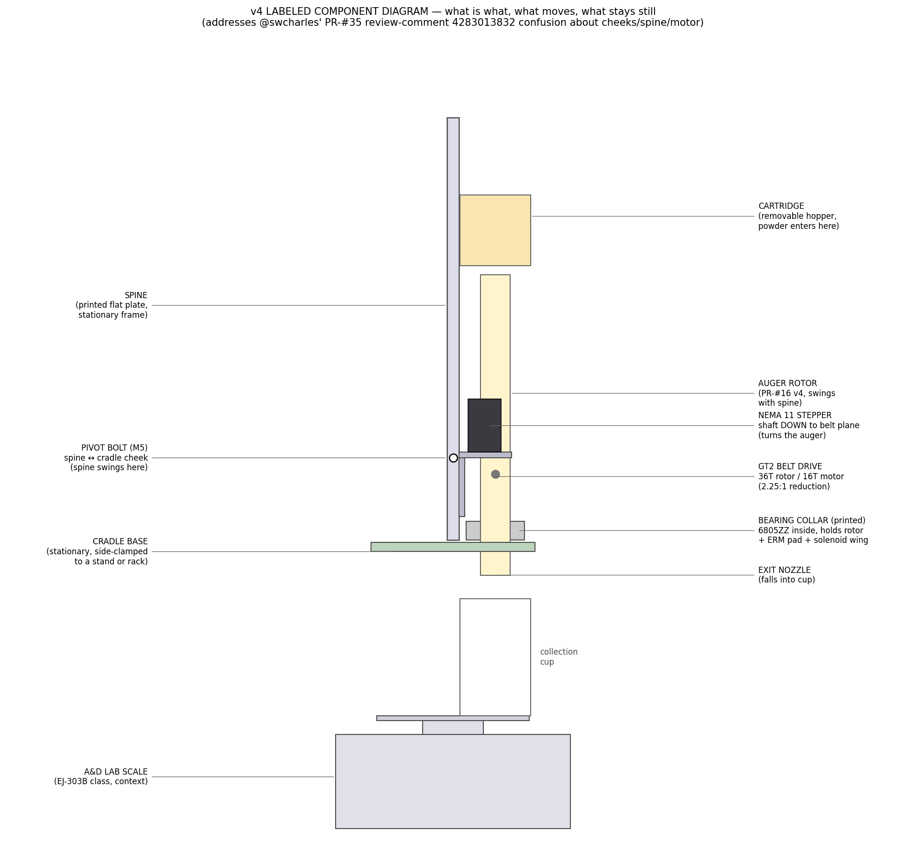
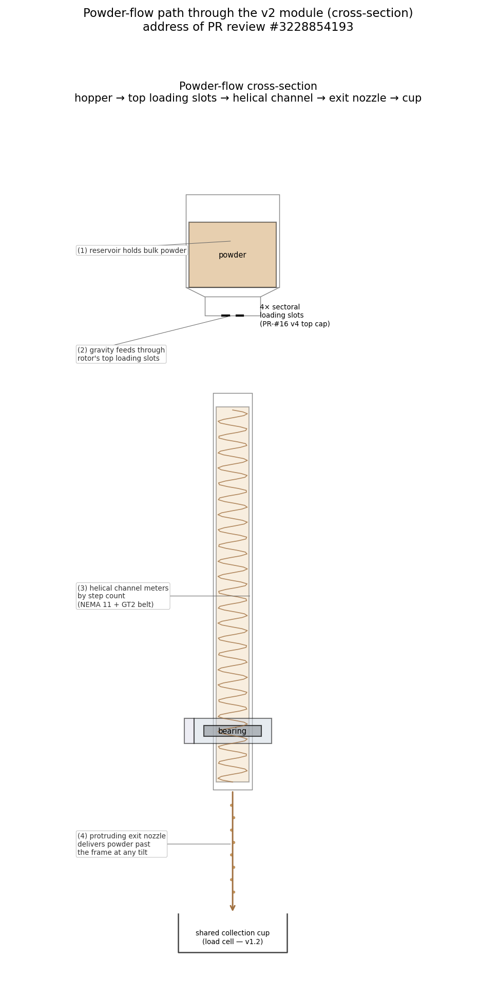
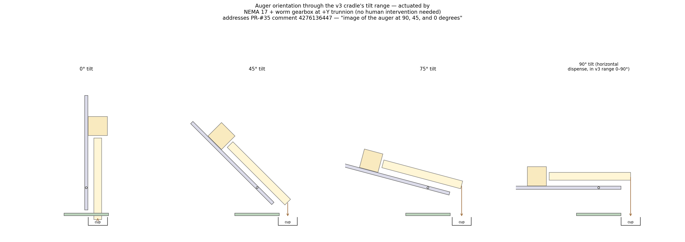
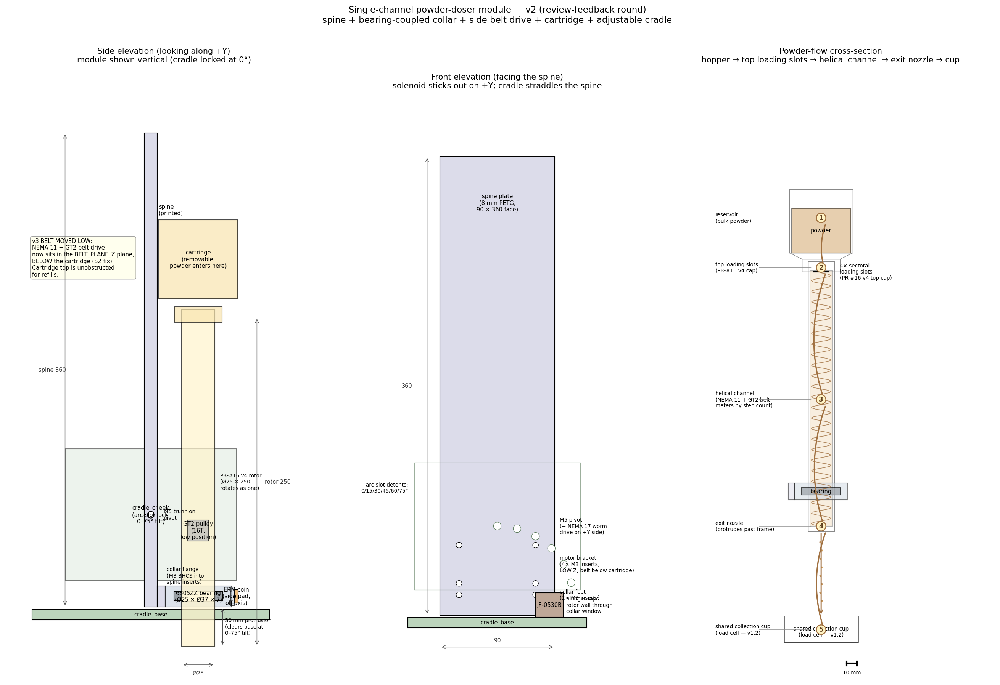

# Single-channel powder-doser module — "Idea B" archetype (v4)

This folder is the design pass for the powder doser. It implements
"Idea B / §2.2" of the brainstorming doc that ships in
[PR #31](https://github.com/vertical-cloud-lab/powder-doser/pull/31)
(`design/brainstorming.md` once that PR merges):
a self-contained single-channel module — one auger + one stepper +
one solenoid + one vibration motor + that channel's electronics — that
gets **replicated N times** around a shared collection cup to build the
full multi-powder doser.

> [!IMPORTANT]
> **v4 (this revision)** addresses [@swcharles's PR-#35 review-comment
> 4283013832](https://github.com/vertical-cloud-lab/powder-doser/pull/35#pullrequestreview-4283013832)
> ("v3 motor bracket gussets are still 3 separate bodies", "pivot point
> too high — auger swings wildly", "belt clips into the auger", "module
> floats in midair — add scale + cup", "send a full-assembly STL"). v3
> notes are kept below in [§ What changed in v3](#what-changed-in-v3).
> v1 and v2 are preserved in the git history but not documented here.

Issue: **vertical-cloud-lab/powder-doser#33**.
Resolves the design-execution half of the issue (the discussion half was
the brainstorming PR
[#31](https://github.com/vertical-cloud-lab/powder-doser/pull/31)).

## Renders

| | |
|---|---|
|  |  |
| Isometric line render — now includes the A&D scale + cup as context bodies (no more "module floating in midair"). | **v4 labeled component diagram** — every part annotated with a leader-line callout in two flanking columns (no overlapping text). Addresses @swcharles's "I'm confused about the right and left cheeks / where is the motor" question. |
|  |  |
| Standalone larger view of the powder-flow path. Numbered nodes (1–5) with a single continuous chained arrow linking reservoir → loading slots → helix → nozzle → cup, plus a 10 mm scale bar. | Side elevation rotated to 0°, 45°, 75°, and 90° about the **v4 lowered pivot** (z = 70 mm, was 220 mm in v3). The auger mouth now stays close to the same XY position across the full tilt range — no need to manually move the cup at every angle change. |
|  | |
| 2D dimensioned schematic — side, front, and powder-flow cross-section. | |

Additional orthographic SVG/PNG views (`*_front`, `*_side`, `*_top`) are
in [`renders/`](renders/).

## What's in this folder

| File | What it is |
|---|---|
| [`cad_model.py`](cad_model.py) | Parametric **CadQuery** model. Builds every printed part, places every vendor component (NEMA 11, 6805ZZ bearing, GT2 16T pulleys + belt, JF-0530B, ERM coin, PR-#16 auger envelope), exports `single_channel_module.step` and per-printed-part STLs. |
| [`sketch_2d.py`](sketch_2d.py) | Matplotlib schematic. 3-panel `single_channel_module_sketch.png` (side / front / flow) plus the standalone `single_channel_module_powder_flow.png`. Constants mirror `cad_model.py`. |
| [`single_channel_module.step`](single_channel_module.step) | STEP export of the **full assembly** (printed parts in lavender, cradle in green, cartridge in straw, vendor placeholders in their own colours). |
| [`stl/`](stl/) | Per-part STLs of every printed part — slicer-ready. **v4 also exports `ASSEMBLY_full_module.stl`** (all printed parts + vendor envelopes unioned into one solid) and `ASSEMBLY_full_module_with_scale_and_cup.stl` (everything + the A&D scale + cup context bodies). |
| [`renders/`](renders/) | All SVGs + PNGs. |

## Reproducing

```bash
cd design/cad/single-channel-module
pip install cadquery matplotlib cairosvg numpy

python cad_model.py     # writes the .step + stl/*.stl + renders/*.svg
python sketch_2d.py     # writes the 2D PNGs

# rasterize the four CAD SVGs to PNG
python -c "import cairosvg
for v in ('iso','front','top','side'):
    cairosvg.svg2png(url=f'renders/single_channel_module_{v}.svg',
                     write_to=f'renders/single_channel_module_{v}.png',
                     output_width=1600)"
```

## Architecture

The module's load path is one **printed spine** (8 mm × 90 mm × 360 mm
flat plate, printed flat-on-bed). All hardware bolts to the spine's
+X face:

1. **Bearing collar** at the bottom of the spine. A 6805ZZ deep-groove
   ball bearing (Ø25 ID × Ø37 OD × 7 mm) presses into a printed
   stationary collar. The PR-#16 v4 auger rotor (Ø25 OD) press-fits into
   the bearing's *inner* race — so the rotor spins on real bearings, and
   tap/vibration energy from the stationary outer race transmits through
   the ball/race contact into the rotor wall.
2. The collar carries an **integral solenoid bracket** with a gusset rib
   and a plunger-clearance window cut THROUGH the collar body — so the
   JF-0530B's plunger taps the rotor wall *directly*, not the collar.
3. The collar carries an **integral ERM-coin pad** on its underside
   (-Z), close to the dispense end where the de-bridging effort matters
   most.
4. The collar's **mounting flange/feet are integral** to the same
   printed part (no separate bosses); two M3 BHCS through the flange
   thread into M3 brass heat-set inserts in the spine.
5. **NEMA 11 stepper** mounts on a printed right-angle bracket bolted
   to the spine higher up. It drives the rotor via a **1:1 GT2 belt**
   (16T pulleys, ~110 mm closed-loop belt). With the motor on the
   side, **the top of the rotor is free** so the user can drop on a
   removable powder cartridge.
6. **Cartridge** snaps onto the rotor's PR-#16-v4 top loading slots.
   60 mm-Ø reservoir, 60° taper to a 36-mm collar, lifts off in one
   piece for refills or colour swaps.
7. The **rotor protrudes 30 mm below the bottom of the spine**, so the
   dispensed powder column escapes the frame regardless of tilt
   angle. There is no longer a "base plate exit hole" — the bearing
   collar is the lowest frame point.
8. The whole assembly mounts on an **adjustable-angle cradle** — two
   printed cheeks straddle the spine on M5 trunnion pivots at the
   spine's waist, locking via an arc-slot detent at any of 0°, 15°,
   30°, 45°, 60°, 75°. The cheeks bolt to a flat printed base plate.

## What changed in v4

v4 is a focused round of fixes driven by [@swcharles's PR-#35
review-comment 4283013832](https://github.com/vertical-cloud-lab/powder-doser/pull/35#pullrequestreview-4283013832).
Each row cross-links the line in `cad_model.py` / `sketch_2d.py` that
implements the fix.

| @swcharles v4 ask | v3 problem | v4 fix | Code |
|---|---|---|---|
| Motor bracket — "the triangular crossbars are not [touching], resulting in 3 bodies in what should be a single-body part" | Two separate Y=±25 gussets unioned into the face/foot but visually read as 3 disconnected bodies because the 45 mm Y span between them is empty | Replaced both gussets with **one continuous gusset web** spanning the whole `MB_FOOT_W − 4 mm` Y range. Provably single solid (one extrusion) and renders as one connected body in any view. | `make_motor_bracket()` |
| Pivot point — "the bottom of the auger swings wildly … keep the mouth of the auger as close as possible to the base" | `CRADLE_PIVOT_Z = 220 mm`, but the rotor exit is at `z = -30 mm` ⇒ 250 mm moment arm; nozzle swings ~250 mm horizontally across 0–90° tilt | `CRADLE_PIVOT_Z` lowered **220 → 70 mm** (just above the bracket faceplate, in clear spine area). Moment arm to the exit nozzle is now ~100 mm — a 60% reduction in nozzle swing. The cup no longer needs to be re-positioned at every tilt. | `CRADLE_PIVOT_Z` constant |
| Belt clipping into the auger; belt diameter too small for the rotor | Both pulleys drawn at GT2-16T Ø12.2 mm. The rotor body is Ø25, so the rotor pulley is **smaller than the rotor it's supposed to clamp**, and the belt would intersect the rotor wall | Rotor pulley sized **up to 36T (Ø26.5 mm)** so it clears the rotor by ~0.75 mm and gives a useful **2.25:1 reduction** (slower auger = better metering). `make_pulley()` and `make_belt()` now take `pulley_od` so each end can have its own diameter. Belt width also bumped 6 → 9 mm for strength at this small scale. | `MOTOR_PULLEY_OD`, `ROTOR_PULLEY_OD`, `make_pulley()`, `make_belt()` |
| "Module is currently floating in midair" — needs a real surface | The cradle base hung in space with nothing under it; no scale or cup in the renders | New `make_scale()` (A&D EJ-303B-class envelope: 213×213×80 mm base + 130 mm pan) and `make_cup()` (Ø60×100 mm) added to the assembly as **CONTEXT_** bodies. Cradle base now sits on the scale pan; cup sits on the pan directly under the rotor exit nozzle. Visible in every render. | `make_scale()`, `make_cup()`, assembly placement |
| "Include an STL of the assembly so we can better understand how the pieces all fit together" | Only per-part STLs were exported | Two new combined STLs: **`stl/ASSEMBLY_full_module.stl`** (printed parts + vendor envelopes, no scale/cup) and **`stl/ASSEMBLY_full_module_with_scale_and_cup.stl`** (everything). Slicer-loadable as one file. | `_union_all` + STL exports |
| "I'm confused about the right and left cheeks … provide a diagram labeling each component" with no overlapping text | Component layout was only visible in raw orthographic renders | New **`renders/single_channel_module_labeled.png`** — leader-line callouts in two flanking columns (left/right of the diagram), so labels never overlap each other or the geometry. | `draw_labeled_diagram()` in `sketch_2d.py` |

### Mitigations for "single-body / parts touching" spatial-reasoning errors

@swcharles asked: _"You consistently have trouble with that kind of
reasoning. Provide a list of ways to combat that — simulation, other
LLMs, etc. How can we avoid that problem in the future?"_

Concrete mitigations, ordered by what's reasonable to wire into this
repo first:

1. **Connectedness assertion in `cad_model.py`** — after every
   `union()` chain, assert `cq.exporters.export(part, ...).Solid`
   yields a single `TopoDS_Solid` (not a `Compound`). A 3-line check
   that fails the build if a printed part comes out as multiple bodies.
   This is the single most direct guard against the v3 motor-bracket
   class of bug.
2. **Volume-conservation cross-check** — for each `union(A, B)`, assert
   `vol(A∪B) ≤ vol(A) + vol(B)` (with overlap implying actual contact);
   non-overlap silently produces "cohabiting" bodies in CadQuery.
3. **Headless overlap matrix** — build a small `validate_assembly.py`
   that loops over every pair of `(part_i, part_j)` in the assembly
   and checks `intersect(part_i, part_j).volume`. Print a CSV of
   non-intended interferences before any human review.
4. **Multi-view VLM judges** — keep the Edison `run_judge.py` round
   pattern, but extend it to feed **three views per part + the full
   assembly** to the judge each round (current setup feeds the full
   assembly only). Cross-check against a second LLM (e.g. Claude
   Sonnet vs. GPT-4o) so a single model's spatial blind-spot can't
   pass through.
5. **CAE-backed checks (low-cost)** — run a free FreeCAD `Part.Solid`
   `isClosed()` / `isValid()` pass over each exported STEP body in CI;
   FreeCAD will refuse to validate a "two-bodies-pretending-to-be-one"
   geometry.
6. **Slicer dry-run** — slice every printed STL with PrusaSlicer's
   `--info` mode in CI. The slicer reports the body count per file;
   any STL that comes back as `bodies > 1` for a part that should be
   one printed piece is an automatic fail.
7. **3D-print-aware code review** — the spatial-reasoning checklist
   in [#29](https://github.com/vertical-cloud-lab/powder-doser/issues/29)
   should be applied as a structured review template before any CAD
   PR is approved (each printed part: one body? all features anchored?
   gussets > thinnest wall? etc.).
8. **Physics simulation (heavier-weight)** — for joints under load
   (cradle pivot, motor bracket cantilever), a static-FEA pass in
   FreeCAD-FEM or Onshape's free Simulation tier would surface
   stress concentrations that no VLM can.

Items 1–4 are cheap and we should add them in v4.1; 5–8 are the
medium-term plan.

### v4 deferred / explicitly NOT done

* **Animation** — @swcharles flagged this as "lower priority,
  accomplish all other tasks first". Not produced in v4 in favour of
  the labeled diagram + scale/cup context + lowered pivot. v4.1 plans
  a Blender turntable + tilt-sweep MP4 fed off the new
  `ASSEMBLY_full_module.stl`.
* **Auger teeth for the belt drive** — @swcharles pointed out that
  the belt currently couples to the rotor purely by friction. The
  cleanest fix is a custom rotor pulley clamped on a Ø8 turned-down
  shaft section of the PR-#16 v4 rotor (rather than reshaping the
  rotor body); that depends on PR-#16 cutting that flat in v5 and is
  tracked under [§ Parts I'd like added](#parts-id-like-added-to-the-repo).
* **Auger-extends-below-the-base concern** — there is **no base
  plate hole** in v3/v4. The "base" is the bearing collar; the rotor
  hangs in air below it (see the `cad_model.py` `make_auger` 30 mm
  protrusion). The rotor turns freely — nothing for it to hit.

## What changed in v3

v3 is a mechanical rewrite driven by [@swcharles's PR-#35
review](https://github.com/vertical-cloud-lab/powder-doser/pull/35#issuecomment-4276136447)
("most of the parts here don't work") and [@sgbaird's request to use
Edison Scientific as an independent VLM
Judge](https://github.com/vertical-cloud-lab/powder-doser/pull/35#issuecomment-4435069073).
The Edison runner + raw answers are committed under
[`edison_judge/`](edison_judge/) for reproducibility.

| Critique (reviewer / Edison) | v2 design | v3 fix | Code |
|---|---|---|---|
| @swcharles S1, S4 + Edison r1 #2 — motor bracket plates don't touch; "exploded view" | Foot at Y=0, faceplate at Y=−50; 7.5 mm Z gap between halves | Rebuilt as a true L: foot is a vertical YZ-plane plate against the spine; faceplate is a horizontal XY-plane plate cantilevered off the foot's TOP edge, sharing the foot's Y range. Two triangular gussets tie the cantilever back to the foot. | `make_motor_bracket()` |
| @swcharles S2 — belt drive directly under cartridge | Belt at Z ≈ rotor top (≈ 280 mm), in line with the cartridge | New `BELT_PLANE_Z = COLLAR_H + 4` puts both pulleys at Z ≈ 20 mm, just above the bearing collar. The cartridge above the rotor is unobstructed. | `BELT_PLANE_Z`, `make_motor_bracket()`, pulley placements |
| @swcharles S2 + Edison r1 #3 — ERM coin in the powder flow path (centred under the rotor) | Disc pad at `(rotor_x, 0)` directly below the rotor's exit nozzle | ERM moved off-axis to a flat **side pad on the −Y face** of the bearing collar (`ERM_PAD_Y_OFFSET`). Coin still couples vibration into the bearing inner race in shear via the collar wall. The exit nozzle is clear. | `make_bearing_collar()`, `make_erm()` |
| @swcharles S3 — large unnecessary outboard plates | `cradle_base` 220 × 180; `CHEEK_H` 220 mm in X | `cradle_base` trimmed to 140 × 110; `CHEEK_H` reduced from 220 → 130 mm in X (just enough to clear the 0–90° arc-slot at radius 60 mm). | `CRADLE_BASE_W/D`, `CHEEK_H`, `CHEEK_W` |
| @swcharles S6 — show 0 / 45 / 90 ° tilt; need a second motor for automated tilt | 90 ° dashed (out of cradle range); manual wing-nut detent | Cradle range extended to 0–90 ° (`CRADLE_DETENT_ANGLES_DEG = [0,15,30,45,60,75,90]`). New **NEMA 17 + 30:1 worm gearbox** at the +Y trunnion drives tilt under software control; −Y trunnion remains a passive M5 pivot. Tilt-sweep render now shows 90 ° as a real (not dashed) state. | `make_tilt_drive()`, `CRADLE_DETENT_ANGLES_DEG` |
| @swcharles S7 — small parts look too thin for FDM | `SPINE_T = 8`, `CHEEK_T = 6` | Stiffness pass: `SPINE_T 8 → 10`, `CHEEK_T 6 → 8`. | constants block |
| Edison r1 #1 — cartridge floats ~56 mm above the rotor (`auger_top_z = COLLAR_H + 10 + AUGER_LEN`) | Cartridge rim at Z = 276 vs. rotor top at Z = 220 | `auger_top_z = (rotor_z0 + AUGER_LEN) − 4` so the cartridge collar slip-fits over the rotor's top cap, 4 mm engagement. | `make_cartridge()` |
| Edison r1 #4 — solenoid plunger drawn as a Z-extruded coin | `Workplane("XY")...extrude(SOL_PLUNGER_D)` | Sketched in XZ, extruded along −Y so the plunger is a rod from the solenoid front face to the rotor wall through the collar window. | `make_solenoid()` |
| Edison r1 #5b — cradle base sits 2 mm below the cheek foot | `cradle_base.translate((0, 0, -10))` with `CRADLE_BASE_T = 8` → top face at Z = −2; cheek foot starts at Z = 0 | `cradle_base.translate((0, 0, -CRADLE_BASE_T))` so the base top face is exactly Z = 0, flush with the cheek foot bottom. New continuous **spar** in the cheek body fills the previous gap between the pivot region and the foot, so each cheek prints as one connected solid. | cheek build; assembly placement |

> Single source of truth for these critiques: the raw VLM-Judge runs are at
> [`edison_judge/round1.answer.md`](edison_judge/round1.answer.md) and
> [`edison_judge/round2.answer.md`](edison_judge/round2.answer.md).
>
> **Round-2 fixes layered on top** (Edison flagged 5 new issues introduced
> by the round-1 changes; all were addressed):
>
> | Edison r2 finding | v3-r2 fix |
> |---|---|
> | #1 — Cradle cheek **axis bug**: cheeks at `y_face = ±5.5` are *embedded inside* the spine's Y range (-45..+45) instead of straddling its X-thinnest dimension | `make_cradle_cheek()` rewritten on `Workplane("YZ")` offset along ±X. Cheeks now bolt to the spine's flat ±X faces and pivot about the X axis (matching the spine's existing X-axis trunnion bore). |
> | #2 — Motor bracket faceplate at `MB_FOOT_Y_HI = +12` cuts straight through the rotor (rotor occupies Y=±12.5) | `MB_FOOT_Y_HI = -(AUGER_OD/2 + 1.0) = -13.5` so the foot stops 1 mm short of the rotor wall. |
> | #2 — Faceplate too narrow to capture the NEMA-11 23 mm BHC | `MB_FOOT_X` 32 → 45. |
> | #3 — Bracket foot dangles below the spine bottom and clashes with the bearing collar flange (Z=0..16) | Foot now spans `Z = COLLAR_H + 4 .. MOTOR_FACE_TOP_Z`, completely above the flange. `BELT_PLANE_Z` raised from `COLLAR_H + 4` to `COLLAR_H + 34`. The 4-hole insert pattern is computed from the foot dimensions rather than hard-coded. |
> | #5/#6 — `sketch_2d.py` `AUGER_TOP_Z` was stale, leaving a 56 mm air gap in the 2D sketches | `AUGER_TOP_Z = ROTOR_BOTTOM_Z + AUGER_LEN - 4.0`, matching `make_cartridge()` in the CAD. Cheek dimensions `CHEEK_H/CHEEK_W` re-synced (130/100). |
> | #7 — At 75–90° tilt the spine bottom strikes the cradle base because `CRADLE_PIVOT_Z=200 < SPINE_H/2 + 20` | `CRADLE_PIVOT_Z` raised 200 → 220. |
>
> Round-2 issues left as **deferred / open questions** (documented but not
> auto-fixed):
>
> * Pulley-on-rotor sizing — the GT2 16T pulley (Ø12.2) is smaller than
>   the rotor body (Ø25), so it can't physically clamp on the rotor body
>   at the belt plane. Two options are open: (a) spec a larger rotor
>   pulley (e.g. 36T, Ø~26 mm OD), or (b) modify the PR-#16 v4 rotor to
>   include a Ø8 turned-down clamping neck at `BELT_PLANE_Z`. Listed as
>   an explicit reviewer question in [§ Open questions / asks](#parts-id-like-added-to-the-repo).
> * Spine stiffness vs. ERM/belt loads at 360 mm cantilever — bench
>   testing in v3.1 will tell us whether the 10 mm PETG spine needs
>   ribbing.

## What changed in v2

Each row links to the GitHub review comment that drove the change.

| Review feedback | v1 design | v2 fix |
|---|---|---|
| [#3228421681](https://github.com/vertical-cloud-lab/powder-doser/pull/35#discussion_r3228421681) — vibration motor doesn't reach the rotor | 1 mm air gap between rotor and tap collar | **6805ZZ ball bearing** (Ø25/Ø37/7) press-fit into the collar; rotor presses into the inner race. Vibration transmits through the ball/race contact. |
| [#3228681184](https://github.com/vertical-cloud-lab/powder-doser/pull/35#discussion_r3228681184) — plunger needs through-hole or bearing | plunger pushed against air | The bearing handles vibration coupling. The solenoid plunger now passes **THROUGH a Ø5 window** in the collar body and impacts the rotor wall directly. |
| [#3228441106](https://github.com/vertical-cloud-lab/powder-doser/pull/35#discussion_r3228441106) — collar bosses appear separate | Two cylindrical bosses bolted to the base plate | Collar has an **integral L-flange** with two M3 through-bores; bolts through into spine inserts. One printed part. |
| [#3228681184](https://github.com/vertical-cloud-lab/powder-doser/pull/35#discussion_r3228681184) — fragile solenoid mount | 4 mm-thick wing, no gusset | Wing widened to 6 mm, **triangular gusset rib** ties wing back to the collar body. |
| [#3228543667](https://github.com/vertical-cloud-lab/powder-doser/pull/35#discussion_r3228543667) — stepper blocks powder entry | Stepper directly on top of rotor via flex coupler | Stepper moved to the side on its own bracket; **GT2 1:1 belt drive** to a pulley on the rotor's M3 boss. Top of rotor is free. |
| [#3228854193](https://github.com/vertical-cloud-lab/powder-doser/pull/35#discussion_r3228854193) — cartridges + flow | Nothing for powder loading | Removable **cartridge** part (60-mm reservoir, 60° taper, 36-mm collar) snaps onto the rotor's top loading slots. New **powder-flow cross-section** render in `renders/single_channel_module_powder_flow.png`. |
| [#3228525590](https://github.com/vertical-cloud-lab/powder-doser/pull/35#discussion_r3228525590) — base-plate exit bridging at angles | Rotor stopped flush with the base plate | Rotor now **protrudes 30 mm below the lowest frame point** (the bearing collar). No "base plate exit hole" any more. |
| [#3228660546](https://github.com/vertical-cloud-lab/powder-doser/pull/35#discussion_r3228660546) — open to alternatives to top/bottom-plate + 4 posts | 80 × 80 frame, 6 separate printed parts | **Single printed spine** is the entire structural backbone. Two top/bottom plates + 4 corner posts gone. |
| [#3228508510](https://github.com/vertical-cloud-lab/powder-doser/pull/35#discussion_r3228508510) — adjustable-angle stand | Vertical only | Separate **adjustable cradle** (2× cheeks + base) with M5 trunnion pivots and 0/15/30/45/60/75° detents. |
| [#3228811380](https://github.com/vertical-cloud-lab/powder-doser/pull/35#discussion_r3228811380) — 80 mm cup-rim height was made up | "R9" baked an unjustified 80 mm into the design | **R9 dropped.** The dispense height is now whatever the cradle tilt + ring-frame (deferred to v1.3) puts the rotor exit at — the module no longer cares. |
| [#3228875238](https://github.com/vertical-cloud-lab/powder-doser/pull/35#discussion_r3228875238) — threaded inserts not self-tapped holes | M3 self-tappers + M2 bolts straight into PETG | Every printed-part fastener hole is sized for a **brass heat-set insert** (Ruthex M3×5×4, OD 4.0 mm, install with a 4.5 mm pilot, soldering iron @ 240 °C). [§ Fastener strategy](#fastener-strategy) below. |
| [#3228476410](https://github.com/vertical-cloud-lab/powder-doser/pull/35#discussion_r3228476410) — use real PR-#25 part geometries | Boxes for everything | All PR-#25 envelopes kept and corrected against datasheets; new vendor parts (6805ZZ, GT2 pulley + belt) added with realistic dimensions. The CadQuery model still uses simplified box envelopes for PCB carriers — see [§ Parts I'd like added to the repo](#parts-id-like-added-to-the-repo) for the manufacturer STEP files that would let me drop in real geometry. |

## Geometry (single source of truth)

Every dimension below is duplicated as a constant in **both**
`cad_model.py` and `sketch_2d.py`; if you change one, change the other.

### Printed parts (PETG recommended; PLA OK)

| Part | Footprint / envelope | Notes |
|---|---|---|
| `spine` | 8 × 90 × 360 mm flat plate | 2× M3 inserts at the collar mounting Z, 4× M3 inserts at the motor-bracket Z, 1× M5 through-hole at the trunnion-pivot waist. Printed flat-on-bed. |
| `bearing_collar` | Ø50 OD × 16 H + flange + wing + pad (one piece) | Ø37 H7 bearing seat, Ø5 plunger window, integral 6 mm-thick flange (2× M3 BHCS clearance), gusseted solenoid wing (M2 mounting pattern for JF-0530B), Ø18 ERM pad on -Z face. |
| `motor_bracket` | 50 × 50 face + 60 × 35 foot, 5 mm walls | Stepper mounts to the face on a 23 mm BHC + Ø22 boss bore; foot has 4× M3 clearance bores for the spine insert pattern. |
| `cartridge` | Ø60 reservoir × 60 H + 60° taper + Ø36 base collar | Removable. Slip fit Ø25.6 over the rotor's top cap. Lifts off for refills. |
| `cradle_cheek_L` / `cradle_cheek_R` | 220 × 80 × 6 mm cheek + foot | Mirrored pair. M5 pivot bore + arc-slot lock at 60 mm radius with 6 detents (0/15/30/45/60/75°). |
| `cradle_base` | 220 × 180 × 8 mm | 4× corner Ø4.4 (M4 BHCS) for bench mounting / future ring-frame integration. |

### Vendor / placeholder parts (purchased — see [BOM](#bill-of-materials))

| Part | Envelope | Source |
|---|---|---|
| PR-#16 v4 auger rotor (printed by user) | Ø25 × 250 mm rotor + Ø8 × 6 mm M3 boss on top cap, 4× sectoral loading slots in top cap | `cad/auger/archimedes-auger.scad` (lands with [PR #16](https://github.com/vertical-cloud-lab/powder-doser/pull/16)) |
| 6805ZZ deep-groove ball bearing | Ø25 ID × Ø37 OD × 7 mm | McMaster-Carr 5972K368 / generic |
| NEMA 11 bipolar stepper | 28 × 28 × 45 mm body, 5 mm shaft | PR-#25 item 10 |
| GT2 pulley × 2 (16-tooth, 5 mm bore + adapter / 5 mm bore) | Ø10 × 16 mm body + Ø16 flanges | Amazon / Pololu generic |
| GT2 closed-loop belt | 6 mm wide, ~110 mm closed loop, 1.4 mm thick | Amazon / Pololu generic |
| JF-0530B push-pull 5 V solenoid | 9.6 × 19 × 22 mm, 4.5 mm stroke | PR-#25 item 4 |
| ERM coin vibration motor | Ø10 × 2.7 mm | PR-#25 item 2 |

Total module envelope: **~140 × 90 × 410 mm** (with cartridge in place).

## Bill of materials (per module)

| Qty | Item | Approx. \$ | Source |
|---|---|---|---|
| 1 | PR-#16 v4 auger rotor (printed) | ~$1 (PETG) | `cad/auger/archimedes-auger.scad` ([PR #16](https://github.com/vertical-cloud-lab/powder-doser/pull/16)) |
| 1 | NEMA 11 stepper, 5 mm shaft | $14–18 | [SparkFun ROB-10848](https://www.sparkfun.com/products/10848) |
| 1 | 6805ZZ deep-groove ball bearing | $3–5 | McMaster 5972K368 / Amazon |
| 2 | GT2 16T pulley, 5 mm bore | $4 each | Amazon |
| 1 | GT2 closed-loop belt, 6 mm wide, ~110 mm | $2 | Amazon |
| 1 | DRV8825 stepper-driver carrier | $7.95 | [Pololu #2133](https://www.pololu.com/product/2133) |
| 1 | JF-0530B 5 V mini push-pull solenoid | $4.95 | [Adafruit #412](https://www.adafruit.com/product/412) |
| 1 | DRV8871 DC motor driver breakout | $7.50 | [Adafruit #3190](https://www.adafruit.com/product/3190) |
| 1 | ERM 10 mm vibration coin (or LRA #1631) | $1.95 | [Adafruit #1201](https://www.adafruit.com/product/1201) |
| 1 | DRV2605L haptic-driver breakout | $7.95 | [Adafruit #2305](https://www.adafruit.com/product/2305) |
| ~14 | M3 brass heat-set inserts (Ruthex M3×5×4 or equivalent) | <$3 | [Ruthex / E-Z LOK](https://www.ruthex.de/en/) |
| ~12 | M3 × 8 mm BHCS | <$1 | any |
| 2 | M3 × 12 mm BHCS (collar → spine) | <$0.50 | any |
| 4 | M2.5 × 8 mm BHCS (NEMA 11 → bracket) | <$1 | any |
| 2 | M2 × 6 mm BHCS (solenoid → wing) | <$0.50 | any |
| 2 | M5 × 25 mm BHCS + nyloc + washers (trunnion) | <$1 | any |
| 1 | M5 × 25 + wing nut + washers (arc-slot lock) | <$1 | any |
| 4 | M4 × 12 mm BHCS (cradle base → bench) | <$1 | any |
| 1 | Adhesive pad (3M VHB or instant) for the ERM | <$0.50 | any |

**Per-module electronics + motor + bearing sub-total ≈ $60.**
Print consumables ≈ $5 of PETG. Multiply by N (target 8–12 for v1).

The **shared** parts (12 V wall-wart, Pololu D24V22F5 buck, Pi Zero 2 W,
GPIO expander) are not per-module and live on a future backplane PR.

## Fastener strategy

Per [comment #3228875238](https://github.com/vertical-cloud-lab/powder-doser/pull/35#discussion_r3228875238)
all printed-part fasteners use **M3 brass heat-set threaded inserts**
(Ruthex M3×5×4, OD 4.0 mm, length 4.0 mm) installed with a soldering
iron at 240 °C into pre-printed Ø4.5 pilot holes. The `cad_model.py`
emits Ø4.5 pilots at every insert location.

| Joint | Fastener | Notes |
|---|---|---|
| `bearing_collar` ↔ `spine` | 2× M3 × 12 mm BHCS through the collar flange into M3 inserts in the spine | Collar bolt heads on the +X face; inserts on the -X face of the spine. |
| `motor_bracket` ↔ `spine` | 4× M3 × 8 mm BHCS through the bracket foot into M3 inserts in the spine | 30 × 20 mm rectangular pattern. |
| NEMA 11 ↔ `motor_bracket` | 4× M2.5 × 8 mm BHCS into the stepper's tapped faceplate | 23 mm BHC, no insert needed (stepper tapped). |
| JF-0530B ↔ collar wing | 2× M2 × 6 mm BHCS into the solenoid's stock M2 tapped tabs | 14 mm pitch. |
| ERM coin ↔ collar pad | adhesive (3M VHB pad or instant) | shallow Ø10.4 × 0.7 mm recess for alignment. |
| Cradle cheek ↔ cradle base | 2× M3 × 8 mm BHCS into M3 inserts in the cheek foot | per cheek (4 total). |
| Cradle pivot | M5 × 25 mm BHCS through cheek + spine + cheek + nyloc | The trunnion. |
| Cradle lock | M5 × 25 mm BHCS + wing nut through arc slot | Frees up the angle. |
| Cartridge ↔ rotor | none — slip fit on the rotor top cap | Lifts off; the cartridge's own weight + powder fill keeps it seated. |

> [!NOTE]
> Heat-set inserts are stronger than self-tapped holes in PETG by a
> factor of ~3× in pull-out, repeatable across many install/uninstall
> cycles, and forgiving of slightly off-tolerance prints. The downside
> is a one-time investment in inserts and an iron tip; no special
> press is required.

## Print orientation & settings

PETG (preferred) or PLA, 0.4 mm nozzle, 0.2 mm layers, 4 perimeters,
25 % gyroid infill is the recommended baseline.

| Part | Orientation | Supports | Notes |
|---|---|---|---|
| `spine.stl` | Flat on bed | none | Largest plate part — 90 × 360 footprint fits any FDM bed. |
| `bearing_collar.stl` | Solenoid wing on the bed; +Z (the bearing seat side) up | trees on the wing M2 holes only | The Ø37 bearing seat needs to be a vertical hole — print with the bore axis vertical so it stays round. |
| `motor_bracket.stl` | Foot on the bed | brim recommended for the right-angle | A small part — print 4 at a time. |
| `cartridge.stl` | Hopper rim on the bed | none | Tapered section bridges cleanly. |
| `cradle_cheek_L.stl` / `_R.stl` | Cheek face on the bed | none | Print one of each (mirrored). |
| `cradle_base.stl` | Flat | none | Brim recommended. |

The PR-#16 v4 auger has its own print recipe in `cad/auger/archimedes-auger.scad`
(landing with [PR #16](https://github.com/vertical-cloud-lab/powder-doser/pull/16))
— follow that file's header notes.

## Assembly order

1. Print all parts. Heat-install M3 brass inserts at every Ø4.5 pilot
   on the spine, the motor bracket, and the cradle cheeks (Ruthex
   recommends 240 °C, 5–8 s push-in).
2. **Press the 6805ZZ bearing into the collar's Ø37 bore.** A bench vise
   or arbor press is fine; do *not* hammer. The seat is a slip fit at
   nominal — if your printer over-extrudes you may need to ream.
3. **Press the rotor into the bearing's inner race** from the +Z (top)
   side. Again, smooth steady force; protect the rotor with a wood
   block. The rotor should now spin freely in the collar.
4. Bolt the collar to the spine using 2× M3 × 12 mm BHCS through the
   flange into the spine inserts. Solenoid wing on +Y.
5. Bolt the JF-0530B to the wing with 2× M2 × 6 mm. Verify the plunger
   tip just clears the rotor wall when retracted (~1 mm) and impacts
   solidly when actuated.
6. Adhere the ERM coin to the bottom-of-collar recess with VHB.
7. Bolt the **motor bracket** to the spine using 4× M3 × 8 mm into the
   upper insert pattern.
8. Bolt the **NEMA 11** to the bracket with 4× M2.5 × 8 mm.
9. Slip the rotor pulley over the rotor's M3 top boss and tighten the
   pulley set screw against the boss. Do the same for the motor pulley
   on the stepper shaft. Loop the GT2 belt over both pulleys; tension by
   sliding the motor bracket on its (slotted) foot holes.
10. Slip the **cartridge** down over the rotor's top cap (it lands on the
    PR-#16 v4 loading slots).
11. Bolt the two **cradle cheeks** to the **cradle base** with 4× M3 × 8 mm
    BHCS. Run the M5 trunnion bolt through one cheek, through the spine
    waist hole, through the other cheek, and tighten with a nyloc nut.
12. Set the desired tilt angle, drop the M5 lock bolt through the
    nearest arc-slot detent, and finger-tighten with the wing nut.

## Roadmap

> The issue text asks for a "project plan/pathway to a prototype" with
> a `AI design → printing → testing → feedback → AI design` loop. v1
> already executed one round of that loop (the @williamulbz review on
> commit c39e07f); v2 (this revision) is the AI-redesign output of
> that round.

- [x] **v1.0 (commit c39e07f)** — initial mechanical archetype.
- [x] **v2.0 (this revision)** — review-feedback redesign:
      bearing-coupled collar, side belt drive, cartridge, cradle,
      heat-set inserts, integral collar features, rotor protrusion.
- [ ] **v2.1 — print + bench-test loop** *(needs human in the loop)*.
      Print one module, populate it with the actuator stack, drive it
      from the `hardware/kicad/` schematic ([PR #36](https://github.com/vertical-cloud-lab/powder-doser/pull/36)),
      and dispense
      xanthan gum + one metal powder (e.g. 316L) into a tared cup.
      **Failure modes to look for:** rotor wobble (only one bearing,
      cantilevered ~250 mm — may need an upper support bearing on
      v2.2), cartridge powder bridging at the loading slots, bearing
      contamination from fines (consider a dust seal on the +Z face of
      the collar), belt skip if the pulley set screw on the M3 boss
      slips. **Bring back:** photos, weighed-mass-vs-step curves,
      printed-part fractures, dispense-angle vs flow-rate curves.
- [ ] **v2.2 — upper bearing + dust seal.** If v2.1 reveals rotor
      wobble or fines ingress, add (a) a 608ZZ bearing in a printed
      clamp at the top of the spine that captures the rotor's M3 boss
      area, and (b) a felt or rubber dust wiper on the +Z bearing seat
      face.
- [ ] **v2.3 — mechanical-coupling pass.** Address the v2 mechanical
      gaps called out by [@swcharles in PR-#35 comment 4276136447](https://github.com/vertical-cloud-lab/powder-doser/pull/35#issuecomment-4276136447):
      audit every joint so that nothing reads as an "exploded view"
      (currently the NEMA 11 envelope, the GT2 belt loop, and the cradle
      cheek pivot are positioned correctly in code but rendered as
      detached bodies in the assembly STEP and would benefit from
      explicit `cq.Assembly` constraints + visible fasteners in the
      isometric render); reroute or shrink anything that obstructs
      gravity flow under the cartridge (the GT2 belt currently passes
      directly under the cartridge collar — move the pulley pair up
      onto the rotor's bearing-shoulder so the belt clears the powder
      column, and shift the ERM coin off the rotor's vertical
      centreline so it doesn't sit "in the middle of the collar"); trim
      the spine and cradle-base outboard plate area that is not load-
      bearing; up-scale all printed parts at least one wall-thickness
      step now that v2.1 will tell us how thin we can really go on a
      Ø25 rotor.
- [ ] **v3.0 — N=2 fan-in test rig.** Two modules + a shared bench
      load-cell on a piece of MDF. Validates that the §2.2 cup geometry
      works in the small before committing to the 12-channel ring.
      Also pulls in the v2.3 changes plus an **automated-tilt actuator**
      (a second NEMA 11 driving the cradle's M5 trunnion through a
      worm-gear or harmonic drive) so the dispense angle can be set
      programmatically per powder — see PR-#35 comment 4276136447 — and
      ships a `*_tilt_sweep.png` style render of the auger at 0/45/90°
      analogous to `renders/single_channel_module_tilt_sweep.png`.
- [ ] **v3.1 — ring frame for N=12.** A printed (or laser-cut acrylic)
      ring with 12 cradle-base pads on the §2.2 150 mm pitch circle,
      shared cup + load cell underneath. *Sibling folder:*
      `design/cad/ring-frame/` (does not exist yet).
- [ ] **v4.0 — inert-atmosphere enclosure.** Wrap the N-module ring in
      a sealed box with a single dispense aperture; deferred until v3.x
      has logged a dispense campaign without cross-contamination.
- [ ] **(Idea C, deferred — note: confirmed infeasible for cross-powder
      reuse.)** [@sgbaird in PR-#35 comment 4434514153](https://github.com/vertical-cloud-lab/powder-doser/pull/35#issuecomment-4434514153)
      called out that *"once powder has contacted an auger, that auger
      will be considered contaminated and won't be allowed any other
      powder types."* That kills the original Idea-C framing of *"one
      shared auger, swap the cartridge to change powder."* Any
      swappable-cartridge variant must therefore swap the
      **cartridge + rotor as one unit** (the rotor is what becomes
      contaminated, not just the hopper) — i.e. a cassette that
      includes its own auger, with a quick-release coupling on the
      pulley side instead of the powder side. Re-evaluate after v2.1.

## Parts I'd like added to the repo

If the team can drop these into `hardware/cad/vendor/`, I can swap them
into `cad_model.py` instead of the box envelopes:

- **NEMA 11 STEP** for the specific stepper purchased (SparkFun
  ROB-10848 vs StepperOnline 11HS18-0674S — they differ in body
  length and shaft flat). StepperOnline publishes STEP files;
  SparkFun does not.
- **JF-0530B STEP/STL.** No manufacturer file is published; a
  community-modelled STEP would replace my box envelope.
- **ERM coin model** with the actual lead-wire egress (currently a
  featureless disc).
- **Driver carrier exports** for DRV8825 / DRV8871 / DRV2605L (Pololu
  and Adafruit publish board outlines but not full-component STEPs).
  v2 doesn't show the driver carriers in the assembly any more (they
  belong on a backplane PR), but they were called out in v1 and would
  be useful for the future electronics-tray design.
- **GT2 16T pulley STEP** with the real tooth profile (mine is a
  smooth cylinder approximation).
- **6805ZZ bearing STEP** (mine is a flat annulus).
- ~~**Cartridge** — clarification from the team on whether
  ["cartridge" in #3228854193](https://github.com/vertical-cloud-lab/powder-doser/pull/35#discussion_r3228854193)
  meant the powder hopper I drew, or the swappable-channel carrier
  from Idea C.~~ **Resolved** in
  [@williamulbz's reply](https://github.com/vertical-cloud-lab/powder-doser/pull/35#issuecomment-4433776251):
  "by cartridge i meant whatever device will hold powder and connect
  to the inlet of the auger and be easily reloadable" — which is
  exactly what the v2 `cartridge.stl` implements (Ø60 reservoir →
  60° taper → Ø36 collar that slip-fits over the rotor's PR-#16-v4
  top loading slots; lifts off in one piece for refills). No further
  redesign needed for v2; the swappable-cartridge variant from Idea C
  remains deferred per the roadmap.

## Known limitations / next steps

- **Single-bearing cantilever.** The 6805 is the rotor's only support;
  ~250 mm of rotor cantilevers above it. Whether wobble stays inside
  acceptable bounds is a v2.1 bench-test question. Easy upgrade path
  in v2.2 (add an upper bearing in a printed clamp).
- **The auger is shown as a smooth Ø25 envelope**, not the actual
  v4 helical geometry. The real geometry lives in
  `cad/auger/archimedes-auger.scad` ([PR #16](https://github.com/vertical-cloud-lab/powder-doser/pull/16))
  and is a separate solid; importing it into CadQuery would inflate
  the model's load time without changing any fit-check that matters
  at this stage. The two interfaces that *do* matter — the M3 spindle
  + 4× loading slots at the top, and the Ø3 exit hole at the bottom —
  are documented in the powder-flow render.
- **The `electronics_tray` from v1 is removed** in v2. Per-module
  driver carriers (DRV8825 / DRV8871 / DRV2605L) belong on a shared
  backplane that bolts behind the cradle base; that's a future PR.
- **Bearing dust ingress** is unaddressed. ZZ-shielded bearings handle
  the main hazard but a felt wiper on the +Z face would be belt-and-
  braces for fine metal powders. Deferred to v2.2.
- **Belt tensioning** is via slotted bracket-foot holes — quick to
  prototype, not as elegant as a tensioner pulley. Tensioner pulley
  is a v2.2 candidate if belt skip becomes a problem.
- **Cartridge ↔ auger throat is the most under-specified interface
  in v2** and is the most likely v2.1 failure mode. The
  cartridge's Ø36 collar funnels into the rotor's 4× sectoral top
  loading slots through a ~6 mm necked region (`CART_NECK_H`); for
  cohesive powders this throat is exactly where a stable bridge
  forms. [@sgbaird called this out explicitly in PR-#35 comment 4434514153](https://github.com/vertical-cloud-lab/powder-doser/pull/35#issuecomment-4434514153)
  ("the interface between a cartridge/hopper and the auger… could be
  a pretty big hang-up/bottleneck in terms of powder flow"; see also
  [PR-#16 comment 4427176284](https://github.com/vertical-cloud-lab/powder-doser/pull/16#issuecomment-4427176284)).
  The ERM coin on the collar OD is the v2 mitigation — it shakes the
  *rotor* to break bridges *inside* the helix, but does very little
  for a bridge that forms one node above, in the cartridge throat.
  v2.1 needs to characterise this; a v2.2 candidate fix is bonding a
  second ERM (or the existing one, repositioned) onto the cartridge
  body itself, plus widening `CART_NECK_H` and increasing the funnel
  half-angle past the powder's measured angle of repose.
- **Cross-powder contamination forecloses single-auger designs.**
  Per [@sgbaird in PR-#35 comment 4434514153](https://github.com/vertical-cloud-lab/powder-doser/pull/35#issuecomment-4434514153),
  once a powder has touched a rotor, that rotor is dedicated to that
  powder for the lifetime of the rig. The N-channel architecture is
  therefore strictly **N dedicated rotors / N dedicated cartridges**
  — there is no shared-auger short-cut. This is captured in the v3.0
  / Idea-C bullets above and is the core reason the ring-frame ships
  N modules rather than one motor with N cartridges.
