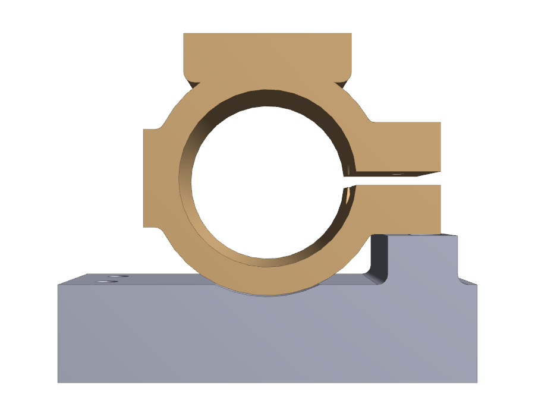

# Tap Collar (independent split-collar with vibration motor + solenoid mounts)

Parametric CAD for the tap collar requested in the issue
*Tap Collar Design*: a collar that sits rigidly around the auger and carries
an integrated **coin vibration motor** and **push/pull solenoid** to vibrate
and tap the auger so powder flows more reliably.

The piece is split into two independently-printed parts so the collar can
spin freely on the auger (which lets the motor and solenoid wiring stay
put) while a small hardstop bump on the chassis-mounted plate keeps it
from being dragged all the way around with the auger and winding up the
cabling.



## How it works

```
               ┌──────────────┐               ← push/pull solenoid
               │   solenoid   │                  (Adafruit 412 / TAU0730TM;
               │ ─── plunger ─┘                  plunger drops through the
               ▼   ↓  Ø7.5 plunger clearance     Ø7.5 hole — clears the Ø6.9
             ╱  ╲  ╱  ╲                          plunger bushing — and taps
            │ M3 ⊙   ⊙ M3│      ← solenoid top boss; the two M3 mount holes
             ╲────┬────╱          follow the real solenoid flange: diagonally
              ╲   │   ╱           opposite, 18.2 mm apart in X and 16.0 mm in
        ┌──┐    ────────    ┌──┐  Y.  Rectangular reinforced slab that sinks
        │  │  ╱        ╲    │  │  ← M3 clamp screw (sets the running fit;
   coin │  │ │  auger   │   ├──┤    the two horizontal clamp ears are the
  motor │  │ │   bore   │   │  │    "contact point" — the bottom ear rests
        │  │ │  Ø 25.5  │   └──┘    on the bump on the mounting plate,
        │  │  ╲        ╱            arresting rotation)
        └──┘   ────────
        ↑       (lower tab) ──┐
       coin-motor pad         │ rests on
       (rectangular slab,     ▼
        Ø10×1 mm recess,    ┌─── small hardstop bump (top just below the
        sinks 3 mm into     │    lower tab; +X corner M3 hole is countersunk
        the OD, filleted    │    through it for flush screw + screwdriver
        at the join)        ▼    access)
        ─────────────────────────────
        │ ⊙ M3                  M3 ⊙ │  ← rectangular mounting plate
        │     half-cyl. collar relief │     (4 corner M3 mounting holes,
        └─────────────────────────────┘      same footprint as PR #47 bracket,
                                             plus a half-cylindrical relief
                                             cut into the top so the collar
                                             can spin freely above it)
```

* The **mounting plate** (`mount_plate`) is the same rectangular flange and
  4-corner M3 mounting-hole pattern as the auger bracket from
  [PR #47](https://github.com/vertical-cloud-lab/powder-doser/pull/47).
  Instead of a circular collar it carries a small **hardstop bump** on
  the +X end of the plate top.  The bump:

  - has its top face 0.25 mm below the bottom face of the resting lower
    clamp tab, so the lower tab rests on the bump (the *contact point*
    from the drawing) and CCW rotation of the collar is arrested
    immediately;
  - sits **fully below** the lower-tab Z range, so it does *not*
    interfere with the collar at rest or while sliding it onto the
    auger (this fixes the PR #51 v1 column that was taller than the
    whole collar and made assembly physically impossible);
  - **straddles** the +X corner M3 mount hole (X = 17.25 → 27.20 mm), with
    a Ø 3.4 cylindrical cut-out through the bump body so the mount screw
    drives straight through it — the "hollow" option the reviewer called
    out.  The +X corner hole is **countersunk** (M3 90° flat-head,
    Ø 6 × 1.3 mm) into the bump top so the screw head sits flush and the
    bump's top face stays flat against the resting lower clamp tab.

  The plate top also carries a half-cylindrical **collar relief** at
  (x = 0, axis along Y, R = 17.00 mm = collar OD / 2 + 0.25 mm) cut
  straight through the plate Y-extent.  This gives the collar 0.5 mm
  diametral free-running clearance over the plate — the **same fit the
  bracket bore uses on the auger in [PR #46 / #47](https://github.com/vertical-cloud-lab/powder-doser/pull/47)**
  — so the collar can rotate freely above the plate instead of physically
  interfering with it (fix for the v2 1.5 mm direct overlap that came
  from inheriting `COLLAR_PLATE_OVERLAP` straight from the bracket).

* The **tap collar** (`tap_collar`) reuses the bracket's bore (Ø 25.5 for
  the Ø 25 mm Archimedes auger of [PR #16](https://github.com/vertical-cloud-lab/powder-doser/pull/16)),
  collar OD (Ø 33.5), 2 mm clamp slot, and clamp-ear / clamp-screw
  geometry — but with the slot rotated 90° so it opens to the +X side
  and the two clamp ears are horizontal at rest.  The collar's clamp
  screw is intended to set the running fit of the collar on the auger
  (snug enough that the collar stays put axially; loose enough that the
  auger can rotate freely inside it), not to lock it onto the shaft.

  The collar is **lengthened along the auger axis to 24 mm** (vs 12 mm on
  the bracket).  The extra Y-extent fixes the v1 problem where the
  solenoid mounting boss was wider than the collar in Y, so its mount
  holes hung half off the boss into mid-air; with the lengthened collar,
  both holes of the real solenoid's 16 mm Y-pitch pattern sit fully over
  solid collar material.  (It grew 18 → 24 mm in v7 to fit that real
  pattern — see the solenoid note below.)

* The **coin vibration motor** (Ø 10 × 3 mm adhesive coin-style motor, e.g.
  any "10 mm flat coin vibration motor") sits in a Ø 10 × 1 mm recess
  on a flat face on the **-X side** of the collar.  The face is the
  outer face of a **rectangular reinforced slab** (14 mm × 24 mm × ~4 mm)
  that sinks `PAD_COLLAR_OVERLAP` = 3 mm into the collar OD, with the
  slab/cylinder intersection blended by a 1.5 mm fillet — the same
  reinforcement template the bracket uses for its plate ↔ collar
  intersection in PR #47.  Result: the slab looks like it is coming out
  of the cylinder, instead of being a fragile flat plate tangent to it.
  Adhere the motor with its own foam-tape backing.

* The **push/pull solenoid** is the real part now in hand: an open-frame
  push/pull solenoid (**Adafruit 412** / Shanghai Chaocheng **TAU0730TM**,
  12 V; 51.9 mm overall incl. plunger, 29.7 mm body, 14 × 17 mm
  cross-section, Ø5 plunger cap, Ø6.9 plunger bushing).  It sits on a flat
  face on the **+Z** (top) side of the collar.  Same template as the coin
  pad: a **rectangular reinforced slab** (24 mm × 24 mm × ~7.0 mm)
  sinking 3 mm into the collar OD with a 1.5 mm fillet at the
  intersection.  The two mount holes follow the **real solenoid flange**
  — two **M3** holes on diagonally-opposite ears, **18.2 mm apart across
  the body (X) and 16.0 mm along it (Y)**, sized as self-tapping pilots
  for M3 screws driven through the solenoid's Ø3 flange holes into the
  printed boss.  Both holes sit fully over solid collar material thanks to
  the 24 mm collar length.  The solenoid body axis is oriented along **X**
  (perpendicular to the auger axis), and the **Ø7.5** plunger path is
  targeted so the extended tip reaches **3 mm into the auger OD**.
  Source: Adafruit 412 datasheet `412_C514-B_diagram.PDF` (PR #51
  [`4672498176`](https://github.com/vertical-cloud-lab/powder-doser/pull/51#issuecomment-4672498176)).

The motor and solenoid are mounted around the OD as suggested in the
sketch; rotating the boss and pad to taste is just a matter of changing
the angle in `cad_model.py`.

## Files

| File | What it is |
| --- | --- |
| [`cad_model.py`](cad_model.py) | Parametric CadQuery model.  Builds both parts.  Run it to (re)generate the STEPs and STLs. |
| [`mount_plate.step`](mount_plate.step) | STEP export of the mounting plate. |
| [`tap_collar.step`](tap_collar.step) | STEP export of the collar. |
| [`stl/mount_plate.stl`](stl/mount_plate.stl) | **Ready-to-print STL** of the mounting plate. |
| [`stl/tap_collar.stl`](stl/tap_collar.stl) | **Ready-to-print STL** of the collar. |
| [`render_views.py`](render_views.py) | Headless VTK render of iso/front/top/side views (per part + assembled pair). |
| [`renders/`](renders/) | PNG renders committed for the PR / README. |

## Key parameters (mm)

All parameters live at the top of [`cad_model.py`](cad_model.py).  The
shared geometry block is kept in lock-step with the bracket from PR #47;
the collar-only `TC_COLLAR_DEPTH`, the slab `PAD_COLLAR_OVERLAP`, the
plate `COLLAR_RELIEF_R`, and the bump-top countersink are the new
parameters added in the v2 / v3 redesigns.

| Parameter | Value | Notes |
| --- | --- | --- |
| `AUGER_OD` | 25.0 | Matches the Archimedes auger OD from [PR #16](https://github.com/vertical-cloud-lab/powder-doser/pull/16). |
| `BORE_CLEARANCE` | 0.5 | Diametral clearance — same free-running fit as the bracket. |
| `COLLAR_WALL` | 4.0 | Collar OD = 33.5 mm. |
| `PLATE_LENGTH × DEPTH × THICKNESS` | 60 × **24** × 14 | Same X length and corner-hole pattern as [PR #47](https://github.com/vertical-cloud-lab/powder-doser/pull/47), and same 29.25 mm bore-axis lift that clears the [PR #49](https://github.com/vertical-cloud-lab/powder-doser/pull/49) gear OD. `PLATE_DEPTH` is matched to `TC_COLLAR_DEPTH` so the mounting plate is the same width as the tap collar along the auger axis. |
| `TC_COLLAR_DEPTH` | **24.0** | Collar Y-extent — longer than the bracket's 12 mm so the solenoid boss is fully supported underneath and the real diagonal flange-hole pattern stays over solid material. `PLATE_DEPTH` tracks this value. |
| `MOUNT_HOLE_INSET_X` / `MOUNT_HOLE_D` | 6.0 / 3.4 | M3 corner mounting holes — same as the bracket. |
| `BUMP_INNER_X / BUMP_OUTER_X` | 17.25 / 27.20 | Hardstop bump straddles the +X corner mount hole — Ø3.4 cut-out through the bump preserves screwdriver access. |
| `BUMP_TOP_Z / BUMP_HEIGHT` | 21.00 / 7.00 | Bump top sits 0.25 mm below the lower clamp tab's bottom face — no collar interference, single-direction hard contact at rest. |
| `CLAMP_GAP` / `CLAMP_SCREW_D` | 2.0 / 3.4 | Drawing callout slot width + M3 clearance through both ears. |
| `TC_TAB_W × H` | 8 × 7 | Clamp ears, widened along X (was 3 mm on the bracket) so the lower ear reaches over the +X hardstop bump. |
| `TAB_COLLAR_OVERLAP` | 6.0 | How far the tab block sinks into the collar OD so the union forms a continuous solid. |
| `COIN_MOTOR_D` / `COIN_MOTOR_RECESS_DEPTH` | 10.0 / 1.0 | Adhesive Ø10 coin vibration motor; 1 mm shallow recess locates the motor on the side pad. |
| `COIN_PAD_W` / `PAD_COLLAR_OVERLAP` | 14 / 3 | Rectangular slab face width × overlap into the collar OD (same template as the bracket's plate↔collar reinforcement in PR #47). |
| `SOLENOID_BOSS_W` / `PROUD` | 24 / 4 | Rectangular slab face width × height above `COLLAR_TOP_Z`; raised so the M3 holes have slab depth to thread into. Same 3 mm overlap into the collar OD as the coin pad. |
| `COLLAR_RELIEF_R` / `COLLAR_RELIEF_CLEARANCE` | 17.00 / 0.5 | Half-cylindrical relief in the mounting plate top — same 0.5 mm diametral free-running fit the bracket bore uses on the auger. |
| `CSK_HEAD_D / CSK_DEPTH` | 6.0 / 1.30 | M3 90° flat-head countersink in the +X mount hole, sunk into the bump top so the screw head sits flush. |
| `SOLENOID_HOLE_PITCH_ACROSS / _ALONG` | 18.2 / 16.0 | Real **Adafruit 412 / TAU0730TM** flange: two diagonally-opposite mount holes, 18.2 mm apart across the body and 16.0 mm along it. |
| `SOLENOID_SCREW_D` | 2.7 | Self-tapping pilot for M3 screws driven through the solenoid's Ø3 flange holes into the printed boss. |
| `SOLENOID_PLUNGER_D` | 7.5 | Plunger clearance hole through the full collar wall — opened from Ø6 to clear the Ø6.9 plunger bushing. |
| `SOLENOID_INTERFERENCE_INTO_AUGER` | 3.0 | Sets the plunger-tip target depth into the auger OD at full extension. |
| `FILLET_PLATE_BUMP` / `FILLET_TAB_COLLAR` | 1.5 / 1.0 | Stress-relief / cosmetic blends. |

Defensive `assert`s catch parameter retunes that would:
- push the solenoid mount holes through the central plunger hole, off
  the boss footprint (X or Y), or off the collar Y-extent (so it isn't
  possible to silently regress the v1 cantilever bug);
- push the hardstop bump above the lower-tab Z range (which would make
  the collar physically un-installable);
- push the hardstop bump past the plate end.

## Print orientation

Both parts print with the **plate / boss face down on the bed**, the same
as the bracket — bore axis ends up parallel to the bed and no internal
supports are needed inside the collar bore.

## Regenerating outputs

```sh
cd design/cad/tap-collar
python cad_model.py                  # writes *.step + stl/*.stl
xvfb-run -a python render_views.py   # iso/front/top/side PNGs in renders/
```
