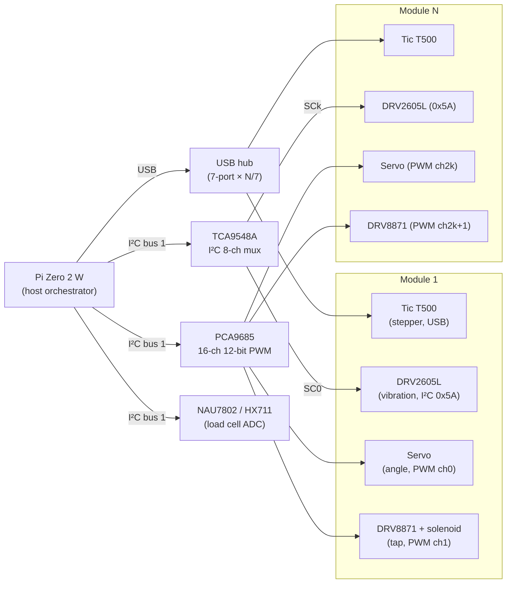
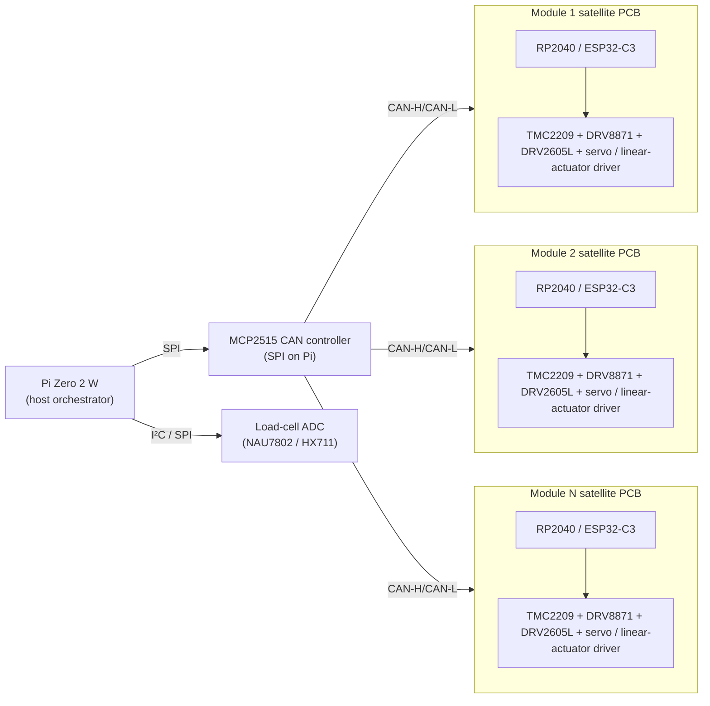
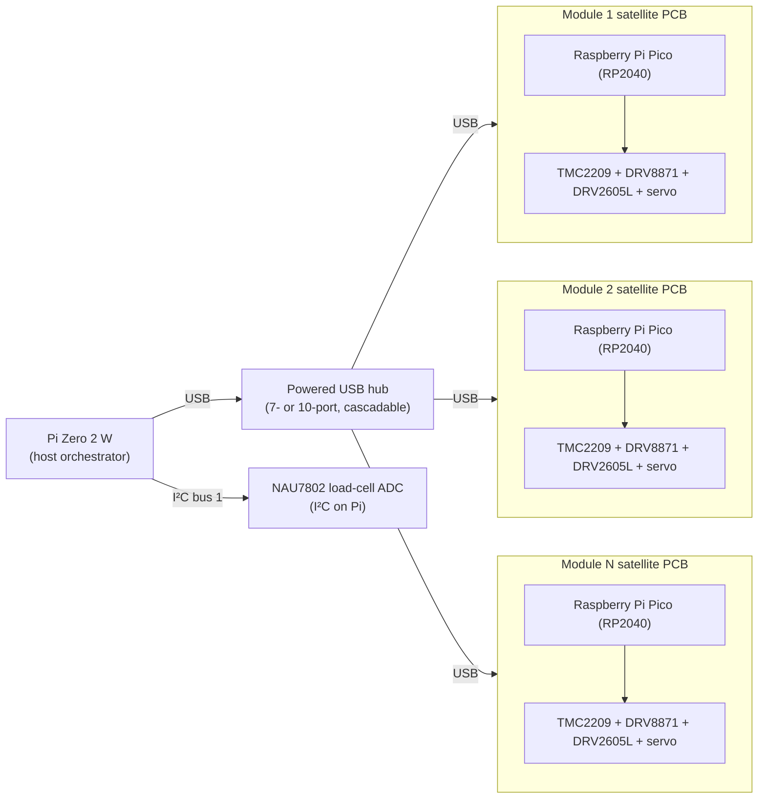

# Powder doser — electrical & software brainstorming (design 2.2)

This document is the written output of the brainstorming session called
for in [issue #44][i44]: an exploration of *electrical-* and
*software-architecture-level* options for the **modular, N parallel
channels** dispenser concept (architecture 2.2 in the
[`design/brainstorming.md`][bdoc] write-up from [PR #31][i31]).

The actuator choices for **a single channel** are already locked by
[PR #25][i25] (NEMA 11 stepper + Pololu DRV8825 *or* Tic T500, JF-0530B
solenoid + Adafruit DRV8871, ERM/LRA on Adafruit DRV2605L, all hosted
on a Raspberry Pi Zero 2 W via an Adafruit Perma-Proto Bonnet). This
document does **not** revisit those parts; it asks what changes when
that one-channel stack has to be replicated 8–12 times (per §1 of the
[design brainstorming][bdoc]) and grown to ~30 channels later.

No hardware is built or ordered here. The deliverable is a written
comparison of three system-level electrical/software topologies plus
small reference code snippets so the next PR can pick one and build it.

[i25]: https://github.com/vertical-cloud-lab/powder-doser/pull/25
[i31]: https://github.com/vertical-cloud-lab/powder-doser/pull/31
[i44]: https://github.com/vertical-cloud-lab/powder-doser/issues/44
[bdoc]: ./brainstorming.md

## 1. Requirements recap (electrical / software)

Distilled from the issue text and the upstream documents:

- **Inputs to the system.** A blend recipe — a list of
  `(powder_id, mass_grams)` pairs — arrives from the host autonomy
  loop (e.g. as JSON over the lab network or as a Python call inside
  the same orchestrator process).
- **Per-channel control surface.** For each loaded powder the
  controller must independently command:
  1. **Auger rotation** — direction + step rate (effectively
     "RPM"), via the NEMA 11 stepper (#25).
  2. **Tap frequency / duty** — solenoid PWM train, via the
     JF-0530B + DRV8871 (#25).
  3. **Vibration frequency / amplitude / waveform** — via the
     ERM/LRA + DRV2605L (#25). The DRV2605L exposes both library
     waveforms and a real-time PWM/analog input.
  4. **Dispense angle** — *not yet specified by #25.* The issue
     calls out servo, stepper, or linear actuator as candidates;
     §2.4 below picks one for each topology.
- **Closed-loop dispense.** A scale / load cell sits under the shared
  collection cup (architecture 2.2 places one cup below an inward-
  aimed fan of channels — see the `cad/inward-collection-cup/` first-
  pass visualization introduced in [PR #31][i31]). The controller
  reads mass at ≥10 Hz and modulates each active
  channel's auger + tap + vibration to land each powder's mass within
  the §1 accuracy budget (±1 wt% baseline, ±0.1 wt% stretch).
- **Simultaneous + independent.** Two or more channels must be able
  to run *at the same time* without timing interference (e.g. one
  channel doing a slow trim while another is still mid bulk-dispense).
  This is the constraint that drives most of the topology trade space.
- **Easy expansion.** Adding a 9th, 10th, …, Nth channel should
  ideally be a *plug-in* operation in both electrical and software
  terms — no rewiring of existing channels, no recompile of existing
  channel firmware, ideally a single configuration entry per new
  channel.
- **Scale ceiling.** ~8–12 channels loaded simultaneously
  (the §1 sizing in [`brainstorming.md`][bdoc]), with a credible path
  to ~30 if a second ring or a larger cup is added.

## 2. The I/O fan-out problem on a Raspberry Pi Zero 2 W

The Pi Zero 2 W exposes a 2×20 GPIO header with the usual Broadcom
peripherals. What's actually available *and* what each peripheral
costs to fan out per channel is summarized below — these counts are
why a "just wire more GPIOs to a bigger Pi" answer doesn't scale.

| Peripheral on Pi Zero 2 W           | Native count                           | Per-channel demand (#25 stack + angle) | Headroom at N=8 / N=12 / N=30                |
|-------------------------------------|----------------------------------------|----------------------------------------|----------------------------------------------|
| GPIO pins (BCM)                     | 26 usable (after I²C/SPI/UART pinmux)  | DRV8825: STEP+DIR+~EN = 3; DRV8871: 1 PWM; servo angle: 1 PWM = **5 GPIO/ch** | 8→40, 12→60, 30→150 — **busts the header at N≥6** |
| Hardware PWM channels               | 2 (GPIO12/13 and GPIO18/19, paired)    | Solenoid tap PWM + (optional) servo    | **Already exhausted at N=1** — software PWM jitters under Linux load |
| I²C buses (BSC0/BSC1)               | 1 user bus (`/dev/i2c-1`) at up to 400 kHz | DRV2605L per channel = 1 I²C addr; load cell ADC if I²C | All 30 DRV2605Ls share **one fixed 7-bit address (0x5A)** → must use I²C **mux** (e.g. TCA9548A) or per-module satellite |
| SPI buses                           | 2 (`spidev0.0/0.1`, `spidev1.0/1.1/1.2`) | optional ADC for HX711-style load cells | Plenty for the load cell; not enough for fan-out alone |
| Hardware UART                       | 1 (PL011) + 1 mini-UART (shared with BT) | TMC stepper drivers can multi-drop on UART | One bus serves up to ~8 TMC drivers comfortably |
| USB host (via OTG hub)              | 1 micro-USB OTG, expandable with a hub | Tic T500 stepper driver: 1 USB endpoint per stepper | A 7-port hub gives 7 channels per hub; cascadable |
| Realtime jitter                     | non-RT Linux, ~100 µs typical, ms tails | step pulses tolerate ms jitter at low microstep; tap/vibration tolerate ms jitter; **angle servo PWM does not** (visible twitch) | Anything time-critical (microstepped step pulses, RC-servo PWM) really wants a satellite MCU |

Two structural conclusions fall out:

- **The DRV2605L address collision alone forces fan-out.** All Adafruit
  DRV2605L breakouts ship with the same fixed I²C address (0x5A) and
  the chip provides no address-strap pin, so any topology that
  multiplexes more than one DRV2605L onto the same Pi I²C bus needs
  either a TCA9548A-style **I²C mux** (the address collision is
  resolved by enabling one downstream segment at a time) or a
  per-module satellite MCU that owns its own I²C bus.
- **Linux on the Pi is not a real-time controller for tens of channels.**
  Soft-PWM jitter on RC-servo angle control and on microstepped step
  trains gets visibly worse as channel count and CPU load rise. Topo-
  logies that push the *step pulse* and *servo PWM* generation to a
  satellite controller — whether a small MCU per module or a dedicated
  PWM/stepper IC like the PCA9685 / Tic T500 / TMC2209 — are the ones
  that scale.

## 2a. Per-channel actuator block (already designed, #25)

Inside *one* module, the electrical stack is whatever PR #25 settles
on. The KiCad project introduced in [PR #25][i25] (under
`hardware/kicad/` once that PR lands) is the reference for the
per-module schematic — the topologies in §3 below treat that block
as a black box with a small set of per-module signals (I²C, optional
UART/USB, optional digital I/O, 12 V + 5 V + GND). When a topology
in §3 says "duplicate the #25 stack N times", it means duplicate
that schematic; no edits to the per-channel electrical design are
implied.

## 2b. Angle-control sub-problem

Per the issue, the angle actuator is **not yet chosen**. Three
candidates, scored against the constraint that whatever we pick has
to fit inside the per-module envelope, draw from the same supplies
already on the Bonnet (5 V / 12 V), and be drivable from whichever
host topology §3 lands on:

| Candidate                                   | Range / resolution           | Drive interface                                          | Cost / module | Fit with §3 topologies                                            | Pitfalls                                                          |
|---------------------------------------------|------------------------------|----------------------------------------------------------|---------------|-------------------------------------------------------------------|-------------------------------------------------------------------|
| **Hobby RC servo** (e.g. MG996R, DS3225)    | 0–180°, ~1°                  | 50 Hz PWM, 1–2 ms pulse, 5–6 V                           | $5–$25        | Pairs naturally with PCA9685 (3a) or with a satellite MCU (3b/3c) | Soft-PWM on the Pi jitters; needs hardware PWM or PCA9685 or MCU |
| **NEMA 8 / NEMA 11 stepper + lead-screw**   | continuous, microstepped     | STEP/DIR/~EN on a small driver (TMC2209, A4988, DRV8825) | $20–$45       | Same family of drivers as the auger stepper; drop-in for 3b/3c    | More BOM per channel; needs homing                                |
| **Linear actuator** (e.g. Actuonix L12-I)   | 30/50/100 mm stroke, 0.1 mm  | RC-servo-style PWM *or* internal positioner over UART     | $70–$110      | PWM variant fits 3a, UART variant fits 3b/3c                      | Most expensive; extends the module envelope vertically            |

Recommendation for the *brainstorm* (not a final decision): a hobby
servo on a per-module PCA9685 channel is the cheapest path to "good
enough, ~1° resolution, drop-in across topologies"; a NEMA 8 + lead
screw is the right choice if we discover that some powders need
sub-degree reproducibility under vibration. The schematic effect is
just one extra signal on the per-module bus or one extra PWM pin
exposed by whatever fan-out chip the topology already uses; it does
**not** force a particular §3 topology.

## 3. Three candidate system topologies

For each topology the discussion lists the **block diagram**, the
**per-module wiring**, **how channels stay independent** (i.e. how
parallel control is achieved), the **add-a-module workflow** in
both electrical and software terms, the **benefits**, and the
**pitfalls**. The same per-module actuator stack from #25 is assumed
inside each module box; only the connection to the host changes.

### 3.1 Topology A — Pi-direct, I²C/SPI/USB fan-out boards

Keep the Pi Zero 2 W from #25 as the *only* compute element. Solve
fan-out with off-the-shelf I²C / SPI / USB expanders:



**Per-module wiring.** Each module needs: 12 V/5 V/GND, two SDA/SCL
wires (one pair from a TCA9548A downstream segment for that
module's DRV2605L), two PWM lines from a PCA9685, and one USB cable
back to the hub for the Tic T500 stepper driver.

**How channels stay independent.** All three actuator drives are
already non-blocking on the bus side (Tic T500 takes a "go to N
steps at rate R" command and runs autonomously over USB; PCA9685
holds its PWM outputs autonomously; DRV2605L holds its waveform
slot autonomously). The Pi is therefore free to issue commands to
any module at any time — true simultaneous control falls out for
free as long as the host code is async (see §6).

**Adding a module.** Electrical: plug into the next free TCA9548A
segment (1 of 8 per mux — cascade muxes for ≥9 channels), the next
two PCA9685 channels (16 channels per chip, so 8 modules per
PCA9685), and the next free USB-hub port. No per-module satellite
PCB. Software: add one entry to a YAML/JSON channel table giving
its mux segment, its first PWM channel, and its Tic T500 USB
serial. No firmware exists to recompile.

**Benefits.**

- Lowest BOM per module on the *electronics* side — no satellite MCU.
- Reuses the exact #25 actuator block unchanged.
- Add-a-module is a config-file edit; no firmware flash, no
  per-module address strap soldering.
- All compute and all logs live in one place (the Pi); easy to
  debug.

**Pitfalls.**

- **The Pi becomes the realtime element for tap/vibration timing.**
  Servo position via PCA9685 is fine (it has its own oscillator),
  but anything the Pi is timing in software (e.g. a tap-train
  envelope on a PCA9685 PWM that the Pi is reprogramming at 10 Hz)
  inherits Linux jitter.
- **USB fan-out for ≥8 Tic T500s gets cable-management-ugly.** USB
  hubs cascade fine electrically, but a fan of 12 USB cables radiating
  out of a Pi Zero 2 W is a packaging problem.
- **One I²C mux failure takes out all downstream channels** on that
  segment — the failure domain is "8 channels at a time".
- **A single Pi failure stops the whole rig.** No redundancy.
- **Cost balloons in a hidden way:** Tic T500 is ~$45 each; at N=12
  that's $540 in stepper drivers alone, vs. ~$5 each for a
  TMC2209 in 3b/3c.

### 3.2 Topology B — Per-module satellite MCU on a shared bus

Each module gets its own small microcontroller (RP2040 / ESP32-C3 /
STM32G0-class) that owns *its* DRV8825/TMC2209 + DRV8871 + DRV2605L
+ angle actuator. The Pi Zero 2 W is demoted to an orchestrator
that talks to all satellites over a shared bus (CAN, RS-485, or
even just I²C with each MCU configured as a slave at a unique
address).



**Per-module wiring.** Each module is now a small **satellite PCB**
carrying the MCU, the four drivers, and a 4-pin connector to the
backbone (CAN-H, CAN-L, 12 V, GND). 5 V is regenerated on the
satellite PCB from the 12 V rail with a tiny buck (e.g. MP1584).

**How channels stay independent.** Each satellite is an autonomous
controller. The Pi sends a command like
`{"target": 0.250, "rpm": 12, "tap_hz": 4, "vib_effect": 47}` and
the satellite runs the closed loop locally against that target,
streaming back current dispensed mass / status / done events. The
Pi never touches step pulses, never touches solenoid PWM edges,
never touches I²C arbitration with the DRV2605L; all of that is
local to the satellite. CAN at 500 kbit/s easily carries
≥1 kHz status messages from 30 satellites.

**Adding a module.** Electrical: T-tap onto the CAN backbone (with
a single 120 Ω terminator at each physical end). Software: one
config-table entry mapping `{module_id → CAN node-id, powder_id,
calibration profile}`; the Pi auto-discovers new node-ids on the
bus at startup with a CAN ping (see §7). Firmware on the satellite
is identical across modules — no per-module compile.

**Benefits.**

- **Hard real-time jitter problem disappears.** Step pulses and
  servo PWM are generated by a microcontroller with deterministic
  timing (RP2040 PIO is *especially* good at this — one PIO state
  machine per stepper trivially fans out 4+ steppers off a
  $1 MCU).
- **CAN bus is the simplest "drop-in N more modules" backbone in
  industry.** Two wires + ground + power, daisy-chained, no
  segments, no muxes. The IO-expansion capability of the chosen
  microcontroller (Pi Zero 2 W) is *augmented* trivially: any
  CAN-capable microcontroller can be added to the bus, and the Pi
  itself only needs one MCP2515 SPI controller (or a USB-CAN
  dongle like the Canable / CANUSB) regardless of how many
  satellites exist.
- **Failure isolation.** A wedged satellite stops one channel, not
  the whole rig — the Pi can mark it offline and continue with the
  remaining channels.
- **Per-module firmware update over the bus** (CANopen, or just a
  custom XMODEM-style boot block) is a known-good pattern.
- **Per-module BOM drops** vs. 3.1: a TMC2209 (~$5) replaces the
  Tic T500 ($45), and the RP2040 (~$1) is much cheaper than
  carrying a 7-port hub + per-module USB cable.

**Pitfalls.**

- **Two new things we now have to design ourselves:** the satellite
  PCB, and the satellite firmware. Both are small but both are
  scope creep over #25.
- **A first batch of satellite PCBs needs to be fabricated** —
  prototyping 12 boards on perfboard is feasible but tedious.
- **CAN tooling on the Pi** (SocketCAN + python-can) works well but
  is one more thing to learn for whoever maintains the system.
- **Per-module 12 V→5 V buck adds a heat / EMI consideration** that
  the centralized 5 V rail in 3.1 doesn't have.

### 3.3 Topology C — Hybrid (recommended): satellite MCUs over USB-CDC

Same partition as 3.2 (per-module RP2040 owns the per-module
realtime control), but the bus is **USB-CDC serial** through a
powered USB hub, rather than CAN. The RP2040 happens to be
extraordinarily cheap and ships with native USB; a $4 Raspberry
Pi Pico is the satellite. Each module enumerates as
`/dev/serial/by-id/usb-VCL_powderdoser_module_<sn>-if00` on the
Pi, where `<sn>` is the unique 64-bit board ID baked into the
RP2040 flash.



**Per-module wiring.** 12 V/GND backbone + one USB cable per module
back to the hub. The satellite PCB is a Pi Pico carrier with a
TMC2209 SilentStepStick socket, a DRV8871 footprint, a DRV2605L
footprint, and a servo header. The DRV2605L's I²C bus stays *on*
the satellite (one chip per local I²C bus → no address collision,
no mux).

**How channels stay independent.** Identical to 3.2 — each Pico
runs its own closed loop against the target the host gives it, and
host-side asyncio coroutines per channel issue commands and read
status without blocking each other (see §6).

**Adding a module.** Electrical: plug a USB cable into the next
free hub port and a 12 V power tap. Software: nothing — the host
detects the new `serial/by-id/...` symlink, queries it for its
firmware version + factory-baked board serial, and adds it to the
live channel registry. The user *configures* it (which powder is
loaded) through the host's UI, not through hardware straps.

**Benefits.**

- **Fewest new things to learn.** USB-CDC serial is the lowest-
  friction PC-to-MCU comms path that exists; every Linux distro
  has the drivers. CircuitPython / MicroPython / pico-sdk all
  speak it natively.
- **All the realtime benefits of 3.2** (RP2040 PIO step generation,
  hardware PWM for solenoid + servo, dedicated I²C for the
  DRV2605L) without the satellite PCB needing a CAN transceiver.
- **Auto-discovery is essentially free** because USB does the
  enumeration for us; the firmware just has to expose its serial
  number and a one-line `WHOAMI` command (see §7).
- **The same satellite PCB doubles as a development board** — flash
  it standalone over USB during bring-up.

**Pitfalls.**

- USB cables in a fan are still a packaging concern for N≥12 (same
  pitfall as 3.1).
- USB suspend / re-enumeration storms can happen if the hub
  browns out under load — needs a powered hub, not bus-powered.
- USB doesn't have CAN's natural multi-master / broadcast property;
  any "abort all channels NOW" command has to be a fanned-out
  serial write rather than a single bus broadcast. (In practice the
  per-channel `abort()` call from asyncio is plenty fast.)
- 12 V backbone + USB data still means *two* cables per module, vs.
  a single 4-conductor CAN cable in 3.2. For benchtop deployment
  this is fine; for a future inert-atmosphere enclosure (#1
  requirement bullet) that wants one feedthrough per module, 3.2
  wins.

### Comparison summary

| Criterion                                    | 3.1 Pi-direct fan-out | 3.2 CAN satellites | 3.3 USB-CDC satellites *(rec.)* |
|----------------------------------------------|-----------------------|--------------------|---------------------------------|
| New PCB needed?                              | No                    | Yes (satellite)    | Yes (satellite)                 |
| New firmware needed?                         | No                    | Yes (one image)    | Yes (one image)                 |
| Realtime jitter on step / servo PWM          | Bad (Linux-bound)     | Good (MCU)         | Good (MCU)                      |
| Add-a-module electrical work                 | Plug into mux + PCA9685 + USB hub | T-tap CAN | Plug USB cable      |
| Add-a-module software work                   | Edit channel table    | Auto-discover over CAN | Auto-discover over USB enum |
| Failure isolation                            | Per-mux segment (8 ch)| Per-channel        | Per-channel                     |
| Cost / channel (drivers only, est.)          | ~$60 (Tic + servo + DRV2605L + DRV8871) | ~$15 | ~$15                |
| Inert-atmosphere feedthrough story           | Many cables           | One CAN+power      | USB+power per module            |
| Effort to first prototype                    | Lowest                | Highest            | Middle                          |

**Recommendation** for the prototype: **3.3 (USB-CDC satellites)**.
It gets the realtime-jitter and BOM-cost wins of 3.2 without the
satellite needing a CAN transceiver or the team needing to learn
SocketCAN, and the add-a-module workflow degenerates to "plug it
in". A future v2 inside an inert-atmosphere enclosure can migrate
the firmware to CAN with the satellite PCB largely unchanged.

## 4. Where the load cell lives, and why it matters

The §1 closed-loop dispense requires a mass reading at ≥10 Hz that
is unambiguously associated with the *cup*, not with any one
channel. Two reasonable hosts for the load-cell ADC:

- **On the Pi directly.** A NAU7802 (24-bit, I²C, ~80 SPS) or
  HX711 (24-bit, custom 2-wire, ~10/80 SPS) connects to the Pi's
  spare I²C / GPIO pins. The Pi reads mass, decides which channel
  needs a "tap harder" or "slow down" command, and pushes that
  command down to the relevant satellite/PCA9685. **This is the
  recommended placement** in all three topologies, because the
  cup is shared and the feedback loop is naturally a host-level
  responsibility.
- **On a dedicated "scale module" satellite** (3.2/3.3 only). The
  load cell is wired to its own RP2040 satellite PCB, identical
  in form factor to the actuator satellites but populated with a
  HX711 instead of a TMC2209/DRV8871/DRV2605L. The host
  subscribes to its mass-stream messages. This is cleaner for
  hot-swapping the cup assembly but adds one more satellite to
  build.

The control loop itself is straightforward — it is a soft-trim
PID where the manipulated variable changes mid-dispense:

```
while not at_target(channel, mass_g):
    read_mass()
    if remaining_g > BULK_THRESHOLD:        # bulk phase
        cmd(channel, rpm=BULK_RPM, tap_hz=BULK_TAP, vib=BULK_VIB)
    elif remaining_g > TRIM_THRESHOLD:      # slowdown phase
        cmd(channel, rpm=BULK_RPM/4, tap_hz=BULK_TAP, vib=BULK_VIB)
    else:                                   # final-grain trim
        cmd(channel, rpm=0, tap_hz=TRIM_TAP, vib=0)
```

Each per-powder profile (`BULK_RPM`, `BULK_TAP`, `BULK_VIB`,
`TRIM_TAP`, the two thresholds, and an angle setpoint) lives in a
**calibration table** keyed by `powder_id` — that table is the
*only* thing that changes when a new powder is loaded into a
module.

## 5. Concurrency model — how channels run simultaneously

Whichever §3 topology we pick, the host-side code can use
`asyncio` to drive all channels concurrently from a single Python
process on the Pi. The pattern is the same:

```python
# host_orchestrator.py — minimal blend orchestrator (works for 3.1/3.2/3.3)
import asyncio
from powder_doser import Channel, Scale, load_calibration

async def dispense_one(ch: Channel, powder_id: str, target_g: float, scale: Scale):
    profile = load_calibration(powder_id)
    await ch.set_angle(profile["angle_deg"])          # one-shot pose
    await ch.set_vibration(profile["vib_effect"])     # waveform slot on DRV2605L
    await ch.set_tap(hz=profile["bulk_tap_hz"], duty=profile["bulk_tap_duty"])
    await ch.start_auger(rpm=profile["bulk_rpm"])

    async for mass_g in scale.stream(channel=ch.id, hz=20):
        remaining = target_g - mass_g
        if   remaining < profile["trim_g"]:           # final trim
            await ch.set_auger(rpm=0)
            await ch.set_tap(hz=profile["trim_tap_hz"], duty=profile["trim_tap_duty"])
        elif remaining < profile["slow_g"]:           # slowdown
            await ch.set_auger(rpm=profile["bulk_rpm"] / 4)
        if mass_g >= target_g - profile["tolerance_g"]:
            await ch.stop_all()
            return mass_g

async def run_blend(blend: dict[str, float]):
    scale = await Scale.connect()
    channels = {p: await Channel.for_powder(p) for p in blend}
    # All channels dispense in parallel; gather() blocks until all are done.
    return await asyncio.gather(*[
        dispense_one(channels[p], p, g, scale)
        for p, g in blend.items()
    ])

if __name__ == "__main__":
    recipe = {"316L": 120.0, "Ti6Al4V": 80.0, "IN718": 50.0}
    print(asyncio.run(run_blend(recipe)))
```

Why this is **simultaneous and independent**:

- `asyncio.gather()` schedules one coroutine per active channel.
  Each coroutine awaits I/O (USB, I²C, CAN) and yields to the
  scheduler between awaits.
- In topologies 3.2 / 3.3 the *actual* per-channel realtime work
  (step pulses at 5–50 kHz, solenoid PWM at 1–20 Hz, servo PWM at
  50 Hz) happens on the satellite MCU and runs uninterrupted by
  whatever else the Pi is doing. The Pi only needs to push
  setpoint changes a few times per second, which asyncio handles
  trivially.
- In topology 3.1 the PCA9685 and Tic T500 likewise hold their
  outputs autonomously between Pi commands, so the Pi-side
  asyncio model is unchanged.
- A failed or lagging channel only blocks *its* coroutine; the
  others keep running. `gather()` collects results / exceptions
  per-channel.

A `threading.Thread` per channel would also work, but `asyncio` is
preferred because all of the per-channel work is I/O-bound (waiting
on USB/CAN/I²C transactions and on the scale stream) and asyncio
avoids the GIL ceremony.

## 6. Per-module satellite firmware sketch (topologies 3.2 / 3.3)

A single firmware image on every satellite — the Pi sends commands
and the firmware just executes them. The skeleton below is
MicroPython on an RP2040; CircuitPython or pico-sdk C would map
1:1.

```python
# satellite_firmware.py (RP2040, MicroPython) — runs on every module
import sys, ujson, machine
from machine import Pin, PWM, I2C

# Pin map — same on every satellite PCB rev A.
STEP, DIR, EN = Pin(2, Pin.OUT), Pin(3, Pin.OUT), Pin(4, Pin.OUT, value=1)
TAP_PWM       = PWM(Pin(5));  TAP_PWM.freq(10);  TAP_PWM.duty_u16(0)
SERVO_PWM     = PWM(Pin(6));  SERVO_PWM.freq(50)
I2C_LOCAL     = I2C(0, scl=Pin(9), sda=Pin(8), freq=400_000)   # DRV2605L lives here, alone

import drv2605                                                 # local driver lib
HAPTIC = drv2605.DRV2605(I2C_LOCAL)

# RP2040 PIO does the step train so the CPU stays free for USB.
import rp2
@rp2.asm_pio(set_init=rp2.PIO.OUT_LOW)
def step_pulse():                                              # one step per loop
    set(pins, 1) [15]
    set(pins, 0) [15]
sm = rp2.StateMachine(0, step_pulse, freq=2_000, set_base=STEP)

WHOAMI = {"product": "powderdoser-module", "fw": "0.1", "sn": machine.unique_id().hex()}

def handle(cmd):
    op = cmd["op"]
    if   op == "whoami":     return WHOAMI
    elif op == "set_auger":                                    # rpm: float
        rpm = cmd["rpm"]
        if rpm == 0: sm.active(0); EN.value(1); return {"ok": True}
        EN.value(0); sm.freq(int(rpm * 200 / 60)); sm.active(1); return {"ok": True}
    elif op == "set_tap":                                      # hz, duty 0..1
        TAP_PWM.freq(int(cmd["hz"]))
        TAP_PWM.duty_u16(int(cmd["duty"] * 65535))
        return {"ok": True}
    elif op == "set_vibration":                                # waveform slot 0..123
        HAPTIC.sequence[0] = drv2605.Effect(cmd["effect"]); HAPTIC.play()
        return {"ok": True}
    elif op == "set_angle":                                    # degrees 0..180
        us = 1000 + int(cmd["deg"] * 1000 / 180)               # 1.0–2.0 ms pulse
        SERVO_PWM.duty_u16(int(us * 65535 * 50 / 1_000_000))
        return {"ok": True}
    elif op == "stop_all":
        sm.active(0); EN.value(1); TAP_PWM.duty_u16(0); HAPTIC.stop()
        return {"ok": True}
    return {"error": f"unknown op {op}"}

# Newline-delimited JSON over USB-CDC stdin/stdout.
while True:
    line = sys.stdin.readline()
    if not line: continue
    try:    resp = handle(ujson.loads(line))
    except Exception as e: resp = {"error": repr(e)}
    sys.stdout.write(ujson.dumps(resp) + "\n")
```

Notes on this sketch:

- **One firmware, no per-module compile.** The board's identity is
  `machine.unique_id()` — read by the host on first contact.
- **Step generation lives in PIO**, not in a Python loop, so the
  motor doesn't stutter when the USB stack is busy.
- **The DRV2605L gets its own dedicated I²C bus** (the satellite's
  local one) — no mux, no address collision with other modules,
  even though every module's chip is at 0x5A.
- **Solenoid tap and servo angle use hardware PWM**, not soft PWM.

## 7. Module discovery / hot-add

The "easily added" requirement turns into a small auto-discovery
protocol:

- **Topology 3.1.** No discovery — channels are wholly defined by
  the YAML/JSON channel table. Adding a module is a config commit.
  Trade-off: the table is now part of the source of truth and has
  to stay in sync with the wiring.
- **Topology 3.2 (CAN).** On boot the Pi sends a broadcast `WHOAMI`
  (e.g. CAN ID 0x100); every satellite responds on a unique
  ID derived from its 64-bit unique ID hash modulo the 11-bit CAN
  ID space (collisions resolved by retry with salt). The host
  builds the channel registry from the responses. Hot-add: the
  satellite spontaneously sends `HELLO` when it powers on; the
  host listens.
- **Topology 3.3 (USB-CDC).** The Pi watches `pyudev` for new
  `tty` devices under `/dev/serial/by-id/`. On each new device it
  opens the port, sends `{"op":"whoami"}`, and adds the returned
  `sn` to the channel registry. Hot-unplug fires the inverse
  event.

In all three cases the **channel↔powder assignment** (which
physical channel currently holds which powder) is *operator*
metadata — it lives in the host's channel registry, gets persisted
to disk, and is editable from the host UI / a CLI, not from
hardware straps. This means a module can be physically moved
between bays without rewiring or reflashing.

A small example of the discovery loop for 3.3:

```python
# discovery.py — host-side, polls /dev/serial/by-id/ and registers modules
import asyncio, glob, json, serial_asyncio

REGISTRY: dict[str, "Channel"] = {}   # sn -> Channel

async def probe(path):
    reader, writer = await serial_asyncio.open_serial_connection(url=path, baudrate=115200)
    writer.write(b'{"op":"whoami"}\n'); await writer.drain()
    line = await reader.readline()
    return json.loads(line)           # {"product": "...", "fw": "...", "sn": "..."}

async def watch():
    while True:
        for path in glob.glob("/dev/serial/by-id/usb-VCL_powderdoser_module_*"):
            if path in REGISTRY: continue
            info = await probe(path)
            REGISTRY[info["sn"]] = Channel(path=path, **info)
            print(f"[+] registered module {info['sn']} on {path}")
        await asyncio.sleep(2.0)
```

## 8. Where this leaves the open angle-control decision

The angle actuator (§2b) doesn't force a topology choice in either
direction — every candidate (servo / NEMA stepper / linear actuator)
has a clean home in all three topologies. The decision can therefore
be deferred until we have one physical channel built and can answer
the empirical question *"how repeatable does the angle have to be
for the powders we actually care about?"* A separate follow-up
issue should:

1. Pick two test powders with known angle-sensitive behaviour (e.g.
   a free-flowing 316L gas-atomized lot and a sticky organic
   like the POSE xanthan gum).
2. Sweep angle with a manual indexed mount; measure mass-flow
   variance at each setpoint.
3. Decide whether ~1° (servo) is sufficient or whether ~0.1°
   (NEMA + lead screw) is required.

## 9. Open questions

- **TMC2209 vs DRV8825 vs Tic T500 for the per-channel stepper.**
  #25 picked DRV8825 / Tic T500 for the *single*-channel build.
  Topologies 3.2 / 3.3 prefer TMC2209 (UART-configurable, silent,
  cheap) — does the per-channel BOM win justify deviating from
  #25's parts list?
- **Load-cell ADC choice.** NAU7802 (I²C) is cleanest topology-
  wise; HX711 is cheaper and has more reference code in the lab
  but uses a custom 2-wire protocol that's a chore from Linux.
- **Inert-atmosphere v2 feedthrough budget.** If the v2 enclosure
  is going to be built, that pushes us toward 3.2 (one feedthrough
  per module) over 3.3 (two cables per module).
- **Satellite PCB vendor / form factor.** If we go 3.2 or 3.3 the
  satellite PCB needs a first-pass layout. Castellated Pi Pico
  carrier on JLCPCB is the cheapest path; a Pi Pico + perfboard
  carrier is fine for the first ~3 modules.
- **Emergency-stop topology.** A single hardware E-stop wired into
  the 12 V backbone needs to drop power to all augers without
  bricking the Pi or losing the load-cell tare; this is straight-
  forward in 3.2 (latching contactor on the 12 V rail) but worth
  confirming in 3.1 / 3.3.
- **Calibration data lifecycle.** Per-powder profiles will drift as
  hopper level drops; do we recalibrate per-blend, per-campaign,
  or only when the operator says so? This is software, not
  hardware, but it interacts with the channel registry from §7.

These are deferred to follow-up issues; this document is only
trying to map the design space, not close it.
