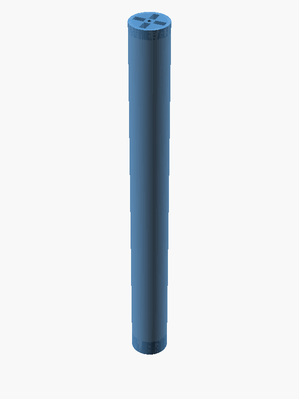
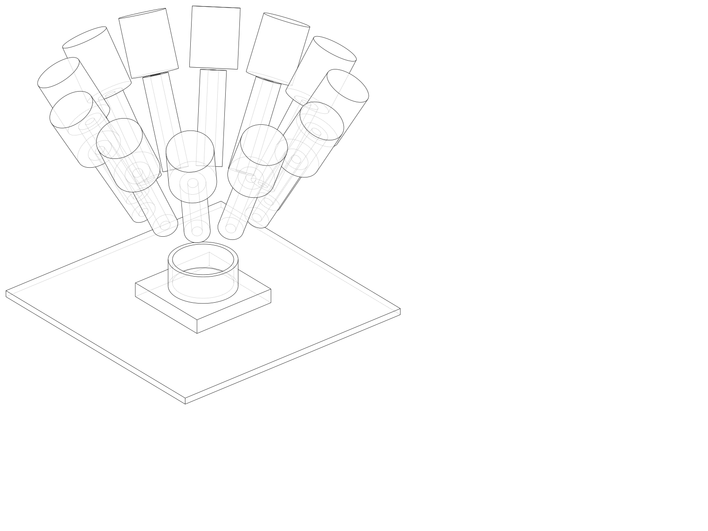

# Orientation for new research students

Welcome to the **powder-doser** project — the feedstock-preparation node of a
closed-loop, Bayesian-optimization alloy-development pipeline being built by the
**Vertical Cloud Lab (VCL) at BYU** (advisor: Sterling G. Baird,
[@sgbaird](https://github.com/sgbaird)). This document is the fastest path from
"I just got repo access" to "I understand what we're building, why, who is
working on what, and where everything lives." It was requested in issue
[#160](https://github.com/vertical-cloud-lab/powder-doser/issues/160) and is
maintained alongside the [README](../README.md).

**The one-paragraph pitch** (from the working abstract in
[#160](https://github.com/vertical-cloud-lab/powder-doser/issues/160)):
an open-source programmable powder doser with a **sub-$1,000 bill-of-materials
target**, designed to meter and blend cohesive, static-prone alloy-precursor
powders. Design targets: **15+ independently addressable reservoirs**,
**250 mL blends**, **±1 mg per-powder accuracy**, dosing under inert
atmosphere. Cross-contamination is prevented *by design* — each powder gets a
dedicated auger, exchanged by an **automated auger-swap system** (the
"multi-doser"). A machine-learning calibration layer trained on gravimetric
load-cell feedback maps actuator parameters to dispensed mass. Dosed powders
will feed ultrasonic atomization and laser powder bed fusion (L-PBF).

## The project in one figure

The doser is stage (a) of the autonomous alloy-development loop in the
[BYU/Utah NASA Space Grant proposal](../proposals/byu-nasa-space-grant-2026/):

## What the device is today (September 2026)

A validated **single-channel bench rig**, plus a **multi-doser prototype** in
active design and printing (see [the multi-doser section](#the-multi-doser-current-focus)).

The single channel is:

- A 250 mm × 25 mm rotating **dispenser tube** ("auger" — v5 is a hollow tube;
  the v1→v5 history is documented in the header of
  [`cad/auger/archimedes-auger.scad`](../cad/auger/archimedes-auger.scad)).
  Sam Charles' "Auger Type 4" ([`Auger4.stl`](../Auger4.stl)) is the main
  printed design. Metering is by rotation + gravity, with de-bridging assists.
- **Direct drive, 1:1** — a NEMA 11 stepper (11HS18-0674S) through a 5 mm
  ST-FC01 beam coupler onto the auger. There is no gearbox; resolution comes
  from microstepping.
- **Agitation and trim** — a JF-0530B solenoid "tapper" and an ERM vibration
  motor mounted on a tap collar; a servo tilts the module between 0° and 90°.
- **Gravimetric feedback** — an A&D **HR-100A** analytical balance under the
  collection cup closes the dose loop (read over RS232 via a Waveshare
  Pico-2CH-RS232 module; see PR
  [#100](https://github.com/vertical-cloud-lab/powder-doser/pull/100)).
  Runs are logged to MongoDB and the bench is on a rolling YouTube
  livestream ([@byu-vcl-hardware-streams](https://youtube.com/@byu-vcl-hardware-streams)),
  so every dose has a timestamped video link.
- **Control** — MicroPython firmware for a Raspberry Pi Pico W
  ([`hardware/test-module/firmware/main.py`](../hardware/test-module/firmware/main.py))
  exposing a one-line serial command REPL (stepper, solenoid, vibration,
  servo, emergency stop), plus a Raspberry Pi on Tailscale for remote
  access. The rig lives in a fume hood at BYU.
- **Printed on** a Bambu Lab H2D (ready-to-print G-code under
  [`cad/auger/slices/`](../cad/auger/slices/)).
- **Cost** — about $163 for the single-channel v1, dropping toward
  $98/channel at scale (see the hardware "bible",
  [`hardware/vibration-motor-and-solenoid.md`](../hardware/vibration-motor-and-solenoid.md)).

 

*Left: the current dispenser tube. Right: the v1 reference architecture from
[`design/brainstorming.md`](../design/brainstorming.md) §2.2 — N parallel
channels aimed at one collection cup on a load cell.*

## Project history — how we got here

The repository has **two eras**. Knowing this saves a lot of confusion,
because the README's design-history sections and `docs/manuscript/` describe
the *first* era, not the current device.

| When (2026) | What happened | Key links |
|---|---|---|
| **Apr 23–24** | **Era 1: the "powder-excavator".** A pure-mechanical, gantry-mounted tilting trough for scooping powder. Hand sketch → Edison Scientific design reviews (which killed the original sawtooth/transverse-pivot design) → CadQuery parametric CAD → a design-notes manuscript. Devora Najjar's viability analysis in [#3](https://github.com/vertical-cloud-lab/powder-doser/issues/3) recommended **closed-loop gravimetric dosing** (balance under the target; a 0.05 mg-resolution load cell supports ±1 mg doses) — the architecture still in use — and the discussion in [#1](https://github.com/vertical-cloud-lab/powder-doser/issues/1) pivoted toward a vertical **Archimedes auger** with solenoid tapping and vibration, seeded by Devora's first auger CAD. | Issues [#1](https://github.com/vertical-cloud-lab/powder-doser/issues/1), [#3](https://github.com/vertical-cloud-lab/powder-doser/issues/3); PRs [#2](https://github.com/vertical-cloud-lab/powder-doser/pull/2), [#16](https://github.com/vertical-cloud-lab/powder-doser/pull/16); [`docs/edison/`](edison/), [`docs/manuscript/`](manuscript/), [`cad/`](../cad/) |
| **May 5–8** | **The pivot to a powder doser.** Repo renamed ([#20](https://github.com/vertical-cloud-lab/powder-doser/issues/20)); commercial dispensers surveyed and found to cost $10k–30k ([#10](https://github.com/vertical-cloud-lab/powder-doser/issues/10), [#32](https://github.com/vertical-cloud-lab/powder-doser/issues/32)); Sam Charles' **NASA Space Grant proposal** drafted ([#26](https://github.com/vertical-cloud-lab/powder-doser/issues/26) → PR [#27](https://github.com/vertical-cloud-lab/powder-doser/pull/27)); the seven-architecture brainstorm written ([#30](https://github.com/vertical-cloud-lab/powder-doser/issues/30) → PR [#31](https://github.com/vertical-cloud-lab/powder-doser/pull/31), now [`design/brainstorming.md`](../design/brainstorming.md)). A rotating-tube proof of concept was designed and printed **in about 24 hours** at the POSE workshop ([`POSE_tube_xanthan_gum.png`](../POSE_tube_xanthan_gum.png), [slides](https://docs.google.com/presentation/d/1SZyMInTeK6V5QMu_9ptvdzXFou06gq9Mr7xBxdh9StA/edit?usp=sharing)). | [`proposals/byu-nasa-space-grant-2026/`](../proposals/byu-nasa-space-grant-2026/), [`design/brainstorming.md`](../design/brainstorming.md) |
| **May 11** | **The commitment meeting.** Sam and Sterling committed to the auger + solenoid tap + vibration mechanism set, cross-contamination as the governing constraint, and a **build-one-module-first, replicate-later** strategy. The full transcript is in the repo. | [`powder-doser-transcript-2026-05-11.txt`](../powder-doser-transcript-2026-05-11.txt) |
| **May 12–19** | **Part-by-part CAD sprint** (Sam driving, agents executing). After whole-module AI designs ([#34](https://github.com/vertical-cloud-lab/powder-doser/issues/34) → PR [#35](https://github.com/vertical-cloud-lab/powder-doser/pull/35)) proved hard to iterate, [#46](https://github.com/vertical-cloud-lab/powder-doser/issues/46) set the loop that stuck: **humans draw an engineering sketch → the agent CADs one part → the lab prints it → feedback goes back as photos**. Parts: sealing cap ([#36](https://github.com/vertical-cloud-lab/powder-doser/issues/36)), geared auger ([#48](https://github.com/vertical-cloud-lab/powder-doser/issues/48) → PR [#49](https://github.com/vertical-cloud-lab/powder-doser/pull/49) — its threaded storage augers are the ones used in calibration), tap collar ([#50](https://github.com/vertical-cloud-lab/powder-doser/issues/50)), mounting plate + tilt ([#62](https://github.com/vertical-cloud-lab/powder-doser/issues/62), [#65](https://github.com/vertical-cloud-lab/powder-doser/issues/65)). In parallel, the **electrical/software architecture** ([#44](https://github.com/vertical-cloud-lab/powder-doser/issues/44)) and **test-module electronics** ([#60](https://github.com/vertical-cloud-lab/powder-doser/issues/60) → PR [#61](https://github.com/vertical-cloud-lab/powder-doser/pull/61), William Mulberry) took shape, along with the full BOM and KiCad schematic under [`hardware/`](../hardware/). | [`hardware/vibration-motor-and-solenoid.md`](../hardware/vibration-motor-and-solenoid.md), [`hardware/kicad/`](../hardware/kicad/) |
| **May–Jun** | **Generative-CAD and generative-PCB experiments** — a research thread in its own right (the NASA proposal's research question is *agentic generative CAD*). CAD: zoo.dev vs CADsmith on simple/complex parts ([#52](https://github.com/vertical-cloud-lab/powder-doser/issues/52), [#54](https://github.com/vertical-cloud-lab/powder-doser/issues/54), [#56](https://github.com/vertical-cloud-lab/powder-doser/issues/56), [#58](https://github.com/vertical-cloud-lab/powder-doser/issues/58)), then a four-way spec-driven bake-off: Copilot-only, Zoo API, Zoo Design Studio, CADSmith ([#104](https://github.com/vertical-cloud-lab/powder-doser/issues/104)–[#112](https://github.com/vertical-cloud-lab/powder-doser/pull/112)). Verdict on Zoo Design Studio from recorded sessions in [#92](https://github.com/vertical-cloud-lab/powder-doser/issues/92): much better spatial reasoning than Copilot (1–2 iterations vs 7–8), but each iteration takes about an hour ([Sam's full session](https://www.youtube.com/watch?v=6YsOMIsOfkY), [Will's simple-part video](https://youtu.be/DwFI1eQ_3bI)). PCB: flux.ai ([#82](https://github.com/vertical-cloud-lab/powder-doser/issues/82)), DeepPCB ([#94](https://github.com/vertical-cloud-lab/powder-doser/issues/94)), Quilter.ai ([#95](https://github.com/vertical-cloud-lab/powder-doser/issues/95)), agentic schematic review ([#87](https://github.com/vertical-cloud-lab/powder-doser/issues/87)) — Luke Winters leading the PCB side. | [`paper/background/`](../paper/background/) |
| **Jun** | **Bench bring-up.** Auger Type 4 uploaded (Jun 8); William's firmware fixes from the real bench (Jun 9–15); **closed-loop dosing with the HR-100A scale** designed ([#99](https://github.com/vertical-cloud-lab/powder-doser/issues/99) → PR [#100](https://github.com/vertical-cloud-lab/powder-doser/pull/100): coarse auger + fine tap trim); bill of materials ([#114](https://github.com/vertical-cloud-lab/powder-doser/issues/114) → PR [#115](https://github.com/vertical-cloud-lab/powder-doser/pull/115)); manuscript drafting begins ([#96](https://github.com/vertical-cloud-lab/powder-doser/issues/96) → PR [#97](https://github.com/vertical-cloud-lab/powder-doser/pull/97)); conference abstracts ([#77](https://github.com/vertical-cloud-lab/powder-doser/issues/77) → PR [#78](https://github.com/vertical-cloud-lab/powder-doser/pull/78)). The **@claude GitHub workflow** lands (PR [#118](https://github.com/vertical-cloud-lab/powder-doser/pull/118), Jun 30). | |
| **Jul** | **Remote-controlled physical lab + the multi-doser.** Tailscale SSH access to the doser's Raspberry Pi wired into CI ([#127](https://github.com/vertical-cloud-lab/powder-doser/issues/127) + [`CLAUDE.md`](../CLAUDE.md)), so agents can operate the real rig. The **calibration campaign** ([#116](https://github.com/vertical-cloud-lab/powder-doser/issues/116)) and **optimization problem definition** ([#123](https://github.com/vertical-cloud-lab/powder-doser/issues/123), [#130](https://github.com/vertical-cloud-lab/powder-doser/issues/130), William) spin up. **Multi-doser design opens ([#128](https://github.com/vertical-cloud-lab/powder-doser/issues/128))** — see the next section. | |
| **Aug** | **The rig runs for real — remotely.** Automated calibration "battery" runs (Blocks A–H) on salt, xanthan gum, rice flours, calcium lactate, CMC, sodium alginate, and **AlSi10Mg** across 0°/45°/90° tilts, executed by the Claude bot over Tailscale, livestreamed, and logged to MongoDB — all in the epic [#116](https://github.com/vertical-cloud-lab/powder-doser/issues/116) thread (135 comments; data on the `claude/issue-116-*` branches, e.g. [`data/battery/`](https://github.com/vertical-cloud-lab/powder-doser/tree/ada4db7/data/battery)). Live remote demos: [#145](https://github.com/vertical-cloud-lab/powder-doser/issues/145) (Sterling and his daughter watched the livestream while the bot dosed [1 g](https://www.youtube.com/live/XJ5TRApc6pI?t=12835) and [5 g](https://www.youtube.com/live/XJ5TRApc6pI?t=14580) of salt), [#148](https://github.com/vertical-cloud-lab/powder-doser/issues/148), [#132](https://github.com/vertical-cloud-lab/powder-doser/issues/132). Also: safety guidelines ([#141](https://github.com/vertical-cloud-lab/powder-doser/issues/141)), usage instructions + "always demo-ready" rule ([#144](https://github.com/vertical-cloud-lab/powder-doser/issues/144)), balance isolation ([#146](https://github.com/vertical-cloud-lab/powder-doser/issues/146)), the **multi-doser prototype pitch video** (Aug 18), and first carriage prints. | |
| **Sep** | **Refinement + writing.** Trim-dosing method study ([#153](https://github.com/vertical-cloud-lab/powder-doser/issues/153) → PR [#154](https://github.com/vertical-cloud-lab/powder-doser/pull/154)), manuscript SI work (PRs [#149](https://github.com/vertical-cloud-lab/powder-doser/pull/149), [#150](https://github.com/vertical-cloud-lab/powder-doser/pull/150)), forensics on a mid-August "overturn" timing bug that inflated recorded revolutions 15–54% ([#151](https://github.com/vertical-cloud-lab/powder-doser/issues/151)), scale drift in the new fume hood traced to thermal re-equilibration ([#157](https://github.com/vertical-cloud-lab/powder-doser/issues/157)), powder spread patterns ([#156](https://github.com/vertical-cloud-lab/powder-doser/issues/156)), and this orientation ([#160](https://github.com/vertical-cloud-lab/powder-doser/issues/160)). | |

There is also a Marp wrap-up deck from the excavator era hosted on GitHub
Pages: <https://vertical-cloud-lab.github.io/powder-doser/>.

## Who's who — and who leads what

**Humans** (GitHub handle — lead areas):

- **Sterling G. Baird** ([@sgbaird](https://github.com/sgbaird), also
  [@sgbaird-alt](https://github.com/sgbaird-alt)) — PI/advisor, BYU Vertical
  Cloud Lab. Project direction, the agentic workflow itself (Claude Code,
  Copilot, Edison Scientific), CI/infrastructure (Tailscale Pi access, token
  ops), merges, funding strategy.
- **Sam Charles** ([@swcharles](https://github.com/swcharles)) — **mechanical
  design lead**. Part-by-part doser CAD, Auger Type 4, the NASA Space Grant
  proposal, POSE proof-of-concept, records of designs/prints
  ([#72](https://github.com/vertical-cloud-lab/powder-doser/issues/72),
  [#73](https://github.com/vertical-cloud-lab/powder-doser/issues/73)),
  build/usage instructions
  ([#121](https://github.com/vertical-cloud-lab/powder-doser/issues/121),
  [#144](https://github.com/vertical-cloud-lab/powder-doser/issues/144)),
  and the multi-doser carriage design in Onshape (see below).
- **William Mulberry** ([@williamulbz](https://github.com/williamulbz)) —
  **electronics, firmware, and optimization**. Test-module electronics and
  MicroPython firmware, electrical/software architecture
  ([#44](https://github.com/vertical-cloud-lab/powder-doser/issues/44)),
  Tailscale remote access
  ([#127](https://github.com/vertical-cloud-lab/powder-doser/issues/127)),
  the optimization problem
  ([#123](https://github.com/vertical-cloud-lab/powder-doser/issues/123),
  [#130](https://github.com/vertical-cloud-lab/powder-doser/issues/130)),
  state-space representation
  ([#140](https://github.com/vertical-cloud-lab/powder-doser/issues/140)),
  trim-method brainstorming
  ([#153](https://github.com/vertical-cloud-lab/powder-doser/issues/153)),
  and cross-institution testing with the University of Utah
  ([#117](https://github.com/vertical-cloud-lab/powder-doser/issues/117)).
- **Luke Winters** ([@lbwinters](https://github.com/lbwinters)) — **PCB
  automation and demos/UI**. Quilter.ai and DeepPCB testing
  ([#94](https://github.com/vertical-cloud-lab/powder-doser/issues/94),
  [#95](https://github.com/vertical-cloud-lab/powder-doser/issues/95)),
  agentic circuit review
  ([#87](https://github.com/vertical-cloud-lab/powder-doser/issues/87)),
  the scale-feedback demo loop
  ([#99](https://github.com/vertical-cloud-lab/powder-doser/issues/99)),
  platform ([#113](https://github.com/vertical-cloud-lab/powder-doser/issues/113)),
  and the doser UI
  ([#122](https://github.com/vertical-cloud-lab/powder-doser/issues/122)).
- **Devora Najjar** ([@devoranajjar](https://github.com/devoranajjar)) —
  day-one technical-viability framing
  ([#3](https://github.com/vertical-cloud-lab/powder-doser/issues/3)) and the
  **original Archimedes-auger CAD** (PR
  [#16](https://github.com/vertical-cloud-lab/powder-doser/pull/16)) that
  seeded the whole auger approach.
- **Carl Robison** ([@carl-robison](https://github.com/carl-robison)) —
  hands-on **manual calibration testing**: the per-powder manual
  dispensing-video series (tilt/rotate/tap over the balance) that grounded
  the automated campaign — see the
  [calibration playlist](https://www.youtube.com/playlist?list=PLZTWCFxzhTQv42fTuW2Tjs9o1KuWA_b-I)
  in [#116](https://github.com/vertical-cloud-lab/powder-doser/issues/116).
- **Marcus Madsen** — Bambu H2D test-print payloads (programmatic printing,
  [#22](https://github.com/vertical-cloud-lab/powder-doser/issues/22)).

**Agents.** Most of the repo's content was *written by coding agents under
human direction and review* — that is not incidental, it is the project's
research methodology (the proposal's research question is agentic generative
CAD). By commit count: GitHub Copilot's coding agent (~460), Claude Code
(~240), humans (~75). [Edison Scientific](https://edisonscientific.com/)
provides deep literature/design reviews whose raw outputs are archived for
provenance under [`docs/edison/`](edison/) and
[`paper/background/`](../paper/background/).

## The multi-doser (current focus)

The single channel proves the dosing physics; the **multi-doser** ([#128](https://github.com/vertical-cloud-lab/powder-doser/issues/128),
opened Jul 15) is what makes it a 15+-powder instrument. Read the whole #128
thread — it is the project's best-documented design conversation. The short
version:

- **Architecture direction:** a **roller-chain carousel** of per-powder auger
  modules (cheap #35 chain + custom 3D-printed links/sprockets), driven by a
  NEMA 34 closed-loop stepper (purchased by the U of U collaborators). Note
  the auger itself stays on its little NEMA 11 (1:1 direct drive) — the
  NEMA 34 turns the carousel.
- **The August 18 pitch** (Sam): move **every actuator off the carousel**.
  Each auger rides a passive, electronics-free carriage (base plate on the
  chain + mounting plate on a free pin hinge). One fixed **docking station**
  below the chain raises a linear actuator that, in a single stroke, engages
  the stepper, reaches the solenoid to the tap collar, and provides the tilt.
  No transfer arm, no per-module wiring.
  - Watch the pitch: [Multi-doser prototype pitch (14 min)](https://www.youtube.com/watch?v=IkjBxqa06u0)
    — an annotated, screenshot-indexed walkthrough with corrected transcript
    lives on branch
    [`claude/issue-128-20260821-1546`](https://github.com/vertical-cloud-lab/powder-doser/tree/claude/issue-128-20260821-1546).
  - Watch the follow-ups: [how the carriage pieces fit together](https://youtu.be/BSgpeKZgoXU)
    and [the 3D-printed prototype](https://www.youtube.com/watch?v=liB6YNSN8-Q).
  - Earlier context: [modular powder doser check-in meeting recording](https://youtu.be/0Dwe6eFV3BM).
- **Sam's Onshape models** (sized for an A1 mini print bed):
  [electronics carriage](https://cad.onshape.com/documents/fc58e8f075dd5981b4307d7e/w/8916fbe4fc097631f09c9941/e/0c17210877afc0cc581b35cc?renderMode=0&uiState=6a905e522fefe547f23dc5ea),
  [auger carriage](https://cad.onshape.com/documents/e1673c561e8b44d71565c455/w/423995042d8b43e853a9d98c/e/a10aeb524bcd319ef9e44e32?renderMode=0&uiState=6a905e7568099526c0741d13),
  [frame carriage + assembly](https://cad.onshape.com/documents/f066bfa5549b8ef650963fab/w/03471c180aa36007209ec6d7/e/7cf1dc99ca88a8bf33d6d4b3?renderMode=0&uiState=6a905e837c6f07d168d40235).

Sam's concept sketch and the modeled carriages:

 

**Open design questions you can contribute to right now:**

1. **Vertical vs horizontal carousel** — the thread contains a detailed
   trade-off analysis (glovebox height budget, chain load path, paternoster
   carriers); horizontal chain needs UHMW wear strips since roller chain
   cannot carry transverse load.
2. **Capping the outlet on a rotating module** — Edison prior-art review
   concluded: don't make the cap orientation-agnostic, make the **dock
   orientation-removing** (asymmetric helical lead-in + spring-closed
   shutter). See [`docs/edison/multidoser-cap/`](https://github.com/vertical-cloud-lab/powder-doser/blob/79a8c6a/docs/edison/multidoser-cap/README.md).
3. **Do we even need tilt?** A data-backed analysis of the
   [#116](https://github.com/vertical-cloud-lab/powder-doser/issues/116)
   battery runs found tilt buys **zero containment** (nothing leaks through a
   stationary auger even at 90°) but a 4.5–14× feed-rate range and large
   tapper attenuation — so removing the tilt axis costs dynamic range, not
   safety. Read the analysis in the #128 thread before re-opening this.
4. **Module identification** — RFID tags
   ([#133](https://github.com/vertical-cloud-lab/powder-doser/issues/133)).
5. Alternatives previously explored: Zoo Design Studio multi-doser concepts
   ([#92](https://github.com/vertical-cloud-lab/powder-doser/issues/92) → PR
   [#93](https://github.com/vertical-cloud-lab/powder-doser/pull/93)),
   circulating-conveyor quotes
   ([#129](https://github.com/vertical-cloud-lab/powder-doser/issues/129)).

## Where things live

| Location | What it is |
|---|---|
| [`design/brainstorming.md`](../design/brainstorming.md) | **Read this first.** Requirements + seven candidate architectures + ranking (§2.2 N-parallel-channels is the v1 reference) + balance/safety concerns. |
| [`cad/auger/`](../cad/auger/) | The current dispenser tube (OpenSCAD, v1→v5 history in the file header) + STLs + H2D G-code. |
| [`cad/`](../cad/) (rest) | Excavator-era CadQuery pipeline; [`cad/README.md`](../cad/README.md) is a great read on *why scriptable CAD*. |
| [`hardware/`](../hardware/) | The electrical bible ([BOM + wiring + build order](../hardware/vibration-motor-and-solenoid.md)), KiCad schematic, Pico W firmware, mirrored vendor files. |
| [`docs/candidate-powders.md`](candidate-powders.md) | Target powders (Si, AlSi10Mg, the 15-element VCL palette) + handling rules + food-safe surrogates. |
| [`proposals/byu-nasa-space-grant-2026/`](../proposals/byu-nasa-space-grant-2026/) | The proposal narrative + [week-by-week summer timeline](../proposals/byu-nasa-space-grant-2026/SUMMER_TIMELINE.md) (M1 single channel → M4 release + paper). |
| [`paper/`](../paper/) | Digital Discovery journal-paper template + six Edison literature reviews in [`paper/background/`](../paper/background/) to mine for the manuscript. |
| [`docs/edison/`](edison/), [`docs/manuscript/`](manuscript/), [`docs/figures/`](figures/) | Excavator-era design reviews, design-notes manuscript, and generated figures (historical). |
| [`CLAUDE.md`](../CLAUDE.md), [`.github/copilot-instructions.md`](../.github/copilot-instructions.md) | How the agents are configured: Edison polling, Pi/Tailscale rules, LaTeX/CAD conventions, token ops. |

**Important: `main` is not where most of the work is.** Only a dozen or so
PRs have been merged; **130+ branches and 35+ open PRs** hold the rest,
including all calibration data (on `claude/issue-116-*` branches) and the
multi-doser walkthrough. A complete audit of every PR/branch with a six-wave
merge plan exists on branch
[`claude/issue-137-20260729-2047`](https://github.com/vertical-cloud-lab/powder-doser/tree/claude/issue-137-20260729-2047)
(from [#137](https://github.com/vertical-cloud-lab/powder-doser/issues/137)).
Branch naming: `claude/issue-<N>-<timestamp>` for Claude Code sessions,
`copilot/<slug>` for Copilot sessions. **When you need something, search
issues and PRs first, not just `main`.**

## How work gets done here

1. **Issues are the tasking surface.** Nearly every piece of work starts as
   an issue; mentioning **`@claude`** in an issue/PR comment triggers a
   Claude Code session (workflow from PR
   [#118](https://github.com/vertical-cloud-lab/powder-doser/pull/118));
   issues can also be assigned to GitHub Copilot's coding agent. Humans
   review, redirect, and merge. House rule from the May 11 meeting: don't
   merge an agent PR without a spot-check.
2. **Edison Scientific** is used for literature searches, prior-art reviews,
   and design reviews; the raw trajectories/answers get committed for
   provenance (see [`docs/edison/`](edison/) for the pattern).
3. **The physical rig is reachable from CI** via Tailscale SSH to its
   Raspberry Pi (a Pi Zero 2 W gatewaying to the Pico W — architecture from
   [#127](https://github.com/vertical-cloud-lab/powder-doser/issues/127)) —
   which means agents can run real dosing experiments. In practice you can
   comment `@claude please dispense 1 g of salt` on
   [#132](https://github.com/vertical-cloud-lab/powder-doser/issues/132) and
   watch it happen on the livestream; see
   [#145](https://github.com/vertical-cloud-lab/powder-doser/issues/145) and
   [#148](https://github.com/vertical-cloud-lab/powder-doser/issues/148) for
   real transcripts of exactly that (doses landing within a few mg of
   target, each with a timestamped stream link and a MongoDB record). Treat
   the rig as a **live production device**: read [`CLAUDE.md`](../CLAUDE.md)
   before touching it, and inspect read-only first.
4. **Provenance conventions:** link files with 7-character commit-hash
   permalinks in comments; recompile CAD artifacts when sources change;
   never expose secrets.

## Watch / read list for your first week

Videos (newest first):

- [3D-printed multi-doser prototype showcase](https://www.youtube.com/watch?v=liB6YNSN8-Q) (Sep 2026)
- [How the multi-doser carriage pieces fit together](https://youtu.be/BSgpeKZgoXU)
- [Multi-doser prototype pitch, 14 min](https://www.youtube.com/watch?v=IkjBxqa06u0) (Aug 2026)
- [A remote closed-loop salt dose, live](https://www.youtube.com/live/XJ5TRApc6pI?t=12835) (Aug 2026, from [#145](https://github.com/vertical-cloud-lab/powder-doser/issues/145))
- [Manual calibration playlist](https://www.youtube.com/playlist?list=PLZTWCFxzhTQv42fTuW2Tjs9o1KuWA_b-I) — Carl's per-powder tilt/rotate/tap tests, incl. [AlSi10Mg](https://www.youtube.com/watch?v=LnQZbVpLXvo) (Jul–Aug 2026)
- [Modular powder doser check-in meeting](https://youtu.be/0Dwe6eFV3BM) (Jul 2026)
- The rolling bench livestream: [@byu-vcl-hardware-streams](https://youtube.com/@byu-vcl-hardware-streams)
- [POSE 2026 presentation slides](https://docs.google.com/presentation/d/1SZyMInTeK6V5QMu_9ptvdzXFou06gq9Mr7xBxdh9StA/edit?usp=sharing) and the excavator-era [wrap-up deck](https://vertical-cloud-lab.github.io/powder-doser/)

Reading order:

1. This document, then the abstract in [#160](https://github.com/vertical-cloud-lab/powder-doser/issues/160).
2. [`design/brainstorming.md`](../design/brainstorming.md) — requirements and architecture.
3. The [#128 multi-doser thread](https://github.com/vertical-cloud-lab/powder-doser/issues/128), end to end.
4. [`powder-doser-transcript-2026-05-11.txt`](../powder-doser-transcript-2026-05-11.txt) — why the auger, why single-channel-first.
5. [`hardware/vibration-motor-and-solenoid.md`](../hardware/vibration-motor-and-solenoid.md) — what's on the bench and why.
6. [`docs/candidate-powders.md`](candidate-powders.md) and the safety thread [#141](https://github.com/vertical-cloud-lab/powder-doser/issues/141) — **before handling any powder**.
7. Calibration campaign [#116](https://github.com/vertical-cloud-lab/powder-doser/issues/116) and usage instructions [#144](https://github.com/vertical-cloud-lab/powder-doser/issues/144) — before running the rig.

## Known gaps — good first contributions

- **The physical bench is under-documented on `main`.** The Pico W
  firmware's `config.py` (pin map) and `hardware/test-module/README.md` are
  referenced but not committed, and there is no committed wiring photo or
  scale-interface doc. Drafts exist on branches (a `BUILD-INSTRUCTIONS.md`
  from [#121](https://github.com/vertical-cloud-lab/powder-doser/issues/121),
  `docs/tailscale-remote-access.md` from
  [#127](https://github.com/vertical-cloud-lab/powder-doser/issues/127)) —
  landing and truth-checking them against the real bench, together with
  [#144](https://github.com/vertical-cloud-lab/powder-doser/issues/144)
  (usage instructions), is high-value work.
- **Merge debt** — see [#137](https://github.com/vertical-cloud-lab/powder-doser/issues/137); much finished work sits unmerged.
- **Starter-sized open issues:** print more augers
  ([#134](https://github.com/vertical-cloud-lab/powder-doser/issues/134)),
  reinstall the haptic motor
  ([#142](https://github.com/vertical-cloud-lab/powder-doser/issues/142)),
  blank-auger scale test
  ([#139](https://github.com/vertical-cloud-lab/powder-doser/issues/139)),
  solenoid debugging
  ([#138](https://github.com/vertical-cloud-lab/powder-doser/issues/138)),
  angled-funnel anti-leak idea
  ([#143](https://github.com/vertical-cloud-lab/powder-doser/issues/143)).

## Practical setup checklist

- [ ] Get added to the `vertical-cloud-lab` GitHub org and watch this repo.
- [ ] Ask Sterling for lab access and the powder-safety walkthrough
      ([#141](https://github.com/vertical-cloud-lab/powder-doser/issues/141)).
- [ ] Ask for Onshape share access to Sam's multi-doser documents.
- [ ] If you'll run hardware: get on the tailnet for the doser Pi (see
      [#127](https://github.com/vertical-cloud-lab/powder-doser/issues/127)
      and [`CLAUDE.md`](../CLAUDE.md)).
- [ ] Do the watch/read list above, then comment on
      [#128](https://github.com/vertical-cloud-lab/powder-doser/issues/128)
      or a starter issue with your first idea — commenting on issues is how
      this team thinks.
