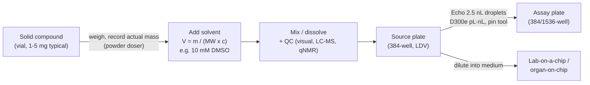

# Drug discovery and lab-on-a-chip applications (issue #159)

This is a literature search requested by @lbwinters in
[issue #159](https://github.com/vertical-cloud-lab/powder-doser/issues/159).
It covers current automated drug-discovery setups, focusing on the step
where a solid drug is dosed into a liquid at the milligram-to-gram scale
*before* it is dispensed in much smaller (nL to pL) amounts, for example
onto a lab-on-a-chip. Four
[Edison Scientific](https://edisonscientific.gitbook.io/edison-cookbook)
queries were run on 2026-10-09: three `LITERATURE_HIGH` and one `PRECEDENT`.
The verbatim answers and full task JSON are in
[`edison_artifacts/`](edison_artifacts/), and
[`edison_run.py`](edison_run.py) records the exact prompts and reproduces the
run.

| Key | Job | Question (short) | Answer |
| --- | --- | --- | --- |
| `drugdisc_solid_to_solution` | `LITERATURE_HIGH` | How do solids become the DMSO/aqueous stocks that Echo / D300e / on-chip dispensers consume? Masses, accuracy, bottlenecks. | [answer](edison_artifacts/drugdisc_solid_to_solution.answer.md) |
| `drugdisc_solid_dispensing_tech` | `LITERATURE_HIGH` | What mg/g solid-dispensing technology exists in pharma R&D, and how well does it perform? | [answer](edison_artifacts/drugdisc_solid_dispensing_tech.answer.md) |
| `drugdisc_applications` | `LITERATURE_HIGH` | Where would a low-cost mg-to-g gravimetric doser add value? Ranked niches and specs. | [answer](edison_artifacts/drugdisc_applications.answer.md) |
| `drugdisc_precedent` | `PRECEDENT` | Has anyone used a low-cost doser to make stocks that feed nL dispensing or a lab-on-a-chip? | [answer](edison_artifacts/drugdisc_precedent.answer.md) |

## Bottom line

1. **No one doses powder at the picogram scale. Every nL/pL platform starts
   from a liquid stock, and making that stock is a mg-scale powder step.**
   Acoustic dispensers (Echo, 2.5 nL droplets), inkjet dispensers (Tecan
   D300e), pin tools, on-chip gradient generators and organ-on-chip perfusion
   all draw from a pre-made stock, usually **10 mM in DMSO**. That stock is
   made by weighing **1-5 mg** of solid (10 mg or more for larger or repeat
   stocks) into a vial and adding a calculated volume of solvent. This
   matches the step @lbwinters described in the issue, and it falls in the
   powder doser's range.
2. **The accuracy bar is lower than it first appears.** If the doser records
   the *actual* dispensed mass and the solvent volume is calculated from that
   mass ("dose-to-weight"), then landing within ±5-10% of the target mass is
   acceptable. What matters is a precise mass reading (0.1 mg readability),
   complete dissolution and traceability. Stock problems such as DMSO water
   uptake, freeze-thaw losses and precipitation usually cause larger
   concentration errors than weighing does.
3. **Commercial solid dispensers exist, but they are expensive and fail on
   hard powders.** In one independent benchmark across 13 solids (Jiang et al.
   2023), Mettler Toledo Quantos, Chemspeed and a dual-arm robot had
   aggregate failure rates of **23-27%**, and Quantos errors at a 20 mg
   target were about 4-6% even for tractable powders. Integrated platforms are six-figure
   purchases. Low-cost options are rare: SALSA, a 3D-printed auger with a
   balance in the loop, is demonstrated only at 0.3 g and above.
4. **The precedent search found the parts of this workflow published
   separately, but not the whole chain.** There is automated 5 mg weighing
   followed by solvent processing (Astellas Powdernium, 2008), and there is
   automated weighing followed by DMSO and acoustic screening (Queensland
   Compound Library, 2014). No published low-cost or open-source system
   covers **1-5 mg powder → automated stock → nL dispenser or organ-chip**.
5. **Ranked fit for our doser:** (1) stock preparation for cell-based,
   microfluidic, organ-/tumor-on-chip and personalized-oncology drug panels;
   (2) a solid-to-stock module for self-driving labs; (3) academic cores and
   low-resource labs; (4) solid-form / pre-formulation screening; (5)
   formulation prototyping; (6) HTE chemistry, for stock or slurry
   preparation only.

## Where the powder step sits

For scale: 1 mg of a 500 g/mol compound makes 200 µL of 10 mM stock, and
5 mg makes 1 mL. That is enough for thousands of 2.5-25 nL Echo transfers,
so a vial dosed at the milligram scale can supply picogram-to-nanogram doses
downstream.

## Key numbers from the literature

| Parameter | Typical value | Source |
| --- | --- | --- |
| Solid weighed per compound | 1-5 mg (10 mg or more for larger / repeat stocks) | Sou & Bergström 2018; Gomez-Sanchez et al. 2020 |
| Master stock | 10 mM in DMSO (pharma HTS, Echo); 20 mM (Tox21); 5-10 mM for poorly soluble compounds | Roberts et al. 2016; Bhatt et al. 2019; Richard et al. 2025 |
| Solvent addition | Usually volumetric from the recorded mass; tolerances rarely reported, so concentrations are often only nominal | Gomez-Sanchez et al. 2020; Richard et al. 2025 |
| Downstream transfer | Echo: 2.5 nL droplets, 5-120 nL per well (AstraZeneca); 10-40 nL into 1536-well (Genentech) | Roberts et al. 2016; Dawes et al. 2016 |
| Cancer drug-sensitivity panels | 10 mM / 1 mM / 100 µM / 10 µM source stocks, 2.5-25 nL Echo transfers (FIMM) | Kulesskiy et al. 2016 |
| Final DMSO in cell assays | 0.1-0.5% v/v | Roberts et al. 2016; Kulesskiy et al. 2016 |
| Why stocks get remade | Compound loss in 8% / 17% / 48% of stocks after 3 / 6 / 12 months at room temperature; precipitation in 26% of wells in one library | Butler et al. 2014; Waybright et al. 2009 |
| Concentration verification | qNMR: about 1% repeatability, 2% accuracy | Pinciroli et al. 2001 |
| Value of recording the actual mass | 5 mg test: 100.9% recovery with mass correction vs 108.1% without | Wakasawa et al. 2008 |
| SDL pain point | Dispensing below about 20 mg is singled out as unreliable; SDLs avoid powders by using stock solutions | Seifrid et al. 2022; Tom et al. 2024 |

## Current technology

| System | Mechanism | Dose range | Reported performance | Notes / cost |
| --- | --- | --- | --- | --- |
| Mettler Toledo Quantos / CHRONECT XPR | Hopper with impeller and rotary tapping onto an analytical balance | mg to g | 20 mg target: about -4 to -6% error; 200-1000 mg: ±0.02-2% for tractable powders; 285 s per 20 mg dose and 31-40 s per 200-1000 mg dose (NaNO₂); 26.9% failure across 13 solids | Module about $30-60k (market estimate, not from the literature) |
| Chemspeed GDU-S SWILE / GDU-Pfd / FLEX / SWING / Crystal Powderdose | Positive-displacement capillary (SWILE), crescent valve (Pfd) | sub-mg to g | SWILE favorable at sub- to low-mg for free-flowing powders (Bahr 2018); 26.5% failure and 67-85% overdose on sugar in Jiang 2023 | Six-figure integrated platform |
| Unchained Labs Junior / Big Kahuna | Integrated HTE workstation | low or sub-mg to g | No independent numbers found | Six-figure |
| ChemBeads (AbbVie) | Reagent coated onto glass beads (about 5 wt%), then dispensed volumetrically | nmol to mg | <5% RSD in 96-well; ±5% at 20 mg | Needs per-compound coating and characterization |
| STORMS (Communications Chemistry 2026) | Vacuum coring into pre-weighed glass capsules, then post-weighing ("stochastic", not target-hitting) | 0.1-10 mg (3-5 mg preferred) | 0.06 mg SD; 20-30 s per capsule; 96% success when Carr index < 30 vs 6% above | Cobot + balance + laser sealer |
| Dual-arm robot (Jiang et al. 2023, Cooper group) | Robot handles spatula and vials over a balance | 20-1000 mg | 0.07% error at 200 mg; 239-552 s per dose; 23.1% failure | Open code; cobot cost |
| SALSA (Zhang et al. 2026) | 3D-printed Archimedes screw, balance in the loop | 0.3 g and up | 0.1 mg balance; dosing error not reported | Low cost; **closest analogue to our auger doser** |
| Xcelodose / 3P Fill2Weigh | Vibratory "pepper-shaker" capsule micro-dosing | 0.1 mg to hundreds of mg | 600-1200 capsules/h | Clinical-trial capsule filling |
| Khinast / TU Graz micro-feeder | Volumetric piston powder pump | 1-20 g/h (continuous) | 10-20% deviation for cohesive APIs | Continuous feeding, not discrete vials |

Benchmarks of commercial dispensers are reviewed in Bahr et al. 2018 and 2020,
which the repo already cites in
[`paper/background/01-powder-dispensing-commercial-landscape.md`](../../../paper/background/01-powder-dispensing-commercial-landscape.md).

## Potential applications for our powder doser (ranked)

This ranking comes mostly from the `drugdisc_applications` answer, with the
specs adjusted to what this repo's hardware can do.

| Rank | Niche | Dose range | Needed performance | Fit with mg-to-g doser |
| --- | --- | --- | --- | --- |
| 1 | **Stock prep for cell-based, microfluidic, organ-/tumor-on-chip and personalized-oncology drug panels** (the step @lbwinters described) | 1-20 mg per vial | 0.1 mg readability, ≤5% RSD, 10-100 vials/day, barcode + actual-mass log, automated solvent addition | **High.** Sub-mg is not needed unless the compound is scarce or very potent |
| 2 | **Solid-to-stock module for self-driving labs** (SDLs that currently avoid powders) | 5-500 mg | ≤5% RSD, unattended operation with recovery from bridging / overshoot / empty hopper, open API | **High** |
| 3 | **Academic core facilities and low-resource labs** | 1 mg to several g | ±5-10% with logged mass; easy calibration and cleaning; low BOM | **High** if cost stays far below commercial systems |
| 4 | **Solid-form / pre-formulation screening** (salt, polymorph, co-crystal, solubility) | 1-15 mg per condition; salt screens use <200 mg total for 150-200 experiments | ≤5% RSD; humidity / static control; low-shear feeding that does not change the solid form | **Mostly.** Not suitable for µg-scale nanospot or inkjet screens |
| 5 | **Formulation prototyping** (API-in-capsule, 3D-printed tablet feedstock, blends) | 10 mg to 2 g | ≤3% RSD; multi-powder recipes; lot traceability | **High for R&D;** GMP manufacture would need qualification and validated cleaning |
| 6 | **HTE for medicinal / process chemistry** | 5-100 mg (stock or slurry prep); direct well dosing needs 0.25-1 mg or less | ≤5% RSD; fast powder changeover; inert atmosphere | **Partial.** Useful for stocks, slurries and larger reagent charges; ChemBeads and sub-mg tools still win for direct 96/384-well dosing |

## What this implies for the hardware

- **Balance:** 1-5 mg stocks need **0.1 mg readability** at the receiving
  vial. The HR-100A already on hand and the candidate HR-202i in
  [`design/brainstorming.md`](../../../design/brainstorming.md) §3 meet that.
  The 1 mg FZ-523 does not.
- **Dose-to-weight mode:** treat the target mass as approximate, log the
  actual mass, and compute the solvent volume from it (or add solvent
  gravimetrically). This removes the need to hit 1.000 mg exactly.
- **Fine-feed control at 1-20 mg:** the auger plus vibration can easily
  overshoot at this scale, so the existing solenoid tapper is a natural
  fine-feed stage. Edison suggests a cross-application target of ±0.5 mg or
  ±5% (whichever is larger), ≤5% RSD at 5 mg, ≤2% RSD at 50 mg and ≤60 s per
  dose.
- **Pharma-like powders:** test with cohesive, electrostatic and hygroscopic
  powders, not only free-flowing metal powders. STORMS found a sharp
  success cliff at a Carr index of 30 (Hausner ratio about 1.43).
- **Downstream integration:** add solvent, mix (vortex), check dissolution
  (Shiri et al. 2021 use computer vision for this) and write a
  barcode-linked record. The precedent search shows that this integration
  is the missing published piece.
- **Containment and cleaning:** PLA/PETG product-contact parts are fine for
  research stocks but hard to validate for GMP. Plan for an enclosure,
  disposable or cleanable contact parts, and keep potent compounds out of
  scope at first.

## Questions for the lab-on-a-chip conversations

These are for the conversations with Gale, Nordin, Woolley and Pitt listed
in the issue:

- Who prepares your drug stocks today, how many per week, and from how much
  solid (mg)? Which balance and solvent do you use?
- What concentration do you load onto the chip, and is it diluted from a
  DMSO stock?
- How often are stocks remade because of precipitation, degradation or
  freeze-thaw cycles?
- Do you run panels of many drugs (e.g. patient-derived tumor samples)? If
  so, weighing scales with the size of the panel.
- Would a bench-top "dose 1-5 mg, add solvent, log the concentration" unit
  save meaningful time, and at what price?

## Key articles

**Workflow (solid → stock → nL dispensing)**

- Roberts et al. (2016). Implementation and challenges of direct acoustic dosing into cell-based assays. *J. Lab. Autom.* 21:76-89. [10.1177/2211068215595212](https://doi.org/10.1177/2211068215595212)
- Kulesskiy et al. (2016). Precision cancer medicine in the acoustic dispensing era. *J. Lab. Autom.* 21:27-36. [10.1177/2211068215618869](https://doi.org/10.1177/2211068215618869)
- Bhatt et al. (2019). Next-generation compound delivery platforms to support miniaturized biology. *SLAS Technol.* 24:245-255. [10.1177/2472630318820017](https://doi.org/10.1177/2472630318820017)
- Dawes et al. (2016). Compound transfer by acoustic droplet ejection promotes quality and efficiency in ultra-high-throughput screening campaigns. *J. Lab. Autom.* 21:64-75. [10.1177/2211068215590588](https://doi.org/10.1177/2211068215590588)
- Shinn et al. (2019). High-throughput screening for drug combinations (NCATS protocol). *Methods Mol. Biol.* 1939:11-35. [10.1007/978-1-4939-9089-4_2](https://doi.org/10.1007/978-1-4939-9089-4_2)
- Sou & Bergström (2018). Automated assays for thermodynamic (equilibrium) solubility determination. *Drug Discov. Today Technol.* 27:11-19. [10.1016/j.ddtec.2018.04.004](https://doi.org/10.1016/j.ddtec.2018.04.004)
- Waybright et al. (2009). Overcoming problems of compound storage in DMSO. *J. Biomol. Screen.* 14:708-715. [10.1177/1087057109335670](https://doi.org/10.1177/1087057109335670)
- Richard et al. (2025). Analytical quality evaluation of the Tox21 compound library. *Chem. Res. Toxicol.* 38:15-41. [10.1021/acs.chemrestox.4c00330](https://doi.org/10.1021/acs.chemrestox.4c00330)
- Eribol et al. (2016). Screening applications in drug discovery based on microfluidic technology. *Biomicrofluidics* 10:011502. [10.1063/1.4940886](https://doi.org/10.1063/1.4940886)

**Solid-dispensing technology and benchmarks**

- Bahr et al. (2018). Collaborative evaluation of commercially available automated powder dispensing platforms for HTE in pharmaceutical applications. *Org. Process Res. Dev.* 22:1500-1508. [10.1021/acs.oprd.8b00259](https://doi.org/10.1021/acs.oprd.8b00259)
- Bahr et al. (2020). Recent advances in high-throughput automated powder dispensing platforms for pharmaceutical applications. *Org. Process Res. Dev.* 24:2752-2761. [10.1021/acs.oprd.0c00411](https://doi.org/10.1021/acs.oprd.0c00411)
- Jiang et al. (2023). Autonomous biomimetic solid dispensing using a dual-arm robotic manipulator. *Digital Discovery* 2:1733-1744. [10.1039/d3dd00075c](https://doi.org/10.1039/d3dd00075c)
- Tu & Wang (2026). Stick to the beads: supercharging medicinal chemistry and methodology development with ChemBeads. *RSC Med. Chem.* 17:52-64. [10.1039/d5md00827a](https://doi.org/10.1039/d5md00827a)
- Miéville, Lisowski et al. (2026). High-throughput solid microsampling through stochastic robotic automation (STORMS). *Commun. Chem.* [10.1038/s42004-026-02153-w](https://doi.org/10.1038/s42004-026-02153-w)
- Zhang et al. (2026). SALSA: a low-cost self-driving lab modular add-on for salt solubility assessment. *Digital Discovery* 5:1881-1887. [10.1039/d5dd00516g](https://doi.org/10.1039/d5dd00516g)
- Nsouli et al. (2025). Advancing organic chemistry using high-throughput experimentation. *Angew. Chem. Int. Ed.* [10.1002/anie.202506588](https://doi.org/10.1002/anie.202506588)
- Christensen et al. (2021). Automation isn't automatic. *Chem. Sci.* 12:15473-15490. [10.1039/d1sc04588a](https://doi.org/10.1039/d1sc04588a)

**Closest precedents and SDL context**

- Wakasawa et al. (2008). Solid-state compatibility studies using a high-throughput and automated forced degradation system. *Int. J. Pharm.* 355:164-173. [10.1016/j.ijpharm.2007.12.002](https://doi.org/10.1016/j.ijpharm.2007.12.002)
- Butler et al. (2014). Natural product libraries: assembly, maintenance, and screening. *Planta Med.* 80:1161-1170. [10.1055/s-0033-1360109](https://doi.org/10.1055/s-0033-1360109)
- Winkler et al. (2022). Automation of cell culture assays using a 3D-printed servomotor-controlled microfluidic valve system. *Lab Chip.* [10.1039/d2lc00629d](https://doi.org/10.1039/d2lc00629d)
- Ewart et al. (2022). Performance assessment and economic analysis of a human Liver-Chip for predictive toxicology. *Commun. Med.* [10.1038/s43856-022-00209-1](https://doi.org/10.1038/s43856-022-00209-1)
- Seifrid et al. (2022). Autonomous chemical experiments: challenges and perspectives on establishing a self-driving lab. *Acc. Chem. Res.* 55:2454-2466. [10.1021/acs.accounts.2c00220](https://doi.org/10.1021/acs.accounts.2c00220)
- Tom et al. (2024). Self-driving laboratories for chemistry and materials science. *Chem. Rev.* 124:9633-9732. [10.1021/acs.chemrev.4c00055](https://doi.org/10.1021/acs.chemrev.4c00055)

**Applications**

- Morissette et al. (2004). High-throughput crystallization: polymorphs, salts, co-crystals and solvates of pharmaceutical solids. *Adv. Drug Deliv. Rev.* 56:275-300. [10.1016/j.addr.2003.10.020](https://doi.org/10.1016/j.addr.2003.10.020)
- Pinciroli et al. (2001). Characterization of small combinatorial chemistry libraries by ¹H NMR (qNMR quantitation). *J. Comb. Chem.* 3:434-440. [10.1021/cc000101t](https://doi.org/10.1021/cc000101t)
- Shiri et al. (2021). Automated solubility screening platform using computer vision. *iScience* 24:102176. [10.1016/j.isci.2021.102176](https://doi.org/10.1016/j.isci.2021.102176)

The full numbered reference lists, with citation counts and the page ranges
Edison drew each claim from, are in the `edison_artifacts/*.references.md`
files.

## Caveats

- These are AI-generated literature syntheses. The tables above take
  numbers from the cited sources as Edison reported them, but a few
  statements in the raw answers are Edison's own inference rather than a
  cited result. For example, the claim that dose-response screens tolerate
  ±10-20% stock error is uncited, and the $30-60k Quantos price is flagged
  as a market estimate. Check the original paper before quoting a number in
  a manuscript or proposal.
- Some sources are theses or vendor notes without DOIs (e.g. Gillespie 2013,
  3P Innovation Fill2Weigh), and independent accuracy data for CHRONECT XPR,
  Unchained Labs, Zinsser, Labman and 3P Fill2Weigh were not found.
- The specs proposed for the doser are design targets, not measured
  performance. None of this has been tested on the current hardware.
