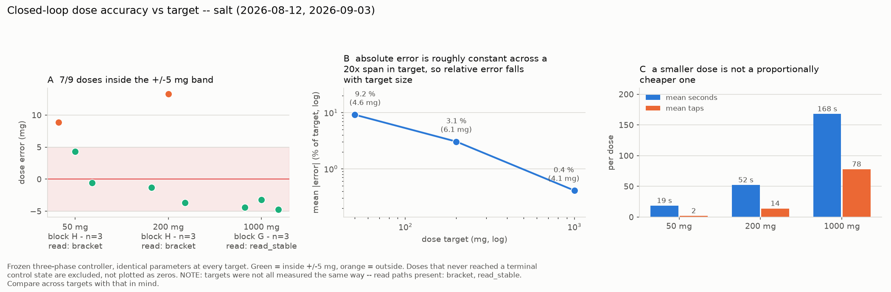

# Block H on salt, in the new fume hood — 2026-09-03

Run directory: `data/battery/20260903T214049Z_salt/`
MongoDB: `powder_doser.battery_runs`, `_id 6a99eaa323c1048102c9aeb1`
`qc.verdict = ok`, `valid_for_cross_powder_comparison = true`

The third Block H attempt of the day and the first that measured
anything. Follows `2026-09-03-salt-block-h-first-run.md` and
`2026-09-03-salt-block-h-rerun-standdown.md`, which record the two runs
that produced no usable dose between them.

| | MDT | UTC |
|---|---|---|
| Balance check + re-zero | 14:44 → 14:52 | 20:44 → 20:52 |
| Environment survey (240 s) | 15:00 → 15:04 | 21:00 → 21:04 |
| Pre-flight | 15:02 | 21:02 |
| **Block H started** | **15:40:49** | 21:40:49 |
| **Block H ended** | **15:44:28** | 21:44:28 |
| **Elapsed** | **0:03:38** | |

## Outcome in one line

All six doses reached a terminal control state and **four of six landed
inside ±5 mg**, including two of three at the 50 mg target.

## The doses

| # | target | delivered | error | status | time | cycles | taps |
|---|---|---|---|---|---|---|---|
| 0 | 50 mg | 58.9 mg | **+8.9 mg** | `overshoot` | 17 s | fine 2 | 0 |
| 1 | 50 mg | 54.3 mg | **+4.3 mg** | **`ok`** | 22 s | fine 1, tap 3 | 6 |
| 2 | 50 mg | 49.4 mg | **−0.6 mg** | **`ok`** | 17 s | fine 2 | 0 |
| 3 | 200 mg | 198.7 mg | **−1.3 mg** | **`ok`** | 40 s | fine 4, tap 4 | 8 |
| 4 | 200 mg | 213.3 mg | **+13.3 mg** | `overshoot` | 53 s | fine 6, tap 5 | 10 |
| 5 | 200 mg | 196.3 mg | **−3.7 mg** | **`ok`** | 64 s | bulk 1, fine 3, tap 12 | 24 |

No `scale-error`. No `not-tared`. The bulk phase correctly skipped
itself on five of six doses, which is the point of scaling `t1` with the
target — a bulk phase carrying ~0.12 g in flight must never open for a
50 mg dose.

## 50 mg is reachable, and it is the answer to the question Block H asks

`_block_h_small_dose` exists to ask whether dose error is a **fixed
mass** or a **fixed fraction of the target**. Three targets of the same
powder under the same frozen controller now answer it:

| target | mean \|error\| | relative | doses inside ±5 mg |
|---|---|---|---|
| 50 mg (block H, today) | 4.6 mg | **9.2 %** | 2/3 |
| 200 mg (block H, today) | 6.1 mg | **3.1 %** | 2/3 |
| 1000 mg (block G, 2026-08-12) | 4.1 mg | **0.4 %** | 3/3 |

**Absolute error is roughly constant — 4–6 mg across a 20× span in
target — so relative error falls with target size.** Error is a fixed
mass, not a fixed fraction. That is the useful, transferable statement:
this doser's accuracy is quantised by the mass of one control action,
and shrinking the target does not shrink that quantum.

A caveat the figure states rather than hides: the 1 g doses were
collected through `read_stable()` and today's through the bracketed read
path (see below), so the three targets are not all measured the same
way. The comparison is worth making and worth flagging.

## Why the two overshoots happened, and why that is the real finding

Both failures are overshoots, and both are the fine increment being
coarser than the tolerance band. Salt was conveying **192 mg/rev** in the
pre-flight, so one 180° fine increment is ~96 mg of commanded travel —
**about twice the entire 50 mg target** and half the 200 mg one.

The morning run saw this even more sharply: a single 45° increment
delivered 57.5 mg against a 50 mg target. Today's doses succeed when the
increments happen to land favourably and the tap phase can trim; they
overshoot when one increment crosses the band. That is luck, not
control, and it is why 2/3 rather than 3/3.

So the honest reading of "can the doser do 50 mg?" is: **yes, but not
reliably, and not by design.** The fix is not a quieter room — it is an
increment that scales with the measured feed factor, which is the
standing recommendation from the calcium lactate 1 g run and from this
morning's notes, and belongs to the per-powder tuning in #123/#130.

## Method change: the doser no longer needs stable frames

This is the first run whose closed-loop doses read the balance through
`balance_filter` brackets rather than `Scale.read_stable()`. It is
recorded as `config.dose_read_path = bracket` in the run document
because **all 11 committed Block G runs used `read_stable`**, so dose
numbers either side of that flag are not the same measurement method.

Why it was needed: `read_stable()` waits for the A&D to assert `ST` and
returns `None` otherwise, and the doser turned that `None` into
`scale-error`. The balance was 97 % stable at rest this morning and
0–2 % stable the moment the rig actuated, so every dose read was a coin
flip — four of six doses died that way on each of the two earlier
attempts. Blocks A–E stopped depending on `ST` on 2026-08-20; the doser
had simply never been given the same path.

**No controller parameter changed** — no phase, angle, RPM, tap count or
threshold — and `test_three_phase_reads.py` pins that, so the 50 mg
question is still being asked of the frozen controller.

Two further faults were found by running it rather than by reasoning:

1. **The balance intermittently answers nothing for a few seconds**, so a
   1.4 s bracket started in that window sees no frames at all. A device
   probe timed it answering again 119 ms after a normal tare, so the
   silence is transient. The read is now retried up to 12 times. The
   retry is **counted, not timed**: the first version used a seconds
   deadline against MicroPython's `time.time()`, which returns *integer
   seconds* on this build, and gave up after one attempt.
2. **The first version of the refused-tare guard was too strict** and
   refused every dose. An unattended run cannot empty its own cup and a
   pre-flight legitimately leaves ~1 g in it, so the guard fired on a
   normal condition. Subtracting the baseline is what actually makes
   this safe: the dose becomes a *difference*, so leftover powder
   cancels rather than being reported as delivery. `not-tared` is now
   reserved for a pan loaded past a capacity ceiling.

The guard earned its place in between: on the second attempt it caught a
genuinely refused tare with 1.0419 g in the cup and reported
`not-tared` instead of inventing a delivery — which is exactly the
phantom 7.5393 g and 1.5410 g "overshoots" the morning runs produced.

## The new fume hood

First run there, and it is the reason the dose blocks are runnable again
after the 2026-09-03 stand-down.

| | new hood | shared hood, 2026-08-20 |
|---|---|---|
| sample-to-sample jitter | **0.077 mg** | 0.7 – 2.9 mg |
| stable frames | **69 – 75 %** | 0 – 13 % |
| **mechanical shocks > 10 mg** | **0 in 240 s** | ~100 mg excursions |

Shocks are what the stand-down was about — they arrive from outside the
experiment, cannot be scheduled around, and cost a run rather than a
trial. None appeared in 240 s of survey or in the run.

What remains is a **smooth drift**, measured at −3.6, −1.8 and +2.6
mg/min across the afternoon. Smooth is the tractable kind: it is fitted
per dose from the baseline bracket and recorded, and over the 17–64 s
these doses take it contributes 2.8–3.8 mg. That is inside the ±5 mg
band but not negligible against it, so a dose reported at ±4 mg carries
comparable baseline uncertainty. It is also decaying, consistent with
thermal settling after the move.

The survey's own verdict line still reads `BAD` for the dose blocks,
because that gate is calibrated for a Block G dose lasting minutes. A
Block H dose lasts 17–64 s, where the environmental error is 2.8–3.8 mg
rather than 8.8 mg. **The gate should be read against the dose duration,
not against a fixed 180 s row.**

## Pre-flight

`feed confirmed`, 0.9611 g over 5 revolutions at tilt 90° = **192.2
mg/rev**, plus 76.9 mg from 10 taps. Per revolution: 100, 266, 244, 149,
202 mg — the first is the delivery section charging, the rest are salt's
normal range (182–235 mg/rev this morning, 230–265 on 08-12 and 08-21).

## Rig state at the end

`META,park_tilt_deg,0.0` then `RUN,END,ok`: tilt parked at 0°, stepper
disabled, solenoid off. No tmux server, no capture process. Salt is
loaded in the auger; the collection beaker holds the pre-flight's ~1 g
plus the six doses' ~0.77 g and should be emptied before the next run.

## What is still owed

1. **Scale the fine increment with the measured feed factor.** Both
   overshoots are one increment crossing the band. At 192 mg/rev a 180°
   step is ~96 mg, so a 50 mg target cannot be resolved by construction;
   the two successes are the tap phase rescuing a favourable landing.
2. **Block F (vibration)** is still missing from every run — the
   DRV2605L is absent from the I²C bus, so it is not wired in rather
   than failing.
3. **Calibration.** The HR-100A has not been calibrated since it moved,
   and there is still no 100 g class E2/F1 weight at the rig.
4. **A duplicate document** exists in `battery_runs` for the 17:04:37
   run (two records, same `started_utc`). Left alone rather than deleted
   — flagged for whoever owns that collection.
