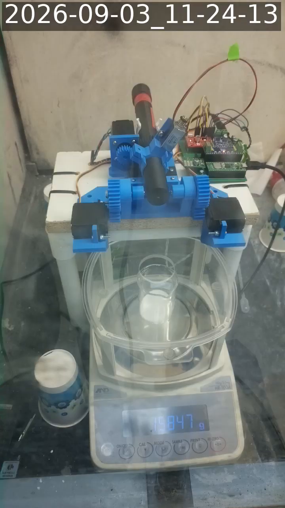

# Block H re-run, and the stand-down — salt, 2026-09-03

Run directory: `data/battery/20260903T170437Z_salt/`
MongoDB: `powder_doser.battery_runs`, `_id 6a99aad7c88cfb60c95d8dcf`
`qc.verdict = doser-scale-unreadable`, `valid_for_cross_powder_comparison = false`

Follows `2026-09-03-salt-block-h-first-run.md`, which is where the Block H
implementation and the `read_stable()` blocker are described. This run exists
to record the second attempt and the decision that ended the session.

| | MDT | UTC |
|---|---|---|
| Pre-flight | 11:03 | 17:03 |
| **Block H started** | **11:04:37** | 17:04:37 |
| **Block H ended** | **11:05:55** | 17:05:55 |
| **Elapsed** | **0:01:17** | |
| Operator stand-down declared | 11:04 | 17:04 |
| Read-only balance check (this session) | 11:12 | 17:12 |

## Outcome in one line

The run finished `RUN,END,ok` and measured nothing: **the auger never turned on
any of the six doses**, so there is no dose in this run whose number means
anything.

## The doses

| # | target | reported | status | auger rev | taps |
|---|---|---|---|---|---|
| 0 | 50 mg | 0.0 mg | `scale-error` | **0.00** | 0 |
| 1 | 50 mg | 0.0 mg | `scale-error` | **0.00** | 0 |
| 2 | 50 mg | 0.0 mg | `scale-error` | **0.00** | 0 |
| 3 | 200 mg | 0.0 mg | `scale-error` | **0.00** | 0 |
| 4 | 200 mg | 0.0 mg | `scale-error` | **0.00** | 0 |
| 5 | 200 mg | 1541.0 mg | `overshoot` | **0.00** | 0 |

`0.00 auger rev` on every row is the important column. Five doses aborted on
`Scale.read_stable()` returning `None` before the controller ever commanded
rotation; the sixth skipped all three phases because it believed it was already
1.341 g over target. **No powder was dispensed by this run**, and the ~1.5 g in
the cup at the end is what the pre-flight put there.

### Dose 5's "overshoot" is the pre-flight's own salt

    pre-flight rotation   1.40883 g
    pre-flight taps     + 0.13248 g
                        = 1.54132 g      reported as delivered: 1.5410 g

A 0.3 mg match. The sequence is the refused-tare failure documented on
2026-08-20, one step further along than the morning run's dose 1:

1. the pre-flight left 1.54 g of salt in the cup (`feed confirmed`,
   172/280/272/325/360 mg per revolution — the delivery path was fine);
2. Block H's *"EMPTY the collection cup now"* prompt was **auto-answered by
   `--unattended`**, because nothing in an unattended run can empty a cup;
3. the doser tared, the balance silently refused the tare while unstable, and
   the doser then read the pre-existing 1.54 g as this dose's delivery.

That is worse than a `scale-error`, because `scale-error` is obviously not a
measurement while `overshoot: 1.5410 g` looks like one. **Any Block G/H dose in
an unattended run whose predecessor left powder in the cup can produce a
plausible-looking number for mass it never dispensed.** The morning run's dose 1
(7.5393 g, from the feed diagnostic's salt) is the same fault; two for two on
the runs where it could fire.

## Why the balance could not hold a reading: the fume hood is shared

The morning notes closed with the balance degradation *unresolved* — it got
worse over the eight minutes after the run rather than settling, which did not
match the decaying actuation transient seen on 2026-08-20. The operator
identified the cause during this session: **a student used the fume hood's
compressed air**, and did so again immediately before this run.

| when | jitter | stable frames | peak-to-peak | |
|---|---|---|---|---|
| 10:19 MDT, at rest, before any actuation | 0.013 mg | 98 % | — | best of the campaign |
| 10:21–10:25 survey, at rest | 0.011 mg | 97 % | — | environmental error over 180 s: **0.8 mg** |
| 10:39, after the morning run | 1.804 mg | 2 % | — | |
| 10:42, eight minutes later | 2.882 mg | 0 % | — | |
| **11:12, 90 s read-only, this session** | **0.721 mg** | **13 %** | 13.6 mg | rig idle and parked |
| **11:19, 120 s read-only, this session** | **2.724 mg** | **4 %** | **109.7 mg** | rig idle and parked |

The 10:21 survey is the only time since the fume-hood move that the Block G/H
environmental gate has passed — 0.8 mg of environmental error against a ±5 mg
dose band. The bench is capable of dosing. It just cannot be relied on to *stay*
that way for the 20–60 minutes a Block H run needs, because the disturbance
arrives from outside the experiment.

**The last two rows are the ones that decide it.** They were taken seven minutes
apart with the rig parked, the stepper disabled, the solenoid off and nothing
commanded in between, and the balance got *worse* — 0.72 → 2.72 mg of jitter,
13.6 → 109.7 mg of excursion. That is not the decaying actuation transient seen
on 2026-08-20, which settled over minutes. It is a bench being disturbed
repeatedly from outside, which is exactly the operator's account and exactly
what a pre-run survey cannot warn about.

One confound stated rather than buried: a parallel session was also on the bench
this hour, and its device scripts are deleted after each use, so the only
activity in that seven-minute window that could be *observed* was a read-only
balance query. Read-only queries do not shake a load cell, and a 110 mg
excursion with everything parked is a mechanical impulse, not serial traffic —
but the window is not fully accounted for. The comparison that does not depend
on it at all is 0.011 mg at rest in the morning against 0.7–2.7 mg at rest all
afternoon.

## The decision

> *"I'm going to declare that while students are using this fume hood, we can't
> run any tests. The student just used the air again, and we have no guarantee
> this won't keep happening."* — @swcharles, 2026-09-03

Block H is deferred to the new fume hood. This is the right call and it is worth
being precise about *why*, because it is not the same objection as the granite:

- **It is not a noise problem that averaging fixes.** Blocks A–E survive an
  occupied lab because each trial is seconds long and actuator-gated, so
  `balance_filter` can bracket it. A closed-loop dose has no do-nothing interval
  to bracket against — the whole point is that mass arrives throughout — so a
  disturbance during a dose is indistinguishable from the dose.
- **It is not predictable, so it cannot be scheduled around.** The morning
  survey passed. The bench then degraded mid-session for a reason outside the
  experiment's control, with no warning in the pre-run gate.
- **It costs a run, not a trial.** Two Block H attempts on one day produced zero
  usable doses between them.

Blocks A–E remain runnable in a shared hood; this stand-down is specifically
about the dose blocks. See "When not to run" in `docs/powder-battery-protocol.md`.

## What is still owed on Block H

Unchanged from the morning notes, and none of it is blocked by the hood:

1. **Give the three-phase doser the `balance_filter` read path.** Blocks A–E got
   it on 2026-08-20; Blocks G and H still call `read_stable()`. A quieter room
   would have hidden this rather than fixed it — the doser would still be one
   unlucky read from abandoning a dose. Recording it as a method change matters,
   because all eleven committed Block G runs were collected through
   `read_stable()`.
2. **Empty the cup between runs**, and treat the unattended auto-answer above as
   the reason it is not merely tidiness. A cheap belt-and-braces fix: have the
   dose refuse to start when the tare visibly did not take, rather than trusting
   a stale zero.
3. **Scale the fine increment with the measured feed factor** before any 50 mg
   number is quoted. Salt conveys 182–235 mg/rev, so a 45° increment is ~28 mg
   of commanded travel — the morning's only completed dose overshot a 50 mg
   target on its first fine cycle.

## Rig state at the end

`META,park_tilt_deg,0.0` then `RUN,END,ok`: tilt parked at 0°, stepper disabled,
solenoid off. No tmux server, no capture process. Salt is loaded in the auger
and ~1.5 g of it is in the collection cup.

Bench camera at 11:24 MDT: tube horizontal, beaker on the pan with the breeze
break closed, balance showing a normal reading in grams — no `Error 1`, no
overload `E`. The instrument is working; it is the room it sits in that is not
holding still. The ~1.5 g on the display is the pre-flight's salt and should be
emptied before the next run, per the standing bench checklist.
