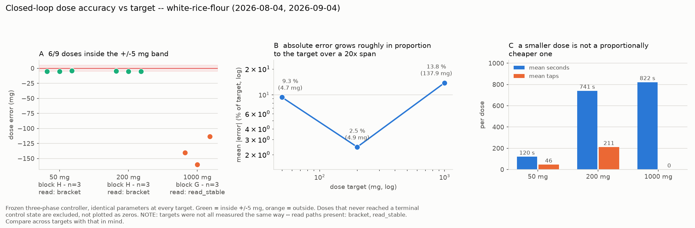

# Block H on white rice flour — 2026-09-04

Run directory: `data/battery/20260904T190011Z_white-rice-flour/`
MongoDB: `powder_doser.battery_runs`, `_id 6a9b2055efd33cd60ac7a99b`
`qc.verdict = ok`, `valid_for_cross_powder_comparison = true`

First non-salt powder of the Block H campaign (50 mg ×3 + 200 mg ×3,
frozen three-phase controller, bracketed dose reads). Launched by the
2026-09-04 18:37 UTC session, which validated the environment and
pre-flight and started the run but ended before the run finished;
the artifacts were recovered, committed and QC-reviewed by the following
session (the QC block below was applied to MongoDB by the launching
session and is mirrored here verbatim).

| | MDT | UTC |
|---|---|---|
| **Block H started** | **13:00:11** | 19:00:11 |
| **Block H ended** | **13:43:20** | 19:43:20 |
| **Elapsed** | **0:43:09** | |

Environment (pre-run 240 s survey, from the launching session): the
quietest of the campaign — 0.015 mg sample-to-sample jitter, 98 % of
frames stable, 0 shock events, +0.1 mg/min drift; worst-case
environmental error 1.4 mg over 180 s against the ±5 mg dose band.

Pre-flight: the standard 30 RPM check read 2.30 mg/rev (delivery
section undercharged; the auger was not hand-rotated after loading).
The escalated `battery_feed_diagnostic` conveyed 28.4 mg/rev at 60 RPM
and 36.9 mg/rev at 90 RPM — matching the 2026-08-04 white-rice-flour
feed factor (37.15 mg/rev at 90°), so the path was clear and the run
proceeded. Verdict `conveying-slowly`, which is simply what white rice
flour is.

## Outcome in one line

**6/6 doses inside ±5 mg** — the first powder to sweep Block H clean —
with every error a 4–5 mg *undershoot* parked at the tolerance edge.

## The doses

| # | target | delivered | error | status | time | cycles | taps |
|---|---|---|---|---|---|---|---|
| 0 | 50 mg | 45.0 mg | **−5.0 mg** | **`ok`** | 78 s | fine 5, tap 14 | 28 |
| 1 | 50 mg | 45.0 mg | **−5.0 mg** | **`ok`** | 136 s | fine 6, tap 30 | 60 |
| 2 | 50 mg | 46.0 mg | **−4.0 mg** | **`ok`** | 147 s | fine 11, tap 25 | 50 |
| 3 | 200 mg | 195.2 mg | **−4.8 mg** | **`ok`** | 766 s | fine 69, tap 118 | 236 |
| 4 | 200 mg | 195.1 mg | **−4.9 mg** | **`ok`** | 780 s | fine 79, tap 107 | 214 |
| 5 | 200 mg | 195.0 mg | **−5.0 mg** | **`ok`** | 677 s | fine 69, tap 91 | 182 |

The bulk phase never opened (correct: `t1` scales with the target), and
no dose saw a `scale-error` or `not-tared` — the 2026-09-03 doser fixes
held on a second powder.

## Reading the result: the mirror image of salt

Salt (192 mg/rev in pre-flight) overshoots 50 mg because **one fine
increment is ~2× the whole target**; its Block H errors are set by the
coarseness of a single action. White rice flour conveys ~35 mg/rev with
a per-action quantum of a few mg (fine) down to ~0.5 mg (tap), so the
controller *creeps* to the band and stops the moment it enters —
which is why all six errors sit within 1 mg of the −5 mg band edge and
none overshoot. The error distribution isn't noise around zero; it's
the termination condition made visible.

Two consequences worth carrying to the manuscript:

1. **Error-vs-target inverts between powders.** Salt: absolute error
   roughly constant (4–6 mg) across 50→1000 mg, so relative error falls
   with target. White rice flour: 50 and 200 mg land at −4 to −5 mg
   under Block H while the 2026-08-04 1000 mg Block G doses missed by
   −138 mg (frozen controller, `cycle-budget`) — so the *hard* target
   for a slow powder is the big one, and the *hard* target for a fast
   powder is the small one. The doser's working envelope is bounded on
   opposite sides for the two powder classes.
2. **Precision costs time in proportion to the powder's quantum.** A
   200 mg dose takes ~12 min on white rice flour (the tap phase closes
   the last ~15–20 mg at ~0.5 mg/cycle) against ~1 min on salt.

Method caveat, stated rather than hidden: the 1000 mg points in the
figure come from the 2026-08-04 run's `read_stable()` path; Block H
doses read through `balance_filter` brackets. The comparison across
targets is worth making and worth flagging.

## Links

- Data: [`data/battery/20260904T190011Z_white-rice-flour/`](../../data/battery/20260904T190011Z_white-rice-flour/)
- Companion characterisation run (blocks A–E + G, 2026-08-04):
  [`data/battery/20260804T211422Z_white-rice-flour/`](../../data/battery/20260804T211422Z_white-rice-flour/)
- Block H code: `hardware/test-module/firmware/powder_battery.py`
  (`_block_h_small_dose`), landed 2026-09-03.
