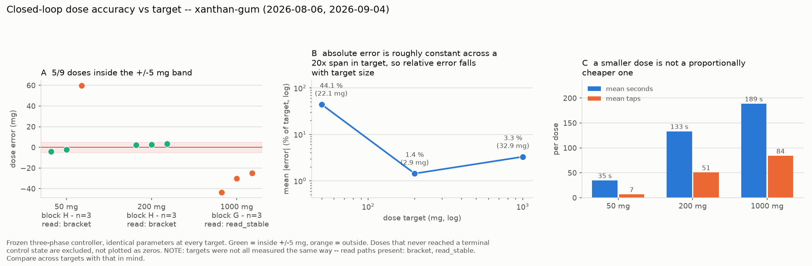

# Block H on xanthan gum — 2026-09-04

Run directory: `data/battery/20260904T203727Z_xanthan-gum/`
MongoDB: `powder_doser.battery_runs`, `_id 6a9b2e06418eba44dae787bd`
`qc.verdict = ok`, `valid_for_cross_powder_comparison = true`

Third powder of the Block H campaign (50 mg ×3 + 200 mg ×3, frozen
three-phase controller, bracketed dose reads), second of the day after
white rice flour. Xanthan gum's flow-characterisation blocks A–E and
1.000 g Block G doses exist from 2026-08-06
(`20260806T140254Z_xanthan-gum`).

| | MDT | UTC |
|---|---|---|
| Balance re-zero | 14:28 | 20:28 |
| Environment survey (240 s) | 14:29 → 14:33 | 20:29 → 20:33 |
| Pre-flight (two passes) | 14:33 → 14:37 | 20:33 → 20:37 |
| **Block H started** | **14:37:27** | 20:37:27 |
| **Block H ended** | **14:45:56** | 20:45:56 |
| **Elapsed** | **0:08:29** | |

Environment: 0.057 mg jitter, 80 % stable frames, **0 shock events**,
but −4.5 mg/min zero drift in the survey — and the per-dose tare
estimates swung −8.7 → +7.3 mg/min across the six doses, which is not
thermal creep (creep is smooth and one-directional). The bench had been
handled ~25 min earlier for the auger swap.

Pre-flight: two passes at tilt 90°. Pass 1 charged the freshly loaded
column (47.9, −8.3, 24.1, 30.1, 99.3 mg/rev); pass 2 reached steady
state at **~143 mg/rev** (62.2, 148.2, 136.8, 154.7, 133.5) — below the
2026-08-06 fully-loaded 186.8 mg/rev, consistent with a lighter fill.
Tap deltas were *negative* on both passes (−8.8, −22.7 mg per 10 taps);
see the electrostatics note below.

## Outcome in one line

**5/6 doses inside ±5 mg** — including the tightest 200 mg triple of
the campaign — with one 50 mg dose overshooting to 109.8 mg on a single
slug release.

## The doses

| # | target | delivered | error | status | time | cycles | taps |
|---|---|---|---|---|---|---|---|
| 0 | 50 mg | 45.9 mg | **−4.1 mg** | **`ok`** | 54 s | fine 3, tap 10 | 20 |
| 1 | 50 mg | 47.7 mg | **−2.3 mg** | **`ok`** | 37 s | fine 6 | 0 |
| 2 | 50 mg | 109.8 mg | **+59.8 mg** | `overshoot` | 13 s | bulk 1, fine 1 | 0 |
| 3 | 200 mg | 202.5 mg | **+2.5 mg** | **`ok`** | 85 s | bulk 1, fine 7, tap 11 | 22 |
| 4 | 200 mg | 202.6 mg | **+2.6 mg** | **`ok`** | 89 s | bulk 1, fine 7, tap 12 | 24 |
| 5 | 200 mg | 203.5 mg | **+3.5 mg** | **`ok`** | 226 s | fine 9, tap 53 | 106 |

The 200 mg errors (+2.5/+2.6/+3.5, σ 0.55 mg) are the tightest 200 mg
triple measured so far — tighter than salt's (−1.3/+13.3/−3.7) and on
the other side of zero from white rice flour's (−4.8/−4.9/−5.0).

## The overshoot is two mechanisms stacked, and both are worth having

**1. A 0.1 mg tare residual decided whether a 55-RPM continuous phase
ran.** The bulk phase skips when to-go ≤ 0.0500 g. Dose 1's tare read
−0.1 mg → to-go 0.0500 → bulk skipped. Dose 2's tare read **+0.1 mg →
to-go 0.0501 → bulk opened** — a CONTINUOUS 55-RPM phase on a 50 mg
target — and landed **20.5 mg** (0.13 rev) in the poll-and-halt
latency before the halt took effect. The skip threshold sits exactly
*at* the 50 mg target, so the balance's last display digit flips the
doser between two qualitatively different regimes. Controller
implication for #123/#130: the bulk-skip test needs a guard band (skip
when to-go ≤ threshold + margin, or whenever the target itself is at or
below the threshold), not an exact comparison against a 0.1 mg-resolution
reading.

**2. One 45° fine increment delivered 89.6 mg — a slug, not a
metering error.** At the measured 143 mg/rev, 45° of auger is ~18 mg.
Five times that arrived at once: a slug released from the charged lip.
This is the same lip-bridging behaviour xanthan gum showed in the
2026-08-06 run (and in @carl-robison's hand tests — "an initial large
burst"), now expressed as a dose failure. Salt's Block H overshoots
(+8.9, +13.3 mg) were increment *granularity*; xanthan gum's is slug
*release*, an order of magnitude larger and less predictable. A
fine-phase increment sized from the powder's mean feed factor is not
safe against a powder whose delivery is quantised in slugs.

## The balance readings misbehaved for this powder specifically

Intra-dose readings swung far beyond anything drift can explain —
between fine cycles of dose 1: −21.2 → −26.7 → +5.4 → −44.5 → +12.2 →
+47.7 mg total-mass readings (a *decreasing* total is physically
impossible for powder); between tap cycles of dose 5: −11.8/+16.4 mg
swings. White rice flour, 95 minutes earlier on the same balance, same
beaker, same hood, stepped monotonically at 3–8 mg/cycle with none of
this. The per-dose tare drift estimates also flipped sign dose to dose.

The signature — bidirectional, tens of mg, powder-specific, appearing
when powder moves and worst near the lip — is consistent with
**triboelectric charging**: xanthan gum is an organic polymer powder
falling into a glass beaker in a dry hood, a textbook static
configuration for an analytical balance. It also retroactively explains
the negative pre-flight tap deltas. The 2026-08-06 xanthan run predates
the per-cycle logging so there is nothing to compare against, and
`design/brainstorming.md` already flags electrostatics (grounding path
for the crucible) for fine powders. Worth a bench test: a grounded or
metal cup, or an anti-static measure, and re-run one 50 mg dose.

Despite it, the 200 mg doses converged cleanly — more cycles average
the disturbance, and the terminal reads settled — which is itself a
robustness statement about the closed loop.

## Block H across three powders

| powder | feed (pre-flight) | 50 mg | 200 mg | overall |
|---|---|---|---|---|
| salt (09-03) | 192 mg/rev | +8.9 / +4.3 / −0.6 | −1.3 / +13.3 / −3.7 | 4/6 |
| white rice flour (09-04) | ~35 mg/rev | −5.0 / −5.0 / −4.0 | −4.8 / −4.9 / −5.0 | **6/6** |
| **xanthan gum (09-04)** | **143 mg/rev** | −4.1 / −2.3 / **+59.8** | **+2.5 / +2.6 / +3.5** | **5/6** |

The pattern sharpening across three powders: **failures are exclusively
overshoots, they happen only at 50 mg, and only on powders whose
per-action quantum is large** (salt ~96 mg per 180° increment, xanthan
gum ~18 mg per 45° increment *plus* slugs). The slow powder sweeps
clean because it can only creep. 200 mg is comfortably inside the
working envelope for all three. The 50 mg boundary is set by action
quantisation, not by measurement.

Method caveat: the 1000 mg comparison points come from Block G runs
(2026-08-06 for xanthan gum) collected through `read_stable()` and an
earlier doser state; Block H doses read through `balance_filter`
brackets. Compare across targets with that in mind.

## Links

- Data: [`data/battery/20260904T203727Z_xanthan-gum/`](../../data/battery/20260904T203727Z_xanthan-gum/)
- Companion characterisation run (blocks A–E + G, 2026-08-06):
  [`data/battery/20260806T140254Z_xanthan-gum/`](../../data/battery/20260806T140254Z_xanthan-gum/)
- Pre-run survey: `docs/rig-checks/data/2026-09-04_xanthan-preroll-survey-240s.csv`
- Block H code: `hardware/test-module/firmware/powder_battery.py`
  (`_block_h_small_dose`).
