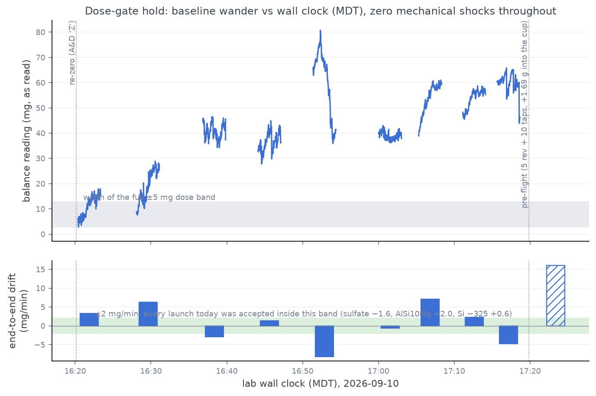

# 2026-09-10 — silicon −110/+200 blocks G+H: stood down at the dose gate

| | |
|---|---|
| Intended | Blocks `GH` (3 × 1 g + 3 × 50 mg + 3 × 200 mg), fifth dose run of the 2026-09-10 campaign |
| Outcome | **Not run.** Gate held 16:20 → 17:25 MDT (ten 180 s surveys); the bench never met the launch condition. Pre-flight *was* run and **confirmed feed at 316.5 mg/rev**. |
| Batch / operator | `metal-2026-08` / swcharles |
| Dataset impact | **None** — no `battery_runs` document was created; MongoDB and the run log are unchanged. |
| Pre-flight record | `data/battery/20260910T231950Z_silicon-110-200_preflight/` |
| Rig left | tilt parked 0°, stepper disabled, solenoid off, no tmux/capture process; **≈1.69 g of silicon in the beaker** (pre-flight discharge — metal-powder waste when emptied) |

Silicon −110/+200 is the last metal powder missing its G+H (valid A–E run:
[2026-08-20](2026-08-20-silicon-110-200.md), 302.4 mg/rev at 90°). The
operator loaded it and removed the tape at 16:11 MDT. Four dose runs had
already launched cleanly today, so the rig, firmware (byte-identical
Pi + Pico checksums) and procedure were all in place — the *room* is what
failed.

## The hold — a ±10–30 mg oscillation, zero shocks, no convergence

Ten 180 s surveys (CSVs under
`docs/rig-checks/data/2026-09-10_silicon-110-200-preroll-survey*.csv`).
The balance was re-zeroed off a stale −33 mg tare at 16:20; every window
after that:

| # | window (MDT) | end-to-end drift | worst 180 s error | shocks |
|---|---|---|---|---|
| 1 | 16:20–16:23 | +3.2 mg/min | 14.4 mg | 0 |
| 2 | 16:28–16:31 | +6.3 | 18.8 | 0 |
| 3 | 16:37–16:40 | −2.9 | 12.3 | 0 |
| 4 | 16:44–16:47 | +1.3 (±8 mid-window swing) | 17.0 | 0 |
| 5 | 16:51–16:54 | −8.2 (peak 80.7 mg, then fall) | 44.8 | 0 |
| 6 | 17:00–17:03 | **−0.6** | **6.8** — near pass | 0 |
| 7 | 17:05–17:08 | +7.1 | 22.1 | 0 |
| 8 | 17:11–17:14 | +2.3 | 13.2 | 0 |
| 9 | 17:16–17:19 | −4.7 | 21.9 | 0 |
| 10 | 17:22–17:25 | +16 *(post-pre-flight: includes lip dribble)* | 48.8 | 0 |

Character: sample-to-sample jitter at or near the display floor
(0.12–0.27 mg), **zero** discrete step events, and a smooth bidirectional
baseline wave of ±10–30 mg with a period of roughly ten minutes. It is
not a settling transient (no decay across an hour), not drafts (jitter
floor), and not a contact fault — a bench-camera frame at 16:56:55 MDT
shows the beaker centred and clear inside the shield with the display
agreeing with the serial reading
(`../rig-checks/frames/2026-09-10_silicon-110-200-gate-hold-bench.png`).

The sharpest fact: at silicon −325's launch gate **90 minutes earlier**
(15:25 MDT) this same balance read 0.009 mg jitter, 100 % stable frames,
2.1 mg/180 s — the cleanest window of the whole campaign. The room
changed state between ~15:30 and ~16:20 MDT, the same interval in which
the auger was swapped and late-afternoon building HVAC ramps. The
oscillation's timescale fits an HVAC/hood duty cycle; a sash left at a
different height after the reload, or an unseated breeze-break section,
would look the same and should be checked first.

## Why stand down rather than launch

Every launch today was accepted inside ±2 mg/min end-to-end with zero
shocks (sulfate −1.6, AlSi10Mg +2.0 after a 70-minute hold, silicon −325
+0.6). Nine of ten windows here failed that; the one near-pass (window
6) was immediately followed by +7 mg/min. A closed-loop dose cannot be
bracketed — mass arrives throughout, so there is no do-nothing interval
for `balance_filter` to fit — which is the 2026-09-03 rule: **in a
disturbed room the dose blocks do not run, because the unit of loss is
the run.** Launching would have spent ~4 g of silicon on 50/200/1000 mg
classifications against a ±5 mg band inside a ±10–30 mg wander, i.e. an
excluded run by construction.

## What was banked anyway: the pre-flight replicate

Short bracketed trials survive this room, so the feed check ran at
17:20 MDT (tilt 90°, 30 RPM): **feed confirmed** —

| revolution | 1 | 2 | 3 | 4 | 5 |
|---|---|---|---|---|---|
| delivered (mg) | 328.7 | 340.1 | 325.8 | 296.7 | 291.3 |

- **316.5 mg/rev, steady from revolution 1** — no charging transient;
  the operator's load filled the delivery flights.
- Against the 2026-08-20 block C at the same tilt: 302.4 mg/rev →
  **+4.7 % agreement across a three-week gap and a fresh reload.** Like
  AlSi10Mg (whose pre-flight matched its A–E era feed factor same-day),
  the coarse silicon did not cake in storage — consistent with the
  hygroscopicity ranking in
  [powder-storage-hygroscopicity.md](../powder-storage-hygroscopicity.md).
- **10 taps → 95.2 mg (9.5 mg/tap at 90°)** — a real tap quantum, where
  the 2026-08-20 A–E run could not resolve one through the old bench's
  noise. AlSi10Mg's equivalent (6.35 mg/tap) predicted its dose tap
  phases would converge, and they did; the same is now expected here.
- The column is **left charged**, so the next attempt can go straight
  from gate to launch.

## Re-run condition

1. Check the **sash height** and that the **breeze break is fully
   seated** — 10 seconds at the bench, and the leading suspects for the
   16:20 onset.
2. Any quiet stretch works: the gate is a 180 s survey inside
   ±2 mg/min with 0 shocks (`balance_environment_survey.py --settle
   180`). This morning's windows passed repeatedly; evening/morning
   HVAC regimes have been reliably calm.
3. Powder is loaded, tape off, column charged, firmware in sync —
   the re-run is just a comment. Emptying the beaker (~1.69 g silicon,
   metal-powder waste) before it is tidier but not blocking: the
   capture tares best-effort and the doses read bracketed deltas.

## Files

- `data/battery/20260910T231950Z_silicon-110-200_preflight/` —
  `preflight.json` + `raw_preflight.log`
- `docs/rig-checks/data/2026-09-10_silicon-110-200-preroll-survey*.csv`
  — ten raw survey captures
- `docs/rig-checks/frames/2026-09-10_silicon-110-200-gate-hold.png` —
  the hold figure (`scripts/plot_gate_hold.py`)
- `docs/rig-checks/frames/2026-09-10_silicon-110-200-gate-hold-bench.png`
  — bench camera during the hold
