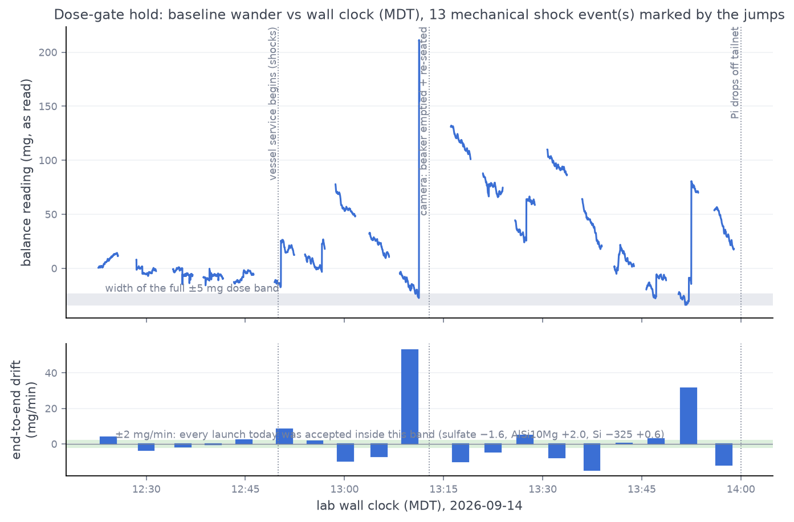

# 2026-09-14 — silicon −110/+200 blocks G+H: second stand-down at the dose gate

| | |
|---|---|
| Intended | Blocks `GH` (3 × 1 g + 3 × 50 mg + 3 × 200 mg) — the last missing cell of the powders × blocks coverage grid |
| Outcome | **Not run.** Gate held 12:22 → 13:58 MDT (19 × 180 s surveys); no window met the launch condition. At **14:00 MDT the doser Pi dropped off the tailnet** mid-hold and had not returned by the session bound, so the fresh-reload pre-flight could not be banked either. |
| Batch / operator | `metal-2026-08` / swcharles (loaded the powder and removed the tape ~12:12 MDT) |
| Dataset impact | **None** — no `battery_runs` document was created; MongoDB and the run log are unchanged (35 runs). No powder was dispensed. |
| Rig left | Untouched since the pre-hold checks: tilt parked 0°, stepper de-energised, solenoid off, no tmux/capture process. Balance was re-zeroed off a stale +73.8 mg tare at 12:20 MDT. Firmware/scripts byte-identical Pi ↔ Pico ↔ repo (verified 12:18 MDT, before the outage). |

This is the second stand-down for this powder's G+H, after
[2026-09-10](2026-09-10-silicon-110-200-gh-standdown.md). Same gate, same
verdict, different room signature — and this time the operator's bench work
is visible *inside* the record.

## The hold — 19 windows, none launchable

Launch condition (unchanged from the four 2026-09-10 launches): a 180 s
survey with end-to-end inside ±6 mg (±2 mg/min), peak-to-peak swing ≤ 6 mg,
and 0 shock events; a marginal window (swing ≤ 9 mg) launches only if the
next window confirms it, so a single lucky wave-crossing cannot fake a pass
(the 09-10 hold's window 6 was exactly that trap).

| # | window (MDT) | end-to-end (mg/180 s) | peak-to-peak (mg) | single-poll jumps ≥ 10 mg |
|---|---|---|---|---|
| 1 | 12:22–12:25 | +11.1 | 13.8 | 0 |
| 2 | 12:28–12:31 | −4.1 | 15.2 | 0 |
| 3 | 12:34–12:37 | −6.1 | 15.8 | 0 |
| 4 | 12:38–12:41 | −1.2 | 15.5 | 0 |
| 5 | 12:43–12:46 | +7.7 | 12.6 | 0 |
| 6 | 12:49–12:52 | +25.1 | 43.9 | 2 |
| 7 | 12:54–12:57 | +7.2 | 30.1 | 1 |
| 8 | 12:58–13:01 | −27.4 | 30.0 | 0 |
| 9 | 13:03–13:06 | −21.0 | 23.4 | 0 |
| 10 | 13:08–13:11 | **+192.2** | **238.8** | 5 |
| 11 | 13:16–13:19 | −29.4 | 31.2 | 0 |
| 12 | 13:20–13:23 | −14.1 | 22.2 | 0 |
| 13 | 13:25–13:28 | +15.3 | 42.4 | 1 |
| 14 | 13:30–13:33 | −23.3 | 24.0 | 0 |
| 15 | 13:35–13:38 | −43.0 | 46.4 | 0 |
| 16 | 13:40–13:43 | +1.2 | 26.9 | 0 |
| 17 | 13:45–13:48 | +8.5 | 22.3 | 0 |
| 18 | 13:50–13:53 | +94.3 | 114.5 | 4 |
| 19 | 13:55–13:58 | −36.1 | 39.3 | 0 |

Jitter sat at the 0.1 mg display floor in every window — drafts were never
the problem. Three phases are legible in the record:

1. **12:22–12:46 (windows 1–5): the 09-10 wave, reproduced.** Smooth
   bidirectional 12–16 mg swings, ~10 min period, zero jumps — the same
   HVAC/hood-duty-cycle signature that stood the 09-10 attempt down,
   at about half its amplitude.
2. **12:49–13:11 (windows 6–10): vessel service.** Jumps and a +192 mg
   excursion — the bench being worked on. A live camera frame at
   **13:12:49 MDT** shows the outcome: the beaker freshly emptied and
   cleaned (the ≈1.69 g of 09-10 pre-flight silicon gone), re-seated and
   centred, breeze break closed, tube parked at 0°
   (`../rig-checks/frames/2026-09-14_silicon-110-200-gate-hold-bench.png`).
3. **13:16–13:58 (windows 11–19): post-service equilibration that never
   converged.** 22–46 mg swings with occasional jumps — *larger* than
   before the service, consistent with a washed/handled vessel and
   enclosure equilibrating (the AlSi10Mg 09-10 pre-roll took ~70 min to
   decay after its vessel wash) stacked on continuing room activity. No
   decaying trend was established before the outage cut the hold short.

## 14:00 MDT — the Pi dropped off the tailnet

Tailscale shows the doser Pi last seen 14:00:00 MDT; SSH then timed out
for the rest of the session. Identical presentation to the 2026-09-10
morning outage (network-only, ~1 h, no reboot, no rig impact — the Pi had
10 days' uptime at the start of this session and the rig was idle with
nothing commanded). Consequences:

- The **fresh-reload pre-flight could not be banked.** The 09-10 pre-flight
  replicate (316.5 mg/rev) belongs to the *09-10 load*; the auger has since
  been swapped to salt (per `RIG-STATE.md`, 09-11) and back to silicon
  today, so the next attempt owes a pre-flight before its doses regardless.
- The stand-down could not include the usual end-of-session device check;
  the rig's last verified state is the 12:18 MDT sync check (idle, parked),
  and nothing was commanded after it.

## Why stand down rather than launch

Unchanged from 09-10, with today's numbers: a closed-loop dose cannot be
bracketed — mass arrives throughout, so there is no do-nothing interval for
`balance_filter` to fit — and every window here carried 12–240 mg of
baseline motion against a ±5 mg classification band. Launching would have
spent ~4 g of silicon on an excluded-by-construction run. The four 09-10
launches were all accepted inside ±2 mg/min with zero shocks; nothing today
came close on the swing criterion.

## Re-run condition

1. **Pick a calm HVAC regime.** Both stand-downs now bracket the same
   finding: mid-afternoon (12:20–14:00 today, 16:20–17:25 on 09-10) carries
   a 10-minute-period wave the gate never passes, while every successful
   dose launch of the campaign went out in the morning (09-10: 07:39,
   11:08, 13:44, 15:29 MDT launches — the two afternoon ones only after
   long holds caught a lull). Morning is the reliable window.
2. **Give the bench ≥ 1 h hands-off before the attempt** — the vessel
   service mid-hold reset the equilibration clock today; window 10 to
   window 19 was only 47 min.
3. Powder is loaded and tape is off (operator, 12:12 MDT today). The next
   session runs the gate, then **pre-flight (owed for this load)**, then
   straight into `blocks="GH"` — launcher already staged on the Pi
   (`~/launch_silicon110_gh.sh`).

## Files

- `docs/rig-checks/data/2026-09-14_silicon-110-200-preroll-survey{1..19}-180s.csv`
  — the raw survey captures
- `docs/rig-checks/frames/2026-09-14_silicon-110-200-gate-hold.png` — the
  hold figure (`scripts/plot_gate_hold.py`, which now derives its
  shock-count title from the data instead of asserting "zero shocks")
- `docs/rig-checks/frames/2026-09-14_silicon-110-200-gate-hold-bench.png`
  — bench camera at 13:12:49 MDT, post-service
