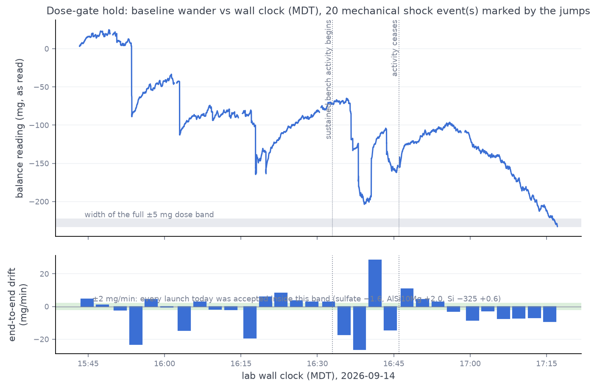

# 2026-09-14 (evening) — silicon −110/+200 blocks G+H: third stand-down at the dose gate

| | |
|---|---|
| Intended | Blocks `GH` (3 × 1 g + 3 × 50 mg + 3 × 200 mg) — still the last missing cell of the powders × blocks coverage grid |
| Outcome | **Not run.** Gate held 15:43 → 17:17 MDT (**30 × 180 s windows, zero passes**) and the posted hard stop was honoured. The pre-flight (owed for this load since the 09-14 midday outage) therefore also did not run — the flow is gate → pre-flight → launch, and the gate never opened. |
| Batch / operator | `metal-2026-08` / swcharles (powder loaded and tape removed 12:12 MDT, before the midday attempt; untouched since) |
| Dataset impact | **None** — no powder dispensed, no `battery_runs` document created; MongoDB and the run log unchanged (35 runs). |
| Rig | Never actuated this session: no stepper, servo or solenoid command was issued at any point. Balance was re-zeroed off a stale +252.6 mg tare at 15:41 MDT (sample-to-sample jitter 0.078 mg — display floor). Tilt parked 0° throughout, confirmed on camera at 17:19 MDT. |
| Pi | Back on the tailnet after the 14:00 MDT outage — 11 days' uptime, so the outage was network-only, no reboot. |

Third stand-down for this powder's G+H, after
[2026-09-10](2026-09-10-silicon-110-200-gh-standdown.md) (16:20–17:25 MDT) and
[2026-09-14 midday](2026-09-14-silicon-110-200-gh-standdown2.md) (12:22–13:58 MDT).
This hold sampled the **evening** (15:43–17:17 MDT) — the one day-part not yet
tried — and adds a new finding: after the end-of-day bench activity stopped,
the room did not go quiet; it settled into a **sustained monotone drift**.

## The hold — 30 windows, none launchable

Launch condition (unchanged from the four accepted 2026-09-10 launches): a
180 s survey with end-to-end inside ±6 mg, peak-to-peak swing ≤ 6 mg, zero
single-poll jumps ≥ 10 mg; a marginal window (swing ≤ 9 mg) launches only if
the next window confirms it.

| # | ends (UTC) | ends (MDT) | end-to-end (mg/180 s) | peak-to-peak (mg) | jumps ≥ 10 mg |
|---|---|---|---|---|---|
| 1 | 21:46:18 | 15:46 | +14.0 | 17.3 | 0 |
| 2 | 21:49:20 | 15:49 | +2.8 | 10.9 | 0 |
| 3 | 21:52:49 | 15:52 | −7.2 | 17.8 | 0 |
| 4 | 21:55:51 | 15:55 | −69.9 | 101.8 | 4 |
| 5 | 21:58:53 | 15:58 | +13.4 | 13.8 | 0 |
| 6 | 22:01:55 | 16:01 | −1.8 | 16.1 | 0 |
| 7 | 22:05:23 | 16:05 | −43.7 | 70.1 | 3 |
| 8 | 22:08:25 | 16:08 | +7.5 | 12.0 | 0 |
| 9 | 22:11:27 | 16:11 | −4.9 | 19.7 | 0 |
| 10 | 22:14:30 | 16:14 | −6.3 | 11.7 | 0 |
| 11 | 22:18:17 | 16:18 | −58.2 | 84.3 | 4 |
| 12 | 22:21:19 | 16:21 | +17.8 | 37.3 | 2 |
| 13 | 22:24:21 | 16:24 | +25.0 | 25.0 | 0 |
| 14 | 22:27:23 | 16:27 | +10.5 | 16.4 | 0 |
| 15 | 22:30:25 | 16:30 | +7.9 | 11.8 | 0 |
| 16 | 22:33:42 | 16:33 | +7.9 | 11.8 | 0 |
| 17 | 22:36:44 | 16:36 | −52.0 | 54.2 | 2 |
| 18 | 22:39:47 | 16:39 | −78.6 | 86.3 | 2 |
| 19 | 22:42:49 | 16:42 | +86.6 | 91.6 | 2 |
| 20 | 22:45:51 | 16:45 | −42.7 | 57.9 | 1 |
| 21 | 22:49:07 | 16:49 | +32.2 | 34.6 | 0 |
| 22 | 22:52:09 | 16:52 | +12.6 | 17.4 | 0 |
| 23 | 22:55:11 | 16:55 | **+8.2** | **9.6** | 0 |
| 24 | 22:58:13 | 16:58 | −9.6 | 13.7 | 0 |
| 25 | 23:01:57 | 17:01 | −25.2 | 27.2 | 0 |
| 26 | 23:04:59 | 17:04 | −8.1 | 11.0 | 0 |
| 27 | 23:08:01 | 17:08 | −21.6 | 22.9 | 0 |
| 28 | 23:11:03 | 17:11 | −21.3 | 23.1 | 0 |
| 29 | 23:14:06 | 17:14 | −20.1 | 28.2 | 0 |
| 30 | 23:17:08 | 17:17 | −26.9 | 28.5 | 0 |

(Windows 15 and 16 read identically to one decimal; the raw CSVs are distinct
captures at different absolute levels — −91 vs −77 mg — so it is a
coincidence, not a duplicated file.)

Jitter sat at the 0.1 mg display floor in every window — drafts were never
the problem. Five phases are legible:

1. **15:43–16:14 (windows 1–10, minus 4 and 7): the familiar wave.** Smooth
   shock-free 11–20 mg swings with a ≈10 min period — the signature of both
   earlier stand-downs, at the midday hold's amplitude.
2. **Bench disturbances (windows 4, 7, 11, 12).** Shock clusters of 2–4
   jumps, 37–102 mg peak-to-peak, arriving roughly every 10 minutes through
   the first half of the hold.
3. **16:33–16:46 (windows 17–20): sustained activity.** Every window
   shocked (54–92 mg) — continuous work at or near the bench.
4. **16:46–16:58 (windows 21–24): activity ceases, wave decays.** Zero
   shocks; swing falls 34.6 → 17.4 → **9.6** → 13.7 mg. Window 23 was the
   closest of all three holds to a launch — 0.6 mg over the marginal swing
   bound and 2.2 mg over the end-to-end bound — but it was a trough
   crossing, not a trend: window 24 moved away again. This is exactly the
   single-window trap the two-window confirmation rule exists to reject.
5. **17:01–17:17 (windows 25–30): the drift regime.** Sustained monotone
   fall of −20 to −27 mg per 180 s (≈ −7 to −9 mg/min) with zero shocks for
   17 straight minutes and no sign of decay. This is not the oscillating
   wave — the baseline was simply walking. Cumulative walk over the whole
   hold: the balance, zeroed at 15:41, read **−233 mg by 17:17**.

A bench-camera frame at 17:19 MDT shows why nothing could be attributed:
rig parked and correct, beaker centred and clear, shield closed, nobody in
frame (`../rig-checks/frames/2026-09-14-attempt3_bench-at-standdown.png`).
Whatever drives the evening drift is invisible — consistent with HVAC
behaviour (possibly an after-hours setback regime) rather than people.

## Why stand down rather than launch

Unchanged physics: a closed-loop dose cannot be bracketed — mass arrives
throughout, so `balance_filter` has no do-nothing interval to fit — and the
G/H doses classify against a ±5 mg band. In the phase-5 regime alone, the
baseline moves 20–120 mg over the 3–14 minutes a dose takes. Launching would
have spent ≈4–6 g of silicon on a run excluded by construction, exactly what
the gate exists to prevent. The hold was extended twice (posted each time)
because phase 4 looked like the 09-10 pattern of a lull after activity;
phase 5 showed the lull never came.

## What three stand-downs now establish

| hold | day-part (MDT) | outcome |
|---|---|---|
| 2026-09-10 | 16:20–17:25 | wave, no pass |
| 2026-09-14 midday | 12:22–13:58 | wave + service equilibration, no pass |
| 2026-09-14 evening | 15:43–17:17 | wave + activity + **drift regime**, no pass |
| four accepted launches (09-10) | 07:39, 11:08, 13:44, 15:29 | the later two only after long holds caught a lull |

Midday, afternoon and evening have each now been sampled and failed;
**every launch of the campaign that passed the gate cleanly went out in the
morning.** The evening adds that even an empty lab does not guarantee a
launchable balance — the drift regime replaces the people.

## Re-run condition

1. **Morning.** Before ≈11:00 MDT, with the bench hands-off for the hour
   before. This is now a three-stand-down finding, not a preference.
2. Powder is loaded and tape is off (operator, 09-14 12:12 MDT; nothing has
   been dispensed since). The **pre-flight is still owed** — column charge
   state remains unverified after the auger's salt round-trip.
3. Everything is staged: launcher `~/launch_silicon110_gh.sh` and pre-flight
   runner `~/preflight_runner.sh` on the Pi, firmware in sync, and the gate
   loop is now a committed tool (`scripts/gate_hold.sh` — runner-side, one
   command). The next session is: gate → pre-flight → launch → report.
4. The #157 drift work is the longer-term fix; the granite slab (PR #147
   sourcing note) remains the hardware answer for the dose blocks.

## Files

- `docs/rig-checks/data/2026-09-14-attempt3_silicon-110-200-preroll-survey{1..30}-180s.csv`
  — the raw survey captures (window N of the table)
- `docs/rig-checks/frames/2026-09-14-attempt3_silicon-110-200-gate-hold.png`
  — the hold figure (`scripts/plot_gate_hold.py`)
- `docs/rig-checks/frames/2026-09-14-attempt3_bench-at-standdown.png`
  — bench camera at 17:19:51 MDT, post-hold
- `scripts/gate_hold.sh` — the gate loop as run (30 windows validated live
  this session), committed so the next attempt does not rebuild it ad hoc
