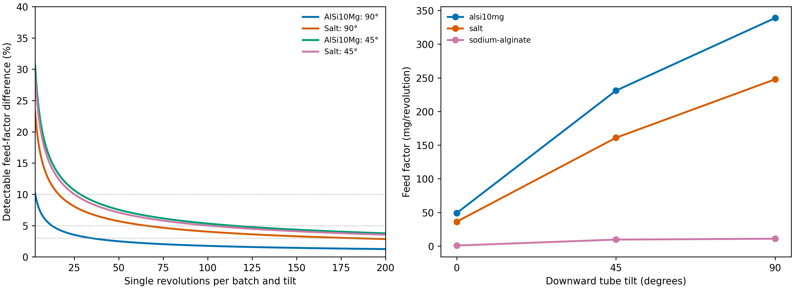
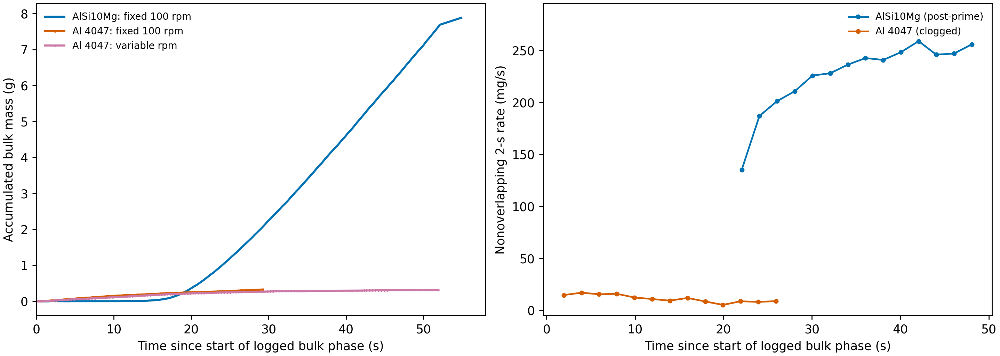

# Doser-based flowability proxies for LPBF powder spreading

Issue [#163](https://github.com/vertical-cloud-lab/powder-doser/issues/163) (request from the 2026-10-02
atomizer meeting): one flowability number per atomized batch, using the auger doser instead of a
commercial spreadability tester. Informed by two Edison tasks, both archived under
[`edison_artifacts/`](edison_artifacts/):

- **Literature** (`paperqa3-high`, task `29ff3ff2-9f73-40d4-a8d1-84442070e1b9`): which flowability
  metrics predict LPBF spreadability, and screw-feeder and rotating-drum analogs.
  [answer](edison_artifacts/lit_spreadability_proxies/lit_spreadability_proxies.answer.md),
  [references](edison_artifacts/lit_spreadability_proxies/lit_spreadability_proxies.references.md).
- **Analysis** (`data-analysis-crow-high`, task `0b0b98aa-d9f8-485f-9c1c-e403197a2b04`) of the #116
  battery data plus the AlSi10Mg and Al 4047 production doses from #166.
  [answer](edison_artifacts/analysis_doser_flowability_proxies/analysis_doser_flowability_proxies.answer.md),
  [notebook](edison_artifacts/analysis_doser_flowability_proxies/outputs/0b0b98aa-d9f8-485f-9c1c-e403197a2b04.ipynb),
  [code](edison_artifacts/analysis_doser_flowability_proxies/outputs/analysis.py),
  [feature table](edison_artifacts/analysis_doser_flowability_proxies/outputs/feature_table.csv),
  [correlations](edison_artifacts/analysis_doser_flowability_proxies/outputs/correlations.csv).
  The uploaded bundle is listed in
  [`bundle_manifest.txt`](edison_artifacts/analysis_doser_flowability_proxies/bundle_manifest.txt).

## Proposal

1. **Prep:** sieve each batch to the LPBF cut (weigh the oversize as a QC number), vacuum-dry it at
   60–80 °C, measure its poured bulk density, and test it in the same session as the commercial
   AlSi10Mg reference at the same hopper fill, because salt's feed factor drifted about 10 % between
   days.
2. **Run (about 15 min, taps off):** prime at 45°/30 rpm until flow is steady (needing more than 30
   revolutions is itself a flag), then 20 single revolutions at 90°/30 rpm with a stable balance read
   after each, then 6 continuous revolutions at 45°/15 rpm with the balance streaming.
3. **Proxy 1, gravity-assisted volumetric flow** V_g = (FF₉₀/ρ_bulk)_batch ÷ (FF₉₀/ρ_bulk)_AlSi10Mg:
   across the 10 conveying #116 powders FF₉₀ tracks literature angle of repose (Spearman ρ = −0.77),
   and its 2.8–4.5 % per-revolution CV on AlSi10Mg means 13 revolutions resolve a 5 % batch difference
   and 35 resolve 3 % in principle (0° and 45° are 3–8× noisier, so they are dropped).
4. **Proxy 2, interruption fraction** I_stop = share of 15 rpm balance increments below
   max(2 mg, 3σ of the motor-off noise), a doser analog of a rotating-drum cohesive index (which tracked
   blade-recoater layer roughness across 316L, 718 and AlSi10Mg in Brocksieper et al. 2026): it tracks
   angle of repose (ρ = +0.76) while only partly overlapping V_g (ρ = −0.66), reading 0.13 for AlSi10Mg
   and 0.96 for sodium alginate.
5. **Provisional flag:** V_g < 0.8, I_stop more than 0.30 above the reference's, or a failed prime; the
   unsieved al4047-9fxeqt would have failed on throughput alone (0.011 vs 0.236 g/s for AlSi10Mg at the
   same 40°/100 rpm), but that was the chunk clog, which sieving should remove.
6. **Validate once:** neither number sees rare oversize streaks or fines-driven loss of thin-layer
   density, so calibrate the cutoffs by doctor-blading single 50–100 µm layers of 3–4 deliberately
   varied batches (sieved vs unsieved, dried vs humid, plus AlSi10Mg) and checking that both proxies
   rank them like layer coverage and areal mass.

*Left: smallest detectable feed-factor difference between two same-day batches vs single revolutions
per batch (two-sided α = 0.05, power 0.8, independent revolutions assumed, so optimistic). Right: #116
feed factor vs tilt. From the Edison analysis.*

*Same bulk settings (40°, 100 rpm, 2 Hz taps): commercial AlSi10Mg vs the unsieved, clogged Al 4047.*

## Caveats (from the two Edison answers)

- The rank correlations use class-typical literature angles of repose (n = 10, uncorrected); they show
  the proxies order powders like angle of repose does, not that they predict LPBF layer quality.
- The resolution numbers assume independent revolutions on one well-behaved powder. Salt's 90° CV was
  10 %, which needs 66 revolutions for a 5 % difference. Two salt days are the only day-to-day data.
- I_stop has no measured repeatability yet. With 24 one-second windows its best-case detectable
  difference is about 0.27, so the 0.30 cutoff sits at the resolution limit. It also depends on the
  balance poll rate and bench noise, so compute σ from motor-off reads in the same session.
- The literature answer recommended horizontal (0°) feed factor and per-revolution RSD. The data
  analysis moved to 90° (0° is 7.6× noisier on AlSi10Mg) and to the interruption fraction (per-revolution
  RSD at 90° tracked angle of repose at only ρ = +0.35).
- Al alloy powders pick up moisture (AlSi10Mg gained 0.437 % at 50 °C and 80 % RH, Cordova et al. 2020),
  so log RH, test dried powder, and keep the hopper fill fixed (feed factor falls as the hopper empties).
