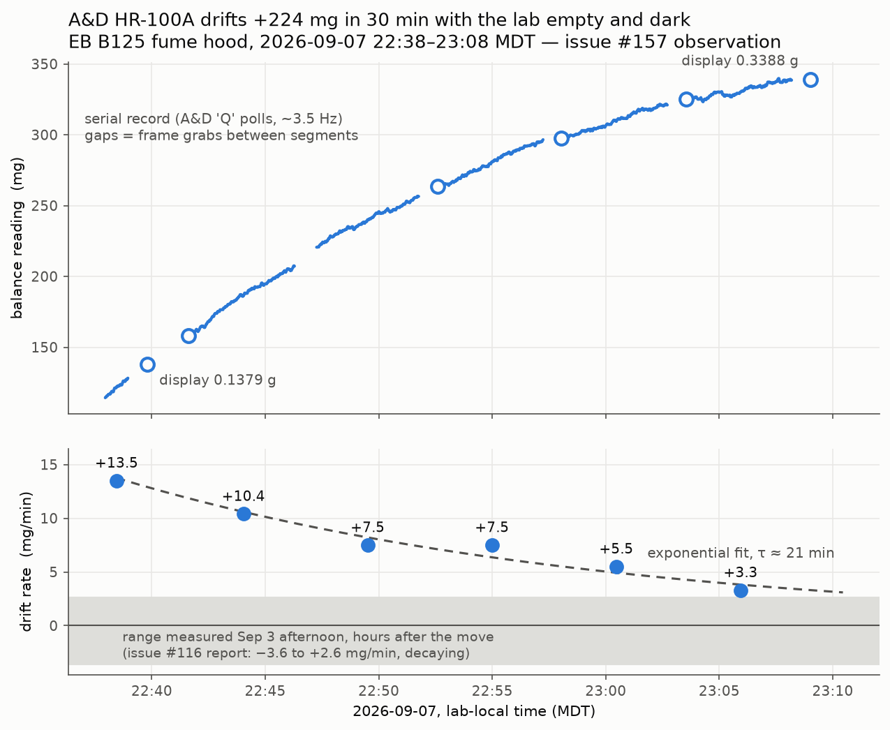
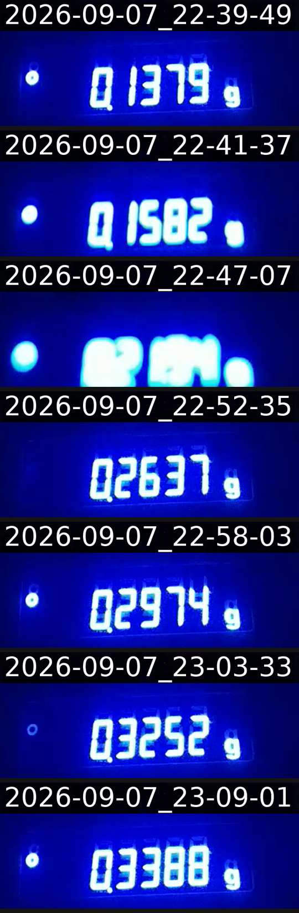

# Issue #157 — scale drift observation, EB B125 fume hood

Overnight observation of the A&D HR-100A drifting with **nobody in the lab
and the lights off**, recorded 2026-09-07 22:38–23:09 MDT (2026-09-08
04:38–05:09 UTC) from the CI runner over Tailscale, in response to
[issue #157](https://github.com/vertical-cloud-lab/powder-doser/issues/157).

## Headline numbers

The balance climbed **+224 mg in 30 minutes** (114.3 → 338.6 mg on the
serial record; 0.1379 → 0.3388 g on the display) while the room was empty.
The rate was not constant — it decayed smoothly:

| segment (270 s each) | start (MDT) | fitted drift (mg/min) | jitter (mg) | stable frames | steps >10 mg |
|---|---|---|---|---|---|
| 0 (60 s smoke) | 22:37:57 | +13.5 | 0.087 | 68 % | 0 |
| 1 | 22:41:47 | +10.4 | 0.081 | 68 % | 0 |
| 2 | 22:47:15 | +7.5 | 0.073 | 72 % | 0 |
| 3 | 22:52:44 | +7.5 | 0.074 | 70 % | 0 |
| 4 | 22:58:12 | +5.5 | 0.073 | 73 % | 0 |
| 5 | 23:03:41 | +3.3 | 0.077 | 71 % | 0 |

An exponential fit to the rate gives **τ ≈ 21 min** — a relaxation toward
equilibrium, not a steady environmental force. Zero mechanical step events
in 26 min of sampling, and sample-to-sample jitter at or below the 0.1 mg
display resolution, so **neither drafts nor vibration is the cause**; the
new hood remains far quieter than the polishing-lab hood on both counts
(which showed 0.7–2.9 mg jitter and ~100 mg shock offsets).

The same signature (smooth decaying drift, −3.6 to +2.6 mg/min, no shocks)
was measured on Sep 3, hours after the balance was moved into this hood
(see `handoff/2026-09-03_blockh_UNPOSTED_REPORT.md` on the Pi, recovered to
branch `claude/issue-116-blockh-recovered`).

## Method

Two independent, read-only channels, cross-checked:

1. **Serial**: `balance_environment_survey.py` (lives on the Pi at
   `~/powder-doser/scripts/`, and in git on the `claude/issue-116-*`
   branches) polls the HR-100A with A&D `Q` queries at ~3.5 Hz via the
   Pico. Five 270 s segments plus one 60 s smoke segment; raw samples in
   `seg*.csv` (`t_s,status,mg`, t relative to segment start), analyzer
   output in `seg*.survey.txt`.
2. **Visual**: `bench_frame.py` grabbed a livestream frame between
   segments (picam-d1pr broadcast; burned-in overlay clock is lab-local
   MDT). Display readings agree with the serial record to 1–2 mg
   throughout — see `contact_sheet.png` and `frame*.png` (`frame2.png` is
   motion-blurred and was excluded).

`observe_drift.py` is the driver that alternated the two (run on the CI
runner with the `RPI_*` env vars present); `make_plot.py` rebuilds the
figure from the CSVs.

## Reading

Consistent with thermal re-equilibration after a disturbance (occupancy,
lights, sash movement) rather than drafts, vibration, or electronics
failure. See the issue #157 comment thread for the full cause/solution
discussion.
