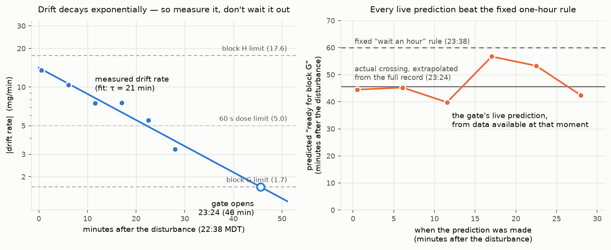

# Issue #157 — the settling gate (`scripts/balance_readiness.py`)

The drift measured in [`docs/issue-157-drift/`](../issue-157-drift/) decays
exponentially (τ ≈ 21 min on 2026-09-07). The conservative response —
"wait an hour after any disturbance" — charges every run the worst case,
which [issue #157](https://github.com/vertical-cloud-lab/powder-doser/issues/157)
correctly objects would more than double operating time.

`scripts/balance_readiness.py` replaces the fixed wait with a
measurement. It takes short read-only samples (A&D `Q` polls, safe with a
loaded auger), extracts the drift rate, fits the decay actually in
progress, and answers per measurement profile: **go now, or ready in
N minutes**. By default it blocks until ready, so the settling window
costs no operator time — chain it in front of a run and walk away:

```bash
# on the CI runner (RPI_* env) or on the Pi with --local
python scripts/balance_readiness.py --profile block-g --confirm 2 \
    && python scripts/powder_battery_capture.py --unattended ...
```

```
--once            one sample + verdict for every profile (exit 0/1)
--confirm 2       require consecutive clean samples (use for unattended)
--duration/--budget   gate a custom measurement length
--json state.json     machine-readable state after every sample
--from-csv f.csv@OFF  replay recorded captures (validation, post-mortems)
```

## Gate limits

The environment may contribute at most the error budget over one
measurement, so the drift-rate limit is `budget / duration`:

| profile | duration | budget | drift limit | typical use |
|---|---|---|---|---|
| `short` | 10 s | 5 mg | 30 mg/min | blocks A–F, bracketed trials |
| `block-h` | 17 s | 5 mg | 17.6 mg/min | one bracketed micro-dose |
| `dose-60` | 60 s | 5 mg | 5 mg/min | slow trial / one dose phase |
| `block-g` | 180 s | 5 mg | 1.7 mg/min | closed-loop dose, ±5 mg band |

Any profile also requires jitter ≤ 0.30 mg (drafts) and zero shock
events; a shock restarts the settling clock, since it is a fresh
disturbance. The ETA uses τ fitted live from successive samples, falling
back to the measured issue-157 default (21 min) until two usable points
exist.

## Validation 1: replay of drift night (2026-09-07)

Replaying the six recorded segments through the gate
([`replay_2026-09-07.txt`](replay_2026-09-07.txt), final state in
[`replay_state.json`](replay_state.json), figure rebuilt by
[`make_readiness_plot.py`](make_readiness_plot.py)):



* Short bracketed work (blocks A–F, H) was **GO the entire night**, even
  at the +13.5 mg/min peak — the hour-long wait was never needed for it.
* Block G would have opened ≈ 23:24, **46 min after the disturbance**
  (extrapolated from the full record; the last sample ends at 23:08 still
  at +3.3 mg/min). The fixed rule says 23:38.
* Every live prediction, including the one made from the **first 60 s
  sample**, landed between 40 and 57 min — always earlier than the fixed
  rule, and the gate would have *held closed* through all six samples,
  correctly (30 min genuinely was not enough for block G that night).

## Validation 2: live shakedown, 2026-09-08 morning

Run from the CI runner while lab members were in and out of EB B125
(times MDT, approximate to the minute; raw samples for the last run in
[`live-2026-09-08/`](live-2026-09-08/)):

| time | drift | jitter | gate said |
|---|---|---|---|
| 10:50 | +8.2 mg/min | 0.100 mg | short/block-h GO; block G in ~33 min |
| 10:52 | +3.7 mg/min | 0.033 mg | dose-60 opened (decay much faster than τ=21) |
| 10:54 | −5.9 mg/min | 0.145 mg | sign flip + jitter = renewed activity in the lab |
| 10:57 | +0.03 mg/min | 0.088 mg | block G opened |
| ~11:06 | — | — | serial port busy: live work at the rig; the gate yields |

Two lessons folded back into the tool:

1. A lone quiet 90 s window opened block G while someone was demonstrably
   still around (the −5.9 → +0.03 swing). Sound for smooth thermal
   decays, weak during occupancy — hence `--confirm 2` for unattended
   use, pinned by a regression test.
2. When another process owns the Pico, the gate reports it and stops
   rather than fighting for the port (inherited from `balance_zero.py`).

## Calibration weight (outstanding since the move)

From the HR-A series manual: the HR-100A calibrates with a **100 g
(factory setting) or 50 g** external weight; the stored value is
adjustable ±0.0150 g, so a certificate's actual value can be entered.
Post-cal verification is ±2 digits (±0.2 mg) — do it through the gate
like a `dose-60` measurement. Class math for this application: a weight
in error by δ at 100 g scales doses by δ/100 g, so even an M1-class
weight (±5 mg) contributes ≤ 0.05 mg on a 1 g dose — any clean,
undamaged 50/100 g weight in the building is adequate for dosing;
certified E2 matters only for traceable absolute mass. Let the weight
sit in the hood to reach temperature, and handle it only with forceps.

## Toward issue #128

This gate is the software half of "automate the whole thing": with
`--confirm 2` in front of `powder_battery_capture.py --unattended`,
settling time becomes unattended runtime — overnight, when drift-night
data shows the room is at its quietest, no operator waits at all. The
gate samples and releases the serial port, so it composes with any run
that starts afterward; continuous *in-run* monitoring belongs in the
capture path (`balance_filter.py`), not a second port-holder.
