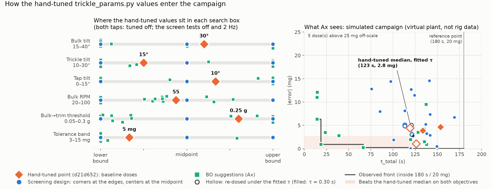
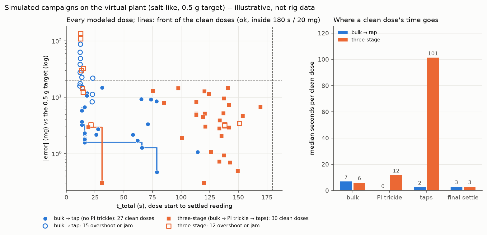

# Optimization campaign: workflow and algorithm design (issue #164)

Design document for the issue #164 campaign; the code it specifies is built and listed
in §3. It answers the two questions issue
[#164](https://github.com/vertical-cloud-lab/powder-doser/issues/164) asks to settle
before code is written:

1. **The workflow** — which machine runs what, where the user types, where data lands,
   and how optimized parameters get reused for future dosing (§1).
2. **The optimization algorithm** — search space, objectives, constraints, the screening
   start prescribed by [PR #162](https://github.com/vertical-cloud-lab/powder-doser/pull/162),
   dose-amount policy, and what gets recorded per dose (§2).

> **Update 2026-09-22** — William answered §4's open questions in
> [issue #164](https://github.com/vertical-cloud-lab/powder-doser/issues/164):
> tap cadence **2 Hz**, target mass **0.5 g**, thresholds **180 s / 20 mg**
> confirmed, first powder **salt**, tuned baseline committed to PR #154
> (`d21d652`), Honegumi sample provided (`ax-platform==0.4.3`, SOBOL → SAASBO,
> existing-data attach). The answers are folded in below; §4 records them as
> locked decisions. Two additions on his request: §2.8 — τ_afterflow quantified
> as a function of mass rate during screening and saved per powder for the
> filters — and §5, the laptop runbook ("what do I need on my computer to run
> this manually").

> **Update 2026-10-01** — §6 adds an alternative campaign that drops the PI trickle:
> the bulk halts on a predicted final mass a set margin short of the goal and the tap
> endgame finishes (`opt_campaign.py --variant bulk-tap`, firmware
> `set trickle_enabled 0`). Everything else in this document applies to it unchanged.

> **Clarification, later the same day** — "run this manually" meant manually
> *starting* the loop, not hand-running doses: once launched, the campaign is
> automated end to end (ask → SSH dose → tell → record), and the operator
> supervises rather than operates. §1.2, §2.3, §3, §4 and §5 now say so; the
> interim hand-transcribed ask–tell mode a draft of §5.3 described is dropped.

It builds on four open threads:

| Thread | What it contributes here |
|---|---|
| [PR #154](https://github.com/vertical-cloud-lab/powder-doser/pull/154) trickle-tap firmware ([`hardware/test-module/firmware/trickle_tap/`](https://github.com/vertical-cloud-lab/powder-doser/tree/claude/issue-153-20260903-2040/hardware/test-module/firmware/trickle_tap)) | The controller being optimized — bulk → PI trickle → tap endgame, hand-tuned by William to well within 10 mg. Its [`trickle_params.py`](https://github.com/vertical-cloud-lab/powder-doser/blob/claude/issue-153-20260903-2040/hardware/test-module/firmware/trickle_tap/trickle_params.py) holds every knob, all settable live over the REPL (`set <key> <value>`). |
| [PR #162](https://github.com/vertical-cloud-lab/powder-doser/pull/162) optimization design doc ([`docs/optimization/README.md`](https://github.com/vertical-cloud-lab/powder-doser/blob/claude/issue-161-20260909-2256/docs/optimization/README.md)) | Problem formulation and the §5 screening DOE this campaign starts with (adapted in §2.4 to the issue #164 parameter list). |
| [PR #131](https://github.com/vertical-cloud-lab/powder-doser/pull/131) data collection ([`docs/characterization-data-collection.md`](https://github.com/vertical-cloud-lab/powder-doser/blob/claude/issue-130-20260721-1807/docs/characterization-data-collection.md)) | The proven remote-operation pattern: laptop → Tailscale SSH → Pi Zero (bench host, tmux) → USB serial → Pico; `powder_id` slug stamped on everything; MongoDB `powder_doser` DB with `MONGODB_URI` in an env file on the Zero; everything written to SD first so offline runs backfill later. |
| [PR #124](https://github.com/vertical-cloud-lab/powder-doser/pull/124) twin + benchmarks | The simulation twin the controller was ported from; useful for dry-running the campaign loop without hardware. |

---

## 1. The workflow

### 1.1 Four layers, four jobs

```
┌─────────────────┐   Tailscale SSH    ┌──────────────────┐   USB serial    ┌─────────────────┐
│  Laptop          │ ─────────────────▶│  Pi Zero          │ ──────────────▶│  Pico W          │
│  (optimizer)     │   one dose per     │  (executor)       │  set params,   │  (controller)    │
│                  │   request, JSON    │                   │  run dose,     │                  │
│  Ax / Honegumi   │   result back      │  dose-capture     │  RESULT line   │  trickle-tap     │
│  ask–tell loop,  │                    │  script: serial   │                │  firmware: KF,   │
│  campaign state, │                    │  bridge, local    │                │  PI, taps, hard  │
│  Pareto review   │                    │  spool, Mongo     │                │  safety aborts   │
└────────┬─────────┘                    │  upload           │                └────────┬────────┘
         │                             └─────────┬─────────┘                          │
         │ campaign + trial documents            │ trial documents,                   │ auger (Tic T500),
         │ (write-through, resumable)            │ telemetry                          │ tilt servos, tap
         ▼                                       ▼                                    │ solenoid, A&D
      ┌──────────────────────────────────────────────┐                                ▼ HR-100A balance
      │  MongoDB Atlas — powder_doser database        │                            the rig
      │  opt_campaigns · opt_trials · dosing_profiles │
      └──────────────────────────────────────────────┘
```

- **Pico W (real-time controller).** Runs the trickle-tap firmware exactly as in #154 —
  the KF, the PI loop, the tap endgame, and all hard safety (dose timeout, RPM cap,
  stall bail, emergency stop). Two small additions are needed (§3): the bulk-phase and
  PI-phase tap cadences as switchable knobs, and a machine-parseable `RESULT` line so
  the host does not scrape human-oriented REPL text.
- **Pi Zero (executor / bench host).** Exactly the role #131 established. Runs a thin
  per-dose script: push one parameter set over serial (`set k v` already exists), issue
  the dose, capture telemetry, take the settled final reading, write the trial document
  to the SD card **and** MongoDB, print one JSON result line back up the SSH pipe. It is
  fully non-interactive — it never chooses parameters, and every operator interaction
  lives in the laptop loop (§1.2).
- **Laptop (optimizer).** Runs the Honegumi-templated Ax loop: ask a parameter set →
  invoke the Zero over SSH → tell Ax the outcomes → repeat. This is the one deliberate
  departure from #131's "run everything on the Zero" pattern, and it is forced:
  Ax rides on BoTorch/PyTorch, which is not realistically installable or runnable on a
  512 MB Zero (piwheels has no torch for it). The split also matches how issue #164 is
  phrased — you sit at your computer, SSH reaches the rig.
- **MongoDB Atlas (ledger).** Same database (`powder_doser`) and connection conventions
  as #131. Three new collections (§1.3). The Zero uploads trial documents (it already
  has `MONGODB_URI` and egress); the laptop writes campaign-level documents and the
  final dosing profiles.

**Robustness to a dropped SSH session.** Each dose is atomic on the Zero: the dose
script finishes the dose, spools the result locally, and uploads to Mongo even if the
laptop vanishes mid-dose (the rig is never left running on a dead pipe — the Pico's
dose timeout and the script's own completion handle that). On reconnect the campaign
script finds the completed trial in Mongo/spool instead of re-dosing it, and the Ax
experiment is snapshotted to JSON after every trial, so a campaign resumes from where
it stopped — across SSH drops, laptop sleeps, or days between sessions.

### 1.2 Where the user types

**The only manual act that runs anything is starting the campaign** (William's
2026-09-22 clarification): once launched, the loop drives itself — ask, dose over
SSH, tell, record, next — with no per-dose typing. User input happens in two
places, both in front of William:

1. **Campaign launch (laptop terminal):**

   ```
   python scripts/opt_campaign.py --powder-id salt --target-g 0.5 \
       --budget 40 [--resume <campaign_id>] [--screen-only]
   ```

   `--powder-id` is the same required slug as #131 (reused consistently so Mongo
   queries pull a powder's whole history across characterization, battery, and
   optimization runs).

2. **Supervision, not operation (same terminal, hands at the rig when asked):**
   between doses the loop shows a short auto-continuing countdown — touch nothing
   and the next dose starts, recorded as "no spill"; press `s` to flag a spill on
   the dose just finished (§2.3), `p` to pause. It hard-blocks only at the §2.5
   cadence prompts (cup emptied back into the hopper, top-up), which genuinely
   need hands at the rig, and it parks itself if several consecutive countdowns
   pass untouched, so a walked-away session pauses rather than dosing unattended.
   Sessions stay supervised by design — operator at or near the rig, hand near
   `!`/power — but a clean session is: launch, cadence hands, watching.

Nothing is typed on the Zero beyond starting/attaching tmux, and nothing on the Pico
beyond what the scripts send.

### 1.3 Where data lands

Everything follows #131's write-local-first rule; Mongo is the queryable ledger.

| Store | Contents |
|---|---|
| `opt_campaigns` (Mongo) | One document per campaign: `campaign_id`, `powder_id`, target mass, search-space definition (boxes + categoricals), **frozen-parameter snapshot** (every `trickle_params` value not being searched — the hand-tuned baseline), firmware git SHA, Ax/Honegumi config, status, and the Ax experiment JSON snapshot (updated as the campaign runs). |
| `opt_trials` (Mongo) | One document per dose (§2.6 field list): parameters, outcomes, flags, per-poll telemetry rows (a dose is a few hundred rows — small enough to embed), session covariates. Written by the Zero at dose completion. |
| `dosing_profiles` (Mongo) | **The product.** One document per (powder, profile): the chosen parameter set, the frozen-parameter snapshot it rides on, provenance (`campaign_id`, date, firmware SHA), and validated performance (median/p95 \|error\|, median time, P(\|error\| ≤ 10 mg) from the §2.4 validation replicates). |
| `powder_models` (Mongo) | One document per `powder_id`: measured physical constants, starting with the §2.8 τ_afterflow fit (τ0, optional rate slope τ1, fit stats, rate range covered, source stop-event count, provenance). Profiles copy in the values they were validated with; future powders append here. |
| Zero SD card | JSONL spool of every trial document + the raw telemetry CSV per dose (the existing `/trickle_log_NNN.csv` pulled off the Pico), under `data/opt/<campaign_id>/`. Offline-safe; backfill to Mongo later exactly as #131 does. |
| Laptop | Ax experiment snapshot JSON (also mirrored into the campaign document); analysis notebooks/plots. Interesting runs get committed to `data/` in the repo as before. |

### 1.4 Future dosing from saved profiles

The reuse path is a small CLI on the Zero (runnable over the same SSH):

```
python scripts/dose.py --powder-id xanthan --target-g 0.35
```

It looks up the newest validated `dosing_profiles` document for that `powder_id`
(falling back to a local profile cache synced at campaign end, so dosing works with no
internet), pushes the full parameter set — searched values *and* frozen snapshot — to
the Pico over `set`, runs the dose, and logs the result to `opt_trials` with a
`mode: "production"` stamp. Production doses therefore keep feeding the same ledger,
which is exactly the data a later contextual/multi-powder model (#162 §4.1) will want.
Profiles are validated at one target mass; dosing other targets with the same profile
is expected to work but is logged as such until we have data across targets.

---

## 2. The optimization algorithm

### 2.1 Search space — 8 parameters

Two categorical, six continuous. Boxes below are placeholders to be finalized by
range-finding + the screen (§2.4); the salt-tuned baseline
([#154 `d21d652`](https://github.com/vertical-cloud-lab/powder-doser/pull/154/commits/d21d652763afbd59d9fc42d58fdd127e54c75a8c))
sits inside every box, though not at its midpoint. §2.9 covers how it enters the
optimizer.

| # | Parameter | Type | Placeholder box | Salt-tuned value | Firmware knob |
|---|---|---|---|---|---|
| 1 | Bulk taps | categorical {off, on @ 2 Hz} | — | off | new — port of `main_three_phase`'s per-phase `tap_on_ms`/`tap_off_ms` into the bulk phase |
| 2 | Trim (PI-phase) taps | categorical {off, on @ 2 Hz} | — | off | new — same machinery during the trickle |
| 3 | Bulk tilt | continuous | 15–40 plate ° | 30.0 | `BULK_TILT_DEG` |
| 4 | Trim tilt | continuous | 10–30 plate ° | 15.0 | `TRICKLE_TILT_DEG` |
| 5 | Tap tilt | continuous | 0–15 plate ° | 10.0 | `TAP_TILT_DEG` |
| 6 | Bulk RPM | continuous | 20–100 auger RPM (ceiling 109) | 55.0 | `BULK_RPM` |
| 7 | Bulk→trim threshold | continuous | 0.05–0.30 g remaining | 0.250 | `TRICKLE_START_REMAINING_G` |
| 8 | Trim tolerance band | continuous | 3–15 mg | 5.0 mg | `TOLERANCE_G` |

Per issue #164, the tap parameters are **on/off only** — the "on" cadence is fixed at
**2 Hz** (William, 2026-09-22): one solenoid cycle per 500 ms, keeping the firmware's
proven 60 ms energize pulse, i.e. `tap_on_ms=60 / tap_off_ms=440` (precedent was
60/150 ≈ 4.8 Hz in `main_three_phase`; #162's screen assumed 5 Hz — both superseded).
Cadence tapping exists as a flow aid for powders that will not feed from rotation
alone; salt flows fine, so the tuned baseline has both off, and the screen learns
whether "on" buys anything on a given powder. Two notes on the list:

- **Trim tolerance band is safe to search** because |error| is scored against the
  *settled final reading*, not against "inside the band": widening the band directly
  costs the error objective, so the optimizer cannot game it — it just trades time
  against error along the Pareto front (this is #162 §4.3's "stopping band", which is
  legitimately a decision variable; the *spec* tolerance is not searched). Its floor
  is physical: a band tighter than the single-tap increment (about 6.5 mg mean on
  salt, per #154) cannot be reliably hit and will show up as tap-budget jams.
- **Everything else is frozen** at the hand-tuned values from William's #154 testing —
  PI gains, cutoff margin, k·σ, τ_bal, anticipation, settle times, tap budgets, KF
  noise levels. The frozen snapshot is recorded in the campaign document (§1.3) so
  every trial is reproducible. The prerequisite is met: the tuned baseline is
  committed as [#154 `d21d652`](https://github.com/vertical-cloud-lab/powder-doser/pull/154/commits/d21d652763afbd59d9fc42d58fdd127e54c75a8c)
  (trickle tilt 15°, bulk tilt 30°, tap tilt 10°, threshold 0.25 g; the file's
  `GOAL_MASS_G = 0.75` was the bench goal — the campaign doses 0.5 g, §2.5). One
  value leaves the frozen set: `TAU_AFTERFLOW_S` becomes a measured per-powder
  quantity (§2.8) rather than the hardcoded 0.30 s guess.

### 2.2 Objectives

**minimize ( t_total , |error| )** — true multi-objective (no scalarization), so the
campaign's product is a Pareto front to pick from rather than a single blessed number.

- `t_total` — wall clock from dose start to the *settled final reading* (bulk + trickle
  + taps + final settle; end-to-end, per #162's formulation).
- `abs_error` — |settled final mass − target|, in mg, from the balance at rest.

Ax's multi-objective machinery needs reference thresholds — outcomes worse than these
contribute nothing to hypervolume. **Confirmed: t_total ≤ 180 s, |error| ≤ 20 mg**
(the tuned controller already beats 10 mg, so 20 mg is a generous outer fence). In the
campaign script these are `ObjectiveProperties(minimize=True, threshold=180.0)` /
`threshold=20.0`. Trials run sequentially (batch size 1) — the rig is serial hardware.

William's Honegumi sample (issue #164, 2026-09-22) fixes the template:
`ax-platform==0.4.3`, a two-step `GenerationStrategy` (SOBOL seed then
`Models.SAASBO` — fully Bayesian SAAS priors, which under a two-objective config
means qNEHVI acquisition over SAAS GPs), and the existing-data `attach_trial`
block, which is exactly the §2.4 screening warm start. Two implementation notes:
with the screening block attached there is little for SOBOL to do, so its
`num_trials` shrinks from the sample's 6 to 2 sanity probes; and SAAS fits are
NUTS-sampled, so `get_next_trial()` takes CPU minutes late in a campaign
(measured in §5) — acceptable at our dose cadence, with plain `Models.MOO`
(MAP GP + qNEHVI) as the drop-in fallback if it drags.

### 2.3 Constraints: no jams, no spills

Both are per-dose binary flags, not modeled objectives:

| Flag | Definition | Detection |
|---|---|---|
| `jam` | Dose could not proceed/finish: stall bail fired, tap nudge/cycle budget exhausted, or `DOSE_TIMEOUT_S` hit | Automatic — the firmware already raises all three |
| `spill` | Powder landed outside the cup | Operator keypress during the between-dose countdown (v1) — an untouched countdown records "no spill", so a clean dose needs no input (§1.2). Later: mass-balance discrepancy (revolutions × learned feed factor vs Δmass on balance) and/or the webcam; spilled powder is invisible to the balance, so the rig alone can't see it yet |

**Handling in the loop (v1, deliberately rough):** a flagged dose is fed back to Ax
with *penalized* objectives — `t_total` = the timeout ceiling, `abs_error` = the 20 mg
cap (or the true value if worse) — plus the flag stored in the trial document. This
teaches the surrogate that the region is bad without extra machinery (simply marking
the trial failed in Ax would *discard* the information and invite re-suggestion
nearby). Flagged doses are excluded when the feasible Pareto front is read out.
Upgrade path if the box still contains failure regions after screening: a proper
feasibility model (outcome-constrained / SafeOpt-style BO, per #162's synthesis).

**Safety independent of the optimizer** (BO never gets to be the safety system): the
box bounds themselves come from range-finding and the screen (tilt/RPM combinations
that spill or flood are cut out of the box, not left for penalties to discourage); the
firmware keeps its hard aborts (`DOSE_TIMEOUT_S`, `TRICKLE_RPM_CAP`, stall bail,
overshoot-abort if mass exceeds goal + guard); and campaign sessions are supervised
with a hand near `!` / power, as the #154 README already prescribes.

### 2.4 Campaign order — screening first, then BO

Per powder (no powder properties provided or modeled in v1 — each powder is an
independent campaign; the schema still stamps `powder_id` everywhere so later
cross-powder modeling needs no migration):

1. **Range-finding (about 5 operator-driven doses).** The one genuinely hands-on
   step, before any loop runs: bracket each continuous box by eye — tilt just
   above no-flow, just below spill/flood; confirm the RPM band. Sets the §2.1
   boxes. (Everything after this step is the automated loop, §1.2.)
2. **Screening (about 22 doses)** — the #162 §5 process, updated to this parameter
   list. Eight factors is too many for the original 2⁴⁻¹, so: **2⁸⁻⁴ resolution-IV
   fraction (16 corners) + 4 center points** ≈ 20 doses, one unattended-ish session,
   plus one dose at the hand-tuned baseline before the block and one after it (§2.9).
   The two tap categoricals slot in natively as two-level factors (off/on). Same
   analysis and decision rules as #162 §5.3: main-effect and dispersion ranking (a
   factor inert on both gets fixed at its cheap level and dropped from the BO —
   each dropped dimension saves real doses), failure corners tighten the box, replicate
   scatter (from the centers) calibrates the GP noise, and **all screening doses are
   attached to Ax as existing data** (the `attach_trial` block in William's sample),
   so the BO starts warm instead of burning budget on random initialization.
   Screening has a second deliverable: its stop events are the dataset for the
   per-powder τ_afterflow fit (§2.8).
3. **BO phase (30–40 doses).** The Honegumi/Ax service loop exactly as William's
   sample shapes it (§2.2): sequential ask–tell, SAASBO after a short SOBOL step,
   screening data attached. Runs with τ_afterflow frozen at the §2.8 refit value.
4. **Pareto readout + profile pick.** Plot the feasible front (time vs |error|);
   William picks the operating point (or the knee by default).
5. **Validation (8–10 replicate doses)** at the picked point. Median/p95 |error|,
   median time, P(|error| ≤ 10 mg) get stamped into the `dosing_profiles` document —
   a profile is only marked `validated` after this block. Several candidate points
   can each get a block; §5.7 has the commands.

Total ≈ 70–80 doses per powder (including the 6 re-dosed anchors of §2.8); at
roughly 1–3 min a dose that is 3–5 supervised sessions of 45–90 min.

### 2.5 Same amount every dose? Yes.

Issue #164 asks whether we need to dose different amounts to stay safe.
**Confirmed: one fixed target mass for the entire campaign — 0.5 g.** Reasons:

- **Comparability is the point.** `t_total` and `|error|` are only comparable across
  trials at a fixed target; varying the target makes it a context variable the GP must
  also model, which costs real doses and buys nothing in v1.
- **Safety doesn't come from varying the amount.** The risky events (overshoot, spill,
  jam) are bounded by the box limits, the firmware aborts, and supervision — none of
  which depend on target size. Varying the target would only vary exposure, not risk.
- **The target must comfortably exceed the bulk→trim threshold.** A dose with
  `target < threshold + anticipation` skips the bulk phase entirely (existing firmware
  behavior), which would make parameters 1/3/6 inert on those trials and corrupt the
  model. Rule: `target ≥ max(threshold box) + anticipation + margin`. The threshold
  box is capped at 0.30 g (it must contain the tuned 0.250 g); with anticipation
  0.05 g, the worst-case bulk halt is at 0.35 g remaining, so a 0.5 g target leaves
  every trial a real three-phase dose with at least 0.15 g dispensed in bulk.

**Session protocol** (the actual safety/consistency mechanics, per dose and per
session): auto-tare before every dose; empty the receiving cup back into the hopper on
a fixed cadence sized against the HR-100A's 102 g capacity and top up the hopper at the
same prompts (feed factor drifts with fill level); log doses-since-empty, hopper
top-up events, and recycle count as covariates (§2.6) so compaction/segregation drift
is diagnosable rather than mystery noise; one powder lot per campaign.

### 2.6 What gets recorded per dose

One `opt_trials` document per dose:

- **Identity:** `campaign_id`, `trial_index`, `powder_id`, `target_g`, `mode`
  (`screen` / `bo` / `validation` / `production`), UTC timestamps, operator, firmware
  git SHA + params-file hash.
- **Parameters:** the 8 searched values *as executed* (echoed back by the Pico, not
  just as commanded) — the frozen snapshot lives once in the campaign document.
- **Outcomes:** `t_bulk_s`, `t_trickle_s`, `t_tap_s`, `t_settle_s`, `t_total_s`;
  settled final mass; signed `error_mg`; `abs_error_mg`; overshoot flag; tap count and
  nudge count; learned feed factor at cutoff.
- **Stop events (feeds §2.8):** one row per halt (bulk halt, trickle cutoff):
  rate-at-stop from the KF `r̂` and from the last-2 s poll slope (both #131
  definitions), at-stop mass estimate, settled mass, `afterflow_g`, and the
  `tau_afterflow_s` the dose executed with.
- **Flags:** `jam` (with reason code: stall / tap-budget / timeout), `spill`
  (operator answer), `aborted`.
- **Covariates:** doses since cup empty, hopper top-up marker, recycle count,
  cup mass before dose.
- **Telemetry:** the per-poll rows (existing 15-column trickle log schema), embedded.

On "relative" times and errors: with target, powder, and rig state fixed and logged,
the raw absolute values *are* the comparable record; normalized forms (s/g dosed,
error as % of target) are derived at analysis time, not stored as primary — storing
raw signed values also preserves the overshoot/undershoot asymmetry that matters for
this rig (dispensing is irreversible).

### 2.7 Why this counts as "rough" on purpose

v1 trades sophistication for dose budget and moving parts: penalties instead of a
feasibility GP; per-powder campaigns instead of contextual transfer; fixed target;
noise handled by Ax's inferred-noise GP plus center-point replicates rather than an
explicit heteroscedastic model. Each has a named upgrade path in #162's doc, and the
data schema is deliberately shaped so none of the upgrades requires re-collecting data.

### 2.8 τ_afterflow — quantified during screening, saved per powder, used in the filters

The firmware's predictive cutoff halts the trickle when
`m̂ + r̂·τ_afterflow + k·σ ≥ goal − margin`; today `TAU_AFTERFLOW_S = 0.30` is a
hardcoded guess. [PR #131](https://github.com/vertical-cloud-lab/powder-doser/pull/131)'s
stop-response work showed the real value is a per-powder property: **afterflow ≈
τ × (flow at stop)** holds for every powder that flows (pooled over 37 battery stop
events: r = 0.95), with per-powder τ spanning 0.78–1.17 s and salt's dedicated stop
tests pooling to **τ = 0.83 ± 0.04 s** (n = 84) — well above the hardcoded 0.30. Per
William (issue #164, 2026-09-22), the campaign quantifies τ_afterflow **as a function
of mass rate, while the screening is happening**, and saves it per powder for the
filters:

- **Free data — no extra doses.** Every dose emits two stop events at very
  different rates: the bulk halt (high rate — `BULK_RPM` × feed factor, spread
  across the RPM/tilt box by the screen's own design) and the trickle cutoff (low
  rate, at or under `TRICKLE_MAX_RATE_GPS`). The Zero records each as a §2.6
  stop-event row: rate-at-stop (KF `r̂`, with the last-2 s poll slope as
  cross-check — the two #131 definitions), at-stop mass estimate, and
  `afterflow_g` = settled reading − at-stop estimate.
- **The fit.** At screening end (about 40 usable stop events spanning the rate
  range; jam/spill doses excluded), robust-fit the zero-intercept model
  `afterflow(ṁ) = τ0·ṁ + τ1·ṁ²` — equivalently τ(ṁ) = τ0 + τ1·ṁ, the
  "function of mass rate" asked for. If τ1 is insignificant (#131's pooled data
  says a single τ fits well), save the scalar τ0 alone.
- **Where it lives.** The `powder_models` document for that `powder_id` (§1.3),
  refreshed as later stop events accumulate; every trial records the value it
  executed with; the dosing profile copies the value it was validated with.
- **How it is used.** Screening itself runs the tuned baseline untouched
  (τ = 0.30 s — the value William's within-10 mg tuning was validated with;
  changing a frozen parameter mid-baseline would corrupt the screen). At BO
  start the refit τ̂ is frozen in and pushed per dose (`set tau_afterflow_s …`),
  and BO, validation, and production all run on it — a single scalar, so no
  firmware change beyond the knob push (a τ1 slope knob is the upgrade if the
  rate dependence turns out real). The screening → BO controller change is a
  §2.7-style v1 roughness; the 4 screening center points and the 2 baseline doses
  (§2.9) are re-dosed once under τ̂ (6 doses) so the warm-start data and the BO
  regime share anchors.
- **Known bias, accepted in v1.** Settled-minus-at-stop deltas fold the balance
  lag into τ (#131's caveat: a shared 0.1–0.2 s inflation; the 2026-08-14 drop
  tests put τ_bal near 0.16 s while the firmware believes 0.7). The cutoff's
  margin + k·σ terms absorb constant offsets, and bench-plan test A1 (τ_bal
  measurement) is the clean-up path — the fit is re-runnable from stored
  stop-event rows once τ_bal is pinned.

### 2.9 How the hand-tuned baseline enters the optimizer

Added 2026-09-29, after William asked on PR #166 how his tuning reaches the algorithm.
The tuned file is `trickle_params.py` as of `d21d652`. In that commit William changed four
searched knobs by hand: bulk tilt 25 → 30°, trickle tilt 20 → 15°, tap tilt 0 → 10°,
and the bulk→trim threshold 0.30 → 0.25 g. He also changed the bench goal, which the
campaign overrides with its own target. Everything else, validated in the same testing,
came from the #154 port. The file reaches the campaign through five channels:

| Channel | Effect on the optimizer | Code |
|---|---|---|
| **Frozen constants.** Every value that is not searched: PI gains, KF noise levels, τ_bal, cutoff margin, k·σ, anticipation, settle times, tap budgets, the 100 mg overshoot guard. | Held fixed on every dose, so they define the controller that Ax is tuning around; Ax cannot compensate for a bad one. They are snapshotted into the campaign document when it is created and **pushed before every dose** (`--frozen`). A value someone left `set` on the shared runner therefore cannot leak into a trial. Before this change, a screening dose could even run on a stale τ. | `frozen_snapshot()`, `Runner.frozen_push()`, `opt_dose_capture.push_params` |
| **Baseline anchor doses.** The 8 searched values as tuned, both taps off. | Dosed once before and once after the screening block at the tuned τ = 0.30 s, then twice more under the fitted τ. All four doses are attached to Ax as observed data, so the surrogate knows this good region exists and the observed Pareto front already contains William's point. qNEHVI scores a candidate by the hypervolume it adds beyond that front, so BO only gains by beating William's point on at least one objective. The repeat doses also give the surrogate a direct noise estimate at a point that matters. | `screening_plan(baseline=…)`, `recenter()`, `_init_ax()` |
| **Readout reference.** | `pareto.json` reports the baseline's median t and \|error\| in each τ regime, and lists the front points that match or beat it on both objectives. This is the direct answer to "did optimization beat hand tuning?" | `baseline_summary()`, `readout()` |
| **Box placement.** | The boxes were drawn to contain every tuned value. The box *edges*, not the tuned values, set the 16 screening corners and the 4 centers. | `oc.SEARCH_SPACE_AX` |
| **τ_afterflow = 0.30 s.** | Screening runs on it, because it is the value the tuning was validated with. From the anchors on, the §2.8 fit replaces it. | `TAU_AFTERFLOW_S`, §2.8 |

The tuned point is **not** the box center. The 2⁸⁻⁴ design's curvature check needs its
center points at the box midpoints (27.5°, 20°, 7.5°, 60 rpm, 0.175 g, 9 mg), and the
tuned point is off the midpoint on every continuous axis. Before 2026-09-29 the campaign
never dosed the tuned point, and Ax never saw it; the baseline anchors close that gap.
They add 4 doses. `--baseline-reps 0` restores the old plan, and the main-effect
analysis of §2.4 uses corners and centers only.

**Re-tuning by hand:** the campaign uses whatever `trickle_params.py` holds in the
**laptop's checkout when the campaign is created**. The snapshot is stored in the
campaign document and never re-read. Commit new hand tuning before starting a campaign.
Edits made only to the Pico's copy, or with live `set` commands, are overwritten by the
per-dose push.



*Left: where the `d21d652` values sit in each continuous box, next to the screening
levels. The boxes, tuned values, and levels are the real campaign's; the BO
suggestions (squares) come from the simulated campaign on the right. Right: that
campaign on the virtual plant (illustrative, not rig data; `opt_campaign.py --simulate
--model moo --budget 14`), with the baseline doses as the reference the front has to
beat. Regenerate with [`make_hand_tuned_figure.py`](make_hand_tuned_figure.py).*

---

## 3. The code (built 2026-09-22, this PR)

All six pieces exist; the table now points at them:

| Piece | Where it runs | What it is |
|---|---|---|
| [`trickle_tap/`](../../hardware/test-module/firmware/trickle_tap/) firmware additions | Pico | `BULK_TAP` / `TRICKLE_TAP` on/off knobs at the fixed 2 Hz cadence (`TAP_CADENCE_ON_MS=60 / TAP_CADENCE_OFF_MS=440`), cadence-tap machinery in both velocity mode and the PI loop (KF treats taps as noise); one machine-parseable `RESULT {json}` line per dose, aborts included (`res` reprints), with per-phase times, the settled scoring read (`FINAL_SETTLE_MS`), the §2.6 stop-event rows, and the params as executed; `OVERSHOOT_ABORT_G` guard; the §6 bulk → tap dose (`TRICKLE_ENABLED = 0`, `BULK_STOP_MARGIN_G`, optional Kalman-filter halt `BULK_HALT_KF`). Sim-tested (`sim/test_trickle_tap.py`, 19 tests) |
| [`scripts/opt_dose_capture.py`](../../scripts/opt_dose_capture.py) | Pi Zero | Per-dose executor, fully non-interactive: probes/boots the runner, pushes the campaign's frozen snapshot (`--frozen`) and then the trial's `set` lines with echo verification (incl. `tau_afterflow_s`), doses, parses `RESULT`, pulls telemetry, spools to `data/opt/<campaign_id>/` + Mongo upload, one JSON summary line on stdout. SIGHUP-immune; same-uuid re-invocation (or `--fetch`) returns the stored result and never doses twice; `--fetch` on a uuid with no result answers `in-progress`, `interrupted`, or `not-found` (§5.4) |
| [`scripts/opt_campaign.py`](../../scripts/opt_campaign.py) | Laptop | The §5.2 loop: pinned `ax-platform==0.4.3` SOBOL→SAASBO template (`--model moo` fallback), explicit 180 s / 20 mg thresholds, §2.4 screening block (2⁸⁻⁴ IV + 4 centers + the §2.9 hand-tuned baseline doses) attached as existing data, τ refit + re-centered anchors, per-trial SSH dose with fetch-on-reconnect, §1.2 countdown/park/cadence prompts (incl. hopper-empty voiding), write-ahead in-flight dose + resume reconciliation (§5.4), snapshots + `--resume` (no id = latest campaign; restores from Mongo when the local copy is gone), the powder file's `latest_campaign` block, `--screen-only`, `--simulate` (dry-run against the #124-derived sim plant), Pareto readout against the baseline, `--validate-point LABEL` / `--validate-params` replicate blocks that write `dosing_profiles` (§5.7), `--variant bulk-tap` (§6), `--frozen-set KEY=VALUE` |
| [`scripts/fit_tau_afterflow.py`](../../scripts/fit_tau_afterflow.py) | Laptop | §2.8 fit: robust median-ratio τ0, quadratic τ1 kept only when \|t\|>2 and n≥10; `powder_models` upsert + local cache; `--plot` diagnostic scatter |
| [`scripts/dose.py`](../../scripts/dose.py) | Pi Zero | §1.4 production dosing from the newest validated profile (Mongo → local cache fallback), full push of frozen snapshot + searched values + τ, logs `mode: "production"` |
| [`scripts/opt_common.py`](../../scripts/opt_common.py) | shared | Schema/helpers: both variants' search spaces (`VARIANTS`; a parameter set's names pick its variant), campaign↔firmware parameter translation, jam classification, §2.3 penalization, document builders, Mongo credential resolution (`$MONGODB_URI` → `$PI_MONGODB_URI` → `~/.config/powder-doser/env`), spool + lazy-pymongo upload (stdlib-only for the Zero) |
| [`scripts/check_mongo.py`](../../scripts/check_mongo.py) | anywhere | MongoDB preflight: reports which credential source resolved (never the URI itself), pings the cluster, lists the `powder_doser` collections |

Host-side tests: `scripts/tests/test_opt_dose_capture.py` (executor against a
canned fake-serial Pico) and `scripts/tests/test_opt_campaign_resume.py` (the §5.4
halts, injected into the loop against the sim plant; its BO checks use real
`ax-platform==0.4.3` and are skipped without it). The loop itself dry-runs end to end with
`opt_campaign.py --simulate` — screening → τ fit → anchors → warm-started BO →
Pareto — with no hardware.

**On the rig since 2026-09-29.** The build is in the Pico's own `/trickle_tap`
folder (uploaded over the Zero with `mpremote`, every file checked by sha256; the
root files were not touched), and the first campaign ran on it unattended (§5.5).
One deliberate difference from the repo: `/trickle_tap/config.py` is the Pico's
own root `config.py`, which differs from the repo copy only in
`SERVO_DEFAULT_DEG = 0` (repo: 90). The rig homes the tilt servo to horizontal at
boot, and a 90° home could tip a loaded tube, so the README's "keep your locally
tuned `config.py`" rule applies. Re-uploading from the repo must keep that file.
The Zero's `scripts/` is a sparse checkout of this branch (§5.1 item 4), so it
only needs `git pull --ff-only` there.

## 4. Decisions — locked 2026-09-22 (William, issue #164)

The §4 questions in the first draft of this doc are all answered:

1. **Tap "on" cadence: 2 Hz**, both bulk and PI phases (`tap_on_ms=60 /
   tap_off_ms=440`). Cadence tapping is a flow aid for powders that will not feed
   from rotation alone; salt baseline runs with both off.
2. **Tuned baseline: committed** —
   [#154 `d21d652`](https://github.com/vertical-cloud-lab/powder-doser/pull/154/commits/d21d652763afbd59d9fc42d58fdd127e54c75a8c)
   updates `trickle_params.py` with the values that worked well for salt. This is the
   §2.1 frozen snapshot. The tuned point lies inside every box but is not its center;
   it is dosed as the §2.9 baseline anchor.
3. **Target mass: 0.5 g**, threshold box capped at 0.30 g (§2.5).
4. **Objective thresholds: 180 s / 20 mg** confirmed (§2.2).
5. **Honegumi sample: provided** — `ax-platform==0.4.3`, SOBOL → SAASBO
   `GenerationStrategy`, existing-data `attach_trial` block (§2.2; laptop-side
   verification in §5).
6. **First powder: salt** (`powder_id = "salt"`). Best-studied powder in the ledger:
   #131 gives it a feed factor near 0.113 g/rev, a measured τ_afterflow prior of
   0.83 s (§2.8), and the single-tap increment near 6.5 mg that floors the tolerance
   band box.
7. **New (this round): τ_afterflow** is quantified as a function of mass rate during
   screening and saved per powder for the filters (§2.8).
8. **Operating model (clarified later the same day): the loop is automated — only
   its start is manual.** William launches `opt_campaign.py` from his computer and
   supervises; there is no per-dose human transport layer and no interim
   hand-transcribed mode, so the §3 build-order scripts gate the first campaign
   dose (§5.3 spells out what the loop automates per trial).

---

## 5. Runbook: running this from your computer

"Manually" means what William meant (2026-09-22 clarification): you **start** the
optimization loop by hand from your computer; you never hand-run doses. Two parts:
what you can set up and verify **today** (§5.1 — all of it laptop-side, nothing
depends on unwritten code), and what a campaign session looks like — and automates
— once §3's scripts exist (§5.2–§5.3). There is no interim hand-transcribed mode:
the first campaign dose waits on the three §3 build-order pieces, which are
deliberately small.

The laptop-side stack was verified 2026-09-22 on a clean Linux machine with
**Python 3.12.3**: `pip install ax-platform==0.4.3` resolves to botorch 0.12.0,
gpytorch 1.13, torch 2.14.0, pyro-ppl 1.9.1, numpy 2.5.3, pandas 3.0.6, and
William's issue-#164 sample runs **unmodified** — 5 `attach_trial` rows accepted,
Sobol suggestions instant, SAASBO suggestions 37–47 s each (at 9 completed trials,
2-core CI runner; NUTS refits the model every ask, so expect low minutes per
suggestion late in a 60-trial campaign), Pareto readout and
`save_to_json_file()` both fine.

### 5.1 One-time setup

1. **Python 3.10–3.12 in a venv.** `ax-platform==0.4.3` is a 2024 pin — if the
   system Python is newer than 3.12, make a 3.12 environment
   (`conda create -n doser-opt python=3.12` or a python.org install). Then:

   ```bash
   python -m venv .venv
   source .venv/bin/activate        # Windows: .venv\Scripts\activate
   pip install ax-platform==0.4.3 pymongo
   ```

   Sizing: on Windows/macOS the default torch wheel is CPU-only and the install is
   about 1 GB. On Linux the default wheel bundles CUDA (5.8 GB measured!) — if the
   laptop is Linux without an NVIDIA GPU, run
   `pip install torch --index-url https://download.pytorch.org/whl/cpu` *first*,
   then the line above. No GPU is needed at this problem size.
2. **Smoke-test the optimizer** by running the issue-#164 sample exactly as pasted
   (`python honegumi_sample.py`). The 6 Sobol trials are instant; the 15 SAASBO
   trials cost 40 s to a few minutes each, so let it run 15–30 min (or shrink
   `range(21)`); it should end by printing nothing after
   `get_pareto_optimal_parameters()` — add a `print(pareto_results)` to see the
   front. If it completes, the whole Ax/BoTorch/torch stack is good.
3. **Tailscale path to the rig.** Install the Tailscale app, log into the tailnet,
   and confirm the Zero is visible (`tailscale status`), then
   `ssh <user>@<zero-hostname> echo ok`. Auth is Tailscale SSH via the tailnet
   ACLs — no key files; if it refuses, the ACL needs your device (admin change).
   This is the #131 path, so it likely already works from your machine.
4. **Repo in both places.** Laptop: clone the repo (campaign script + analysis run
   from it). Zero: **done 2026-09-23.** `~/powder-doser` is now a sparse
   checkout of this branch (seen at the PR tip on 2026-09-25), so update it
   with `git pull --ff-only`.  For the record, it was a plain copied tree,
   **not a git checkout**, and was converted in place over SSH with a
   sparse, blob-filtered checkout of `scripts/` alone (sequence verified
   end-to-end 2026-09-23 against a replica of the bench tree). This transfers
   about 80 KiB instead of the repo's full 134 MB — kind to the bench Wi-Fi —
   and only *adds* files: the tracked `scripts/` names and the on-device bench
   scripts are disjoint, `data/`, `handoff/`, and `preflight_*.json` are
   untracked, and everything else on the device sits outside the sparse pattern.
   No `-f` anywhere, so if any of that ever stops being true git refuses
   instead of overwriting:

   ```bash
   ssh <user>@<zero-hostname>
   cd ~/powder-doser
   git init
   git remote add origin https://github.com/vertical-cloud-lab/powder-doser.git
   git sparse-checkout set --no-cone '/scripts/'
   git fetch --depth 1 --filter=blob:none origin claude/issue-164-20260922-1928
   git checkout -t origin/claude/issue-164-20260922-1928
   git log --oneline -1     # expect the PR #166 tip
   ```

   Point it at the PR branch until #166 merges — `origin/main` does not have
   the campaign scripts yet. Afterwards switch once with
   `git fetch --depth 1 origin main && git checkout -t origin/main`; update
   with `git pull --ff-only` either way. `git status` on the Zero will list
   the bench artifacts as untracked (append `data/`, `handoff/`,
   `preflight_*.json` to `.git/info/exclude` to quiet them) and may list the
   device's older `docs/`/`hardware/` copies as modified — expected, and left
   untouched. Pico: see item 6. The §3 build goes to `/trickle_tap`, not the
   root.
5. **MongoDB.** Access is provisioned end-to-end; `opt_common.resolve_mongo_uri`
   looks for a connection string as `$MONGODB_URI`, then `$PI_MONGODB_URI`, then
   the #131 credential file `~/.config/powder-doser/env` — so per host:

   - **Zero: nothing to do.** The env file is in place (mode 600, holding the
     scoped Atlas user — readWrite on `powder_doser` only) and the campaign
     code reads it directly, so credentials survive the non-interactive SSH
     invocations `opt_campaign.py` makes (which read no rc files). `pymongo`
     lives only in `~/powder-doser-venv`, which the SSH executor now prefers
     (`--remote-python`, falling back to `python3`).
   - **Laptop:** export `MONGODB_URI` before a campaign (#131 convention: env
     var only — never in the shell history of a shared machine, never
     committed). Get the value from the Atlas console (Database Access) or
     reuse the Zero's scoped user; GitHub repo secrets cannot be read back out
     of the settings UI. This is optional — without it the laptop-side campaign
     mirror is skipped and the Zero still uploads every trial.
   - **CI / @claude sessions:** already wired. The workflow injects the repo
     secrets `MONGODB_URI` (admin-grade user), `PI_MONGODB_URI` (identical to
     the Zero's scoped user), and `MONGODB_USERNAME`/`MONGODB_PASSWORD`.

   Verify from any host with the preflight (it never prints the URI):

   ```bash
   python scripts/check_mongo.py                # laptop / CI
   ssh <zero> '~/powder-doser-venv/bin/python ~/powder-doser/scripts/check_mongo.py'
   ```

   The four campaign collections (`opt_campaigns`, `opt_trials`,
   `dosing_profiles`, `powder_models`) are created by the first write — no
   Atlas-side setup is needed. Atlas Network Access already admits both
   datacenter (CI) and residential (bench) IPs, so a new laptop IP is unlikely
   to need an allowlist change; if the preflight fails there anyway, that is
   the first thing to check.
6. **The rig is shared.** Other sessions load and run their own firmware on
   the same Pico through the same Zero: the #116/#131 battery runs, and other
   @claude jobs. So:

   - **Pico flash:** this build lives in `/trickle_tap`, never the root, and
     nothing is installed as `main.py`. The battery firmware at the root
     imports the root `config.py`/`main_three_phase.py`, and §3 changed
     `main_three_phase.py`, so a root upload would silently change their
     runs. Upload commands are in the
     [firmware README](../../hardware/test-module/firmware/trickle_tap/README.md).
   - **Executor guards** (`opt_dose_capture.py`, and `dose.py` through it):
     - Takes the same exclusive port lock as `mpremote` and the #116
       `portguard.sh`, and refuses if any other process has the port open.
       That includes the #116/#131 capture scripts, which don't lock.
     - Never sends Ctrl-C to a program it didn't start. It boots its runner
       only from an idle `>>>` prompt, after a clean raw-REPL soft reset, so
       no root module another session imported stays cached.
     - Doses only when `s` reports `firmware: <opt_common.FIRMWARE_ID>`.
     - Anything else ends the dose as `rig-busy`: nothing is dosed, it counts
       as an infra error, and the campaign stops so `--resume` can retry.
       `--takeover` is the operator's explicit override.
   - **People:** agree a handover before a campaign session, and while you
     own the rig leave a `~/RIG-NOTICE-<date>.txt` on the Zero (the #116
     convention). The guards cover machines, not people. For example, an
     unlocked capture script can still open the port in the middle of a dose.

### 5.2 A campaign session (once §3's scripts exist)

Rig on, balance on and warm, hopper loaded with the campaign powder, empty cup on
the pan; then from the laptop:

```bash
python scripts/opt_campaign.py --powder-id salt --target-g 0.5 --budget 40
```

Everything after that is automatic. The loop pauses for a human only at the
cup-empty / hopper-top-up cadence prompts (§2.5); between doses the §1.2 spill
countdown auto-continues and the campaign moves on by itself. `Ctrl-C`, laptop
sleep, a dropped SSH session, or an empty hopper are all safe: each dose is atomic
on the Zero (§1.1), and the laptop records each dose before it runs. `--resume`
(no id needed) settles any dose that was out on the rig, then continues from the
campaign's local state and Ax snapshot. If the local copy is gone, it restores them
from the MongoDB mirror. §5.4 has the details.

### 5.3 What the loop automates, per trial

`opt_campaign.py` is the sample's own ask–tell pattern pointed at the rig instead
of `branin_moo` — the transport layer is code, not the operator:

1. **Ask.** `ax_client.get_next_trial()` → one parameter set; the laptop mints a
   trial UUID.
2. **Dose.** One SSH invocation:
   `ssh <zero> python scripts/opt_dose_capture.py --trial <uuid> --params '<json>'`.
   The Zero pushes the `set` lines, runs `g 0.5`, captures telemetry and the
   settled reading, spools + uploads the trial document, and prints one JSON
   result line. If the pipe drops mid-dose the dose still completes and lands in
   spool/Mongo under that UUID, and the laptop fetches it on reconnect instead of
   re-dosing (§1.1).
3. **Check-in.** The §1.2 countdown — a keypress only to flag a spill or pause;
   the §2.5 cadence prompts block when due.
4. **Tell.** `complete_trial(...)` with the outcomes (penalized per §2.3 if the
   dose was flagged), then `ax_client.save_to_json_file(...)` plus a local CSV
   append — every trial, so a crash at any point loses nothing.

The experiment definition it carries is the sample's, with the real search space
and objectives swapped in:

```python
ax_client.create_experiment(
    name="salt_campaign",
    parameters=[
        {"name": "bulk_tap", "type": "choice", "is_ordered": False,
         "values": ["off", "2hz"]},
        {"name": "trim_tap", "type": "choice", "is_ordered": False,
         "values": ["off", "2hz"]},
        {"name": "bulk_tilt_deg", "type": "range", "bounds": [15.0, 40.0]},
        {"name": "trickle_tilt_deg", "type": "range", "bounds": [10.0, 30.0]},
        {"name": "tap_tilt_deg", "type": "range", "bounds": [0.0, 15.0]},
        {"name": "bulk_rpm", "type": "range", "bounds": [20.0, 100.0]},
        {"name": "trickle_start_remaining_g", "type": "range",
         "bounds": [0.05, 0.30]},
        {"name": "tolerance_g", "type": "range", "bounds": [0.003, 0.015]},
    ],
    objectives={
        "t_total_s": ObjectiveProperties(minimize=True, threshold=180.0),
        "abs_error_mg": ObjectiveProperties(minimize=True, threshold=20.0),
    },
)
```

(Thresholds passed explicitly — the 2026-09-22 verification run confirmed Ax
silently *infers* thresholds when they are omitted, which is not what we want
scoring hypervolume.)

### 5.4 Halts, interruptions, and resuming

Added 2026-09-29. Two rules make a halted campaign safe to resume: **every dose is
written down before it runs**, and **`--resume` asks the Zero how the in-flight dose
ended before it doses anything new.** Nothing that reached the powder is ever
forgotten or re-dosed blindly.

**What is saved, and when:**

| Where | What | Written |
|---|---|---|
| Laptop `data/opt/<campaign_id>/campaign.json` | phase, status, fitted τ, budget, frozen snapshot, screening plan, and `in_flight`: the dose currently out on the rig (uuid, label, params, Ax trial index) | before and after every dose (atomic replace) |
| Laptop `…/campaign_records.jsonl` | one line per finished dose: label, mode, params, outcomes, stop events, spill/void flags, covariates, Ax trial index | after every dose |
| Laptop `…/ax_snapshot.json` | the Ax experiment (every asked and told trial) + generation strategy | after every ask and every tell |
| Zero `data/opt/<campaign_id>/` | `trial_<uuid>.json` (full document + telemetry), `serial_<uuid>.log` (raw serial), `trials.jsonl` | at the end of every dose, even with the laptop gone (SIGHUP is ignored) |
| MongoDB `opt_trials` | the Zero's trial document | by the Zero, right after its spool |
| MongoDB `opt_campaigns` | `campaign.json` + the Ax snapshot + every record, which is enough to rebuild the laptop directory | every laptop save |
| Powder file: `data/powder_models/<powder>.json` + `powder_models` (Mongo) | the `latest_campaign` block (below), next to the τ fit | every laptop save |

**What happens per halt:**

| Halt | On the rig | Kept | What the loop does |
|---|---|---|---|
| Hopper or auger runs empty mid-dose | The firmware sees no flow and ends the dose `stalled` (bulk: 15 s of spinning without gain; tap endgame: nudge budget spent), or at `timeout`. | full `RESULT` + telemetry, spooled + uploaded | A stall never auto-continues; the loop asks. `e` = it ran empty: refill, and the dose is **voided** (kept in the records, never modeled) and the same parameters are dosed again. `j` = the powder really jammed: kept, penalized (§2.3). `e` also works in the normal countdown, e.g. for an empty hopper that ended at `timeout`. |
| SSH drops mid-dose | The dose finishes, spools, and uploads anyway. | everything, under the uuid | The loop asks the Zero every 30 s for up to 15 min (a dose still running reports `in-progress`). If the Zero stays unreachable, the loop pauses with the dose in flight, and `--resume` fetches and records it. |
| Laptop Ctrl-C, sleep, crash, or power loss during a dose or its countdown | The dose finishes. | the Zero's copy; `in_flight` on the laptop | `--resume` fetches the result by uuid and records it (flag a spill then, if there was one). In BO, Ax is told the result before the next ask. |
| Laptop stopped before the Zero got the command | Nothing dosed. | `in_flight` | The Zero answers `not-found`; the uuid is dropped and the same point is dosed. |
| Zero reboots, or the executor is killed mid-dose | The Pico may finish the dose on its own; nothing is spooled. | `serial_<uuid>.log` on the Zero; telemetry possibly on the Pico's flash (`/trickle_log_NNN.csv`) | `interrupted`: recorded as an infra error (not modeled), and the point is dosed again. Check the cup; the next dose tares. |
| `rig-busy` (another session holds the Pico), serial or scale fault | Nothing dosed (rig-busy), or aborted. | the fault record | The loop pauses; after `--resume` the same point (in BO, the same Ax trial) is dosed again. |
| Laptop lost, or `data/opt/` wiped | — | the MongoDB mirror | `--resume <id>` rebuilds the directory from `opt_campaigns` and continues. |

What the model learns from: jam and spill doses are modeled, penalized per §2.3.
Voided and infra-error doses stay in the records, so nothing is lost, but never reach
Ax, the τ fit, or the front. BO never throws a suggestion away because of the rig:
a trial Ax asked for but was never told about is dosed again with the same
parameters. Before 2026-09-29, a trial left running made `get_next_trial` raise
`MaxParallelismReachedException` on resume (Ax 0.4.3).

**Resuming by hand:**

```bash
python scripts/opt_campaign.py --powder-id salt --resume --host <user>@<zero-hostname>
```

With no id, `--resume` takes this powder's most recent campaign: the newest
`campaign.json` under `data/opt/`, else the powder file's pointer, locally or in
MongoDB. To pick a specific campaign, pass its id (`--resume salt-20260929T…Z`). The
loop prints the id when it pauses, and the powder file stores it. The campaign keeps
its own target mass, budget, screening plan, and frozen snapshot; pass `--budget`
only to change the BO budget. Before resuming, clear whatever stopped it (refill,
get the rig back, reconnect), and leave the cup on the pan, since the next dose
tares. `--validate-params` also runs inside the latest campaign by default, so the
replicates use its fitted τ.

**The powder file** (`data/powder_models/salt.json`, mirrored to `powder_models` in
MongoDB) holds the τ fit and the latest run, including the iteration number:

```json
{
 "powder_id": "salt",
 "tau_afterflow": {"tau0_s": 0.97, "model": "linear", "n_events": 42},
 "latest_campaign": {
  "campaign_id": "salt-20260929T004444Z",
  "status": "paused",
  "phase": "bo",
  "iteration": 31,
  "bo_iteration": 3,
  "progress": {"screen": [22, 22], "recenter": [6, 6], "bo": [3, 40], "validation": 0},
  "last_dose": {"trial_index": 30, "label": "bo-002", "mode": "bo", "status": "ok",
                "t_total_s": 118.8, "abs_error_mg": 4.1, "jam": false, "spill": false,
                "void": null},
  "in_flight": {"label": "bo-003", "trial_uuid": "…"},
  "tau_afterflow_s": 0.97,
  "resume": "python scripts/opt_campaign.py --powder-id salt --resume salt-20260929T004444Z --host <user>@<zero-hostname>"
 }
}
```

`iteration` is the number of doses recorded, so the next dose gets `trial_index`
`iteration`. `progress` counts only modeled doses per phase, against the plan. A
`--simulate` campaign writes its powder file inside its own campaign directory, never
here.

### 5.5 Unattended runs

Added 2026-09-29, when William asked for an overnight campaign from CI with nobody
at the rig. `--unattended` drops every prompt: no countdown, no cup-empty cadence
stop (the cup is never emptied), and spills are recorded as `null` (unobserved)
rather than "no spill". Instead of pausing for a resume, the campaign **ends** at
the first limit, reads out the front, and marks itself `finished` with a
`stop_reason`:

| Limit | Flag | Why |
|---|---|---|
| Cup budget | `--cup-budget-g` | The HR-100A takes 102 g. The budget is the headroom above the cup. Every dose's settled reading adds to the cup load (a dose that ran without one counts as target + the 100 mg overshoot guard), and no dose starts that could go past the budget. The load before each dose is stored as the `cup_load_g` covariate. |
| Deadline | `--stop-at` | No dose starts unless the median of the last five doses (plus the last Ax suggestion time in BO) still fits. A CI job is killed at its `timeout-minutes`, so this leaves time for the readout and the upload. |
| Stall streak | `--max-stall-streak` (2) | A stall looks the same whether the hopper ran empty or the powder jammed. Nobody can check, so each stall stays a penalized jam, and two in a row end the run. |
| Jam streak | `--max-jam-streak` (3) | Something physical is wrong. |
| Rig fault | — | A serial or scale fault is retried once on the same point, then ends the run. `rig-busy` (another session has the Pico) ends it immediately. |

`--no-flash-log` pushes `log_to_flash 0` with the frozen snapshot. The executor
already pulls every dose's telemetry over serial into the trial document, and
the shared Pico's flash had 68 KB free after the `/trickle_tap` upload.

Running from CI (the `claude.yml` job): the job's 180 min timeout, not the cup,
is the binding limit at 0.5 g per dose. The loop runs on the runner as the
"laptop" (`/tmp` venv with the pinned stack), SSHes to the Zero exactly as
§5.3 describes, and is launched detached so it survives between the agent's
foreground polls:

```bash
setsid nohup python -u scripts/opt_campaign.py --powder-id salt --target-g 0.5 \
    --host <user>@<zero-hostname> --unattended --cup-budget-g 45 \
    --stop-at <job start + 150 min> --budget 200 --no-flash-log \
    --operator claude-unattended > /tmp/campaign.log 2>&1 < /dev/null &
python scripts/opt_report.py data/opt/<campaign_id>   # figure + report.md
```

While it owns the rig the session leaves `~/RIG-NOTICE-<date>.txt` on the Zero
(§5.1 item 6). `scripts/opt_report.py` writes `campaign_overview.png` and
`report.md` into the campaign directory. The report covers every dose, the
screening main effects over the 16 corners, the τ fit, the model's Pareto set,
and the recommended point: the knee of the observed front, with each objective
scaled by its threshold.

### 5.6 Dosing one stored point by hand

Added 2026-10-01, when William asked where the optimized parameters live and how
to run a dose with them to watch it.

**The Pico doesn't hold a campaign's point.** `/trickle_tap/trickle_params.py`
keeps the hand-tuned baseline. Each campaign dose pushes its point with `set`,
and `set` values are gone at the next reset. The points are stored here:

| Where | What |
|---|---|
| `data/opt/<campaign_id>/pareto.json`, `report.md` | The readout: the observed front and the model's Pareto set, each point with its 8 values. |
| `data/opt/<campaign_id>/campaign_records.jsonl` | One line per dose: label, the values pushed (τ included), outcome, stop events. |
| `data/opt/<campaign_id>/campaign.json` | The frozen snapshot (every other `trickle_params` value) and the τ fit. |
| `data/opt/<campaign_id>/zero/` | Each dose's trial document and raw serial session, every `set` echo included. |
| MongoDB `opt_campaigns`, `opt_trials` | The same documents. The campaign document also mirrors every dose record. |
| MongoDB `dosing_profiles`, `data/profiles/<powder>.json` | Only after a validation block (§5.7). This is what `dose.py` doses from. |

To turn a point into firmware commands: `bulk_tap` and `trim_tap` become
`set bulk_tap` and `set trickle_tap` (`2hz` = 1, `off` = 0), the six numeric
names are already firmware keys, and τ goes as `set tau_afterflow_s`. For the
recommended point of the salt campaign
[`salt-20260929T014732Z`](../../data/opt/salt-20260929T014732Z/report.md),
`bo-005`:

```
set bulk_tap 1
set trickle_tap 0
set bulk_tilt_deg 40
set trickle_tilt_deg 10
set tap_tilt_deg 15
set bulk_rpm 100
set trickle_start_remaining_g 0.3
set tolerance_g 0.003
set tau_afterflow_s 0.8338
set log_to_flash 0
```

The last line keeps telemetry off the Pico's nearly full flash; `log` still
prints it. A freshly booted runner takes every other value from
`trickle_params.py`, which matches the salt campaign's frozen snapshot for every
knob a three-stage dose uses.

Three ways to dose a point, all on the Zero over SSH. Each one needs the rig
handed over (§5.1 item 6).

1. **At the runner's prompt**, to watch every poll. Nothing is uploaded, and
   `--capture` keeps a copy of the session.

   ```bash
   mpremote connect /dev/ttyACM0 soft-reset repl --capture ~/manual-dose.log
   ```

   `soft-reset` stops whatever the Pico is running and resets it without
   running its power-on `main.py`. At the `>>>` prompt, start this build's
   runner. The path has to go first, or the older runner at the flash root
   loads instead:

   ```
   import sys; sys.path.insert(0, '/trickle_tap'); import main_trickle; main_trickle.main()
   ```

   Paste the `set` lines. The runner doesn't echo what you type, but each line
   answers `[set] <key> = <value> (was ...)`. Check the values with `s`, then
   dose with `g 0.5`. Afterwards, `res` reprints the `RESULT` line and `log`
   prints the telemetry CSV for `plot_trickle.py`. Ctrl-C aborts a dose: the
   auger loops halt the motor on the way out, and re-running the import line
   brings the rig back up with the tap solenoid off. To hand the rig back,
   press Ctrl-C, then Ctrl-D (the Pico reboots into its power-on `main.py`),
   then Ctrl-] to leave `mpremote`.

2. **Through the executor**, the same path a campaign dose takes. The trial is
   spooled to `data/opt/manual-salt/` and uploaded to `opt_trials`. Leave any
   `mpremote` session first, because the executor refuses a port that another
   process holds.

   ```bash
   cd ~/powder-doser
   T=$(cat /proc/sys/kernel/random/uuid)
   ~/powder-doser-venv/bin/python scripts/opt_dose_capture.py --takeover \
     --mode production --campaign-id manual-salt --trial "$T" \
     --powder-id salt --target-g 0.5 \
     --params '{"bulk_tap": "2hz", "trim_tap": "off", "bulk_tilt_deg": 40, "trickle_tilt_deg": 10, "tap_tilt_deg": 15, "bulk_rpm": 100, "trickle_start_remaining_g": 0.3, "tolerance_g": 0.003, "tau_afterflow_s": 0.8338}' \
     --frozen '{"log_to_flash": false}' &
   tail -F --pid=$! "data/opt/manual-salt/serial_$T.log"
   ```

   `tail` shows the Pico's output live and exits when the dose ends, and the
   executor's one-line JSON summary follows. Ctrl-C stops only `tail`; the dose
   carries on. `--takeover` stops the Pico's power-on `main.py` (without it the
   executor answers `rig-busy`). A runner that is already up is reused as it
   is, though, so reboot the Pico first (Ctrl-C, Ctrl-D in `mpremote`) if you
   `set` values by hand that shouldn't carry into this dose.

3. **Validate it, then use `dose.py`**, for production. From the laptop, inside
   the campaign that found the point (8 replicates on its fitted τ):

   ```bash
   python scripts/opt_campaign.py --powder-id salt --host <user>@<zero-hostname> \
     --takeover --validate-point bo-005 --replicates 8
   ```

   That writes the `dosing_profiles` document. From then on the Zero doses the
   point, with the whole frozen snapshot pushed too, through
   `scripts/dose.py --powder-id salt --target-g 0.5` (add `--takeover` when the
   Pico sits in its power-on `main.py`). §5.7 covers validating other points and
   choosing between them.

Routes 2 and 3 need the Zero's executor and the Pico's `/trickle_tap` build to
report the same `FIRMWARE_ID`. Otherwise they answer `rig-busy` and dose nothing.

### 5.7 Validating other points from the front

Added 2026-10-01, when William asked how to pick points other than the
recommended one and validate them.

Any dose of a campaign can be validated, and several can be validated one after
another. Each block doses its point `--replicates` times (default 8) inside the
campaign, on the campaign's fitted τ, and writes its own `dosing_profiles`
document. The steps, from the laptop:

1. **One-time: MongoDB on the laptop.** `dose.py` on the Zero reads profiles from
   MongoDB, so the laptop has to upload them. Copy the Zero's credential file and
   check it:

   ```bash
   pip install pymongo
   mkdir -p ~/.config/powder-doser
   scp <user>@<zero-hostname>:.config/powder-doser/env ~/.config/powder-doser/env
   chmod 600 ~/.config/powder-doser/env
   python scripts/check_mongo.py
   ```

   Without it, each block still runs and records its doses (the Zero uploads
   those), but the profile stays in the laptop's `data/profiles/<powder>.json`.

2. **Pick points.** `git pull` this branch, then open
   `data/opt/<campaign_id>/report.md`. Three of its tables name doses by label:
   *Model Pareto set* (the `dose` column), *Best observed dose*, and *Every dose*.
   `pareto.json` holds the same points with their values. Any label works, front
   or not, except validation replicates. Check *Every dose* for other doses at the
   same values: a lucky single dose shows up there. Doses from screening ran on
   the screening τ (0.30 s for a three-stage campaign), and their validation runs
   on the fitted one.

3. **Validate a point by its label.** With the rig handed over (§5.1 item 6), the
   campaign's powder in the hopper, and an empty cup on the pan:

   ```bash
   python scripts/opt_campaign.py --powder-id salt --host <user>@<zero-hostname> \
     --takeover --validate-point bo-003 --replicates 8
   ```

   The first line it prints names the campaign and the 8 values. The replicates are
   labelled `val-bo-003-00`, `val-bo-003-01`, and so on. Each one gets the usual
   countdown: `s` flags a spill, which saves the profile as `validated: false`,
   and `e` says the hopper ran empty, so the replicate is voided and dosed again.
   The cup-empty prompt still comes every `--cup-every` doses. A block ends with
   two lines: the stats and the `profile_id`.

   To validate values that no dose ran, such as a front point with one knob
   moved, pass all 8 as JSON instead:

   ```bash
   python scripts/opt_campaign.py --powder-id salt --host <user>@<zero-hostname> \
     --takeover --replicates 8 \
     --validate-params '{"bulk_tap": "2hz", "trim_tap": "off", "bulk_tilt_deg": 40, "trickle_tilt_deg": 30, "tap_tilt_deg": 15, "bulk_rpm": 60, "trickle_start_remaining_g": 0.3, "tolerance_g": 0.003}'
   ```

   The single quotes work in bash, zsh, and Git Bash. Windows PowerShell and
   `cmd` treat quotes differently, and `--validate-point` avoids the problem.

   Both commands run inside the powder's latest campaign. Add
   `--resume <campaign_id>` to use another one.

4. **Compare the blocks.** `python scripts/opt_report.py data/opt/<campaign_id>`
   rewrites `report.md` with a *Validation blocks* table: one row per block with
   its point, values, clean/total replicates, median and p95 |error|,
   P(|error| ≤ 10 mg), median time, and `profile_id`. (The figure needs
   `pip install matplotlib`; without it only `report.md` is written.) Compare the
   numbers, not the `validated` flag. `validated` only means that no replicate
   jammed and none was flagged as a spill (§2.4 step 5), and at 8 replicates
   "p95" is the second-worst replicate.

5. **Choose the one production uses.** `dose.py` doses the newest validated
   profile of the powder. To use another one, name it (on the Zero, in
   `~/powder-doser`):

   ```bash
   ~/powder-doser-venv/bin/python scripts/dose.py --powder-id salt --target-g 0.5 \
     --takeover --profile salt-20260929T014732Z-bo-003-20261002T010203Z
   ```

   (That id is an example; copy the real one from the block's last line or the
   report.) Validating the preferred point last does the same without `--profile`.

A block interrupted partway (Ctrl-C, a pause, a rig fault) starts again from
replicate 0 when the command is re-run. The replicates it already dosed stay in
the records, but they don't count toward the new block.

**Unattended blocks** (`--unattended`, e.g. from CI; added 2026-10-06). There is no
countdown, so spills are recorded as unobserved and the profile's stats say
`spills_observed: false`. A §5.5 limit (deadline, stall or jam streak, rig fault)
stops the block without writing a profile: the campaign's status becomes
`validation-stopped`, with the reason in `validation_stop_reason`. It never re-runs
the campaign's readout (`pareto.json`) or overwrites the campaign's own
`unattended` record.

---

## 6. Alternative campaign: bulk → tap (no PI trickle)

Added 2026-10-01. William asked on PR #166 whether the bulk phase, halted on a predicted
final mass, gets close enough to the goal for the tap endgame to finish the dose
without the PI trickle, which would make dosing much faster. The evidence behind the
question is the Al 4047 bulk-only top-up (`56a01060`, `data/opt/production-al4047-9fxeqt/`):
it halted 2.3 mg short at 31 rpm and settled at +0.95 mg, 0.32 g in 65 s on a clogged
tube. This variant tests that idea as a campaign. It reuses the executor, the τ fit,
the anchors, SAASBO, resume, the readout, validation, and `dose.py` as they are; only
the dose and the search space change.

### 6.1 The dose

`set trickle_enabled 0` (firmware `trickle_tap/2026-10-01`):

| Stage | What runs |
|---|---|
| 1 bulk | Velocity mode at `BULK_TILT_DEG`, with cadence taps if `BULK_TAP`. The rpm holds `BULK_RPM` until `BULK_TAPER_START_G` is left to go, then tapers linearly to `BULK_MIN_RPM` at the stop margin. Each 3 s without 2 mg of flow multiplies the rpm by 1.5 (capped at `BULK_RPM`). The auger halts when the **predicted final mass** reaches goal − `BULK_STOP_MARGIN_G`, then waits 1.5 s and takes a settled reading. One pass. |
| 2 trickle | Skipped. |
| 3 taps | The tap endgame, unchanged, from the settled bulk reading: single taps (or the tap burst) at `TAP_TILT_DEG` with settled reads and dry-lip nudges, until within `TOLERANCE_G`. |

The prediction is the bulk-only rule, `reading + trailing-2 s slope × τ_afterflow`, the
same one that landed the Al 4047 top-up. `--frozen-set bulk_halt_kf=1` swaps in the
trickle's Kalman filter instead (§6.5). The bulk is one pass because a second pass
spins 1.5 s before its slope is trusted. At 40° and 20 rpm, salt's bulk halts in the
salt campaign were flowing 46–78 mg/s, so a top-up could add 70–120 mg before it is
able to halt. The taps take whatever the pass leaves. `BULK_ONLY = 1`, if frozen,
still wins over this mode.

### 6.2 Search space

The three PI-only knobs leave: trim taps, trim tilt, and the bulk→trim threshold. Three
knobs of the predictive bulk come in:

| # | Parameter | Box | Shipped value (baseline) | Firmware knob |
|---|---|---|---|---|
| 1 | Bulk taps | off / 2 Hz | off | `BULK_TAP` |
| 2 | Bulk tilt | 15–40° | 30 | `BULK_TILT_DEG` |
| 3 | Bulk RPM | 20–100 | 55 | `BULK_RPM` |
| 4 | Approach (taper floor) RPM | 5–25 | 20 | `BULK_MIN_RPM` |
| 5 | Taper start | 0.05–0.30 g to go | 0.10 | `BULK_TAPER_START_G` |
| 6 | Bulk stop margin | 0–50 mg | 10 mg | `BULK_STOP_MARGIN_G` |
| 7 | Tap tilt | 0–15° | 10 | `TAP_TILT_DEG` |
| 8 | Tolerance band | 3–15 mg | 5 mg | `TOLERANCE_G` |

- **Approach rpm** sets the flow at the halt, and the afterflow scales with it. On salt
  at 20 rpm without taps, the bulk halts kept flowing 21–129 mg after the stop, at
  35–78 mg/s. At 20 rpm with 2 Hz taps the ratio of afterflow to stop rate was larger
  (median 1.4 s, up to 3.2 s), because the taps keep shaking the loaded lip.
- **Taper start** only matters if it is larger than the margin plus the predicted
  afterflow (flow × τ: about 70–130 mg for salt at 55–100 rpm). Below that, the halt fires
  at full speed before the taper begins; in the sim, a 0.10 g taper start and no taper
  at all gave the same dose at 55 rpm. The low end of the box tests that no-taper regime.
- **Stop margin** trades overshoot against tap time. At 0 the bulk aims at the goal
  itself, so any under-predicted afterflow becomes overshoot. At 50 mg the taps finish
  the last 50 mg, 70–100 single taps on salt at 0.5–0.7 mg each, close to the
  120-cycle tap budget.

The shipped values are `trickle_params.py`'s bulk and tap tuning plus the bulk-only
defaults. No hand-tuned bulk → tap point exists yet, so the two baseline doses are a
reference, not a tuned optimum.

### 6.3 What differs from the three-stage campaign

- **Screen.** The same 2⁸⁻⁴ resolution-IV design: A bulk tilt, B approach rpm, C tap
  tilt, D bulk rpm, E = BCD stop margin, F = ACD tolerance, G = ABC bulk taps,
  H = ABD taper start. The 4 centers sit at the box midpoints with bulk taps off, and
  the 2 baseline doses bracket the block, as in §2.4 and §2.9.
- **τ during screening.** The powder's fitted τ (salt: 0.8338 s from
  `salt-20260929T014732Z`), else 0.83 s. The three-stage screen runs the tuned 0.30 s
  because its bulk halt is a fixed threshold. Here the halt is the prediction, and
  0.30 s would overshoot by design: salt's halts at 100 rpm kept flowing 95–139 mg.
  After screening, τ is refit from the bulk halts alone and the anchors are re-dosed,
  exactly as in §2.8.
- **The dose structure travels with the parameters.** Every bulk-tap trial pushes
  `set trickle_enabled 0` as a verified line with its searched values, and every
  three-stage trial pushes `1`, so a runner left in either mode by another session
  cannot run the wrong dose. The executor and `dose.py` tell the variants apart by the
  parameter names, so the Zero needs no new flag.
- **Bookkeeping.** Campaign ids are `<powder>-bulktap-<UTC>`, and the campaign document,
  the powder file's `latest_campaign` block, and validated profiles carry
  `"variant": "bulk-tap"`. A profile's frozen snapshot has `trickle_enabled: false`, so
  `dose.py` doses it as validated. `--resume` keeps a campaign's variant (with
  `--variant`, it only considers that variant's campaigns), and `--validate-params`
  reads the variant off the parameters.

### 6.4 Running it

Before the first dose:

- Upload the three changed files to `/trickle_tap` on the Pico:
  `trickle_controller.py`, `trickle_params.py`, and `trickle_kf.py`. Keep the rig's own
  `config.py`.
- Run `git pull --ff-only` in `~/powder-doser` on the Zero.

The firmware id is now `trickle_tap/2026-10-01`, and the executor refuses any other
firmware with `rig-busy`. That applies to three-stage campaigns and `dose.py` too.

```bash
python scripts/opt_campaign.py --powder-id salt --variant bulk-tap --target-g 0.5 \
    --budget 40 --host <user>@<zero-hostname>
# optional, for the whole campaign: the Kalman-filter halt, 2-tap bursts above 10 mg
#   --frozen-set bulk_halt_kf=1 --frozen-set tap_burst_above_g=0.01
```

`--frozen-set KEY=VALUE` (new campaigns only, repeatable) changes one frozen
`trickle_params` value in the campaign's snapshot. It refuses the searched knobs and
the variant's switch. `--unattended` (§5.5) works the same as for the three-stage
campaign.

The readout's reference is the three-stage salt campaign: its recommended point
`bo-005` took 99.7 s at −2.4 mg (model: 102 s, 0.9 mg), and its fastest clean dose,
`corner-09`, took 51.8 s at −0.7 mg.

### 6.5 Slope or Kalman filter for the halt

The default is the slope rule, for three reasons:

1. It is the rule that worked on the rig (the Al 4047 top-up).
2. The §2.8 τ fit pairs the raw reading at the halt with the trailing slope, which is
   exactly what the slope rule uses, so the fitted τ calibrates it directly.
3. The Kalman filter de-lags its mass estimate `m̂` with `TAU_BAL_S` = 0.7 s, while the
   2026-08-14 drop tests put the balance lag near 0.16 s. If they are right, `m̂` runs
   0.54 s × the flow ahead of the pan. That is about 12 mg at trickle rates, lost in
   the scatter of the salt campaign's trickle cutoffs (`m̂` was above the settled mass
   in 18 of 35), but 50–85 mg at bulk rates, so the bulk would halt early and leave
   the rest to the taps.

`bulk_halt_kf 1` is still there to test the filter directly. In the bulk it starts at
the pass's first trusted poll, seeded from the slope fit (`TrickleKF.seed(rate_gps=…)`),
and learns the feed factor from the slope. The trickle's 0.35 g/rev prior is 3× salt's
and left `m̂` 140 mg ahead at the halt of a 0.5 g sim dose. Its stop events record
`"predictor": "kf"` and pair `m̂` with `r̂`, so the τ refit calibrates the filter's own
prediction. The fit drops negative afterflows as settling artifacts, though, so if `m̂`
is ahead of the settled mass the fitted τ cannot fall far enough to compensate. Pin
τ_bal first (bench-plan test A1).

The sim shows both sides. These are single 0.5 g doses at the shipped bulk settings
(30°, 55 rpm, taper from 0.10 g) with τ = 0.83 s, on the virtual plant, not the rig:

| Plant balance lag | Halt rule | Margin 10 mg | Margin 40 mg |
|---|---|---|---|
| 0.7 s (the filter's belief) | slope | overshoot, +14.7 mg in 14 s | −0.8 mg in 29 s, 6 taps |
| 0.7 s | Kalman filter | −0.8 mg in 29 s, 6 taps | −3.8 mg in 74 s, 24 taps |
| 0.16 s (the drop tests) | slope | −4.0 mg in 71 s, 23 taps | +0.5 mg in 116 s, 41 taps |
| 0.16 s | Kalman filter | +1.6 mg in 215 s, 81 taps | −1.3 mg in 248 s, 94 taps |

For reference, the three-stage dose with the shipped tuning took 141 s (47 taps) and
150 s (50 taps) on the same two plants. The filter wins when its lag belief is right
and loses badly when it is not. The slope rule's overshoot at 10 mg is what the τ refit
corrects: refit from a simulated bulk-tap screen, τ comes out at 0.91 s.


### 6.6 Simulated shakedown

Both campaigns ran end to end on the PR #124 virtual plant, with the same seed and
budget (`--simulate --model moo --budget 14`): 22 screening doses, 6 re-dosed anchors,
and 14 BO doses each, 0.5 g of a salt-like powder. The plant flows smoothly with no
slugs, so the rig will be noisier. These numbers show the loop works and how the two
doses differ in shape; they do not predict rig performance.

| | bulk → tap | three-stage |
|---|---|---|
| Clean doses (`ok`, no jam) | 27 of 42 | 30 of 42 |
| Overshoots | 15 (12 in the screen) | 12 |
| Median clean dose | 17.8 s, 2.3 mg | 125 s, 4.5 mg |
| Clean BO doses | 13 of 14 | 7 of 14 |
| Front of the clean doses | 13.5 s / 3.3 mg, 16.0 s / 1.6 mg, 65.8 s / 1.3 mg, 79.0 s / 0.5 mg | 19.2 s / 3.0 mg, 31.0 s / 0.1 mg, 120 s / 0.0 mg |
| Fitted τ | 0.91 s | 1.01 s |



*Left: every modeled dose of both campaigns; hollow markers overshot or jammed.
Right: median time per stage of the clean doses. Regenerate with
[`make_bulk_tap_sim_figure.py`](make_bulk_tap_sim_figure.py).*

The bulk → tap screen overshot most at its zero-margin corners, and at 100 rpm with
the 0.83 s screening τ. `corner-10` (15°, 100 rpm, 50 mg margin) halted with 169 mg to go
at 148 mg/s, and this plant's afterflow there was 1.15 s × the flow, so it landed
+17 mg. After the τ refit, 13 of the 14 BO doses were clean. On the rig, expect the
same pattern wherever the afterflow outruns τ: at 2 Hz bulk taps and 40°, salt's
afterflow reached 3.2 s × the stop rate (§6.2). The overshoot guard still aborts
anything past 100 mg.
