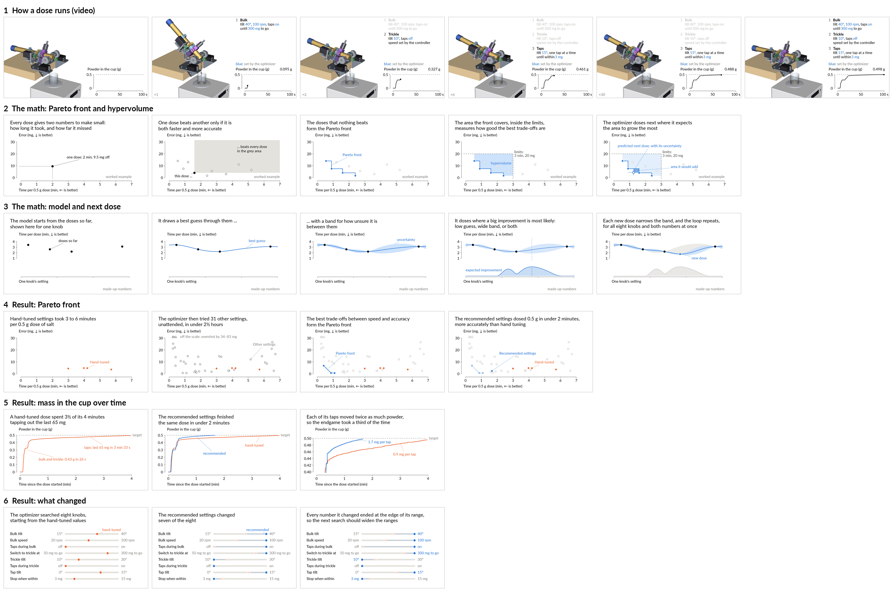

# Slides: the salt optimization campaign

Six slides for a talk about the salt campaign `salt-20260929T014732Z` of
[PR #166](https://github.com/vertical-cloud-lab/powder-doser/pull/166): one
video of a dose, two slides on the math, three on the results. Every slide
is a build. Each step adds one thing and greys out what came before, and the
message, a full sentence, sits at the same spot in the top left of every
slide.



| # | Slide | Folder | Versions | Steps |
|---|---|---|---|---|
| 1 | How a dose runs: tilt, rotation, taps (video) | [`procedure/`](procedure/) | annotated, plain | 21 s |
| 2 | The math: Pareto front and hypervolume | [`front-math/example/`](front-math/example/) | one | 5 |
| 3 | The math: the model and the next dose | [`model-math/example/`](model-math/example/) | one | 5 |
| 4 | Result: Pareto front | [`pareto/`](pareto/) | `linear`, `model`, `log` | 4 |
| 5 | Result: powder in the cup over time | [`traces/`](traces/) | `pair`, `all` | 3 |
| 6 | Result: what the optimizer changed | [`knobs/dumbbell/`](knobs/dumbbell/) | one | 3 |

## Files in each slide folder

| File | What it is |
|---|---|
| `step_N.png` | step N, 1920 x 1080, with the message |
| `plain/step_N.png` | the same without the message, for a slide that has its own title; everything else is in the same place |
| `print/step_N.png` | step N at 300 dpi (4000 x 2250) |
| `build.gif` | all steps, 1280 x 720, each held 4 s (the last 6 s), 0.25 s cross-fades |
| `build.mp4` | the same build at 1920 x 1080, H.264 |

For click-to-advance slides, put `step_1.png` to `step_N.png` on consecutive
slides; they line up exactly.

The procedure video ([`procedure/`](procedure/)):

| File | What it is |
|---|---|
| `procedure_annotated.mp4` / `.gif` | the doser on the left; on the right the three stages appear one at a time with the settings the optimizer chose (blue), and the balance reading of the real dose draws itself |
| `procedure_plain.mp4` | the doser only, centred on a white 16:9 frame |
| `procedure_plain_square.mp4` / `.gif` | the doser only, 1080 x 1080 / 720 x 720 |
| `procedure_still_start.png`, `procedure_still_end.png` | first and last annotated frames |

The one piece of text in the plain videos is the playback speed (`x1`,
`x6`, ...) in the bottom-left corner.

## Design rules used

- 16:9 canvas of 13.33 x 7.5 in, so one matplotlib point is one PowerPoint
  point when the image fills the slide. The smallest text is 24 pt; messages
  are 32 pt.
- One message per slide, as a full sentence, top left, at most two lines.
- No plot titles and no legends: series are named by text in their own
  colour, joined to the marks by a faded line with no arrowhead.
- Horizontal y labels above the axis; axes end at the outermost tick; no grid.
- Orange is hand tuning, blue is the optimizer, grey is context. Earlier
  steps fade to light grey or light blue.
- Lato, the font the earlier lab figures use.

## Where the numbers come from

- Doses, times, errors and settings: `data/opt/salt-20260929T014732Z/campaign_records.jsonl`.
- Balance readings over time: the Zero's trial documents in `data/opt/salt-20260929T014732Z/zero/`.
- The model's front (`pareto` version `model`): `pareto.json` (`model_pareto`,
  Ax SAASBO posterior means).
- The two math slides use made-up numbers, and say so on the slide. They
  explain the method; the result slides use only the real doses.
- The procedure video replays `bo-005` (the recommended settings, 99.7 s,
  2.4 mg under): see `procedure/make_timeline.py` for what is drawn at real
  speed and what isn't.

## Rebuilding

```bash
pip install numpy matplotlib pillow imageio-ffmpeg   # ffmpeg on PATH for the MP4s
python3 make_slides.py            # slides 2-6, every version (about 5 min)
python3 make_contact_sheet.py

# the procedure video needs the CAD from PR #170 (cad/full-assembly at b40203e)
pip install cadquery vtk trimesh
python3 procedure/make_timeline.py
xvfb-run -a python3 procedure/render_procedure.py --cad-dir <checkout of #170>/cad/full-assembly \
    --timeline procedure/timeline.json --out-dir /tmp/procedure_frames
python3 procedure/compose_procedure.py --frames /tmp/procedure_frames
```
