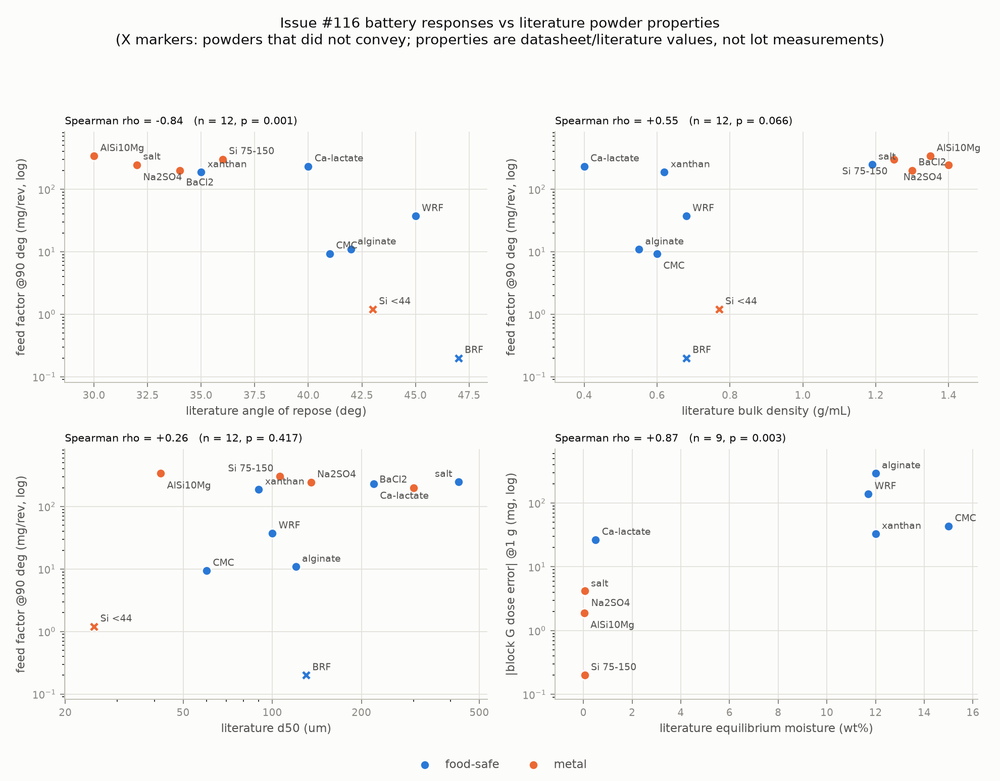
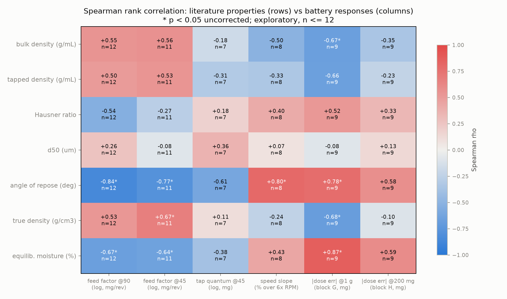

# Powder properties from the literature vs the #116 battery: correlation study

Issue [#163](https://github.com/vertical-cloud-lab/powder-doser/issues/163).

Measuring the full characterization suite in-house for every powder was judged
not reasonable (per the discussion on #163), so this study takes the other
route the Edison optimization review leaves open: **assign each powder its
property vector from supplier data and published literature**, then test
whether those literature values correlate with what the doser actually did in
the issue #116 uniform battery. If literature values carry signal, they can
seed the contextual-BO context vector (Hausner ratio, d50, bulk density —
review §4.5/§6.3) at near-zero lab cost, with in-house measurement reserved
for the few powders/properties where the literature is ambiguous or where our
lot demonstrably deviates (moisture state, above all).

## Where each number comes from

**Predictors** (`data/powder-properties/literature_powder_properties.csv`):
one row per powder, best-estimate intrinsic properties. Every value is traced
to a source in
`data/powder-properties/literature_powder_properties_long.csv`
(long format: powder x property x value x specificity x source URL). Values
are datasheet/literature figures for the *material or product class* — they
are **not measurements of our lots**. Product identity for the food-safe
batch comes from the PR #19 buy-list
([`candidate-powders-shopping-list.md`](candidate-powders-shopping-list.md)):
Bob's Red Mill rice flours and xanthan gum, Modernist Pantry sodium alginate,
Cape Crystal Brands calcium lactate and CMC. The metal-batch suppliers were
not recorded in the repo, so those rows use grade-typical values (mesh-cut
silicon, gas-atomized AM-grade AlSi10Mg, ACS-grade salts).

**Responses** (`data/powder-properties/battery_responses.csv`): one row per
powder, curated from the issue #116 campaign:

- Feed factors at tilt 0/45/90 deg (block C, 30 RPM) from
  `docs/battery-runs/run-log.csv` on the campaign branches, QC-valid runs
  only. Salt uses the mean of the two valid post-08-06 runs (the 08-06 run
  was superseded: under-filled auger).
- Tap quantum at 45 deg (block E) where the run resolved it; unresolved
  (noisy-bench) runs stay empty rather than zero.
- Speed slope: % change in mass/rev across the 6x block D speed sweep, from
  the per-run docs.
- Block G mean dose error (3 x 1 g, frozen salt-tuned controller) and
  block H mean errors (200 mg / 50 mg targets, target-scaled thresholds).
  No-conveyance and caking failures are recorded as outcomes, not as
  -999 mg "errors", and are excluded from |error| correlations.

## Method

`scripts/powder_property_correlations.py` joins the two tables and computes
Spearman rank correlations (n <= 12; ranks are the honest scale for
literature-valued predictors), with feed factor and tap quantum on log10
scales since they span three decades. p-values are uncorrected across the
42 predictor-response pairs — treat anything near p = 0.05 as a lead, not a
finding.

## The literature property vector

Best estimates (see the long CSV for ranges + per-value sources). HR values
marked with a dagger are **assumption-derived** — no measured tapped density
was found, so the researcher assumed a flow-class-typical Hausner band to
estimate it; for those powders the HR column encodes textbook expectation,
not independent data.

| powder | bulk ρ (g/mL) | tapped ρ | HR | d50 (µm) | AoR (deg) | true ρ | EMC (wt%) | shape |
|---|---|---|---|---|---|---|---|---|
| salt | 1.19 | 1.28 | 1.08† | 425 | 32 | 2.165 | 0.05 | cubic crystals |
| white rice flour | 0.68 | 0.80 | 1.18 | 100 | 45 | 1.45 | 11.7 | polygonal starch granules |
| brown rice flour | 0.68 | 0.82† | 1.20 | 130 | 47 | 1.45 | 11.5 | granules + bran flakes |
| sodium alginate | 0.55 | 0.70† | 1.27† | 120 | 42 | 1.65 | 12 | fibrous/granular |
| calcium lactate | 0.40 | 0.55† | 1.375† | 220 | 40 | 1.494 | 0.5 | crystalline ground |
| CMC | 0.60 | 0.80† | 1.33 | 60 | 41 | 1.60 | 15 | fibrous |
| xanthan gum | 0.62 | 0.77 | 1.24 | 90 | 35 | 1.52 | 12 | milled irregular |
| sodium sulfate | 1.40 | 1.68 | 1.13 | 135 | 32 | 2.664 | 0.06 | granular crystalline |
| silicon −110/+200 | 1.25 | 1.45† | 1.16† | 106 | 36 | 2.33 | 0.05 | angular crushed |
| silicon −325 | 0.77 | 1.00† | 1.30† | 25 | 43 | 2.33 | 0.1 | angular fines |
| AlSi10Mg | 1.35 | 1.60 | 1.19 | 42 | 30 | 2.67 | 0.03 | spherical gas-atomized |
| barium chloride ·2H₂O | 1.30 | 1.50† | 1.15† | 300 | 34 | 3.097 | 0.02 | rhomboidal crystals |

Angle-of-repose provenance is similarly mixed: measured/manufacturer values
exist for salt (32), sodium sulfate (32, Corechem PDS), CMC (41, patent),
rice flour class (45), AlSi10Mg (30, AlSi7Mg analog); the other seven are
engineering estimates.

## Results

Full ranked table: [`correlation_table.md`](../data/powder-properties/correlation_table.md).
Headlines, strongest first:

1. **Angle of repose is the best literature predictor of conveying**
   (Spearman rho −0.84 vs log feed factor @90°, p < 0.001, n = 12; −0.77 @45°;
   +0.80 vs speed slope; +0.78 vs |block G error|). It also predicts the
   *density-normalized* volumetric conveying (rho −0.67, p = 0.017), i.e. it
   captures the flight-fill term, not just a density echo. Caveat: 7 of the
   12 AoR values are estimates, so the correlation partly tests "textbook
   flow class vs rig" — but the five measured/manufacturer AoR values alone
   rank their powders' feed factors correctly (AoR 30–32 → 244–339 mg/rev;
   AoR 41–45 → 9–37 mg/rev).
2. **Equilibrium moisture is the best predictor of dose error under the
   frozen controller** (rho +0.87 vs |block G error|, p = 0.003, n = 9). Every
   sub-5 mg block G powder (salt, sodium sulfate, silicon −110/+200,
   AlSi10Mg) has EMC below 0.1 wt%; every hygroscopic biopolymer missed by
   33–292 mg. EMC here is largely a proxy for "hygroscopic organic vs
   dry inorganic" — the same composition axis as the campaign's
   organics-vs-salts tap-quantum split — so treat it as a class label with a
   mechanism attached (moisture-mediated cohesion), not an isolated cause.
3. **The density family carries real but weaker signal** (bulk +0.55 vs log
   FF90, p = 0.066; true density +0.67 vs FF45, p = 0.026; bulk −0.67 vs
   |block G error|, p = 0.050). Direction matches the loss-in-weight
   literature's "feed factor from conditioned bulk density" claim, but
   density alone mis-ranks the mid-table: calcium lactate has the *lowest*
   literature bulk density (0.40) and the second-highest feed factor.
4. **Literature d50 predicts nothing across materials** (rho +0.26 vs FF90,
   p = 0.42; near zero elsewhere) — despite particle size being decisive
   *within* a material (the silicon pair's 250× feed gap). Across materials,
   shape/cohesion dominate and class-typical d50 error bars are wide: the
   rice flours are literature twins (d50 100 vs 130) with a 185× feed-factor
   gap, while salt (425 µm) and xanthan (90 µm) convey similarly fast.
5. **Literature Hausner ratio underperforms** (rho −0.54 vs FF90, p = 0.07)
   — ironically, the Edison review's headline context variable is the one
   literature serves worst. The published/estimated HR span is compressed
   (1.08–1.38), five values are assumption-derived, and the worst failure is
   calcium lactate: assigned the worst HR in the set (1.375†) yet the
   second-fastest conveyor. Conclusion: HR must be *measured*, not looked
   up; it is also the cheapest measurement on the list.
6. **The tap-quantum split stays unexplained** (n = 7 resolved; best
   predictor AoR at rho −0.61, p = 0.15). Calcium lactate and barium chloride
   still differ 10× at matched feed factor with similar literature vectors.
   Whatever sets tap efficacy — plausibly particle-scale mechanics at the
   flight lip — is not in any literature column.
7. **The two conveyance failures are not literature-separable from their
   twins.** Brown rice flour (fails) vs white rice flour (conveys): bulk
   density identical (Bob's Red Mill lists both at 160 g/cup), d50/AoR/EMC
   overlapping — the only literature-visible difference is bran-flake shape
   heterogeneity. Silicon −325 (fails) at least sits at the cohesive end of
   the estimated ranks (finest d50, highest metal AoR estimate). A crisp
   AoR threshold does not exist: WRF conveys at an estimated 45° while
   silicon −325 fails at 43°.
8. **Literature moisture physics partially exonerates the ambient lab.**
   Thenardite (anhydrous Na₂SO₄) hydration toward mirabilite "does not
   begin until at least 85% RH" (Liu & Bish 2020), and BaCl₂·2H₂O is a
   *stable* hydrate with no deliquescence below roughly 90% RH. At the
   40–60% RH the rig normally sees, both are predicted safe — so the
   observed barium chloride caking implies an RH excursion/condensation
   event (or a non-RH mechanism), not steady ambient uptake. Before the
   owed dried-BaCl₂ re-run, pull the T/RH logs around the 09-10 caking
   window; that's now a specific, checkable prediction.

### What this means for the BO context vector

The Edison review's nominated context triple (HR, d50, bulk density) is
exactly backwards as a *literature* shopping list: literature bulk density
works, literature d50 and HR do not. The literature-servable context vector
today is **{bulk density, true density, angle-of-repose class, hygroscopicity
class}** — free, sourced, and already correlated 0.55–0.87 with the battery's
responses. The measured supplement that would upgrade it fastest is exactly
the cheap pair: cylinder bulk/tapped density (real HR) and run-time moisture
state.

## Limitations

1. **Literature values are class-typical, not lot-specific.** PSD grades
   vary between suppliers of "the same" material (rice flour d50 spans
   roughly 2x across brands; food-grade CMC/xanthan mesh grades vary).
   The rank ordering used by Spearman is more robust to this than the raw
   values, but a mis-ranked pair silently degrades every correlation.
2. **Moisture/hydration state is a property of our storage, not the
   literature.** The barium chloride caking failure and sodium sulfate's
   hydration appetite are lot-state effects no datasheet predicts. The
   equilibrium-moisture column ranks *tendency*, and that is all.
3. **Small n, many comparisons.** 12 powders (9-11 with complete pairs,
   7 with resolved tap quanta) against 8 predictors: at alpha = 0.05 one
   spurious "significant" pair is expected by chance. Confounding is
   unavoidable — the organics are all low-density AND fine AND hygroscopic;
   the metals/salts are the reverse. No single-predictor claim here is
   causal.
4. **Responses carry rig-specific bias.** Feed factor is *collected* mass
   under one collection geometry (powder-specific overspray was observed
   for AlSi10Mg), one auger, one fill protocol.
5. **Censoring.** The two non-conveying powders (brown rice flour,
   silicon -325) and the caked barium chloride G/H runs enter conveyance
   comparisons but not |dose error| ones.

## What still deserves an in-house measurement

The correlation table says literature values already rank powders usefully
for the BO context vector. The short list where a bench measurement still
pays for itself:

1. **Moisture state at run time** (all hygroscopic powders; loss-on-drying
   or even just desiccator in/out logging) — no literature value can stand
   in for it, and it is implicated in the three worst anomalies of the
   campaign (BaCl2 arching, Na2SO4 hydration, salt drift).
2. **Bulk + tapped density** (one graduated cylinder, minutes per powder) —
   cheapest way to replace the two least product-specific literature
   columns with lot truth, and it yields Hausner/Carr for free.
3. **Sieve check of the silicon cuts** — the -110/+200 vs -325 pair is the
   dataset's only controlled property experiment; its d50s should be data,
   not nominal mesh bounds.

Everything else (angle of repose, true density, morphology, shear-cell
work) can stay literature-valued until the BO campaign shows the context
vector is the accuracy bottleneck.
