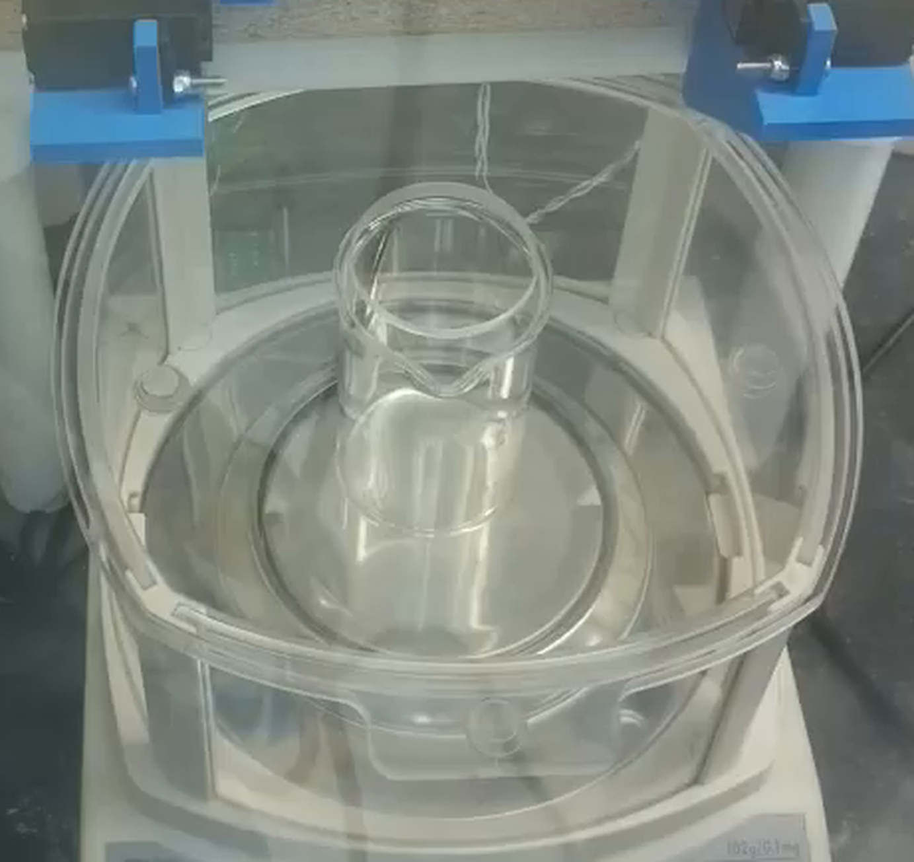
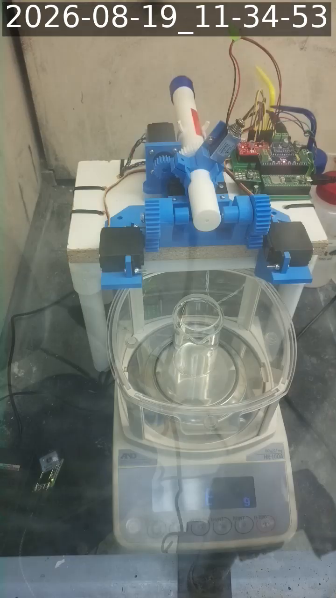

# 2026-08-19 — balance overload with the replacement 100 mL beaker

Requested on [issue #116](https://github.com/vertical-cloud-lab/powder-doser/issues/116)
before the first sodium sulfate battery run. The operator reported that the
replacement 100 mL glass beaker is taller than the previous one, that the
balance's breeze break ("the cage") pushes down on it slightly, and that the
balance displayed `Error 1` when it was switched back on.

**Outcome: the sodium sulfate run was not started.** The balance is in an
overload state and cannot weigh.

## Balance identification

`config.py` (Pico) documents the balance as an **A&D HR-100A**, connected over
a Waveshare Pico-2CH-RS232 module on UART0 (`GP12` TX / `GP13` RX, 19200 8/N/1).
The instrument label visible on the bench camera reads `102 g / 0.1 mg`, which
matches the HR-A series specification table.

Manual (covers HR-100A/150A/250A and the HR-AZ variants):
<https://weighing.andonline.com/wp-content/uploads/2024/01/HR-A_HR-AZ_Manual_02.pdf>
(also mirrored by [Rice Lake](https://www.ricelake.com/resources/manuals/a-d-weighing-hr-a-and-hr-az-series-analytical-balance-instruction-manual/)
and [ManualsLib](https://www.manualslib.com/manual/597697/AAndd-Hr-250az.html)).

Serial number read back over RS-232: `SN,6A7609446`.

## `Error 1` is the stability error

Section **19-2 Error Codes**, page 69 of the manual. The display glyph
`Error 1` is the balance's rendering of error code **`EC,E11` — stability
error**:

> The balance can not stabilize due to an environmental problem. Prevent
> vibration, drafts, temperature changes, static electricity and magnetic
> fields. [...] To return to the weighing mode, press the `CAL` key.

It is *not* a fault code for the instrument itself. Note that the same table
lists a separate `Error 2` glyph (out-of-range error) and a bare `E` glyph for
**overload**, which is what the balance is displaying now.

## Serial link: working (retracts the 2026-08-19 16:02 finding)

The [previous check](https://github.com/vertical-cloud-lab/powder-doser/blob/6c25f87/docs/rig-checks/2026-08-19-balance-power-on-recheck.md) found zero bytes
back from the balance at ten candidate line settings and suspected the DB9
seating or the Waveshare channel jumper. That is now ruled out — with the
balance powered on it answers immediately on the configured 19200 8/N/1:

```
PASSIVE listen 4 s     -> b''                        (stream mode is off; poll-only)
Q   (query weight)     -> b'OL,+9999999E+19\r\n'
S   (stable weight)    -> b''                        (no stable datum exists while overloaded)
SI  (immediate weight) -> b'OL,+9999999E+19\r\n'
?PT (stored tare)      -> b'PT,+000.0000  g\r\n'
?SN                    -> b'SN,6A7609446 \r\n'
```

The wiring, the RS-232 module and the Pico UART are all fine. The earlier
silence was simply the balance being switched off.

## The balance is overloaded

`OL` is the A&D overload header, which `scale.py` already parses (`OVERLOAD`,
`grams = None`). Five consecutive `Q` queries returned `OL`, so it is a steady
state, not a transient. The stored tare is `+000.0000 g`, so a stale tare value
is not the cause.

The bench camera confirms it visually — the display shows the bare `E`
overload glyph with the `g` annunciator lit:


## Cause: the breeze break is resting on the beaker



The replacement beaker is tall enough that the clear plastic breeze-break
assembly no longer clears its rim. The shield is sitting on the beaker rather
than on the balance housing, so the shield's own weight is transmitted through
the beaker into the weighing pan, on top of the beaker's own mass. Gross load
therefore exceeds the HR-100A's 102.0084 g maximum display and the balance
reports overload.

This also explains the `Error 1` seen at switch-on: a shield resting on the
beaker is a friction/creep contact rather than a clean dead load, so the
balance could not reach a stable reading during its power-on settling and
raised `EC,E11` before the load resolved into a steady overload.



## Why a tare cannot fix this

`RE-ZERO` subtracts a *displayed offset*. It does not raise the instrument's
capacity, and it does not remove a mechanical contact:

- **Capacity is gross.** 102 g is the total load on the pan. Taring the beaker
  leaves the usable net range at roughly `102 g − (beaker + anything resting on
  it)`. While the balance is in overload there is no reading to tare at all.
- **A contact force is not a constant offset.** Any structure that bridges
  between the fixed housing and the pan-borne beaker introduces friction and
  stiction, so the error depends on load history rather than on load. That is
  hysteresis, and taring removes none of it.
- **It shunts an unknown fraction of the load.** Once the beaker is mechanically
  constrained, part of any added mass is carried by the contact instead of the
  load cell. That is a span error — dispensed mass is under-reported by an
  unknown, drifting fraction — and tare only corrects offsets, never span.
- **The error grows during a dose.** The pan deflects by a few micrometres as
  mass accumulates, which changes the contact force as the dose proceeds. For a
  1.000 g dose held to ±5 mg in block G, that is the difference between a
  measurement and a guess.

## Required before any run

1. Restore clearance so that **nothing touches the beaker but the pan** — seat
   the breeze break properly clear of the rim, use a shorter beaker, or run
   without that shield section.
2. Confirm on camera or at the bench that the balance leaves overload and shows
   a normal reading (press `CAL` to clear a lingering `Error 1`).
3. **Weigh the empty beaker** and record it. The HR-100A has only 102 g of
   capacity; the beaker plus the largest planned dose must fit inside it with
   headroom. If the empty beaker is much above ~90 g it is unsuitable regardless
   of the shield, and a lighter vessel is needed.
4. Re-run the pre-flight feed check as usual.

## Checklist addition

The pre-run bench checklist gains a line: **the balance must return a `ST` or
`US` frame — not `OL` — before a battery is started.** `read_stable()` returns
`None` for an overloaded balance exactly as it does for a dead serial link, so
the two failure modes are indistinguishable from the capture script alone; only
the raw frame header separates them.
