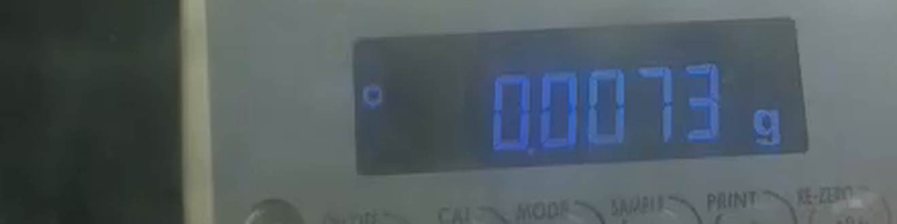
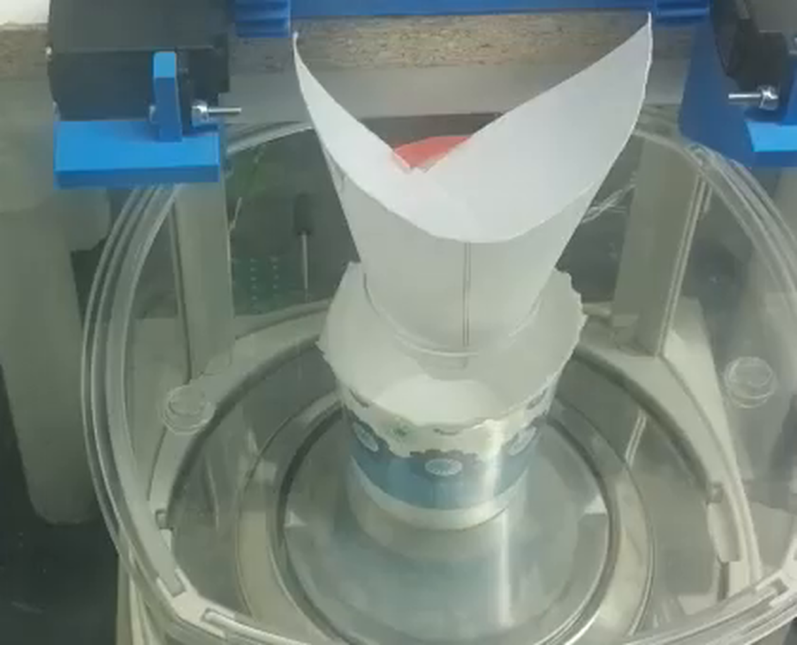

# 2026-08-20 — balance `Error 1` on the front panel, but re-zeros fine over serial

**Reported by** @swcharles (issue #116): the A&D HR-100A kept showing `Error 1`
when re-zeroed by hand, *"even when there's nothing on the scale at all and the
enclosure is on"*, and pressing `CAL` did nothing. An empty paper cup was on the
pan.

**Finding:** the balance is healthy. The re-zero *function* works on the first
try and repeats 5/5. What fails is the **physical key press** — reaching in to
press `RE-ZERO` is itself the disturbance the balance rejects.

**Action:** stop taring this balance by hand. Use
[`scripts/balance_zero.py`](../../scripts/balance_zero.py).

---

## What the balance actually reported

All commands issued from the Pico over the existing RS-232 link
(19200 8/N/1, `config.SCALE_*`). Read-only apart from the re-zeros; no stepper,
servo or solenoid was commanded.

```
PASSIVE (3 s) : b''                       # not in stream mode
Q             : ST,+011.5495  g           # stable, no error
Q             : ST,+011.5492  g
S             : ST,+011.5483  g
?TN           : TN,   HR-100A
?SN           : SN,6A7609446
?PT           : PT,+000.0000  g           # no stale tare
```

No `EC,E11`, no `OL`, no error of any kind — and the readings are *stable*.
Whatever the front panel was showing, the balance was in normal weighing mode
and talking normally when queried.

## The re-zero works, and it repeats

A&D's command table (manual §17-1) lists `Z` as **"Same as the RE-ZERO key"** —
the same operation, different route in. It succeeded immediately:

```
before Z : ST,+011.5472  g
after  Z : ST,-000.0003  g
```

Repeated five times, including three attempts that began from an **unstable**
(`US`) reading:

| # | before | after | re-stabilised in |
|---|---|---|---|
| 1 | `US,+000.0176` | `ST,+000.0000` | 1.63 s |
| 2 | `ST,+000.0008` | `ST,+000.0000` | 1.63 s |
| 3 | `US,+000.0004` | `ST,+000.0000` | 1.63 s |
| 4 | `ST,+000.0007` | `ST,-000.0001` | 1.63 s |
| 5 | `US,-000.0007` | `ST,-000.0001` | 1.63 s |

5/5, every one landing on exactly 0.0000 g. So the balance will re-zero even
when it does *not* currently consider itself stable — as long as nothing
mechanically disturbs it.

Confirmed on the bench camera afterwards: display in normal weighing mode with
the stability mark lit, no error glyph.



## Why the key press fails when the command doesn't

`Error 1` is the display form of `EC,E11`, **stability error** (manual §19-2):

> The balance can not stabilize due to an environmental problem. Prevent
> vibration, drafts, temperature changes, static electricity and magnetic
> fields. […] To return to the weighing mode, press the CAL key.

The difference between the two routes is purely mechanical:

- Pressing `RE-ZERO` means opening the fume-hood sash and reaching past the
  breeze break — reintroducing exactly the draft that the
  [2026-08-19 shield-removed check](.) measured at 5.15–8.92 mg SD with only
  16–22 % of samples stable, *plus* a direct mechanical knock to the bench.
- Sending `Z` touches nothing. Enclosure closed, sash down, no hand in the hood.

So the balance is not failing to zero — it is being asked to zero at the one
moment it is guaranteed to be disturbed. The measured 74–75 % stable fraction in
the settled, closed state is comfortably enough for `Z`, and clearly not enough
for a reading taken with an arm in the hood.

On `CAL` "doing nothing": a short press is the documented way *out* of `E11`,
and it returns the balance to weighing mode without visible ceremony. Held, it
enters calibration and expects an external weight — with no weight that ends in
`E20`/`E21`, not a zeroed balance. Neither is the fix here.

## Caveat

`Error 1` was not reproduced remotely — I cannot press the key. The
identification rests on the manual's error table, on the timing (it appears only
on hand presses), and on the elimination of every alternative the serial link
can see: no overload, no stale tare, no comms error, a healthy re-zero, and a
stable steady state. The `AK, Error code (erCd)` serial parameter is set to `0`
on this balance, so it neither acknowledges nor reports error codes over the
wire; a failed serial command would be silent. The re-zeros were verified by
their effect (readings landing on exactly 0.0000 g), not by an ack.

## Separate problem found: the baseline walks

With the enclosure closed and nothing being touched, **draft noise is not the
issue** — sample-to-sample jitter is 0.066–0.074 mg, at the balance's 0.1 mg
display resolution. The enclosure is doing its job.

What the balance does instead is walk slowly. A 4-minute capture starting from a
fresh zero ([data](data/2026-08-20_balance-drift-240s.csv), 837 samples):

| | |
|---|---|
| sample-to-sample jitter | **0.066 mg** (quiet) |
| worst wander in 30 s | 9.7 mg |
| worst wander in 60 s | **15.2 mg** |
| over the full 240 s | **19.8 mg** |
| per-30 s means (mg) | −0.4, +0.5, +1.0, +1.6, −0.9, −8.8, −14.8, −16.8 |

Flat for two minutes, then a ~8 mg/min ramp. An earlier 75 s window
([data](data/2026-08-20_balance-post-rezero-75s.csv)) ramped the *other* way at
+3.8 mg/min, and a later `balance_zero.py` run found −21.5 mg of accumulated
offset ~6 minutes after a zero.

That is worse than the 2026-08-19 enclosed measurement (≤4.2 mg over any 60 s)
and it matters: **the baseline moves further in 60 s than the whole ±5 mg block
G dose tolerance.** Blocks A–E take a fresh reference read either side of each
short trial and are largely immune; a multi-minute closed-loop dose is not.

Bidirectional, large-amplitude, multi-minute, low-noise drift is not draft.
Candidates, in the order I'd test them:

1. **The paper cup.** Paper is hygroscopic and exchanges moisture with the
   enclosure over exactly these timescales, in either direction. Glass and metal
   weighing vessels exist for this reason. It is also the cheapest thing to
   swap.
2. **Thermal equilibration** of the load cell — decaying ramps look like this.
3. **Light mechanical contact.** The cup has been pinched into a "V" to fit
   under the breeze break, and a squeezed cup springs against whatever is
   holding it. Low scatter with large slow offset shifts is the signature.



**The test:** put a non-hygroscopic vessel of similar mass on the pan and repeat
the 4-minute capture (`python scripts/balance_zero.py --settle 240 --csv …`).
If the wander collapses, it is the cup. This is worth doing before the short
glass beaker arrives, because it decides whether the paper cup can be the
weighing vessel at all — as opposed to just the disposal vessel, which is what
the issue #116 discussion actually settled on.

## Tooling

- **[`scripts/balance_zero.py`](../../scripts/balance_zero.py)** — re-zeroes the
  balance over serial and reports the settled noise, so nobody has to open the
  enclosure to tare. `--check-only` reads without zeroing; `--settle N` runs the
  drift capture above; `--csv` saves the samples. It separates the two failure
  modes in its warnings: high sample-to-sample jitter means drafts, a large
  slow wander means drift or contact.

- **`bench_frame.py` needs two fixes** (it lives on the unmerged
  `claude/issue-116-*` branches, not on `main`, so it is not patched here):
  1. YouTube has renumbered its live formats. The itags this script tries
     (91–96) no longer exist on these broadcasts; the current set is
     **229/230/231/232/269**, with **232** = 720×1280. Every itag returning
     "empty segment" is this, not a bad stream.
  2. The segment fetch uses `curl -sS` with no `-L`. Segment URLs now answer
     **302**, so the download silently writes a 0-byte file. It needs `-sSL`.

  With both applied the frame grab works normally — the frames in this
  write-up were pulled that way from broadcast `_1u-y15Z5q8`.

## Rig state

Left idle and safe: no actuator commanded at any point, no auger rotated, no
tmux or capture process started, temp scripts removed from the Pi. The balance
is **zeroed and in normal weighing mode**. `yt-dlp` was installed into the Pi's
existing venv for the frame grab; all transfers were rate-capped.
