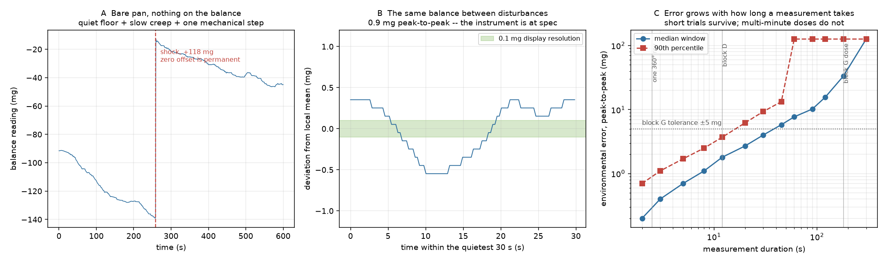

# 2026-08-20 -- `CAL out` explained, and how quiet the polishing lab actually is

Context: issue #116. The operator removed the beaker from the pan (leaving it
inverted over the breeze-break hole to block the top draught), attempted a
front-panel calibration, and got `CAL out` -> `CAL 0` rather than the `CAL in`
the procedure was expected to show. They also asked the wider question: if the
balance cannot tolerate somebody walking into the room, is this workflow
viable at all?

Everything below is read-only. No stepper, servo or solenoid command was
issued, no calibration was started, and no `battery_runs` document was created.

## 1. `CAL out` is correct behaviour, not a fault

This balance is an **HR-100A** -- confirmed over serial (`?TN` -> `TN, HR-100A`)
and legible on the front badge in the bench-camera frame.

From the HR-A/HR-AZ manual:

* **Section 8-2**, "Calibration Using the Internal mass (One-Touch
  Calibration, **only for HR-AZ series**)" -- the balance displays `Calin`.
* **Section 8-6**, "Calibration Using an External Weight" -- step 2: *"Press
  and hold the CAL key until `Calout` is displayed"*; step 3: *"The balance
  displays `Cal 0`."*

The `AZ` suffix is what marks a unit with a motorised internal calibration
mass. An HR-100A has none, so it **cannot** display `Cal in`; `Cal out` is the
only calibration mode it has. `Cal 0` is section 8-6 step 3 -- the balance is
waiting for confirmation that the pan is empty (press `PRINT`), after which it
measures the zero point and then displays the calibration weight value for the
operator to place.

**To finish it you need a physical external weight.** Section 8-6, page 24:

| Model | Usable calibration weight |
|---|---|
| HR-100A | **100 g** (factory setting), or 50 g |

The accuracy of that weight sets the accuracy of the balance, so it wants to be
a proper OIML/ASTM class weight (E2/F1), not a convenient lump of metal.

### Can it be driven remotely?

Partly. The A&D command set includes a `CAL` command, and the manual's command
diagram (section 17) shows the full external-calibration handshake being driven
over RS-232: `CAL` -> zero point -> `PRT` (weight placed) -> `PRT` (weight
removed). So the *button presses* can all be issued from the Pico.

It was **not** attempted, for three reasons:

1. There is no 100 g or 50 g calibration weight at the rig, and steps 5-6 of
   section 8-6 require one to be physically placed on the pan. Starting the
   sequence without one leaves the balance parked out of weighing mode.
2. This balance has `AK, Error code (erCd)` set to `0`, so it does not
   acknowledge commands or report error codes over the wire. The sequence would
   be driven blind.
3. Most importantly -- see below -- calibration is not the fix for the problem
   the rig actually has.

### Calibration will not fix the instability

Calibration sets the **span** (the gain from load to displayed grams). The
failures on this rig are **zero drift** and **zero step offsets**. Those are
orthogonal: a perfectly calibrated balance drifts exactly as much as an
uncalibrated one.

It is still worth doing when a weight is available -- section 8-1 explicitly
calls for calibration after the balance has been moved or the ambient
environment has changed, both of which apply -- but it should be scheduled as
hygiene, not as a repair.

## 2. What the environment is actually doing

With the pan bare (vessel removed entirely, so no cup, beaker, funnel or
deck-contact hypothesis is in play), a 600 s read-only capture at ~3.5 Hz:

| | |
|---|---|
| samples | 2092 over 600 s, 82 % reported stable |
| sample-to-sample jitter | **0.111 mg** |
| quietest 30 s window | **0.9 mg peak-to-peak** |
| drift over the longest step-free stretch (341 s) | **-5.4 mg/min** |
| mechanical step events > 10 mg | **1**, at t = 259 s, net **+118 mg** |
| whole-record peak-to-peak | 126 mg |

Three separate things, which the single "peak-to-peak" number had been hiding:

**The noise floor is at spec.** 0.02-0.04 mg sample-to-sample in quiet
stretches, below the balance's own 0.1 mg display resolution, with 93-100 % of
frames stable. Drafts are solved -- the enclosure works. **The fume-hood blower
is not the problem**: a continuous vibration source would raise jitter, and
jitter is at the resolution floor.

**A slow zero creep of order 5 mg/min.** Bare pan, so this is the balance and
its mounting, not the vessel. Thermal equilibration and load-cell creep both
look like this.

**Occasional step offsets of order 100 mg.** One in ten minutes here. These are
not oscillations that ring down -- the zero moves and *stays* moved. That is
the signature of a mechanical impulse into the weighing structure, i.e. a door,
a machine starting, or somebody at the bench.

### The room is not equally quiet minute to minute

A 90 s capture taken ~15 minutes before the 600 s one, same bare pan, same
settings, reads far worse: **1.3 shock events per minute**, median 5 s window
1.60 mg against 0.70 mg, and no duration at all inside 5 mg at the 90th
percentile.

That is the single most useful practical fact here. The environment varies by
more than an order of magnitude on a timescale of minutes, so "is the lab quiet
enough?" is not a property of the lab that can be settled once -- it has to be
*measured immediately before a run*, which is what
`scripts/balance_environment_survey.py` exists to do.

## 3. What that means for the battery

The whole story is **how long a single measurement takes**. Worst-case
environmental error, measured directly from the record:

| measurement duration | median | 90th percentile | what takes that long |
|---|---|---|---|
| 5 s | 0.70 mg | 1.70 mg | one 360 deg revolution or one tap, bracketed |
| 10 s | 1.50 mg | 3.10 mg | block D, three revolutions at 90 RPM |
| 15 s | 2.20 mg | 4.70 mg | block B static hold |
| 30 s | 4.00 mg | 9.30 mg | block A baseline sweep |
| 60 s | 7.70 mg | 126 mg | a slow trial |
| 180 s | 33.3 mg | 126 mg | **block G, one closed-loop dose** |

So:

* **Blocks A-F are viable in this room, today.** Their trials are seconds long.
  A 1-2 mg environmental contribution is negligible against feed factors of
  10-232 mg/rev. It is *not* negligible against brown rice flour's <0.3 mg/rev
  or the sub-mg tap quanta -- those were always at the edge and remain there.
* **Block G is not viable as currently written.** A dose runs 2-14 minutes
  against a +/-5 mg acceptance band, and the environment alone contributes a
  median 33 mg over 180 s. That is not a marginal call.

## 4. Recommendations

Ordered by value per unit of effort.

### 4a. Reject artifacts by physical plausibility (software, free, biggest win)

During any interval in which **no actuator is commanded**, mass cannot arrive:
the fastest powder measured conveys ~116 mg/s *while rotating* and essentially
nothing while stopped. So any change during a commanded-stop interval is, by
construction, not powder, and can be measured and subtracted.

That single rule handles both failure modes:

* slow creep becomes a measured per-interval baseline correction;
* a >10 mg jump inside one ~0.2 s poll is provably a shock, and can be
  subtracted as a zero step (and logged, so the artifact rate is in the data
  rather than in the measurements).

This is the change that would make block G runnable in an ordinary lab.

### 4b. Bracket and drift-correct each trial (software, free)

Trials currently take one read before and one after. Taking a short *series*
before, fitting its slope, and extrapolating to the post-read time cuts the
residual error measurably -- simulated against this record, from a median
1.60 mg to 0.86 mg at a 5 s gap. Cheap, and it also yields a per-trial quality
number for free.

### 4c. Re-measure disturbed trials instead of aborting (software, free)

`battery_preflight` currently aborts `scale-unreadable` when it cannot get a
stable frame within 10 s. Quiet windows arrive constantly -- 96 % of 5 s
windows in this record are inside 2 mg. Waiting for one, and re-running any
trial whose bracket looks disturbed, converts "somebody walked in" from
corrupted data into a few seconds of lost time. The retry count should be
recorded per trial.

### 4d. Isolate the balance mechanically (hardware, moderate cost, big win)

The step events are impulses reaching the weighing structure through the bench.
Shielding cannot help; isolation can. In the bench frame the balance sits
directly on the fume-hood deck, with the doser platform's feet on that **same**
deck, so the rig is also a coupling path.

* A proper anti-vibration weighing table or balance slab is the standard fix.
* The cheap version -- a 20-30 kg stone/granite paver resting on sorbothane
  pucks (or squash balls) on the hood deck, with the balance on top -- gets
  most of the benefit for very little money.
* Decouple the doser platform from the balance's surface so rig-borne
  vibration does not enter the load cell.

### 4e. Scheduling (do this last, not first)

Overnight running is a real option and costs nothing but calendar time, but it
should not be the *primary* answer -- it trades away most of the usable day to
work around a problem that 4a-4d largely fix. The reasonable split is: run
blocks A-F whenever the lab is available, and if block G is still fragile after
4a, schedule block G for quiet periods.

## 5. What is not recommended

* **Zero tracking (`trc`).** It would hide the drift by subtracting it -- and
  would subtract genuine slow feed with it. Brown rice flour conveys ~0.2 mg
  per revolution; strong zero tracking erases exactly that signal.
* **A coarser balance.** A 100 mg step offset is a real force event and a
  1 mg-resolution balance registers it just the same. Resolution is not the
  binding constraint; isolation and measurement duration are.
* **Treating calibration as the repair.** See section 1.

## Tools added

* `scripts/balance_environment_survey.py` -- run before a battery to get a
  go/no-go, with the error-versus-duration table above computed from the room
  as it is at that moment. `--from-csv` re-analyses an existing capture.
* `scripts/plot_balance_environment_survey.py` -- the figure above.

## Raw data

* `data/2026-08-20_balance-bare-pan-survey-600s.csv` -- the 600 s record
* `data/2026-08-20_balance-bare-pan-90s.csv` -- an earlier 90 s record
* `frames/2026-08-20_beaker-off-pan-weighing-mode.png` -- bench camera,
  confirming the balance is in normal weighing mode (not parked in `Cal 0`)
  and the beaker is off the pan
