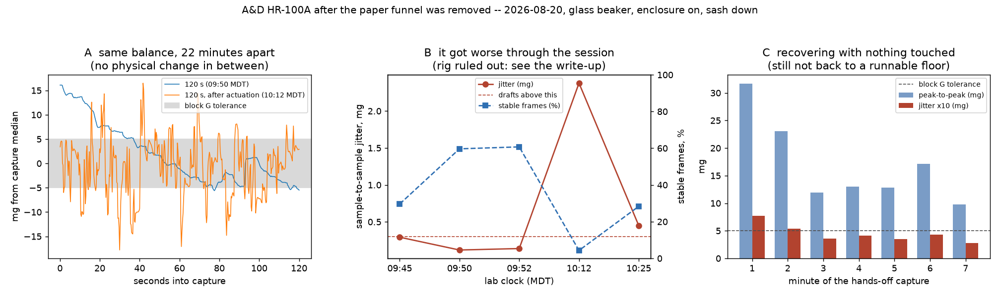
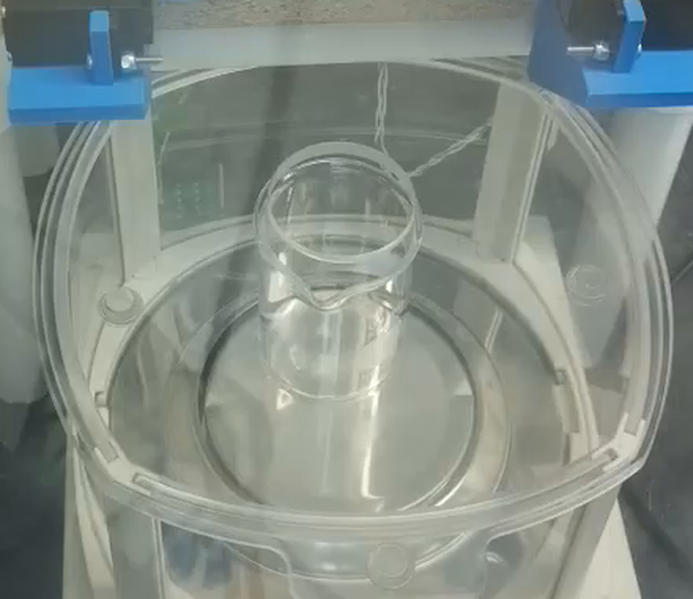

# 2026-08-20 -- paper funnel removed: balance re-check and aborted salt run

**Request** (issue #116, @swcharles): the paper funnel was removed, the ~2.1 g of
salt left in the beaker by the previous session was returned to the auger, and the
delivery-end tape taken off.  Re-check balance stability and run a short salt
battery.

**Outcome: no battery was run.**  Removing the funnel measurably improved the
balance, but over the session the balance degraded to the point where it emitted
**no stable frames at all**, and the pre-flight gate aborted `scale-unreadable`.
No `battery_runs` document was created; the dataset still stands at 11 runs,
8 valid.

All work here was read-only on the balance plus a handful of tilt moves for the
A/B test.  Nothing was dispensed.



## The funnel was a real contributor

The first captures, minutes after the funnel came out, are the quietest readings
since the rig moved into the fume hood:

| lab clock (MDT) | capture | stable frames | jitter | peak-to-peak |
|---|---|---|---|---|
| 09:44 | 30 s, check only | 17 % | 0.606 mg | 14.7 mg |
| 09:45 | re-zero + 75 s | 30 % | 0.292 mg | 24.2 mg |
| **09:50** | **120 s** | **60 %** | **0.119 mg** | 21.7 mg |
| 09:52 | 420 s | 61 % | 0.139 mg | 56.7 mg |

Sample-to-sample jitter is the draft term, and 0.119 mg is at the balance's
0.1 mg display resolution -- i.e. drafts were essentially gone.  That is a ~5x
improvement on the same balance with the paper cone in place, and it supports the
previous session's hypothesis that a large light paper sail sitting on the load
cell was part of the problem.

The camera also clears the other standing suspicion: the beaker is centred on the
pan with its rim well clear of the breeze break and of the rig deck, so nothing
bridges the weighed vessel to the fixed frame.



## What is left is a slow baseline wander, and it got worse

Even in the quiet windows the *baseline* walked: 21.7 mg over 120 s at 09:50, and
the 420 s record ran -13, -8, -6, -12, +8, +14, +31 mg per successive minute --
bidirectional, so not evaporation.

By 10:05 the balance was materially worse, and by the time the driver-isolation
tests ran it was emitting **zero** stable frames:

```
before tare   n=71 samples over 20 s   stable=0   peak-to-peak 21.5 mg
after  tare   n=90 samples over 45 s   stable=0   peak-to-peak 18.5 mg
read_stable(timeout=30 s) -> ST after ~30 s
```

That is why the pre-flight aborts.  `battery_preflight` tares and then calls
`_read_grams`, which requires a stable, non-overload frame within
`STABLE_TIMEOUT_MS = 10000`; with no stable frame in 45 s it returns `None` and
the run ends `PRE,END,scale-unreadable,0,0`.

## What was ruled out

Each of these was tested rather than argued.

| Candidate | Test | Verdict |
|---|---|---|
| Paper funnel | removed by the operator | improved, but not sufficient |
| Mechanical contact vessel <-> frame | bench-camera frame at 09:47 and 10:13 | beaker clear on all sides |
| Servo holding torque | A/B/A: PWM released -> hold 0 deg -> released -> hold 45 deg -> released | no ordering; the *worst* window was a released one |
| The Tic stepper | constructed, then `enable(False)` | no change |
| Constructing the drivers at all | raw UART poll with **no** `main_three_phase` import | equally bad (jitter 1.93 mg, 9 % stable) |
| `scale.zero()` / the tare | 20 s of polling *before* the tare | already 0/71 stable before any tare |
| A latched instrument error | bench camera | normal reading in grams, no `E` glyph, no `OL` frame |

The raw-UART result is the decisive one: with no driver object constructed and no
actuator energised, the balance is just as unstable.  **The rig is not the
source.**

## Actuation does disturb it, and it decays slowly

A seven-minute capture with nothing touched shows the balance walking back down
on its own:

| minute | stable frames | peak-to-peak | jitter |
|---|---|---|---|
| 1 | 18 % | 31.7 mg | 0.774 mg |
| 2 | 29 % | 23.1 mg | 0.541 mg |
| 3 | 26 % | 11.9 mg | 0.356 mg |
| 4 | 28 % | 13.0 mg | 0.415 mg |
| 5 | 27 % | 12.8 mg | 0.351 mg |
| 6 | 29 % | 17.1 mg | 0.430 mg |
| 7 | 42 % | 9.8 mg | 0.281 mg |

So tilt moves (and, presumably, other bench activity) leave a disturbance that
takes several minutes to bleed off -- much longer than the battery's 2 s
`TILT_SETTLE_MS`.  Recovery had not reached the 09:50 floor after seven minutes.

## Bench actions

Cheapest first.  Each is a couple of minutes.

1. **Check whether anything is running or being worked on near the hood** while
   the balance is meant to settle.  The degradation between 09:50 and 10:12
   happened with no change on the rig side at all.
2. **Confirm the breeze break is fully seated and closed**, and that the sash is
   at its marked working height rather than partly raised.
3. **Run `CAL`.**  The HR-A has not been calibrated since the move into the fume
   hood, and the manual asks for a calibration with the large breeze break
   installed after relocation.
4. **Let it sit powered and undisturbed for ~30 minutes**, then re-check with
   `python scripts/balance_zero.py --check-only --settle 120`.

## Acceptance criterion before the next battery

Unchanged from the 2026-08-19 write-up, and worth restating because today's best
window still failed the second half of it:

- detrended scatter <= 0.5 mg **and**
- <= 2 mg of baseline wander over any 3 minutes.

Blocks A-E tolerate more than blocks G does -- each A-E trial is a short delta
with a fresh reference read either side -- but block E's tap quantum for salt is
0.91-3.05 mg, which today's wander would swamp entirely.  A partial
`blocks="ABCD"` run would be defensible at ~2 mg/3 min; a block G dose would not.

## Raw data

- [`data/2026-08-20_balance-funnel-removed-w1-rezero75s.csv`](data/2026-08-20_balance-funnel-removed-w1-rezero75s.csv)
- [`data/2026-08-20_balance-funnel-removed-w2-120s.csv`](data/2026-08-20_balance-funnel-removed-w2-120s.csv)
- [`data/2026-08-20_balance-funnel-removed-w3-420s.csv`](data/2026-08-20_balance-funnel-removed-w3-420s.csv)
- [`data/2026-08-20_balance-funnel-removed-w4-postactuation-120s.csv`](data/2026-08-20_balance-funnel-removed-w4-postactuation-120s.csv)
- [`data/2026-08-20_balance-funnel-removed-w5-handsoff-420s.csv`](data/2026-08-20_balance-funnel-removed-w5-handsoff-420s.csv)

Figure regenerated with `python scripts/plot_balance_funnel_removed.py`.

## Rig state

Idle and safe: stepper stopped and disabled, solenoid untouched, tilt parked at
0 deg with the servo PWM released.  No tmux session or capture process, temp
probe scripts removed from the Pi.
