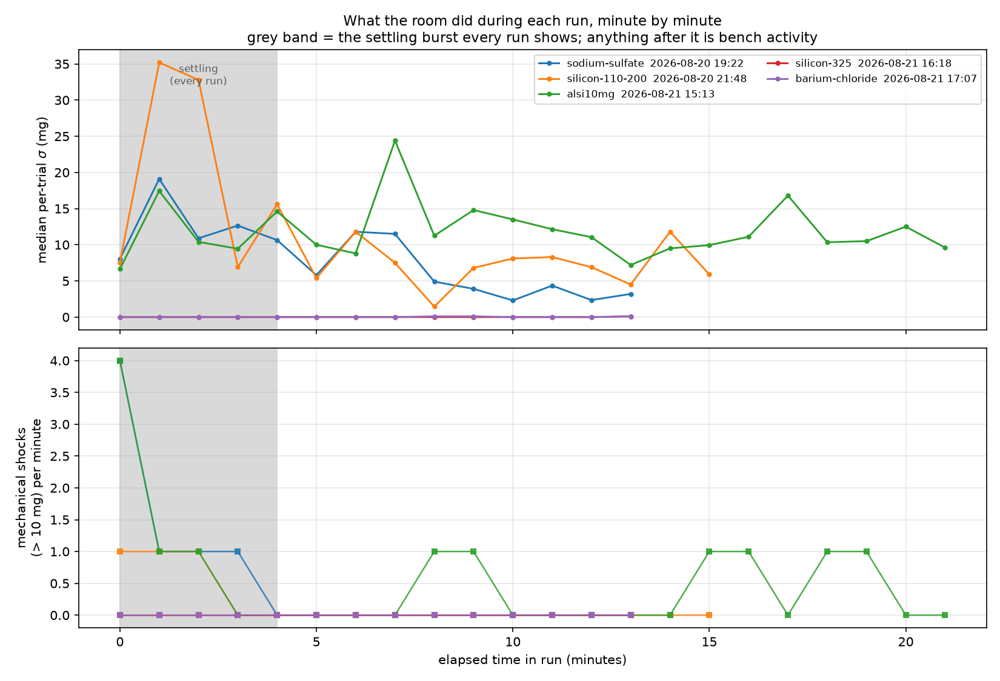

# Does someone working at the bench show up in the data? — 2026-08-21

@swcharles, after the 2026-08-21 AlSi10Mg run:

> during the last run, another student was using the sink side of the
> fume hood for a short period of time. I'm curious if that led to more
> disturbances than normal. If it didn't, then people working at the
> bench might not impact anything.

Short answer: **yes, it shows up, it is separable from the ordinary
settling transient, and it is the only thing that distinguishes that run
from the ones either side of it.** But it only damages the *small-signal*
measurements — the flow-characterisation numbers that run was collected
for came out fine.

## Method

Since 2026-08-20 every trial carries its own quality record: the residual
scatter about the bracket fit (`sigma_g`), any zero step the actuator
gate subtracted as a mechanical shock (`shock_g`), and how many attempts
were discarded and re-measured (`retries`). Those are a continuous
record of what the room did to the balance during the run, sampled
wherever a trial happened to be, and they are already committed for every
run. `scripts/plot_bench_activity.py` buckets them by elapsed minute.

## Every run has a settling burst; only some have a noisy tail

| run | settling, min 0–4 |  |  | late, min ≥ 8 |  |  |
|---|---|---|---|---|---|---|
| | median σ | shocks | /min | median σ | shocks | /min |
| sodium sulfate, 08-20 19:22 | 9.4 mg | 7 | 1.75 | **3.9 mg** | **0** | **0.00** |
| silicon −110/+200, 08-20 21:48 | 8.2 mg | 3 | 0.73 | **6.8 mg** | **0** | **0.00** |
| **AlSi10Mg, 08-21 15:13** | 7.1 mg | 6 | 1.54 | **12.3 mg** | **6** | **0.45** |
| silicon −325, 08-21 16:18 | 0.0 mg | 0 | 0.00 | 0.0 mg | 0 | 0.00 |
| barium chloride, 08-21 17:07 | 0.0 mg | 0 | 0.00 | 0.0 mg | 0 | 0.00 |



Three things fall out.

**1. The early burst is not people, it is the bench settling.** Every run
that was started shortly after the auger was handled shows 0.7–1.8
shocks/min in the first four minutes, regardless of who was in the room.
It decays on its own. This is the effect that produced the "give it two
or three quiet minutes after loading" advice, and it is unchanged.

**2. The late window is where bench activity lives.** Sodium sulfate and
silicon both settle to *zero* shocks after minute 8 and their median σ
falls to 3.9 and 6.8 mg. AlSi10Mg does not: it holds 12.3 mg and keeps
taking shocks all the way to minute 19. That is a second disturbance
source arriving *after* the bench had already settled, which is exactly
the shape a person nearby produces and not a shape the rig can produce
by itself.

**3. The late shocks cluster, as described.** AlSi10Mg's late events:

```
15:22:00 UTC / 09:22:00 MDT   block C tilt 90    -16.5 mg
15:23:03 UTC / 09:23:03 MDT   block D tilt 45    -15.5 mg
15:28:44 UTC / 09:28:44 MDT   block E tilt 45    +10.0 mg
15:30:13 UTC / 09:30:13 MDT   block E tilt 45    -11.1 mg
15:32:00 UTC / 09:32:00 MDT   block E tilt 45    -16.8 mg
15:32:48 UTC / 09:32:48 MDT   block E tilt 45    -17.9 mg
```

Four of the six fall in a ~4-minute window, 09:28–09:33 MDT. That is a
"short period", which matches the report. What the data cannot do is
attribute a *particular* episode to the sink specifically — it records
that the weighing structure was struck, not by what. If the sink visit
was around 09:28–09:33 MDT, that window is it.

## How much did it actually cost?

Not the headline numbers, and quite a lot of powder.

| | affected? | |
|---|---|---|
| Block C feed factor (231–339 mg/rev) | **no** | 12.3 mg σ is 3.6–5.3 % of the signal; block C at 90° still came back at 4.5 % RSD |
| Block D speed sweep | **no** | same argument |
| Block E tap quantum (~1–20 mg) | **yes — destroyed** | all four late shocks landed in block E; the quantum was recorded `not resolved` |
| Block B holds | **yes** | ±13–40 mg readings inside a ±88 mg block A spread, so the no-avalanche result could not be independently established |
| Material | **yes** | 38 retried trials moved **6.45 g** of AlSi10Mg into measurements that were then discarded — 43 % of all the powder the run drew |
| Block G | **would have been** | not run; the 180 s environmental error gate was failing anyway |

So the honest version of "might people working at the bench not impact
anything?" is: **for flow characterisation on a well-conveying powder,
they don't. For the tap quantum, the static holds, and closed-loop
dosing, they do — and on a fast powder they cost grams.**

## The corroboration: the same bench, quiet, four hours later

The strongest evidence that this is people rather than the room is what
happened next. Nothing about the rig changed between these:

| | AlSi10Mg pre-run survey | barium chloride pre-run survey |
|---|---|---|
| when (MDT) | 09:05 | 11:05 |
| sample-to-sample jitter | 1.50 mg | **0.005 mg** |
| stable frames | 4 % | **100 %** |
| shocks in 240 s | 0 | 0 |
| environmental error over 180 s | (failing) | **2.5 mg** |

and in the runs themselves, silicon −325 (16:18 UTC) and barium chloride
(17:07 UTC) both recorded **zero shocks, zero retries and a block A floor
of exactly 0.0000 g** across 64 trials each — the first hard-zero noise
floors since the move into the fume hood.

A factor of ~300 in jitter, with no hardware change, means the
disturbance is **not intrinsic to this room**. The room is capable of
metrology-grade quiet; it just isn't quiet while it is being used.

## What follows for the workflow

* **Keep running blocks A–E whenever the lab is available.** The
  per-trial σ is recorded, so the confidence intervals already tell the
  truth about the conditions each run was collected in. Nothing needs to
  be annotated by hand and no run needs to be scheduled around people.
* **Measure the small-signal blocks when the bench is quiet.** The tap
  quantum and the static holds are cheap (block E alone is ~5 min) and
  they are the measurements that people ruin. Sodium sulfate, silicon
  −110/+200 and AlSi10Mg all have an unresolved tap quantum for exactly
  this reason and are worth a quiet-bench block E each.
* **Block G is currently gated by the *environment*, not by software.**
  It passed the 180 s gate for the first time today (2.5 mg against a
  ±5 mg band). If it is wanted, run it on a quiet bench and check the
  survey first — the gate is already in
  `scripts/balance_environment_survey.py`.
* **Granite is still worth doing, and the argument has changed slightly.**
  It is no longer "the room is unusable"; it is "the room is only usable
  when empty". Isolation buys back the hours when other people are using
  the lab, and it stops a fast powder spending 43 % of its material on
  rejected brackets. The compliant pad under the block is the part that
  does the work — mass alone on the hood deck is not an isolator.
* **A note about the activity is useful but low priority.** The balance
  is a better disturbance *detector* than any log — it resolves 0.1 mg
  and samples continuously. Where a human note helps is *attribution*:
  the data says the structure was struck at 09:28–09:33 MDT, and only a
  person can say what struck it. A one-line "polishing machine ran
  10:15–10:40" or "someone at the sink ~09:30" is cheap and would let a
  future session correlate directly against the logged shock timestamps.
  A camera would answer the same question more expensively; isolation
  would make the question moot, which is the better end state.
