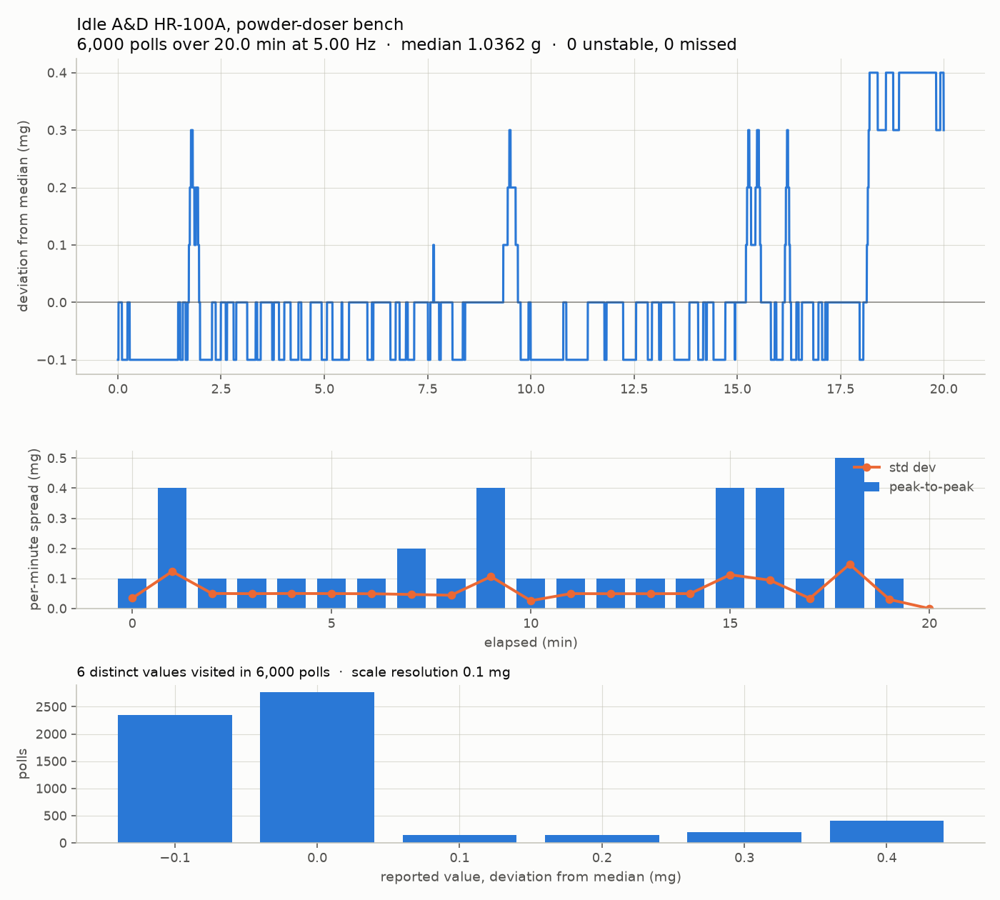

# Idle scale streaming — measured results (issue #126)

Bench test run 2026-07-31, no dispensing: the rig's actuators were never
touched. Everything below is measured on the real HR-100A attached to
`rpi-zero2w-powder-doser`, and on the live Atlas cluster.

The dose side of issue #126 (one document per dispense) is covered by
the design doc and `dose_run_capture.py`. This document covers the piece
that did not exist: the **idle stream**, i.e. what the balance is doing
when nobody is dosing, and how much it costs to keep.

## 1. What was run

| Test | Duration | Result |
|---|---|---|
| Smoke test, 5 Hz | 12 s | 61 polls, 0 misses |
| Idle capture, 5 Hz | 20 min | 6,000 polls, 0 misses, 0 unstable |
| Max-rate probe (poll as fast as the balance answers) | 30 s | 315 polls → **10.46 Hz ceiling** |
| Live pipe → tiering → Atlas | 3 min | 901 polls → 14 tier-3 + 4 tier-2 docs inserted |

Path: GitHub Actions runner → Tailscale → Pi → `mpremote run` → Pico →
RS-232 → HR-100A. The Pico-side script is
`hardware/test-module/firmware/scale_stream.py`, which imports only
`config` and `scale` — no stepper, servo, solenoid, or tap module is
imported, so it cannot move the rig.

Raw logs and artifacts: `data/scale-idle/2026-07-31_idle/`.

## 2. What an idle HR-100A actually does



6,000 polls over 20 minutes with a ~1.036 g object on the pan:

- **Total excursion 0.5 mg** (5 scale counts), std 0.137 mg.
- Most of the time it dithers between two adjacent counts; there are
  brief 0.3–0.4 mg excursions at ~2, ~9.5, ~15 min, and a **step up to
  +0.4 mg at ~18 min that does not come back** within the window.
- Only **6 distinct values** were visited in 6,000 polls.
- **Every single reading was flagged `ST` (stable).** Zero `US`, zero
  timeouts.

That last point is the one with consequences for dosing: the balance
calls itself stable while wandering over ±0.2 mg, so `ST` is not
evidence of a settled reading at the resolution the doser cares about.
A tolerance tighter than ~0.3 mg cannot be verified from a single
stable frame — it needs a window, which is exactly what the tier-2
per-minute `std_mg` / `ptp_mg` columns give you.

The other consequence is that the ~18 min step is *why* long-term
capture is worth doing at all: a 0.4 mg baseline shift is invisible
inside a single dose run and obvious across a day.

**Poll rate ceiling: 10.46 Hz.** Inter-poll spacing at max rate was
91/96/96/99 ms (min/p50/p95/max) — that is the balance's own update
cadence, not the 19200-baud link or the Pico. 5 Hz idle is comfortable;
a dose loop can have ~10 Hz if it wants it, and nothing above that.

## 3. Storage options, measured head-to-head

Same 6,000 real samples, four layouts, each inserted into a scratch
collection on the live cluster and measured (`--benchmark`, scratch
collections dropped afterwards):

```
layout                                               docs      BSON in      stored   MB/day  days->512MB
A: plain collection, every sample, verbose fields    6000   1,242,000B  1,344,000B    96.78            6
B: time-series, every sample, short fields           6000     930,000B     11,772B     0.85          633
C: time-series, dead-band + heartbeat                 138      23,736B      1,265B     0.09        5,894
D: 1-minute aggregates only                            21       5,754B      1,056B     0.08        7,060
```

`stored` is server-side `collStats.size`, which for a time-series
collection is the size of the **bucket** documents — column-compressed,
and what `dbstats.dataSize` (and therefore the free-tier 512 MB quota)
actually counts. `storageSize` is useless at this scale: it reports the
4 KB minimum allocation until WiredTiger checkpoints, so it is recorded
but never extrapolated from.

The headline result is the gap between A and B: **the same 6,000
measurements cost 1,344,000 B in a plain collection and 11,772 B in a
time-series collection — a factor of 114.** That is 2.0 bytes per
measurement, because a near-constant signal is exactly what columnar
bucket compression is built for.

### What that changes

The earlier design assumed the dead band was the big storage lever. It
is not, once bucketing is in play:

- **Keeping every 5 Hz sample forever costs 0.85 MB/day → 1.7 years of
  free tier.** The dead band buys another ~9×, but it is no longer the
  difference between viable and not.
- So the dead band's real justification is now *query cost and clarity*,
  not bytes — and the honest recommendation is to **keep tier 3 raw at
  full rate with a TTL**, and stop treating "store everything" as the
  expensive option.
- Tier 2 aggregates stay permanent and are nearly free (1,440 docs/day,
  ~0.08 MB/day). They are the record that outlives the TTL.

Caveat on generality: this compression ratio is a property of *this*
signal. An idle balance repeats itself; a 20-minute dose-heavy window
with constantly changing mass will bucket less well. The numbers above
should be re-measured with `--benchmark` after the first full day of
real mixed traffic, not assumed.

## 4. What is deployed

Created on the live cluster during the pipe test (both time-series):

| Collection | Retention | Contents |
|---|---|---|
| `scale_raw` | TTL 90 days (`expireAfterSeconds: 7776000`) | one doc per change + 60 s heartbeat: `{t, m, g, f, seq}` |
| `scale_1min` | permanent | per-minute `n / n_unstable / n_missed / min_g / max_g / ptp_mg / mean_g / std_mg / first_g / last_g` |

Both carry `m.schema_version`, `m.device`, `m.scale`, `m.src` in the
time-series `metaField`, so a second rig or a swapped balance separates
cleanly without a schema change. They currently hold only the 3-minute
pipe test (18 documents). To undo: `db.scale_raw.drop()`,
`db.scale_1min.drop()`.

`dose_runs` and `characterization_runs` were not touched.

## 5. Reproducing

```bash
# one-off capture to a log, then benchmark it offline
{ printf 'DURATION_S = 1200.0\nPOLL_HZ = 5.0\n'; \
  cat hardware/test-module/firmware/scale_stream.py; } > /tmp/run.py
scp /tmp/run.py "$PI:~/tmp/run.py"
ssh "$PI" 'mpremote connect /dev/ttyACM0 run ~/tmp/run.py' > idle.log
python scripts/scale_stream_capture.py idle.log --benchmark
python scripts/plot_scale_idle.py idle.log

# live: device -> tiering -> Atlas in one pipe
ssh "$PI" 'mpremote connect /dev/ttyACM0 run ~/tmp/run.py' \
  | tee idle.log \
  | python scripts/scale_stream_capture.py - --ensure-collections --upload
```

Tests: `python scripts/tests/test_scale_stream_capture.py` (20 tests,
stdlib only).

## 6. Next steps, in order

1. **Decide the UART hand-off.** The idle poller and a dose run cannot
   both own `/dev/ttyACM0`. The simple contract — dose runs
   `systemctl stop scale-idle-poller` first, and the unit's
   `Restart=always` brings it back — is why
   `scripts/deploy/scale-idle-poller.service` is committed but **not
   installed**. Installing it before the hand-off is wired into the
   dose procedure would break dosing.
2. **Install the unit on the Pi** once (1) is settled, with
   `MONGODB_URI` in a root-owned `/etc/powder-doser.env` (mode 600).
   Record any further Pi-side changes back into this repo.
3. **Re-measure after a day** of real mixed traffic (`--benchmark` on a
   day of raw log) before trusting the 1.7-year figure.
4. **Reconcile with the dose side** — `dose_run_capture.py` and
   `characterize_capture.py` should share `schema_version` and the
   `m`-metadata convention used here.
5. Only then worry about Zenodo/HF offload; at 0.85 MB/day it is a
   2027-and-later problem.
